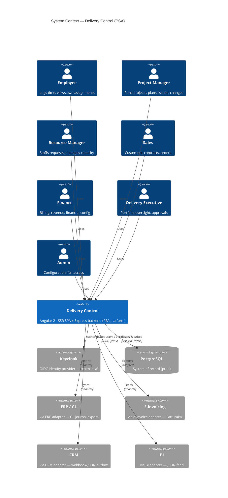
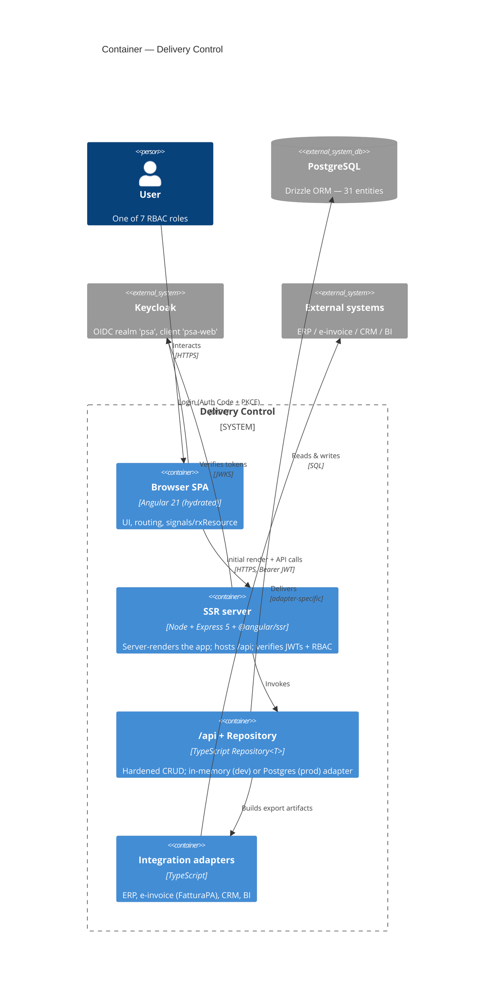

# Architecture Overview

> **Diátaxis mode: Explanation.** This page builds a mental model of Delivery
> Control — the problem it solves, the layers it is built from, and how those
> layers differ between development and production. Step-by-step procedures live
> in the how-to pages linked at the end.

## The PSA problem

A **Professional Services Automation (PSA)** platform runs the delivery business
of a services organization end to end. The hard part is that several concerns
that are usually owned by different systems must stay consistent with each other:

- **People** have skills, capacity, and a cost rate, and are only useful when
  staffed onto demand.
- **Demand** (resource requests) has to be matched to people (assignments)
  without over-booking anyone or leaving requests unstaffed.
- **Projects** consume that staffing, accrue actuals against budgets, hit
  milestones, raise issues, and absorb change requests.
- **Commercial** agreements (customers, contracts, orders) define what the
  customer is paying for and on what terms.
- **Billing and revenue** turn delivered work into invoices and recognized
  revenue — across several billing models at once.
- **Governance** (approvals, segregation of duties, an append-only audit trail)
  has to hold all of the above to account.

Delivery Control models all of these in one system so that, for example, a
milestone being achieved can make a fixed-price billing item billable, and an
approved timesheet can flow into time-and-materials accrual — without manual
re-keying between disconnected tools.

## The four layers

Delivery Control is a four-layer system. Each layer has a single, clear
responsibility and a narrow boundary to the next.

1. **Angular SSR client** — an Angular 21 single-page application rendered on the
   server (`@angular/ssr`) and hydrated in the browser. It owns the UI, routing,
   and reactive state (signals / `rxResource`). See
   [`02-frontend.md`](02-frontend.md).
2. **Express + Repository backend** — `src/server.ts` hosts the SSR engine and a
   hardened `/api` surface. All persistence goes through a generic
   `Repository<T>` abstraction (`src/db`), so the API code never talks to a
   specific store directly. See [`03-backend-and-data.md`](03-backend-and-data.md).
3. **PostgreSQL** — the production system of record, modeled with **Drizzle ORM**
   (31 entities). The Repository's PostgreSQL adapter reads and writes here.
4. **Keycloak** — the identity provider. The browser authenticates against the
   `psa` realm via OIDC (Authorization Code + PKCE); the backend verifies the
   resulting JWTs and applies RBAC. See
   [`04-security-identity.md`](04-security-identity.md).

External systems (ERP, e-invoicing, CRM, BI) are reached through an
**integration adapter layer** rather than directly. See
[`05-integrations.md`](05-integrations.md).

## Dev-vs-prod runtime

The same code runs in two very different shapes depending on environment
variables — this is the single most important thing to understand about the
runtime.

| Concern | Development | Production |
| --- | --- | --- |
| **Persistence** | In-memory Repository adapter (no database). Selected automatically when `DATABASE_URL` is **unset**. | PostgreSQL adapter (Drizzle over `pg`). Selected when `DATABASE_URL` is set. |
| **Identity** | Optional. Demo header trust (`AUTH_TRUST_HEADERS=true`) may stand in for real login — **local only**, never on an untrusted network. | Keycloak OIDC; the server verifies JWTs (signature, issuer, audience) and ignores the demo headers. |
| **Process** | `npx ng serve` | `npm run build` then `npm run serve:ssr:app` (listens on **:3000**) |

This means a developer can clone the repo, `npm install`, `npx ng serve`, and
click through the entire product with seeded in-memory data — no Postgres, no
Keycloak. Switching on `DATABASE_URL` and `OIDC_ISSUER` promotes the exact same
build to a persistent, authenticated deployment.

**Ports.** Keycloak is published on **:8081** (the in-container 8080 is mapped to
host 8081 because host 8080 is owned by openHAB), PostgreSQL on **:5432**, and
the app on **:3000**.

## System Context (C4)

The seven RBAC roles act on Delivery Control, which depends on Keycloak and
PostgreSQL and reaches external systems through integration adapters.

## Container view (C4)

Inside Delivery Control, the browser SPA talks to the SSR server, which exposes
`/api` over the Repository abstraction and reaches external systems through the
integration adapters.

## Tech stack

| Concern | Technology | Notes |
| --- | --- | --- |
| UI framework | **Angular 21** | Standalone components, lazy-loaded routes |
| Reactivity | **signals / `rxResource`** | Signal-based state; `rxResource` for async reads |
| Server rendering | **`@angular/ssr`** | `AngularNodeAppEngine`, host allow-list |
| HTTP server | **Express 5** | `src/server.ts` — SSR host + `/api`, rate limiting, RBAC |
| Data access | **Drizzle ORM** | 31 `pgTable` entities in `src/db/schema.ts` |
| PostgreSQL driver | **`pg`** (node-postgres) | Pool with hardened TLS; prod only |
| Identity provider | **Keycloak 26** | Realm `psa`, client `psa-web` |
| Token verification | **`jose`** | Remote JWKS, issuer + audience checks |
| Testing | **Vitest** | Unit specs alongside source (e.g. adapter `*.spec.ts`) |

## Where to go next

- Frontend internals → [`02-frontend.md`](02-frontend.md)
- Backend, Repository, and the data model → [`03-backend-and-data.md`](03-backend-and-data.md)
- Identity and authorization → [`04-security-identity.md`](04-security-identity.md)
- External integrations → [`05-integrations.md`](05-integrations.md)
- Running and operating it → [`06-deployment-operations.md`](06-deployment-operations.md)
- Roles and what they can do → [`../roles-and-permissions.md`](../roles-and-permissions.md)
- Term definitions → [`../glossary.md`](../glossary.md)
