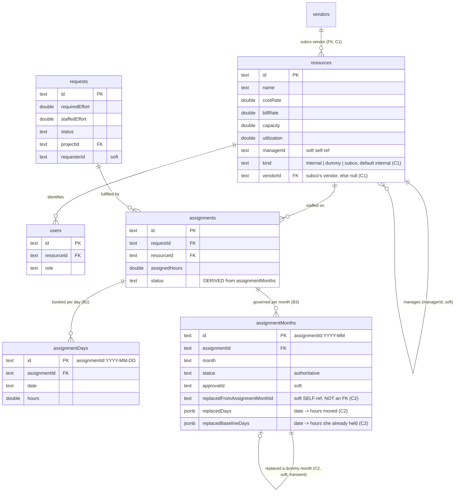
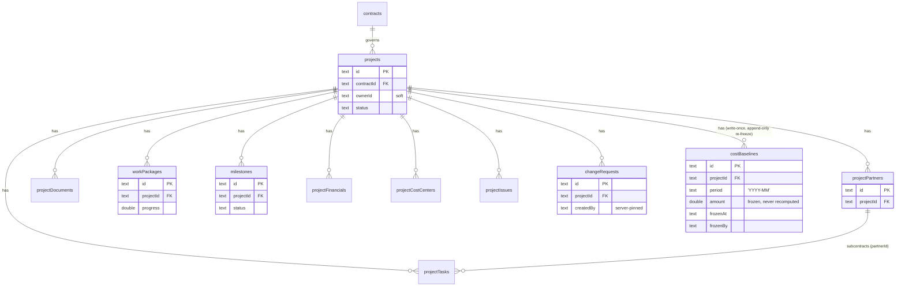
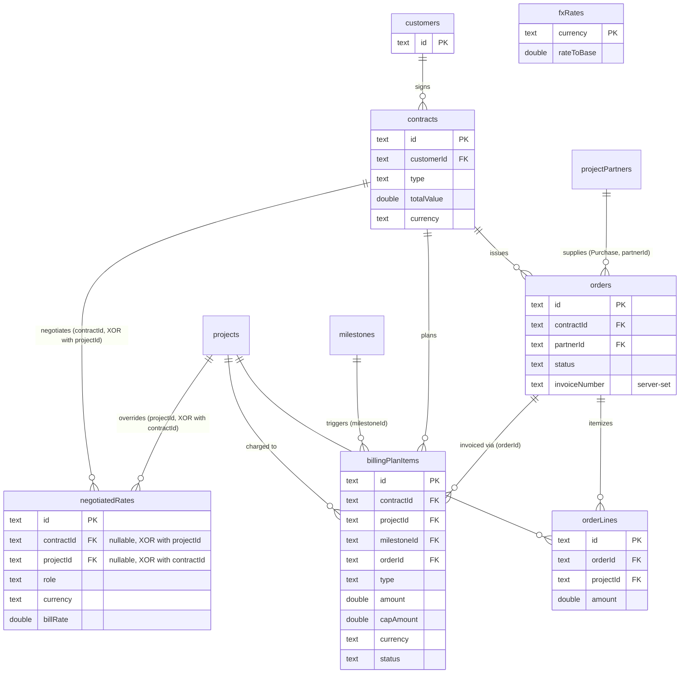
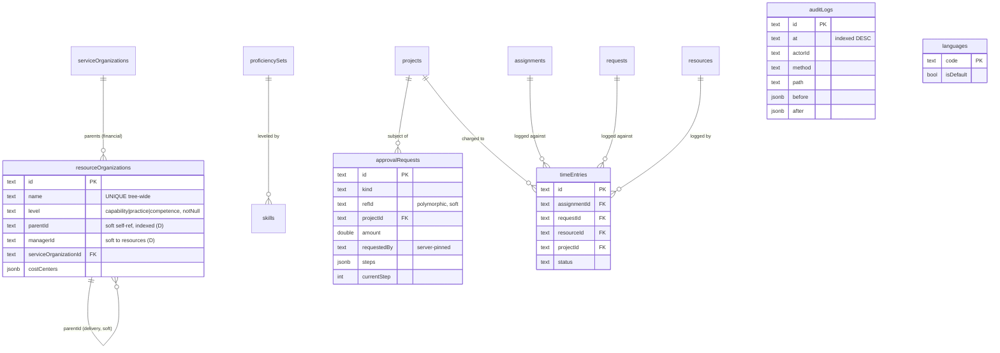

# Backend & Data Model

> **Diátaxis mode: Explanation + Reference.** The first half explains the shape
> of the backend and the Repository pattern that gives Delivery Control a single
> dev-vs-prod parity guarantee. The second half is reference material: the
> domain ER diagrams and a 43-entity catalogue. For the layer overview start at
> [`01-overview.md`](./01-overview.md); for who may call what, see
> [`04-security-identity.md`](./04-security-identity.md) and
> [`../roles-and-permissions.md`](../roles-and-permissions.md).

## The backend shape

There is **one** Express application (`src/server.ts`). It is simultaneously the
**SSR handler** (it renders the Angular app via `AngularNodeAppEngine` and serves
the browser bundle) and the host of the **`/api` router**. The wiring at the
bottom of the file is deliberately ordered:

1. `app.use('/api', apiRouter)` — the API surface.
2. `express.static(browserDistFolder, …)` — the built browser assets.
3. A catch-all that hands the request to `angularApp.handle(req)` for SSR, or
   falls through to `next()` when Angular declines it.

So `/api/*` is matched first and never reaches the SSR engine, while every other
path is server-rendered. The exported `reqHandler` (`createNodeRequestHandler(app)`)
is what the production `serve:ssr` entry invokes; when run as the main module the
app also `listen`s on `PORT` (default 3000) bound to `HOST`.

### Async handlers everywhere

Every route handler is `async` and `await`s the repository. This is required
because the persistence boundary is asynchronous (see below), and it is what
makes the Express 5 behaviour of forwarding a rejected handler promise to the
error middleware useful — see [error mapping](#postgres-fk-integrity--409).

### The generic `crud()` helper

Most collections are plain keyed resources, so a single generic helper mounts
their four endpoints against any `Repository<T>`:

```
crud(router, path, repo, allowed, numericFields?, validate?, searchable?)
  GET    /${path}      -> repo.list(), then optional q/limit/offset search+paginate (Block G)
  POST   /${path}      -> validate numerics, pick allow-list, id = newId(), repo.create()
  PUT    /${path}/:id  -> 404 if missing, validate, repo.update()
  DELETE /${path}/:id  -> repo.remove(); 404 when id was absent, else 204
```

`searchable` (Block G) is a 6th, optional parameter — an array of field names
this collection's `GET` should text-match on via `search.util.ts`'s
`searchPage()`. Default `[]`: every `crud()` caller that doesn't pass it (all
except `customers`, which passes `['name']`) is byte-for-byte unaffected — `q`
is never read for their `GET` route at all.

`crud()` is used for the simple collections (`project-partners`,
`project-documents`, `work-packages`, `project-financials`,
`project-cost-centers`, `project-tasks`, `project-issues`, `cost-centers`,
`customers`). Collections that carry **referential-integrity rules or domain
automations** — `contracts`, `orders`, `order-lines`, `billing-plan-items`,
`requests`, `assignments`, `time-entries`, `milestones`, `change-requests`,
`approval-requests` — are written as bespoke handlers because `crud()` cannot
express their FK checks and side effects.

Two security primitives shared by both styles:

- **`pick()` allow-list (mass-assignment guard).** Every write copies *only*
  named fields from the untrusted body. A field not in the allow-list (e.g. a
  client-supplied `status` on a new time entry, or an `invoiceNumber` on an
  order) is silently dropped, so server-pinned fields can never be forged.
- **Numeric validation.** `findInvalidNumericField()` rejects any present,
  allow-listed numeric field that is not a finite, non-negative number, returning
  `400`. Billing items use a stricter variant
  (`findInvalidBillingNumericField`) that allows a **negative `amount` only for a
  `CreditNote`**.

### Cross-cutting middleware

The `apiRouter` stacks three concerns before any handler runs:

1. **Rate limiting (two tiers).** A per-client limiter (`300 req/min`, keyed on
   `req.ip`) plus a global limiter (`3000 req/min`) so one client cannot exhaust
   the whole budget. `req.ip` is only trustworthy once `TRUST_PROXY` is set to the
   real proxy-hop count; the default is `0` (off), the safe no-proxy default.
2. **`roleGate` (auth + RBAC).** Verifies any `Authorization: Bearer` token
   against Keycloak's JWKS, then applies per-collection read/write RBAC. Detailed
   in [`04-security-identity.md`](./04-security-identity.md).
3. **Append-only audit middleware.** See next.

### Append-only audit middleware with before/after diffs

The audit middleware snapshots the targeted entity **before** a `PUT`/`DELETE`
runs (via `findAuditEntity()`, which resolves a `/collection/:id` path to its
read repository through `auditRepoBySegment`), then on the response `finish`
event — for a successful `POST`/`PUT`/`DELETE` only — re-reads the **after**
state for a `PUT`, diffs the changed keys (`diffChangedKeys`), and appends an
`AuditEntry` via `repos.auditLogs.create(...)`.

Key properties:

- **Append-only.** Entries are created in insertion order and never edited or
  deleted. The read endpoint (`GET /audit-logs`) returns a **bounded,
  newest-first page** (`limit`/`offset`, clamped to a max of 1000). On Postgres
  the ordering + paging are pushed into SQL (`ORDER BY at DESC LIMIT OFFSET`,
  backed by `audit_logs_at_idx`); in memory the list is sorted newest-first and
  sliced.
- **Trusted attribution.** The recorded `actorId`/`actorRole` come from the same
  trust gate as authorization (a verified JWT, or a trusted demo header) — never
  from raw spoofable `X-User-*` headers. An unauthenticated caller cannot forge
  the recorded actor.
- **Best-effort.** Audit persistence happens after the response is sent and its
  failures never affect the already-sent response.

## The Repository pattern

All persistence goes through one small, fully-typed boundary
(`src/db/repository.ts`):

```ts
interface Repository<T extends Entity> {
  list(): Promise<T[]>;
  get(id: string): Promise<T | undefined>;
  create(entity: T): Promise<T>;
  update(id: string, patch: Partial<T>): Promise<T | undefined>;
  remove(id: string): Promise<boolean>;
}
```

`Entity` is simply `{ id: string }`. Handlers depend only on this interface, so
swapping the backing store is a one-line change at the composition root.

### Two interchangeable adapters

- **`InMemoryRepository<T>`** — array-backed, **defensively cloned** on every read
  and write (`structuredClone`, JSON fallback) so the store can never share
  references with callers. Synchronous logic wrapped in `Promise.resolve` to
  satisfy the async contract. This is the **dev / mock** adapter; no database
  needed.
- **`PgRepository<T>`** — PostgreSQL via **Drizzle ORM** over a node-postgres pool
  (`db` from `src/db/client.ts`). `list()` adds `.orderBy(id)` for a deterministic
  order that matches the in-memory adapter's insertion order. The handful of
  unavoidable Drizzle-generic casts are localized to single `.values()` / `.set()`
  arguments and bridged through `unknown` — the public boundary never leaks `any`.

### The composition root and the env-switch

`getRepositories()` (`src/db/repositories.ts`) builds the process-wide
`Repositories` object once and memoizes it. Selection mirrors `src/db/client.ts`:

```
DATABASE_URL set    -> buildPgRepositories(db)         (Drizzle adapters)
DATABASE_URL unset  -> buildInMemoryRepositories()     (seeded mock adapters)
```

`db` (and the connection `pool`) in `client.ts` are themselves `null` when
`DATABASE_URL` is unset, so the same env variable drives both modules. TLS is
hardened in `client.ts`: when `PGSSL=true` the server certificate is **always**
verified (`rejectUnauthorized: true`), optionally pinning a CA bundle from
`PG_CA_CERT`; verification is never disabled.

### Natural-key adapters

Two entities have **no `id`** in their source interfaces: `Language` (keyed by
`code`) and `FxRate` (keyed by `currency`). To flow them through
`Repository<T extends Entity>` without changing their persisted shape, each is
wrapped in a small natural-key adapter (`NaturalKeyInMemoryRepository` /
`NaturalKeyPgRepository`) that:

- carries a **synthetic `id` that always mirrors the natural key** (`id === code`
  / `id === currency`), added on every return path and stripped before any write
  (the Postgres tables have no `id` column);
- moves identity correctly when the natural key itself changes (in memory this is
  a remove + create so the `id === key` invariant holds).

This is why the route handlers can address an FX rate by currency
(`PUT /fx-rates/:currency` does an upsert keyed on `currency`) and a language by
its code while still seeing one uniform `Repository<T>` per entity. The list
handlers project these rows back to the exact legacy client shape (dropping the
synthetic `id`).

### Two parity shims you must know about

The InMemory and Pg adapters must behave **identically** so dev and prod never
diverge in observable ways. Two shims enforce that:

- **`nullsToUndefined()`** — Drizzle returns nullable columns as explicit `null`,
  but the `api.service` interfaces (and the in-memory adapter) model those fields
  as *optional* (`prop?: V`, i.e. absent). Without normalization the prod JSON
  would carry `key: null` where dev omits the key. `nullsToUndefined` runs on
  every **return** path only — never on the values handed to `.set()`, where
  `undefined` is intentionally omitted (no clobber) and an explicit `null` still
  sets the column NULL.
- **Empty-patch update parity** — Drizzle's `.set()` throws `"No values to set"`
  when a patch is effectively empty (a 500 in prod), whereas the in-memory adapter
  returns the unchanged entity (200). The Pg adapters short-circuit an
  all-`undefined` patch to a plain `get(id)` so both adapters return the same 200.

## What the parity guarantee buys, and its gotchas

Because the same handlers run over either adapter, a developer can clone, install,
`npx ng serve`, and exercise the whole product on seeded in-memory data — then
the *same build* is promoted to a persistent Postgres deployment by setting
`DATABASE_URL`. Two real differences between the adapters are deliberately
reconciled at the seam:

### Postgres FK integrity → 409

The Postgres adapter enforces foreign keys (the InMemory adapter would silently
**orphan** a referenced row). Deleting an FK-referenced row therefore raises a
`pg` error with SQLSTATE `23503` (`foreign_key_violation`). The API error
middleware (`isFkViolation` → `apiRouter.use((err, …) => …)`) maps that to a clean
**`409 Conflict`** (`"the record is still referenced by other records"`) instead
of leaking an opaque 500. All other errors fall through to the default handler.

### Restart-safe id sequences

Ids are server-assigned from an in-memory counter (`newId()` → `idSeq`; some
collections wrap the suffix in a prefix, e.g. `TE…`, `AL…`, `AR…`, `OB…`).
Invoice numbers come from a separate `invoiceSeq` (`INV-<year>-NNNN`). After a
restart these counters would reset to their defaults and **re-issue ids that are
already persisted**, colliding on the prefixed primary keys. `seedSequences()`
(run after `initPersistence()`) prevents that by scanning every repository:

- `idSeq` is advanced past the **largest numeric suffix** seen across all rows —
  both purely-numeric ids and prefixed ones (the suffix is `newId()`'s output, via
  the pure `maxIdSeq` scanner).
- `invoiceSeq` is advanced past the largest `INV-<INVOICE_YEAR>-NNNN` across
  orders, so no invoice number is ever reused. (The seed already holds
  `INV-2026-0001` on order `O1`, so the next issued invoice is `0002`.)

## Persistence lifecycle

`initPersistence()` (`src/db/bootstrap.ts`) is called once at boot, before
`seedSequences()`:

- **`DATABASE_URL` unset** → **no-op.** The in-memory repositories are already
  constructed from the same `src/db/seed.ts` arrays, so there is nothing to
  migrate or seed.
- **`DATABASE_URL` set** →
  1. **Migrate.** Run all pending Drizzle migrations from `./drizzle`
     (`drizzle-orm/node-postgres` migrator). `migrate()` is idempotent —
     already-applied migrations are skipped.
  2. **Seed when empty.** Each core table is seeded from `seed.ts` only when its
     own `count(*) === 0` check passes, so repeat boots never duplicate rows.
     Inserts run **parent-before-child** so foreign keys are satisfied (roots like
     `customers`/`resources`/`languages`/`fxRates` first, then `contracts`/`users`,
     then `projects`, then project sub-resources, then the commercial chain and
     `approvalRequests`). `auditLogs` is intentionally seeded empty.

`seed.ts` is the single source of truth for the initial data — the in-memory
adapter and the Postgres seeder consume the *same* arrays, so the two can never
drift apart. (Note: `getRepositories()`/`client.ts` use the in-memory adapter
purely on `DATABASE_URL` presence; the in-memory store is seeded by construction
regardless of `initPersistence`.)

## A request, end to end

**Read** (`GET /api/orders`):

```
client → rate limiters → roleGate (READ_RULES: commercial reads are gated to
  sales/finance/delivery-executive/admin) → audit middleware (no before-snapshot
  for GET) → handler: res.json(await repos.orders.list())
```

**Write** (`PUT /api/orders/:id`, transition to `Invoiced`):

```
client → rate limiters → roleGate (WRITE rule: sales/finance/delivery-executive/
  admin) → audit middleware snapshots the order BEFORE the handler
  → handler: get() 404-guard → pick(ORDER_FIELDS) → numeric + FK validation
    (validateOrder: contract exists; Purchase vs Customer partner rules)
  → withLock('invoice-seq'): re-read, applyInvoiceNumbering (assign the next
    INV-<year>-NNNN + date when first Invoiced), repos.orders.update()
  → res.json(updated)
  → on 'finish' (status < 400): re-read AFTER state, diff changed keys, append an
    audit entry attributed to the trusted actor
```

Read-modify-write sequences over a shared aggregate (a request's
`staffedEffort`, a resource's `utilization`, the invoice sequence, an approval
step) are serialized through a per-key async mutex (`withLock`) because Express
handlers run concurrently and there is no atomic-increment primitive on the
`Repository<T>` boundary.

## Computed views: `/capacity` and `/bench` (no schema)

> No pre-existing subsection described `/capacity/monthly` this way before Block
> F — this section documents both endpoints together because they now share one
> `READ_RULE` predicate (see [`roles-and-permissions.md`](../roles-and-permissions.md#server-endpoint-rbac)),
> and Block F's own design spec (§2) is explicit that it adds no schema at all.

Two `GET`-only endpoints compute a rollup entirely from existing rows — neither
one is backed by its own table, migration, or seed data:

- **`GET /capacity/monthly`** (B2) — monthly FTE capacity-vs-demand, via
  `rollupMonthly` (`src/app/services/capacity.util.ts`).
- **`GET /bench/monthly`** (Block F) — monthly BENCH/PARTIAL/ALLOCATED
  classification, aging, forward-looking signal, availability date, and
  dummy-driven hiring demand, via `benchRollup`
  (`src/app/services/bench.util.ts`).

Both read the **same four inputs** — `resources`, `assignments`,
`assignmentDays`, `assignmentMonths` — plus `holidays` and the hours-per-day
setting, and both are pure functions over those inputs: no `drizzle-kit
generate` step exists anywhere in Block F, and `src/db/schema.ts` gained no
column or table for it. This is why the parity guarantee ([above](#what-the-parity-guarantee-buys-and-its-gotchas))
extends to `/bench/monthly` for free — it reads through the same
`Repository<T>` adapters `/capacity/monthly` already does, so whichever
backend is active (in-memory or Postgres) answers identically.

`GET /bench/monthly` fetches a **9-month window** (2 months look-back + 6
months shown + 1 month look-ahead) but returns only the **6 shown** months,
split by `countsTowardDeliveryCapacity` (`resource-kind.util.ts`) rather than
`countsTowardInternalCapacity`: a subcontractor lands in `subcoRows` next to
`internalRows` (both count as biddable delivery capacity), while a `dummy`
resource never appears in either — it drives `hiringDemand` instead. The
look-back two months feed the retrospective aging buckets (a resource idle
since before the shown window still needs its correct B/C/D bucket on month 1);
the look-ahead month feeds the forward-looking `upcomingUnallocated` signal for
the last shown month, without ever being displayed itself. Both endpoints are
gated by the **same** `READ_RULES` predicate
(`p.startsWith('/capacity') || p.startsWith('/bench')`,
`src/server.ts`) — extended, not duplicated, when Block F was added — and both
run under `roleGate`'s GLOBAL middleware, so neither handler re-gates itself.

## Cross-entity search (Block G, no schema, no new endpoint)

Six existing collection reads — `GET /resources`, `/projects`, `/requests`,
`/customers`, `/contracts`, `/orders` — gained optional `q`/`limit`/`offset`
query parameters. Like `/capacity`/`/bench` above, this adds **no schema**:
no migration, no new table, and (unlike `/capacity`/`/bench`) **no new
endpoint either** — a combined `GET /search` was deliberately rejected in
favor of extending the six reads each collection already had, so every one
keeps the exact `READ_RULES` entry it has today (see
[`roles-and-permissions.md`](../roles-and-permissions.md#a-read_rules--gated-get-collections)) —
zero new `authorizeRead()` calls anywhere in this block's diff.

**`src/app/services/search.util.ts`** is the shared pure layer (`clampSearchPage`,
`matchesQuery`, `searchPage`) — no I/O, no clock, mirroring `/audit-logs`'s own
`AUDIT_LOG_DEFAULT_LIMIT`/`AUDIT_LOG_MAX_LIMIT` clamp shape with this feature's
own thresholds (`SEARCH_DEFAULT_LIMIT = 20`, `SEARCH_MAX_LIMIT = 100`). Every
extended handler calls it **after** the existing, unmodified `repos.X.list()`
— there is no `if (db) { SQL } else { ... }` branch, because there is no
adapter-specific operator to keep in sync: the in-memory adapter and the
Postgres/Drizzle adapter both hand the SAME full array to the SAME
in-process filter/paginate function, so parity is a consequence of calling
one function once, not a second code path to keep from drifting. This is a
deliberate deferral, not an oversight: no `pg_trgm`/`tsvector`/GIN index, no
ranking, no typo tolerance — a Postgres text index cannot exist on the
in-memory adapter, and adding one only on the Postgres side would itself be
the exact kind of divergence the dev↔prod parity rule (see
[above](#the-composition-root-and-the-env-switch)) forbids.

Match fields are the same level of sophistication each collection's own
client-side filter already had (or, for customers/contracts/orders, their
first-ever filter): `resources` on `name`/`role`/`organization`/`location`;
`projects` on `name`/`location`; `requests` on `name`/`description`;
`customers`/`contracts` on `name`; `orders` on `invoiceNumber` only — an order
has no `name` field, and deliberately does **not** join to its parent
contract/customer name, so `GET /orders?q=Globex` (a customer name) matches
zero rows while `GET /contracts?q=Globex` and `GET /customers?q=Globex` both
match. Omitting `q` entirely on any of the six reads returns the exact same
full, unfiltered, unpaginated array they returned before this block — the
one backward-compatibility invariant every pre-existing caller (`resources.component.ts`,
`dashboard.component.ts`, `reporting.ts`, `forecast.ts`, and others) depends on.

## Domain ER diagrams (reference)

The 43 tables (`src/db/schema.ts`) are split into four domain groups below.
Crow's-foot relationships show the **declared** foreign keys; soft links
(`requesterId`, `ownerId`, `refId`) carry the column without a hard FK and are
called out in the catalogue. Money/FX columns use `doublePrecision`; date-like
values are `text` (ISO strings); nested arrays/objects are `jsonb`.

### Resourcing



#### C2 — the substitution back-link is deliberately not a foreign key

`assignmentMonths` carries three nullable, **transient** columns (migrations
`0012_groovy_magik.sql` adds `replaced_from_assignment_month_id`,
`0013_c2_replaced_days.sql` adds `replaced_days`,
`0014_c2_replaced_baseline_days.sql` adds `replaced_baseline_days`). They are
written together when a dummy month's hours are handed to a real person
(`POST /assignment-months/:id/substitute`) and cleared together — in a `finally`
— the moment that month is decided:

| Column | Type | Meaning |
| --- | --- | --- |
| `replaced_from_assignment_month_id` | `text`, nullable | The **dummy's** month-row id these hours came from, i.e. where to give back what the person does not end up taking. |
| `replaced_days` | `jsonb`, nullable | `{ 'YYYY-MM-DD': hours }` — **which** days moved and how many hours from each. Days that moved nothing are absent. |
| `replaced_baseline_days` | `jsonb`, nullable | `{ 'YYYY-MM-DD': hours }` over the **same dates** — what the person already held on each of them, on that assignment, immediately before the transfer. |

**The back-link is a plain `text` column, not a `.references(() => assignmentMonths.id)` self-FK. That is a decision, not an omission.** The row it
points at is legitimately deleted while the row holding the pointer lives on:
deleting the dummy's assignment drops all of its month rows
(`DELETE /assignments/:id` clears children by hand, since
`assignment_months → assignments` is `ON DELETE no action`). With a real FK that
delete would either be rejected by Postgres — mapped to a **409**, so removing a
stale dummy would fail for as long as anyone's substituted month was pending — or,
with a cascade, would reach across into *another resource's* month row. Neither is
acceptable: the person's month is her own record and her decision must not depend
on the dummy still existing. A missing dummy row instead makes the give-back a
**logged no-op** (`returnHoursToDummy`), and the decision lands normally.

Two consequences of that choice worth knowing:

- The link is **only** meaningful while the month is pending. `closeLink()` clears
  all three columns on **every** decision path, including the no-ops and a
  give-back that throws half way, because a decided month that still looks linked
  would hand the same hours back a second time on a retry.
- `replaced_days` is a **map, not a total**, and it is not derivable at decision
  time. The approver may trim or zero the month before approving, so the original
  figures are no longer readable anywhere, and a single total would have to be
  spread over whichever days she happens to hold — silently moving her *own*
  unrelated work onto the dummy. The arithmetic lives in `planGiveBack`
  (`src/app/services/substitution.util.ts`).
- `replaced_baseline_days` is the **other half of that record, and it is equally
  not derivable**. A person's month legitimately mixes her own hours with loaned
  ones *on the same date on the same assignment* — a substitution onto a month she
  already had hours in **demotes** it rather than replacing it (the endpoint
  reports `demotedExistingWork`). What that date holds afterwards is a single
  fused number, so without the recorded baseline the give-back charges her own
  hours against the loan: trimming a shared day back to exactly her own work
  returned only part of the loan and **destroyed** the rest of the placeholder's
  booked demand, while the mirror case on a rejection deleted hours that were
  always hers. Everything in `planGiveBack` derives from
  `loanRemaining = max(0, held − baseline)`; hours at or below the baseline are
  untouchable.
- A give-back that restores hours onto a **`Rejected`** dummy month reopens it to
  `Requested` with a fresh approval. `capacity.util` bands only `Requested` and
  `Allocated` (`PLANNED`), so restored demand on a rejected row would count **zero**
  toward `/capacity/monthly`, `demandFteUncovered` and the B2 semaphore — present in
  storage and on the calendar, invisible exactly where the uncovered gap is meant to
  show. `Draft` is deliberately left alone: it contributed nothing to the bands
  before the substitution either.

All three columns exist only on this branch's migrations; no shipped schema ever had
the intermediate `replaced_hours` column that `0012` created and `0013` dropped.

### Projects & sub-resources



### Commercial, billing & FX



#### Negotiated sell rates — the contractId/projectId XOR is a write-time invariant, not a CHECK

Migration `0016_marvelous_omega_red.sql` adds `negotiated_rates`: the sell
price negotiated **per contract**, with an optional **per-project override**,
for a given `role` + `currency`. Exactly one of `contractId` / `projectId` is
set on every row — never both, never neither.

**The XOR is enforced at write time (`validateNegotiatedRate` in
`src/server.ts`), not as a database `CHECK` constraint.** No portable
constraint expresses "exactly one of these two nullable columns is set"
across both adapters this project runs on: Postgres could carry a `CHECK
((contract_id IS NULL) <> (project_id IS NULL))`, but the in-memory adapter
has no constraint layer at all, so a Postgres-only `CHECK` would let the two
adapters silently disagree on a row the in-memory mock would accept and
Postgres would reject — exactly the class of drift the dev/prod parity
guarantee (see [above](#the-repository-pattern)) exists to prevent. The
invariant instead lives once, in the handler, and runs identically over
either backing store; the same function also carries the FK-existence,
role-in-the-project-roles-catalog, currency-validity, same-key-uniqueness and
non-negative-number checks, called identically from `POST` and `PUT` so the
rule can never drift between the two verbs. The role check validates against
the `/project-roles` catalog rather than roles actually held by a resource
today, because a rate is negotiated — and the contract signed — before
anyone with that profile is ever hired or staffed.

**Validity is not a column on the rate — it comes from the contract's own
period.** `negotiated_rates` carries no `startDate`/`endDate` of its own: a
contract already carries `startDate`/`endDate` (see the ER diagram above), so
a contract-level rate applies only to hours **dated inside that contract's
period**, and a project override borrows its project's contract period when
the project has one (an override on a project with no contract at all applies
with no date limit). A renegotiation is expressed as a **new contract** with
its own period, never as an edit to an existing rate row — there is no
versioning or effective-dating on `negotiated_rates` itself. Resolution
(which rate wins, and whether it is in period) lives entirely in the pure
`sellRateFor` layer (`src/app/services/sell-rate.util.ts`), which takes the
hours' date as a **value** and never reads a clock. See
[roles-and-permissions.md](../roles-and-permissions.md) for who may read/write
`/negotiated-rates`, and
[functional/commercial.md](../functional/commercial.md#negotiate-a-sell-rate-for-a-contract-or-a-project)
for the negotiation workflow.

#### Frozen monthly cost baselines — write-once, and "current" means latest `frozenAt`

Migration `0018_lowly_lady_bullseye.sql` adds `cost_baselines`: a **frozen
monthly PCP/budget snapshot per project**, one row per `(projectId, period)`
at freeze time. `amount` is the resolved EUR figure `plannedCostSchedule`
produced **at the moment of freezing** — never the raw hours/rate inputs,
and never recomputed afterward. Freezing hours × rate instead of the
resolved amount would let the baseline silently drift on every `costRate`
edit, producing a believable but wrong number no test or schema constraint
would catch.

**No `PUT`/`DELETE` is exposed, and there is no unique constraint on
`(projectId, period)` by design.** A re-freeze (`POST /cost-baselines`
again) does not update or replace anything — it appends a brand-new batch
of rows with a later `frozenAt`. More than one row can therefore share a
`(projectId, period)` pair; **the "current" baseline for a period is, by
definition, the row with the latest `frozenAt` for that pair** — resolved
entirely in the pure `costBaselineComparison` layer
(`src/app/services/finance.util.ts`), never by an `UPDATE`. This is what
keeps "was the target moved?" answerable after the fact: every freeze, the
first and every subsequent one, survives as its own row with its own
`frozenBy`/`frozenAt`, never hidden by a later write. See
[roles-and-permissions.md](../roles-and-permissions.md) for who may freeze
(mutate) versus read the comparison, and
[functional/project-delivery.md](../functional/project-delivery.md) for the
Project 360 "Baseline vs Planned" card this feeds.

### Governance, config & audit



#### D — the org tree: three columns and two orthogonal upward references

`resourceOrganizations` is a **Capability > Practice > Competence tree** (migration
`0015_tiny_meltdown.sql`, purely additive — the only table it touches). Three
columns carry it:

| Column | Type | Meaning |
| --- | --- | --- |
| `level` | `text`, **notNull**, default `'capability'` | Which rung of the tree this node is. The legal parent of a node is the level immediately above it (`ORG_LEVELS[i-1]`): a `capability` has **no** parent, a `practice`'s parent is a `capability`, a `competence`'s parent is a `practice`. Enforced on POST *and* PUT, including a guard that refuses a level change which would leave an existing **child** under an illegal parent. |
| `parentId` | `text`, nullable, **indexed** | The node above, in the **delivery** hierarchy. |
| `managerId` | `text`, nullable | The resource who manages this node — the manual's **Capability Leader / Practice Manager / Competence Manager**. No new RBAC role: the manager is data, and their authority is derived (see [roles-and-permissions](../roles-and-permissions.md#d--allocation-decisions-are-scoped-to-the-competent-manager)). |

**Two upward references, orthogonal on purpose.** A node points up twice and the
two answers are unrelated:

- **`parentId` → `resourceOrganizations`** is the **delivery** hierarchy: who a
  resource belongs to, and whose manager is accountable for it.
- **`serviceOrganizationId` → `serviceOrganizations`** is the **financial**
  attachment (cost centers, the S/4HANA-replicated org). Unchanged by D.

Reading one for the other is the mistake this note exists to prevent: two nodes
under the same service organization can sit in completely different capabilities,
and a whole capability branch can share one service organization.

**`parentId` is a plain `text` column, not a `.references(() => resourceOrganizations.id)` self-FK. That is a decision, not an omission** — the
same reasoning as [C2's back-link](#c2--the-substitution-back-link-is-deliberately-not-a-foreign-key),
plus one specific to this table: the delete guard is the *application's*
(`DELETE /resource-organizations/:id` returns **409** naming the blocking
children, and another **409** when resources still reference the node by name),
so a database-level FK would only add a second, opaque failure mode — a bare
`23503`→409 with no count and no message — for a rule that already refuses the
write with an explanation. `managerId` is likewise soft, exactly like
`Resource.managerId`.

**Dimensions are DERIVED, never stored.** A resource carries a *single*
attachment — `Resource.organization`, matched to a node **by name** (which is why
node names are unique tree-wide, why a rename that would orphan resources is
refused with **409**, and why `pickRateCard` still resolves). Its
capability/practice/competence triple is computed by walking **up** from that
node (`dimensionsOf` in `src/app/services/org-scope.util.ts`) on every read.
Nothing denormalizes the triple onto the resource, so a resource's practice can
never disagree with its competence, and re-parenting a node re-derives every
resource beneath it with no backfill. A resource may attach at **any** level, so
a dimension key is simply absent when that level does not exist above the
attachment point.

**Rate-card inheritance (rate-card-inheritance block) walks the same tree
`dimensionsOf` does.** `pickRateCard` now lives in
`src/app/services/rate-card.util.ts` (moved out of `server.ts`, which used to
declare it privately) and resolves a role's effective card by walking
`ancestorChain` — the resource's own node, then each ancestor nearest-first,
then the generic (no-organization) card — instead of by exact-name match
alone. A card configured on a capability therefore reaches every practice or
competence beneath it that has no more specific card of its own; with no
card on any ancestor, the result is byte-identical to the exact-match
resolution that shipped before this block. `resolveResourceRates`
(`src/server.ts`) fetches `resourceOrganizations` alongside `rateCards` for
exactly this reason. This block introduces **no schema change** — `rateCards`
and `resourceOrganizations` are read exactly as they are today, no column is
added, and therefore no column is newly nullable either (nothing here changes
what an explicit `null` means anywhere in this schema).

Both traversals tolerate a cycle in the data (every walk carries a `visited`
set), and writes that would *create* one are refused with **400** — in the tree
(`wouldCycleInOrgTree`) and in the org chart (`wouldCycleInOrgChart`).

**Both axes serialize their writes, on two distinct global keys.** Every
`Resource.managerId` mutation runs under `withLock('org-chart')` so concurrent
reassignments cannot compose a loop through the guard; every
`/resource-organizations` mutation (POST, PUT, DELETE) runs under
`withLock('org-tree')` because `validateOrgTreeNode` reasons about a node against
both its parent *and* its existing children — two writers on their own pre-write
snapshots could each pass and leave, say, a practice parented to a practice, at
which point `dimensionsOf` reports the wrong practice for every resource beneath.
The two keys never nest in either direction (nothing inside an `org-chart` section
touches the tree catalog; nothing inside an `org-tree` section takes any lock), so
they cannot deadlock against each other.

## Entity catalogue (reference)

All 43 tables in `src/db/schema.ts`. **Key FKs** lists declared `references()`
foreign keys; *(soft)* marks columns that carry a reference without a hard FK.

| Entity (table) | Purpose | Key fields & FKs | Domain |
| --- | --- | --- | --- |
| `resources` | People with skills, capacity, rates | `id`, `capacity`, `utilization`, `costRate`, `billRate`, `kind` (`internal`\|`dummy`\|`subco`, default `internal`, C1); `managerId` *(soft self-ref)*; **FK** `vendorId→vendors` (subco only, C1) | Resourcing |
| `users` | Identity → resource + RBAC role mapping | `id`, `role`; **FK** `resourceId→resources` | Resourcing |
| `requests` | Demand (resource requests) | `id`, `requiredEffort`, `staffedEffort`, `status`; **FK** `projectId→projects`; `requesterId` *(soft)* | Resourcing |
| `assignments` | Staffing of a resource onto a request | `id`, `assignedHours`; **FK** `requestId→requests`, `resourceId→resources` | Resourcing |
| `assignmentDays` | Per-day hours of an assignment (B1, time-phased allocation) | `id` = `<assignmentId>:<YYYY-MM-DD>`, `date`, `hours`; **FK** `assignmentId→assignments` | Resourcing |
| `assignmentMonths` | Per-(assignment, month) approval lifecycle (B3) — **authoritative**; `assignments.status` is a derived rollup of these rows | `id` = `<assignmentId>:<YYYY-MM>`, `month`, `status`, `plannerNote`, `approverNote`; **FK** `assignmentId→assignments`; `approvalId` *(soft → approvalRequests)*; C2: `replacedFromAssignmentMonthId` *(soft **self**-ref, deliberately not an FK)* + `replacedDays` (jsonb `date→hours`) + `replacedBaselineDays` (jsonb `date→hours she already held`), all nullable and transient — [why](#c2--the-substitution-back-link-is-deliberately-not-a-foreign-key) | Resourcing / Governance |
| `timeEntries` | Logged hours with approval lifecycle | `id`, `hours`, `status`, `approvedBy/At`; **FK** `assignmentId→assignments`, `requestId→requests`, `resourceId→resources`, `projectId→projects` | Resourcing / Governance |
| `languages` | UI languages (natural key `code`) | `code` PK, `isDefault` | Config |
| `skillCatalogs` | Named collections of skills | `id`, `skills` (jsonb id array) | Config |
| `proficiencySets` | Ordered proficiency rungs | `id`, `levels` (jsonb) | Config |
| `skills` | Skill master data | `id`, `conceptUri`, `restricted`; **FK** `proficiencySetId→proficiencySets` | Config |
| `projectRoles` | Project role master data | `id`, `code`, `restricted` | Config |
| `serviceOrganizations` | Delivery org units | `id`, `code`, `costCenters` (jsonb) | Config |
| `resourceOrganizations` | Resource org units — a **Capability > Practice > Competence tree** (D) | `id`, `name` *(unique tree-wide; `Resource.organization` binds to it **by name**)*, `costCenters` (jsonb); D: `level` *(notNull)*, `parentId` *(soft **self**-ref, indexed, deliberately not an FK)*, `managerId` *(soft → resources)*; **FK** `serviceOrganizationId→serviceOrganizations` *(financial, orthogonal to `parentId`)* — [why](#d--the-org-tree-three-columns-and-two-orthogonal-upward-references) | Config |
| `countries` | Country master data (natural key `code`) | `code` PK, `name` | Config |
| `cities` | City master data | `id`, `name`; **FK** `countryCode→countries` | Config |
| `industries` | Industry master data | `id`, `name` | Config |
| `costCategories` | Cost-category master data | `id`, `name` | Config / Finance |
| `partnerRoles` | Partner-role master data | `id`, `name` | Config |
| `vendors` | Vendor / subcontractor master data | `id`, `vatId`, `country` | Config |
| `rateCards` | Default cost/bill rates by role + organization | `id`, `role`, `currency`, `costRate`, `billRate` | Config / Finance |
| `holidays` | Non-working days (natural key: the ISO date IS the `id`) | `id` = `YYYY-MM-DD`, `name` | Config |
| `planningPeriods` | Open/closed state of a calendar month (natural key: `id` IS `YYYY-MM`) | `id` = `YYYY-MM`, `status` | Config |
| `settings` | Global key/value settings (e.g. hours-per-day) | `id` PK, `value` | Config |
| `projects` | Delivery projects | `id`, `status`; **FK** `contractId→contracts`; `ownerId` *(soft)* | Projects |
| `projectPartners` | Partner companies on a project | `id`, `company`, `status`; **FK** `projectId→projects` | Projects |
| `projectDocuments` | Project document metadata | `id`, `name`, `type`; **FK** `projectId→projects` | Projects |
| `workPackages` | Work breakdown items | `id`, `progress`, `status`; **FK** `projectId→projects` | Projects |
| `milestones` | Project milestones (SAL trigger) | `id`, `status`, `approvedBy/At`; **FK** `projectId→projects` | Projects |
| `projectFinancials` | Budget vs actual by category | `id`, `budget`, `actual`; **FK** `projectId→projects` | Projects / Finance |
| `projectCostCenters` | Per-project cost centers | `id`, `allocated`, `actual`; **FK** `projectId→projects` | Projects / Finance |
| `projectTasks` | Project tasks | `id`, `status`, `priority`; **FK** `projectId→projects`, `partnerId→projectPartners` | Projects |
| `projectIssues` | Project issues / risks | `id`, `severity`, `status`, `escalated`; **FK** `projectId→projects` | Projects |
| `changeRequests` | Scope/budget change requests | `id`, `impactBudget`, `status`, `createdBy` *(server-pinned SoD)*; **FK** `projectId→projects` | Projects / Governance |
| `costCenters` | Top-level (non-project) cost centers | `id`, `allocated`, `actual` | Config / Finance |
| `customers` | Customer accounts | `id`, `industry`, `country` | Commercial |
| `contracts` | Customer contracts (T&M / Fixed / Framework) | `id`, `type`, `totalValue`, `currency`, `status`; **FK** `customerId→customers` | Commercial |
| `orders` | Customer / purchase orders | `id`, `type`, `status`, `invoiceNumber/Date` *(server-set)*; **FK** `contractId→contracts`, `partnerId→projectPartners` | Commercial / Billing |
| `orderLines` | Order line items charged to a project | `id`, `amount`; **FK** `orderId→orders`, `projectId→projects` | Commercial / Billing |
| `billingPlanItems` | Per-`BillingType` billing plan | `id`, `type`, `amount`, `capAmount`, `currency`, `status`; **FK** `contractId→contracts`, `projectId→projects`, `milestoneId→milestones`, `orderId→orders` | Billing |
| `fxRates` | FX rate to base (natural key `currency`) | `currency` PK, `rateToBase` | Billing / Finance |
| `negotiatedRates` | Negotiated SELL rate per contract, with an optional per-project override | `id`, `role`, `currency`, `billRate`; **FK** `contractId→contracts`, `projectId→projects` *(exactly one of the two set — write-time invariant, not a CHECK; validity comes from the referenced contract's own period, not from a column here)* | Commercial |
| `costBaselines` | Frozen monthly PCP/budget snapshot per project | `id`, `period` (`'YYYY-MM'`), `amount` *(frozen, never recomputed)*, `frozenAt`, `frozenBy`; **FK** `projectId→projects` *(no unique constraint on `projectId`+`period` — a re-freeze appends a new row; "current" = latest `frozenAt` for that pair, resolved in `costBaselineComparison`, never by an UPDATE)* | Project / Finance |
| `approvalRequests` | Multi-step approval chains | `id`, `kind`, `amount`, `steps`, `currentStep`, `requestedBy` *(server-pinned SoD)*; **FK** `projectId→projects`; `refId` *(soft, polymorphic)* | Governance |
| `auditLogs` | Append-only mutation trail | `id`, `at` *(indexed DESC)*, `actorId`, `method`, `path`, `before`, `after` | Governance |

## The `doublePrecision` money trade-off

Every monetary amount (contract `totalValue`, order/line/billing `amount`,
`costRate`/`billRate`, negotiated-rate `billRate`, FX `rateToBase`, project
budgets, cost-baseline `amount`) is stored as **`doublePrecision`** — IEEE-754
floating point. This
matches the JS `number` runtime the in-memory mock uses, so dev and prod agree
exactly, and it is fine for the demo's previews, rollups, and exports.

It is **not** appropriate for real money once invoices are actually issued and
posted: binary floating point cannot represent decimal cents exactly, so sums and
VAT computations can drift by sub-cent amounts that violate reconciliation
invariants. **Recommendation: migrate the monetary columns to
`numeric(14,2)`** (a fixed-precision decimal) before Delivery Control issues real
invoices or posts real ledger entries. The integration adapters already round to
2 decimals at the seam (the FatturaPA builder, the GL export), but the
**stored** representation should be exact first.

## Where to go next

- The layered overview → [`01-overview.md`](./01-overview.md)
- Auth, RBAC, and SoD details → [`04-security-identity.md`](./04-security-identity.md)
- The export adapters built on this data → [`05-integrations.md`](./05-integrations.md)
- What each role may do → [`../roles-and-permissions.md`](../roles-and-permissions.md)
- Functional overview → [`../functional/00-overview.md`](../functional/00-overview.md)
