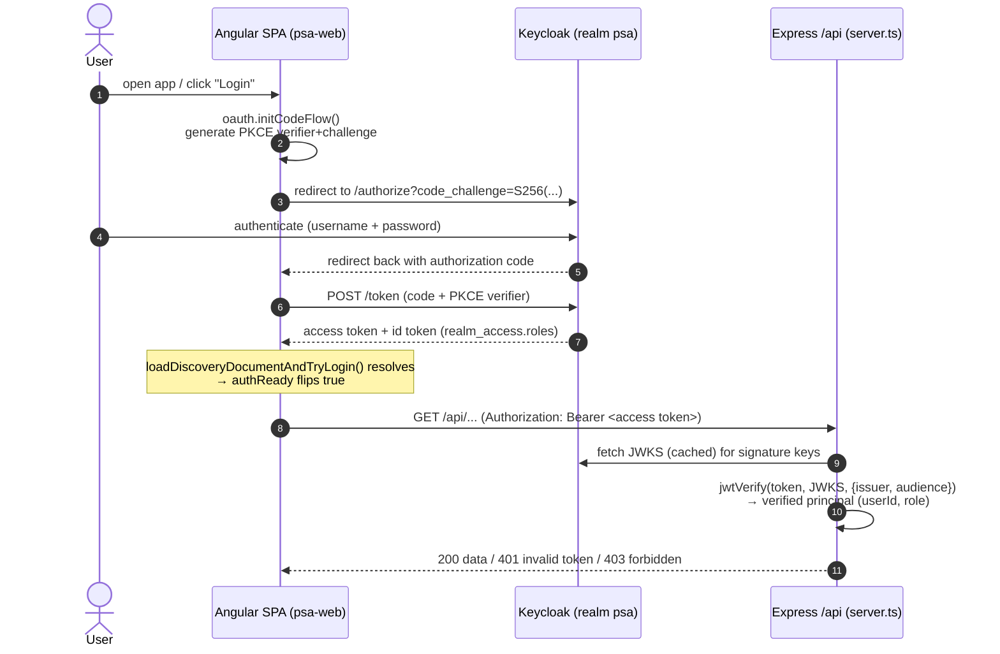
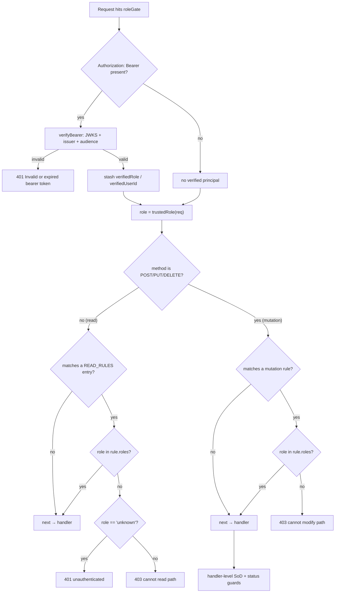

# Security & Identity

> **Diátaxis mode: Explanation.** This page builds the mental model of how
> Delivery Control authenticates a user, decides what that user may do, and
> records what they did. It explains the *why* behind each layer — the
> end-to-end OIDC login, the server-side defence-in-depth, segregation of
> duties, and the append-only audit trail. For the layer overview start at
> [`01-overview.md`](./01-overview.md); for the backend/Repository shape see
> [`03-backend-and-data.md`](./03-backend-and-data.md). The exhaustive,
> look-it-up role/route/endpoint tables live in
> [`../roles-and-permissions.md`](../roles-and-permissions.md). To stand the
> realm up locally, follow [`../functional/keycloak-setup.md`](../functional/keycloak-setup.md).

---

## The shape of the problem

Delivery Control holds commercially sensitive data — resource cost/bill rates,
contracts, orders, billing plans, the revenue-recognition journal, and an
append-only forensic log. Identity and authorization therefore cannot be a
front-end concern: the browser is fully attacker-controlled. The design splits
into two cooperating halves:

- The **Angular SPA** drives the *login experience* (OIDC Authorization Code +
  PKCE against Keycloak), attaches the resulting bearer token to its own `/api`
  calls, and hides routes the user cannot use (a UX nicety, never a security
  boundary).
- The **Express backend** (`src/server.ts`) is the *real* security boundary. It
  cryptographically verifies every bearer token against Keycloak's JWKS, derives
  a trusted role, and applies RBAC + segregation-of-duties + auditing on the
  server where the client cannot interfere.

The guiding rule: **the server never trusts anything the client could forge.** A
verified JWT role always wins; spoofable demo headers are honoured only when an
operator explicitly opts in for local development.

---

## OIDC login: Authorization Code + PKCE

Login uses the OpenID Connect **Authorization Code Flow with PKCE (S256)**. The
SPA is a *public* client (`psa-web`) — it holds no secret, which is exactly why
PKCE is required: the code-to-token exchange is bound to a one-time verifier the
attacker cannot reproduce.

Configuration is fixed in code and overridable in production:

| Setting | Value (dev) | Source |
| --- | --- | --- |
| Realm | `psa` | `keycloak/realm-export.json` |
| Issuer | `http://localhost:8081/realms/psa` | `ISSUER` in `auth.service.ts`; `OIDC_ISSUER` env on the server |
| Client | `psa-web` (public, `standardFlowEnabled`, PKCE `S256`) | `realm-export.json` |
| Scopes | `openid profile email` | `auth.service.ts` |
| Redirect | `window.location.origin + '/'` | `auth.service.ts` |

> Keycloak runs on host port **:8081** — the developer's openHAB owns :8080.



### SSR-safe bootstrap and `authReady` gating

Identity is unknowable during server-side rendering — there is no token on the
server. `AuthService` therefore bootstraps OAuth **only in the browser**, via
`afterNextRender(() => this.init())`. Doing the discovery request inside the
constructor caused an `NG0200` self-reference (the discovery HTTP call flows
through `errorInterceptor`, which `inject()`s `AuthService` mid-construction) and
left hydration unstable (`NG0506`); `afterNextRender` runs once, post-render, and
is a no-op on the server.

Because the OAuth handshake is asynchronous, the service exposes a monotonic
`authReady` signal that flips `true` exactly once — when
`loadDiscoveryDocumentAndTryLogin()` settles (token restored, confirmed absent,
or Keycloak unreachable). Two consumers gate on it:

- **Principal-gated data loads** wait for `authReady` so the request goes out
  *with* the `Authorization` header instead of racing the bootstrap and 401-ing.
- **Route guards** (`role.guard.ts`) return an `Observable<GuardResult>` that
  `filter(ready => ready)` → `take(1)` before evaluating the predicate, so the
  check runs against the *real* post-login role, not the anonymous default.

If Keycloak is unreachable the bootstrap swallows the failure and stays
anonymous — the app still boots (demo/loopback fallback).

---

## Server defence-in-depth

All authorization decisions happen in `roleGate`, an async middleware mounted on
`apiRouter` (after rate limiting, before the audit middleware and the route
handlers). It runs in layers.

### 1. Verify the bearer token

`verifyBearer(req)` extracts `Authorization: Bearer <token>` and calls jose's
`jwtVerify(token, JWKS, { issuer: OIDC_ISSUER, audience: OIDC_AUDIENCE })`:

- **Signature** is checked against the realm JWKS (`createRemoteJWKSet`, lazily
  fetched and cached with rotation handling).
- **Issuer** must equal `OIDC_ISSUER`.
- **Audience** (`aud`) is enforced *only when `OIDC_AUDIENCE` is set*. When set,
  a token minted for a *different* client in the same realm is rejected —
  closing a confused-deputy / cross-audience escalation. When unset, audience is
  not checked (preserves the local-dev default).

The verified principal becomes `req.verifiedUserId` (preferred `preferred_username`,
falling back to `sub`) and `req.verifiedRole` (the highest-privilege realm role).

Three outcomes:

| Token state | Result |
| --- | --- |
| Valid | Stash verified principal on the request; it wins downstream. |
| **Invalid** (bad signature / wrong issuer / expired / wrong audience) | Respond **401** — never silently fall back to header trust. |
| **Absent** | Fall back to demo headers *only if* `AUTH_TRUST_HEADERS=true`; else actor is `'unknown'`. |

### 2. Verified role wins over headers

`trustedRole(req)` encodes the trust hierarchy:

```ts
const trustedRole = (req) => {
  if (req.verifiedRole !== undefined) return req.verifiedRole;   // JWT wins
  return trustHeaders ? actorRole(req) : 'unknown';              // demo headers, opt-in only
};
```

A verified JWT role is **always** trusted. The spoofable `X-User-Role` header is
honoured **only** when `AUTH_TRUST_HEADERS=true` — an explicit, dev-only opt-in
that is *never inferred from the bind host* (binding to 127.0.0.1 behind a
reverse proxy is normal production topology and says nothing about whether the
peer is trusted). When headers are not trusted, every unauthenticated actor is
`'unknown'`, so privileged mutations are denied.

### 3. Highest-privilege-wins role collapse

A Keycloak token can carry several realm roles. Both client and server collapse
them to the single most-privileged one. The server's ordering (higher index =
more privilege) is:

```ts
const ROLE_PRIORITY = ['employee', 'pm', 'resource-manager', 'sales',
                       'finance', 'delivery-executive', 'admin'];
```

`highestRole()` ignores any role outside this set and returns `'unknown'` when
none match. The client mirrors this with a reversed, highest-first list in
`auth.service.ts`. Effective precedence is therefore:

> **admin > delivery-executive > finance > sales > resource-manager > pm > employee**

### 4. RBAC enforcement (read + mutation)

`roleGate` then applies role rules per HTTP method:

- **Reads (GET, etc.):** most of the GET surface stays open (catalogs, config,
  projects). Only genuinely sensitive collections are gated, by `READ_RULES`. A
  request that fails a read rule gets **401 when the role is `'unknown'`**
  (unauthenticated) and **403** otherwise.
- **Mutations (POST / PUT / DELETE):** matched against the mutation `rules`
  array; a role not in the matched rule's list gets **403**. Collections with no
  matching rule are open to any actor that passed bearer verification.

The exact collection→roles arrays are transcribed verbatim in
[`../roles-and-permissions.md`](../roles-and-permissions.md). The decision flow:



Note the asymmetry: a **read** failure can be a 401 (unauthenticated) *or* a 403
(authenticated but unauthorized), whereas the **mutation** rules answer 403 — by
the time a privileged mutation is attempted, an `'unknown'` actor has already
been excluded by the rule because no rule grants `'unknown'`.

---

## Segregation of Duties (SoD)

RBAC answers "may this *role* touch this collection?" SoD answers the orthogonal
question "may this *specific person* be both the requester/owner **and** the
approver?" — which RBAC alone cannot, since the same role legitimately does both
jobs for different items. Three flows enforce it, and all share the same
defence: **the approver/decider is the server-verified actor, and the SoD basis
is a server-pinned identity the client cannot rewrite.**

### Time entries (`PUT /time-entries/:id`)

- The entry's **owner** (`resourceId`) is **not** in the PUT allow-list, so it
  can never be reassigned after creation — an owner cannot re-own a Draft entry
  to a dummy id and then approve it.
- `status` is not in the *create* allow-list and is forced to `'Draft'` after the
  spread, so a client cannot POST an already-`Approved` entry that bypasses the
  transition whitelist and inflates T&M accrual.
- On the transition into `'Approved'`, the approver (the trusted actor, resolved
  from a *user* identity to its **resource id** via `actorResourceId`) must
  differ from the entry's owner. `approvedBy`/`approvedAt` are stamped
  server-side from the verified actor.

> Why the resource-id resolution matters: under real JWT auth the actor is a
> username/`sub`, while entries are keyed by resource id (`'1'`,`'2'`,…).
> Comparing those two namespaces directly is always false — which would silently
> *disable* SoD. `actorResourceId` maps the actor through the user directory
> first.

### Change requests (`POST` / `PUT /change-requests/:id`)

- `createdBy` is **server-pinned** to the verified actor on POST (set after the
  spread, absent from `CHANGE_REQUEST_FIELDS`), so it is the immutable SoD basis.
- On the transition into `'Approved'`: (1) only **`delivery-executive`** or
  **`admin`** may approve; and (2) the decider may be neither the CR's creator
  (`createdBy`) nor — for legacy rows predating `createdBy` — its `requestedBy`
  or `owner`. `decidedBy`/`decidedAt` are stamped server-side.

### Approval-request engine (`POST` / `PUT /approval-requests/:id/decision`)

- `requestedBy` is **server-pinned** to the verified actor at creation (not in
  `APPROVAL_REQUEST_FIELDS`), so the requester cannot forge a different identity.
- A decision requires a recognised principal — an `'unknown'` actor is rejected
  **401**.
- The requester can never decide their own request (SoD), enforced inside a
  per-request lock so concurrent decisions can't double-advance the chain.
- **Step-role enforcement:** only an actor holding the role the routing assigned
  to the *current* step may decide it (`admin` may decide any step). The chain is
  built by `buildApprovalSteps`: items over the high-value threshold (50 000)
  route `delivery-executive` → `finance` (sequential); otherwise a single
  approver is chosen by kind (`TimeEntry`/`Expense` → `resource-manager`,
  `Milestone`/`ChangeRequest` → `delivery-executive`, `Invoice` → `finance`).

The common pattern — **pin the requester/owner server-side, derive the approver
from the verified principal, compare the two** — is what makes SoD real rather
than theatre.

---

## Append-only audit log

Every successful mutation is recorded by the audit middleware, immediately after
`roleGate`:

- The log is **append-only** — entries are created in insertion order and never
  edited or deleted.
- For `PUT`/`DELETE` it snapshots the target entity **before** the handler runs
  and **after** it finishes, and records `changedKeys` plus before/after
  snapshots of just those keys. `POST` has no prior state.
- **Attribution integrity:** the recorded `actorRole`/`actorId` use the *same*
  trust gate as authorization (`trustedRole` / `verifiedUserId`), never the raw
  `X-User-*` headers — so an unauthenticated caller cannot forge the recorded
  actor (e.g. role `admin`) in the forensic log even when header trust is off.
- Auditing is **best-effort**: it runs in an async IIFE on `res.on('finish')`
  and never affects the already-sent response.

The **read** side (`GET /audit-logs`, restricted to `admin`/`delivery-executive`)
is paged newest-first, with `limit`/`offset` clamped (default 200, max 1000) so a
client can never stream the whole ever-growing log. On Postgres the ordering,
`LIMIT` and `OFFSET` are pushed into SQL (backed by `audit_logs_at_idx`).

---

## Client-side scoping: interceptors & CORS

Two HTTP interceptors shape outbound requests, and both are carefully scoped to
**same-origin `/api`** so credentials never leak off-origin:

- **`authTokenInterceptor`** attaches `Authorization: Bearer <access token>` to
  same-origin `/api` requests only (browser-only; a no-op on SSR and when no
  token exists). It never adds the header to third-party hosts (e.g. Keycloak).
- **`errorInterceptor`** stamps the demo `X-User-Id` / `X-User-Role` headers —
  **only** on same-origin `/api` calls. Cross-origin requests (notably the
  Keycloak discovery/token endpoints) must **not** carry these headers: they
  would trigger a CORS preflight Keycloak rejects, breaking login. Scoping the
  `AuthService` injection to `/api` also avoids the `AuthService` ↔ interceptor
  bootstrap cycle. It also swallows the toast for transient 401s on own-`/api`
  GETs (auth-state transitions during bootstrap), while still rethrowing so
  resources fall back to their empty defaults.

The Keycloak client (`psa-web`) declares `webOrigins` for `http://localhost:3000`
so the SPA origin is allowed to call the token endpoint.

---

## Route guards (client UX, not a boundary)

`role.guard.ts` provides a `roleGuard(check, redirect)` factory built on
`CanMatch` (so an unauthorized lazy chunk never even loads), plus two concrete
guards:

- **`commercialGuard`** → `auth.canManageCommercial()`
- **`financeGuard`** → `auth.canApproveFinancials()`

They are **SSR-aware**: on the server, identity is unknowable, so the guard
*allows* the match (letting the page render) and re-runs authoritatively in the
browser after `authReady`. This is safe precisely because **data** is protected
independently — the server JWKS-verifies the bearer on every `/api` call
regardless of which route rendered. Guards are a UX optimization; the API is the
boundary. The exact route→roles mapping is in
[`../roles-and-permissions.md`](../roles-and-permissions.md).

---

## Demo header trust (development only)

When `AUTH_TRUST_HEADERS=true` and no bearer token is present, the server trusts
`X-User-Id` / `X-User-Role`. This exists **only** so the demo works on a
developer's machine without standing up Keycloak. The headers are trivially
spoofable (any caller can set `X-User-Role: admin`), so this must **never** be
enabled on any network reachable by untrusted clients — *including* a
TLS-terminating reverse proxy on a loopback bind. With trust off, the startup log
warns and every unauthenticated actor is `'unknown'` (privileged mutations denied
403).

---

## Production hardening checklist

For deployment specifics see
[`06-deployment-operations.md`](./06-deployment-operations.md). Security
essentials:

- **TLS everywhere** — terminate HTTPS at the proxy; set `TRUST_PROXY` to the
  exact number of trusted proxy hops so `req.ip` (the rate-limit key) is the real
  client IP, not the proxy socket. Default `0` (off) is the safe no-proxy value.
- **`AUTH_TRUST_HEADERS=false`** (or unset) — never trust demo headers in prod.
- **Real `OIDC_ISSUER`** — point at the deployed Keycloak realm URL, not
  `localhost:8081`.
- **Set `OIDC_AUDIENCE`** — enforce the `aud` claim to block cross-audience token
  replay within the realm.
- **Secrets & realm config** — manage Keycloak admin credentials and any client
  secrets out of band; the committed `realm-export.json` is a *dev* seed
  (`requireHttps: false`, demo passwords) and must be hardened before any
  shared environment.
- **Body size & rate limits** — `express.json({ limit: '1mb' })` plus per-client
  (300/min) and global (3000/min) fixed-window limiters are already in place;
  tune for the deployment.

---

## See also

- [`01-overview.md`](./01-overview.md) — the four layers and dev-vs-prod runtime.
- [`03-backend-and-data.md`](./03-backend-and-data.md) — the Express/Repository
  backend and data model this RBAC sits on top of.
- [`../roles-and-permissions.md`](../roles-and-permissions.md) — the definitive
  role, route, and endpoint-RBAC reference.
- [`../functional/keycloak-setup.md`](../functional/keycloak-setup.md) — stand up
  the `psa` realm and assign roles.
- [`../functional/00-overview.md`](../functional/00-overview.md) — the functional
  areas these roles map onto.
