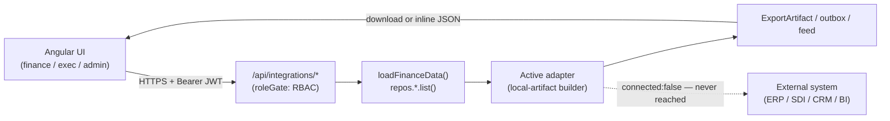

# Integrations

> **Diátaxis mode: Explanation + Reference.** The first half explains the
> adapter-seam philosophy: why every external system is reached through one typed
> interface with exactly one local-artifact implementation, and how that
> implementation is swapped. The second half is reference material: each adapter's
> concrete output, the registry env-switch, and the `/api/integrations` endpoint
> table. For the operating how-to (which button produces which file), see
> [`../functional/integrations.md`](../functional/integrations.md).

## The adapter-seam philosophy

Delivery Control never calls an external system directly. Every integration KIND
— **ERP/GL**, **e-invoicing**, **CRM**, **BI** — is modeled as:

1. **One typed adapter interface** in `src/server/integrations/types.ts`
   (`ErpExportAdapter`, `EInvoiceAdapter`, `CrmSyncAdapter`, `BiFeedAdapter`),
   each of which exposes a `describe()` plus one build method.
2. **Exactly one concrete implementation** per kind, and that implementation is a
   **LOCAL-ARTIFACT builder**: a pure function from plain repository data to an
   in-memory `{ filename, mimeType, content }` (or, for CRM, an outbox entry).
   There is **no network I/O, no credentials, and no vendor SDK** anywhere in the
   layer.

Each adapter self-describes via an `IntegrationDescriptor` whose discriminators
make the intent explicit and machine-readable:

```ts
connected: false           // never contacts an external system
mode: 'local-artifact'     // output is a local, inspectable artifact only
```

The point of the seam is that the *business mapping* (revenue-recognition →
balanced GL journal; invoiced order → FatturaPA XML; customers/contracts → CRM
payload; projects → BI rows) is implemented and unit-tested **today**, while the
delivery mechanism (an HTTP POST, an SDI transmission, a CRM webhook) is left for
a future "connected" implementation that would satisfy the same interface. When
that day comes, you add a second implementation and flip an env var — no handler,
no caller, and no business mapping changes.

### Swapping an implementation

Each kind resolves its active adapter from an env var, defaulting to the single
existing implementation:

| Kind | Env var | Default key |
| --- | --- | --- |
| `erp` | `INTEGRATION_ERP_ADAPTER` | `generic-ledger-export` |
| `einvoice` | `INTEGRATION_EINVOICE_ADAPTER` | `fatturapa` |
| `crm` | `INTEGRATION_CRM_ADAPTER` | `crm-webhook-json-outbox` |
| `bi` | `INTEGRATION_BI_ADAPTER` | `json-feed` |

The registry (`src/server/integrations/registry.ts`) memoizes the active
adapters (`getIntegrations()`) — they are stateless pure builders, so sharing one
instance process-wide is safe. An env var naming an **unknown** key falls back to
the default with a `console.warn` rather than failing boot (there is exactly one
implementation per kind today, so any other value is a misconfiguration).

## The four adapters (reference)

### ERP — `GenericLedgerExport`

Turns the revenue-recognition journal (the `JournalEntry[]` produced by
`recognitionJournal` in `finance.util`) into a flat-file an ERP/accounting system
could import. Two formats:

- **CSV** — one row per journal **line** (`date,memo,account,debit,credit`), a
  header row, and a trailing `TOTALS` row carrying batch Σ debit / Σ credit. Lines
  are joined with CRLF (RFC 4180); every cell goes through `escapeCsv` so a memo or
  account starting with `=`/`+`/`-`/`@`/TAB/CR cannot inject a spreadsheet formula.
- **JSON** — the entries verbatim plus the validated debit/credit totals.

**Balance invariant.** An ERP must never receive an unbalanced batch. Both build
paths first check `journalTotals(entries).balanced`; on violation the builder
throws a typed `UnbalancedJournalError` carrying the offending totals rather than
producing an artifact. `recognitionJournal` is balanced by construction (each
posting emits an equal debit/credit pair), so this is a defensive guard — the
route maps it to a `409`. An empty journal is balanced by definition (Σ0 = Σ0) and
yields a valid empty artifact.

### E-invoicing — `FatturaPA` (FPR12)

Generates a simplified Italian **FatturaElettronica v1.2** XML
(`FormatoTrasmissione = FPR12`, fattura verso privati) for one **invoiced** order.
Specifics that keep it schema-valid:

- `TipoDocumento` **TD01**; `CedentePrestatore` from supplier master data
  (env-driven, see below) with `RegimeFiscale RF01`; `CessionarioCommittente` from
  the customer (with a placeholder VAT, since the `Customer` entity carries none).
- A flat **22% VAT** (`AliquotaIVA 22.00`): `ImponibileImporto` = rounded sum of
  line amounts, `Imposta` = 22% of it, `ImportoTotaleDocumento` = imponibile +
  imposta.
- Each `DettaglioLinee` includes a mandatory **`PrezzoUnitario`** with
  `Quantita 1.00` so `PrezzoTotale = PrezzoUnitario × Quantita` (satisfies SDI
  checks 00200/00423); all amounts are rounded to cents so the document obeys its
  own Σ-lines invariant (00422). Order lines feed the body; an order with no lines
  falls back to a single synthetic line from the order/contract.
- XML text is escaped (`escapeXml`); `Data` is normalized to an `xs:date`
  (`YYYY-MM-DD`).

**Validation.** A missing invoice number (`MISSING_INVOICE_NUMBER`) or missing
supplier VAT (`MISSING_SUPPLIER_VAT`) throws a typed `EInvoiceValidationError` —
the route maps it to a `400`. Only invoiced orders can be exported.

### CRM — `WebhookJsonOutbox`

Builds the exact JSON payload a CRM webhook **would** receive — `accounts` mapped
from customers, `deals` mapped from contracts (deal stage derived from contract
status: `Draft→Negotiation`, `Active→Won`, `Closed→Closed`) joined with each
contract's orders — and wraps it in an outbox entry with status **`Prepared`**.
There is **no `Sent` state** because nothing is ever transmitted. The builder is
pure (the caller supplies `preparedAt`; ids are assigned by the persistence
layer). The outbox itself is **intentionally ephemeral** module-scoped state on
the server: newest-first, capped at 50 entries, cleared on restart by design.

### BI — `JsonFeed`

Builds a flat JSON dataset (one row per project, **all values primitives**)
suitable for Power BI / Tableau. The caller computes each project's financials via
`computeProjectFinancials` and maps `varianceAtCompletion → vac`; the adapter only
formats. It is a left/right-inclusive join by `projectId` — projects with no
financials and financial rows with no matching project are both emitted, padded
with `null`s so no input is silently dropped — and rows are sorted by `projectId`
for a deterministic artifact. Non-finite numbers and `undefined` normalize to
`null` (valid JSON). The BI feed is consumed **inline** (preview/ingestion), not
as a file download.

### Supplier master data (e-invoice)

`CedentePrestatore` (the issuer) is sourced from environment variables with demo
defaults: `INTEGRATION_SUPPLIER_NAME`, `_VAT`, `_ADDRESS`, `_CITY`, `_ZIP`,
`_COUNTRY`, `_SDI` (codice destinatario).

## The `/api/integrations` endpoints (reference)

All routes are gated to **finance / delivery-executive / admin** — on both reads
and writes — via the integration RBAC rules in `roleGate`
(see [`04-security-identity.md`](./04-security-identity.md)). The list, ERP, and
FatturaPA artifacts are sent as **file downloads** (sanitized
`Content-Disposition` filename); the BI feed and CRM outbox are returned inline.

| Endpoint | Method | Roles | Artifact / behaviour |
| --- | --- | --- | --- |
| `/integrations` | GET | finance / delivery-executive / admin | Active adapter descriptors + per-kind active key |
| `/integrations/erp/journal-export` | GET | finance / delivery-executive / admin | Balanced GL journal — CSV (default) or `?format=json`; window derived from dated activity, overridable with `from`/`to` (`YYYY-MM`); `409` if unbalanced |
| `/integrations/einvoice/orders/:id` | GET | finance / delivery-executive / admin | FatturaPA FPR12 XML for the order; `404` broken chain, `400` not invoiced |
| `/integrations/crm/outbox` | GET | finance / delivery-executive / admin | The ephemeral prepared-outbox list (newest first) |
| `/integrations/crm/outbox` | POST | finance / delivery-executive / admin | Build a `Prepared` CRM sync payload and push it to the outbox |
| `/integrations/bi/feed` | GET | finance / delivery-executive / admin | Flat per-project financial feed (JSON, returned inline) |

**GL export window.** The handler derives the recognition window from the min/max
months across time-entry and billing-item dates (`deriveJournalWindow`), so the
export covers **all** dated activity rather than a hardcoded year; it falls back
to full-year 2026 monthly only when nothing is dated. Validated `from`/`to` query
params (each `YYYY-MM`) override it, and `from > to` is rejected with `400`.

## Request flow (no external call)

Every integration request stays entirely inside the process — the artifact is
built from repository data and handed straight back to the caller.



The dotted edge to the external system is **never traversed** by this layer: every
descriptor advertises `connected: false` / `mode: 'local-artifact'`.

## Where to go next

- How to produce and use each artifact → [`../functional/integrations.md`](../functional/integrations.md)
- The data these adapters read → [`03-backend-and-data.md`](./03-backend-and-data.md)
- Who is allowed to call them → [`04-security-identity.md`](./04-security-identity.md) and [`../roles-and-permissions.md`](../roles-and-permissions.md)
- The layered overview → [`01-overview.md`](./01-overview.md)
- Functional overview → [`../functional/00-overview.md`](../functional/00-overview.md)
