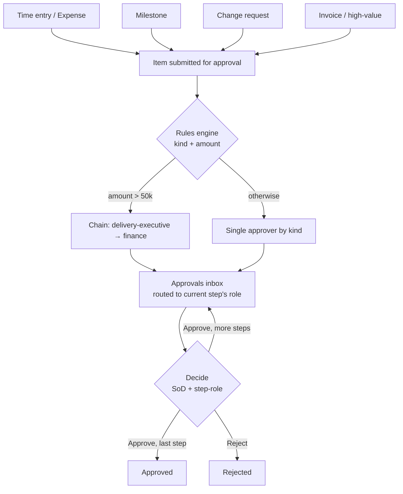
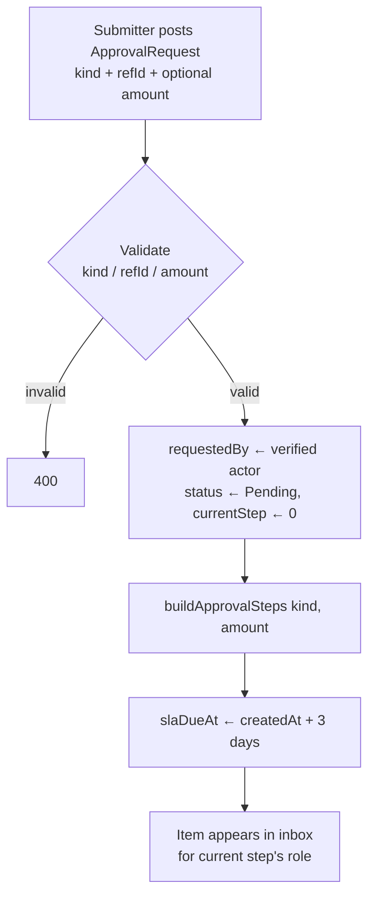
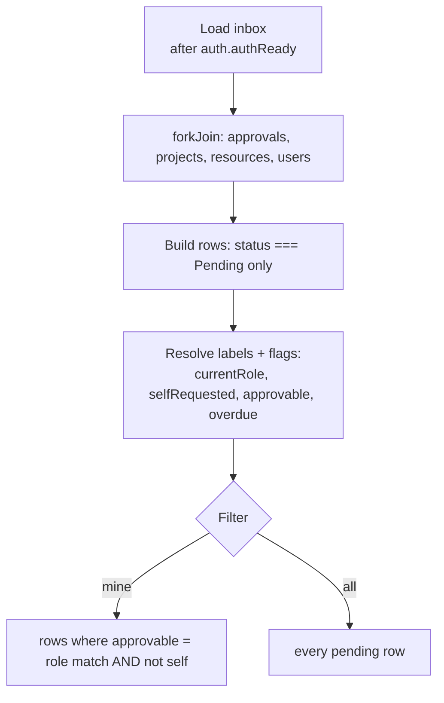
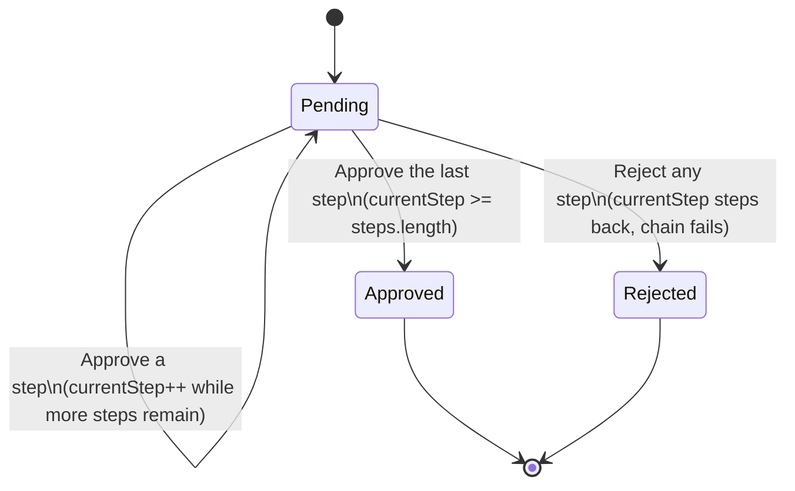
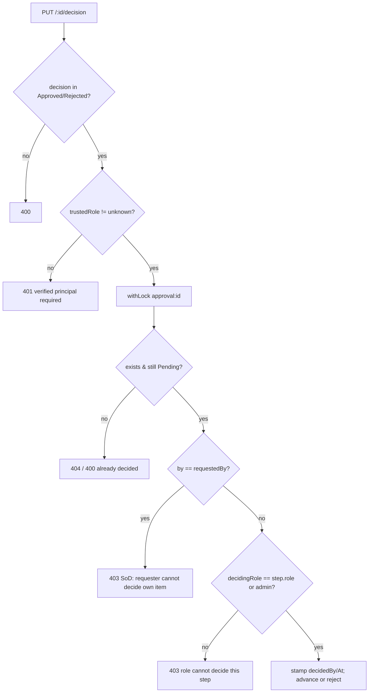
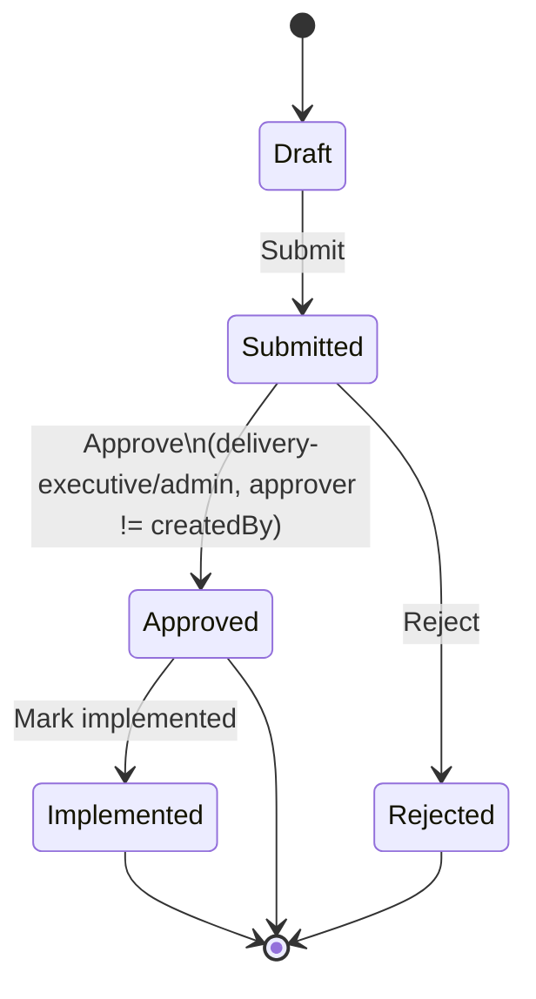

# Approvals & Governance — Standard Operating Procedures

> **Diátaxis mode: How-to.** This document holds the SOPs for the governance
> layer of Delivery Control: how items enter the approval queue (time-entry,
> expense, milestone, change-request, invoice), how the **rules engine** derives
> the approver chain from `kind` + `amount`, how reviewers work the Approvals
> inbox, and how a decision is taken under **Segregation of Duties (SoD)** with
> per-step role enforcement, multi-step high-value chains, and SLA tracking.
> Each SOP follows the format in [`00-overview.md`](00-overview.md). Roles and
> the authorization model are in
> [`../roles-and-permissions.md`](../roles-and-permissions.md).

**Source of truth.** Grounded in the Angular component
`src/app/approvals/approvals.ts` (the inbox + SoD-aware affordances),
`src/app/projects/change-requests/change-requests.ts` (the CR lifecycle that
feeds a `ChangeRequest`-kind approval / its own approve transition), and the
server handlers in `src/server.ts`:

- `POST /approval-requests` — the **rules engine**: `buildApprovalSteps(kind, amount)`,
  `approverRolesByKind`, `slaDueFrom`, and the server-pinned `requestedBy`.
- `PUT /approval-requests/:id/decision` — the **decision engine**: SoD
  (`by === ar.requestedBy` ⇒ 403), step-role enforcement, concurrency lock,
  state-machine advance/reject.
- `PUT /change-requests/:id` — the parallel **CR approval** SoD guard
  (delivery-executive/admin only; approver ≠ server-pinned `createdBy`).

**Roles touching this domain (RBAC, from `src/server.ts`):**

- `/approval-requests` (read **and** mutate, incl. `/decision`) →
  `pm`, `resource-manager`, `delivery-executive`, `finance`, `admin`.
  The coarse gate admits these five roles; the **per-step role** and **SoD**
  checks inside the decision handler are what actually decide who may decide a
  given step.
- `/change-requests` (read/mutate the lifecycle) → `pm`, `delivery-executive`,
  `admin`. The **approve** transition is additionally SoD-gated to
  `delivery-executive`/`admin` and approver ≠ creator.

> **Server is the authority.** The inbox UI mirrors the SoD + step-role rules so
> it never offers an action the server would reject, but every guard is
> re-enforced server-side. `requestedBy` (approval requests) and `createdBy`
> (change requests) are **pinned to the verified principal** at creation and are
> never client-settable — that is the immutable basis the SoD checks trust.

---

## Domain flow at a glance

---

## Approval KIND → required role(s) → threshold

The chain is built once at creation by `buildApprovalSteps(kind, amount)`.
**Amount routing takes precedence:** any request with `amount > 50000`
(`APPROVAL_HIGH_VALUE_THRESHOLD`) is escalated to the two-step
`delivery-executive → finance` chain **regardless of kind**. Otherwise a single
approver is chosen by `approverRolesByKind(kind)`.

| Kind | Single-approver role (amount ≤ 50k or no amount) | High-value chain (amount > 50k) |
| --- | --- | --- |
| `TimeEntry` | `resource-manager` | `delivery-executive` → `finance` |
| `Expense` | `resource-manager` | `delivery-executive` → `finance` |
| `Milestone` | `delivery-executive` | `delivery-executive` → `finance` |
| `ChangeRequest` | `delivery-executive` | `delivery-executive` → `finance` |
| `Invoice` | `finance` | `delivery-executive` → `finance` |

Notes:
- The threshold is a strict `>` (exactly 50,000 stays on the single-approver
  path). A request with no `amount` always takes the single-approver path.
- Each derived role becomes one `ApprovalStep { role, status: 'Pending' }`;
  `currentStep` starts at `0`. The chain order is the order shown above.
- `kind` must be one of `TimeEntry | Expense | Milestone | ChangeRequest | Invoice`
  (else `400`); `refId` is required; `amount` (when present) must be a
  non-negative number.

---

## SOPs

### Submit an item for approval

**Purpose.** Place a delivery or financial item into the governance queue so the
correct authority signs it off before it takes effect. The rules engine derives
the approver chain so submitters never pick approvers manually.

**Scope.**
- *In:* creating an `ApprovalRequest` of any kind via `POST /approval-requests`;
  the server-derived step chain and SLA.
- *Out:* deciding the item (see *Decide an approval*); the change-request
  lifecycle's own Draft→Submitted→Approved transitions (see
  [project-delivery](project-delivery.md) and *Decide a change request* below);
  invoice issuance mechanics (see [billing-and-revenue](billing-and-revenue.md)).

**RACI.**

| Activity | pm | resource-manager | finance | delivery-executive | admin |
| --- | --- | --- | --- | --- | --- |
| Submit time-entry / expense approval | C | R | I | I | A |
| Submit milestone / change-request approval | R | I | I | A | A |
| Submit invoice / high-value approval | I | I | R | A | A |
| Derive the step chain (automatic) | — | — | — | — | — |

*(R = the role that typically raises the item; A = accountable owner of the
chain it routes to. The mutation gate admits pm/resource-manager/delivery-executive/finance/admin
to `POST /approval-requests`.)*

**Process flow.**

**Detailed steps.**

1. **Raise the item.**
   - **Who:** `pm`, `resource-manager`, `finance`, `delivery-executive`, or `admin`.
   - **When:** a time entry needs sign-off, a milestone is reached, a change
     request needs governance, or an invoice / high-value commitment must be
     authorized.
   - **How:** `POST /approval-requests` with `{ kind, refId, projectId?, amount?, note? }`.
     Only these fields are accepted (`APPROVAL_REQUEST_FIELDS`); anything else is
     dropped.
   - **Output:** a persisted `AR…` request, `status: 'Pending'`.

2. **Server pins the SoD basis.**
   - **Who:** server.
   - **When:** on create, after validation.
   - **How:** `requestedBy` is set to `actorId(req)` (the verified principal),
     **never** copied from the body — so the requester cannot forge a different
     identity to later self-approve.
   - **Output:** an immutable requester identity on the request.

3. **Derive the approver chain (rules engine).**
   - **Who:** server (`buildApprovalSteps`).
   - **When:** on create.
   - **How:** if `amount > 50000` → `['delivery-executive', 'finance']`; else
     `approverRolesByKind(kind)` (see the KIND table). Each role becomes a
     `Pending` step; `currentStep = 0`.
   - **Output:** an ordered `steps[]` and the SLA due date
     (`slaDueAt = createdAt + 3 days`, `APPROVAL_SLA_DAYS`).

**Exceptions.**

| Condition | Handling |
| --- | --- |
| `kind` not in the allowed set | `400 kind must be one of: …` |
| Missing / empty `refId` | `400 refId is required` |
| Negative or non-numeric `amount` | `400 amount must be a non-negative number` |
| Caller lacks mutate role on `/approval-requests` | `403` (or `401` if unauthenticated) |

**Metrics.**

| Metric | Definition |
| --- | --- |
| Open approvals | Count of requests with `status === 'Pending'`. |
| Chain length | `steps.length` (1 for single-approver, 2 for high-value). |
| SLA target | `APPROVAL_SLA_DAYS` = 3 days from `createdAt`. |

**Related.** [Roles & SoD](../roles-and-permissions.md) ·
[Change requests](project-delivery.md) ·
[Invoice approval](billing-and-revenue.md).

---

### Review the Approvals inbox

**Purpose.** Give each authority a focused queue of exactly the items awaiting
**their** role at the current step, with SLA status and SoD flags visible, so
sign-offs happen against the right basis and on time.

**Scope.**
- *In:* the `src/app/approvals/approvals.ts` inbox — the *My inbox* / *All
  pending* toggle, enriched rows, SLA badges, and the approve/reject affordances.
- *Out:* the actual decision rules (next SOP); item-specific detail screens.

**RACI.**

| Activity | pm | resource-manager | finance | delivery-executive | admin |
| --- | --- | --- | --- | --- | --- |
| View *My inbox* (items awaiting my role) | R | R | R | R | R |
| View *All pending* | C | C | C | C | A |
| Monitor SLA / overdue | I | I | C | A | A |

**Process flow.**

**Detailed steps.**

1. **Open the inbox.**
   - **Who:** any role admitted to `/approval-requests`.
   - **When:** routinely, or when notified an item awaits sign-off.
   - **How:** navigate to `approvals`. The load is keyed on `auth.authReady()`
     so the gated `forkJoin` (approvals + projects + resources + users) fires
     **after** the OIDC bearer token is attached — avoiding a 401 that would
     latch the inbox empty.
   - **Output:** a table of every `Pending` request, enriched with project /
     requester labels, current-step role, and SLA status.

2. **Choose the filter.**
   - **Who:** the reviewer.
   - **When:** to triage their own queue vs. see portfolio-wide load.
   - **How:** the *My inbox* / *All pending* toggle. *My inbox* (`filter='mine'`)
     shows only `approvable` rows — where the current step's role matches the
     signed-in role (admin matches any) **and** the row is not self-requested.
     The *My inbox* badge count is `mineCount()`.
   - **Output:** a scoped row set; `rows()` recomputes from `allRows()`.

3. **Read step + SLA context.**
   - **Who:** the reviewer.
   - **When:** before deciding.
   - **How:** each row shows `stepRoleLabel` (the role the step awaits),
     `Step X of N`, and an SLA badge: **Overdue** when `slaDueAt` is in the past,
     **On track** otherwise.
   - **Output:** clarity on who must act and whether the item is late.

**Exceptions.**

| Condition | Handling |
| --- | --- |
| Token not yet restored on reload | Load deferred until `authReady()`; default empty data, no false "empty inbox". |
| Row awaits a different role | Approve/Reject disabled; tooltip "Awaiting `<role>` approval". |
| Row was requested by the viewer | Approve/Reject disabled; SoD tooltip (see next SOP). |
| Inbox load errors | `app-list-state` shows the error with a retry. |

**Metrics.**

| Metric | Definition |
| --- | --- |
| My inbox count | `mineCount()` — pending rows where `approvable` is true for the signed-in role. |
| Overdue items | Rows where `new Date(slaDueAt) < now`. |
| Pending total | All rows in *All pending*. |

**Related.** [Decide an approval](#decide-an-approval-segregation-of-duties) ·
[Roles & SoD](../roles-and-permissions.md).

---

### Decide an approval (Segregation of Duties)

**Purpose.** Approve or reject the current step of a request such that (1) no one
decides their own item, (2) only the role the step is routed to may decide it,
and (3) a multi-step high-value chain advances `delivery-executive → finance`
before the request is Approved.

**Scope.**
- *In:* `PUT /approval-requests/:id/decision` and the inbox `decide()` action;
  the SoD, step-role, concurrency, and state-machine rules.
- *Out:* the change-request lifecycle's own approve transition (next SOP).

**RACI** *(for a single decision; the responsible role is whichever role the
**current step** routes to).*

| Activity | pm | resource-manager | finance | delivery-executive | admin |
| --- | --- | --- | --- | --- | --- |
| Decide a `resource-manager` step (time/expense) | — | R | — | — | A |
| Decide a `delivery-executive` step (milestone/CR; HV step 1) | — | — | — | R | A |
| Decide a `finance` step (invoice; HV step 2) | — | — | R | — | A |
| Decide a step you requested | denied (SoD) | denied | denied | denied | denied |

*(admin may decide any step; the requester may decide **none** of their own
items, regardless of role.)*

**Process flow — the approval state machine.**

**Decision guard order (server, inside a per-request lock).**

**Detailed steps.**

1. **Trigger the decision.**
   - **Who:** the role the **current step** is routed to (or `admin`).
   - **When:** the item is in their *My inbox* and on/under SLA.
   - **How:** click Approve / Reject in the inbox, which calls
     `decideApprovalRequest(id, decision, userId)`. `pendingId` guards against
     double-submit; the UI only enables the buttons when `canDecide`
     (`roleMatches && !selfRequested`).
   - **Output:** a `PUT /approval-requests/:id/decision` with
     `{ decision: 'Approved' | 'Rejected' }`.

2. **Identify the decider from the verified principal.**
   - **Who:** server.
   - **When:** before any state change.
   - **How:** `decidingRole = trustedRole(req)` and `by = actorId(req)` — the
     deciding identity is the JWT/trusted-header principal, **never** a
     client-supplied `by`. An `unknown` principal is rejected `401`.
   - **Output:** a trusted `(by, decidingRole)` to test SoD and step-role against.

3. **Enforce Segregation of Duties.**
   - **Who:** server.
   - **When:** inside the lock, on the freshest state.
   - **How:** if `by === ar.requestedBy` → `403` (the requester can never decide
     their own item). This is meaningful precisely because `requestedBy` was
     pinned to the verified actor at creation.
   - **Output:** self-decision blocked.

4. **Enforce step-role.**
   - **Who:** server.
   - **When:** after SoD passes.
   - **How:** if `decidingRole !== step.role && decidingRole !== 'admin'` →
     `403 Role <x> cannot decide a step assigned to <step.role>`. This stops the
     coarse `/approval-requests` gate from letting, e.g., a `pm` decide a step
     routed to `finance`/`delivery-executive`.
   - **Output:** only the right authority advances each step.

5. **Apply the state transition.**
   - **Who:** server.
   - **When:** after both guards pass.
   - **How:** stamp `step.decidedBy/decidedAt`. On **Approve**:
     `step.status = 'Approved'`, `currentStep++`; when `currentStep >= steps.length`
     the whole request becomes `Approved`, otherwise it stays `Pending` and routes
     to the next step's role. On **Reject**: `step.status = 'Rejected'`,
     `ar.status = 'Rejected'`, `currentStep` steps back by one — a rejection at
     any step fails the whole chain.
   - **Output:** updated request; the inbox reloads and toasts the outcome.

**Worked example — high-value chain.** A `Milestone` request with
`amount = 80000` builds `['delivery-executive', 'finance']`. The
delivery-executive approves step 0 (`currentStep` → 1, still `Pending`, now
awaiting `finance`); finance approves step 1 (`currentStep` → 2 ≥ length ⇒
`Approved`). Neither may be the requester; a `pm` cannot decide either step.

**Exceptions.**

| Condition | Handling |
| --- | --- |
| `decision` not `Approved`/`Rejected` | `400`. |
| Unauthenticated principal (`unknown`) | `401 A verified principal is required`. |
| Request not found | `404`. |
| Request already `Approved`/`Rejected` | `400 approval request already <status>`. |
| Decider is the requester | `403` SoD. |
| Decider's role ≠ current step role (and not admin) | `403` step-role. |
| Concurrent decisions on a multi-step request | Serialized via `withLock('approval:<id>')`; each re-reads fresh state, no double-advance. |

**Metrics.**

| Metric | Definition |
| --- | --- |
| Approval rate | Approved ÷ (Approved + Rejected) over decided requests. |
| Steps cleared | Approved steps before terminal state (chain depth realized). |
| SoD blocks | `403` self-decision rejections (should trend to ~0; UI pre-blocks). |

**Related.** [Roles & SoD](../roles-and-permissions.md) ·
[Review the inbox](#review-the-approvals-inbox) ·
[Invoice approval](billing-and-revenue.md).

---

### Decide a change request (parallel SoD path)

**Purpose.** Govern scope/budget/schedule changes through an explicit
`Draft → Submitted → Approved/Rejected → Implemented` lifecycle whose **approve**
transition carries its own SoD guard — because an approved CR feeds
`effectiveBudgetForProject` and would otherwise let a requester silently inflate
their own project budget.

**Scope.**
- *In:* the `src/app/projects/change-requests/change-requests.ts` lifecycle and
  the `PUT /change-requests/:id` approve guard.
- *Out:* a `ChangeRequest`-**kind** entry in the approval engine above (that path
  routes to `delivery-executive` and follows the generic decision engine); CR
  financial impact on EAC/VAC (see [project-delivery](project-delivery.md)).

**RACI.**

| Activity | pm | resource-manager | finance | delivery-executive | admin |
| --- | --- | --- | --- | --- | --- |
| Create / Submit a CR | R | — | — | C | A |
| Approve / Reject a CR | denied (cannot approve) | — | — | R | A |
| Mark Implemented | C | — | — | R | A |

*(`/change-requests` mutation is gated to pm/delivery-executive/admin; the
**approve** transition is further restricted to delivery-executive/admin and the
approver must not be the CR's creator.)*

**Process flow.**

**Detailed steps.**

1. **Create and submit.**
   - **Who:** `pm` (or `delivery-executive`/`admin`).
   - **When:** scope/budget/schedule needs a governed change.
   - **How:** the Change Control screen `save()` posts a `Draft` CR; the server
     pins `createdBy = actorId(req)` (not client-settable). `setStatus(…, 'Submitted')`
     moves it to `Submitted`.
   - **Output:** a CR awaiting decision; KPIs (Open, Approved Impact, Schedule
     Impact, High/Critical) update.

2. **Approve under SoD.**
   - **Who:** `delivery-executive` or `admin`, **other than** the creator.
   - **When:** the CR is `Submitted`.
   - **How:** `setStatus(change, 'Approved')` → `PUT /change-requests/:id` with
     `status: 'Approved'`. The server checks the transition **into** Approved:
     role must be `delivery-executive`/`admin` (else `403`), and the decider must
     not equal the pinned `createdBy` (falling back to `requestedBy`/`owner` for
     legacy rows) — else `403` SoD. `decidedBy/decidedAt` are stamped server-side.
   - **Output:** an `Approved` CR whose `impactBudget` flows into the project's
     effective budget / VAC.

3. **Reject or implement.**
   - **Who:** `delivery-executive`/`admin`.
   - **When:** the change is declined, or approved work is delivered.
   - **How:** `setStatus(change, 'Rejected')` (stamps decided who/when) or, from
     `Approved`, `setStatus(change, 'Implemented')`.
   - **Output:** terminal CR state.

**Exceptions.**

| Condition | Handling |
| --- | --- |
| Approver lacks delivery-executive/admin | `403 Only delivery-executive or admin may approve a change request`. |
| Approver is the CR creator (`createdBy`) | `403` SoD. |
| Legacy CR with no `createdBy` | SoD falls back to `requestedBy`/`owner`. |
| CR not found | `404`. |

**Metrics.**

| Metric | Definition |
| --- | --- |
| Open changes | CRs in `Draft` or `Submitted` (also surfaced on the reporting dashboard). |
| Approved budget impact | Σ `impactBudget` of `Approved`/`Implemented` CRs. |
| Approved schedule impact | Σ `impactScheduleDays` of `Approved`/`Implemented` CRs. |
| High/Critical | CRs with `priority` High or Critical. |

**Related.** [Project delivery — change control](project-delivery.md) ·
[Roles & SoD](../roles-and-permissions.md) ·
[Reporting — Open Changes KPI](reporting-analytics.md).

---

## SLA tracking

- **Target.** Every request gets `slaDueAt = createdAt + APPROVAL_SLA_DAYS`
  (3 days), set by `slaDueFrom` at creation.
- **Surfacing.** The inbox marks a row **Overdue** when
  `new Date(slaDueAt).getTime() < now`, else **On track**. Overdue is purely a
  visual/management signal — it does **not** block or auto-escalate a decision.
- **Operational use.** Delivery-executive / finance monitor overdue items in
  *All pending*; an overdue high-value chain typically means step 1
  (`delivery-executive`) has not yet cleared to route step 2 to `finance`.

---

## Related

- [Roles & permissions / SoD model](../roles-and-permissions.md)
- [Project delivery — change requests](project-delivery.md)
- [Billing & revenue — invoice approval](billing-and-revenue.md)
- [Reporting & analytics — Open Changes / alerts](reporting-analytics.md)
- [Functional overview & SOP format](00-overview.md)
