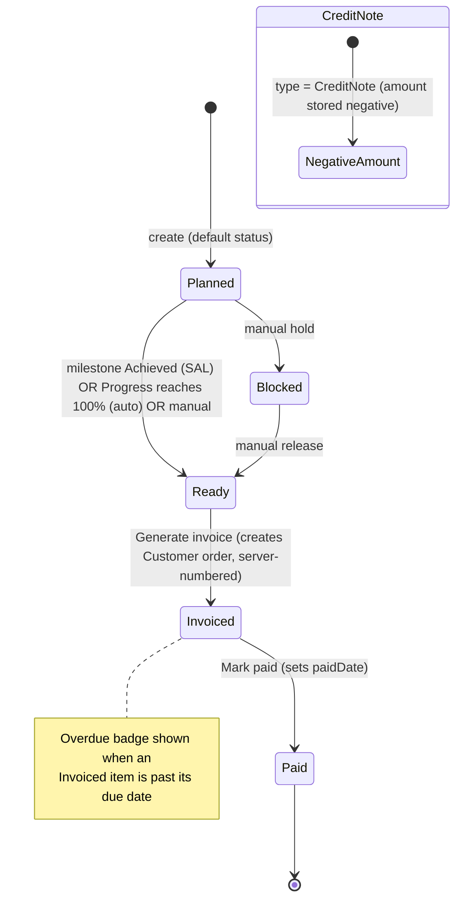
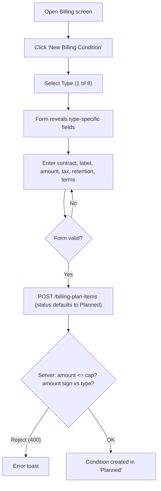
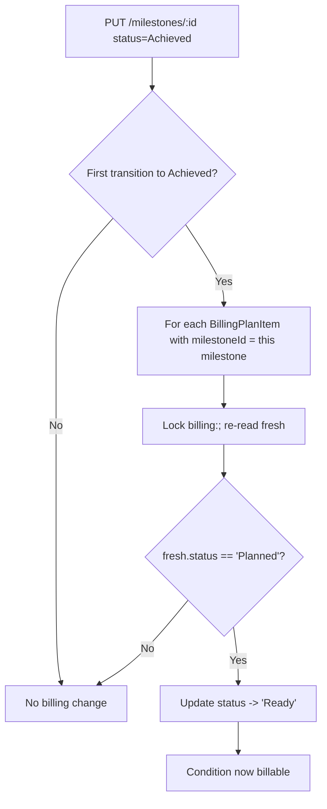
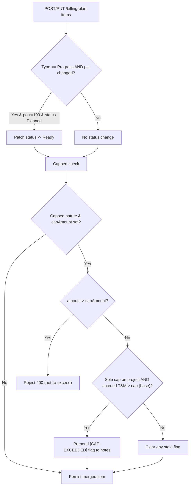
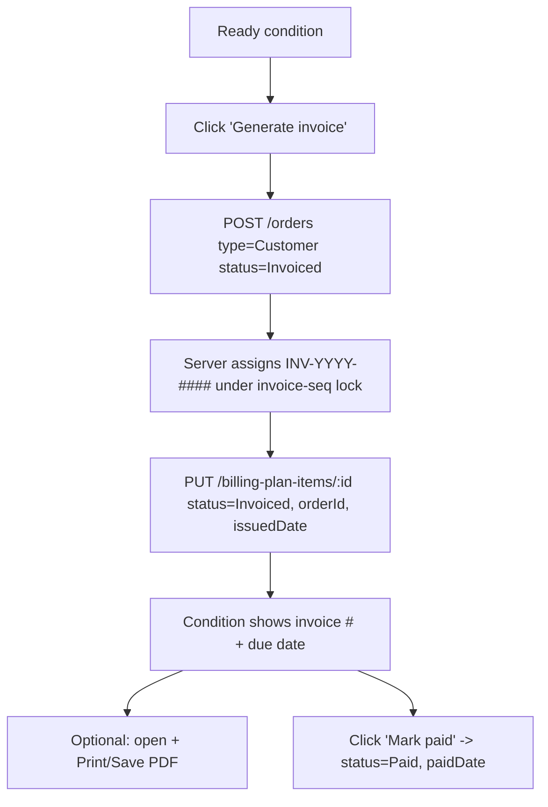
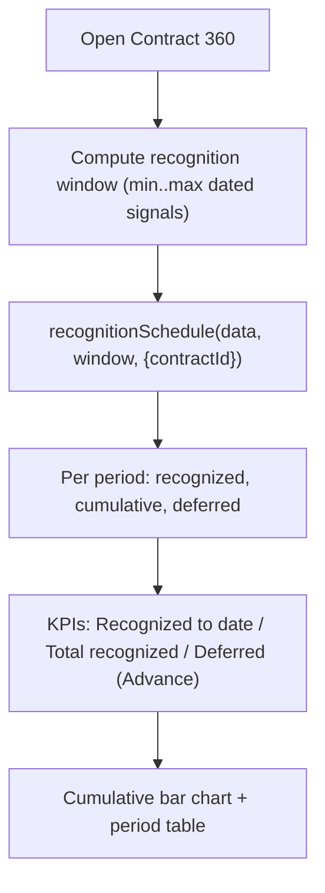
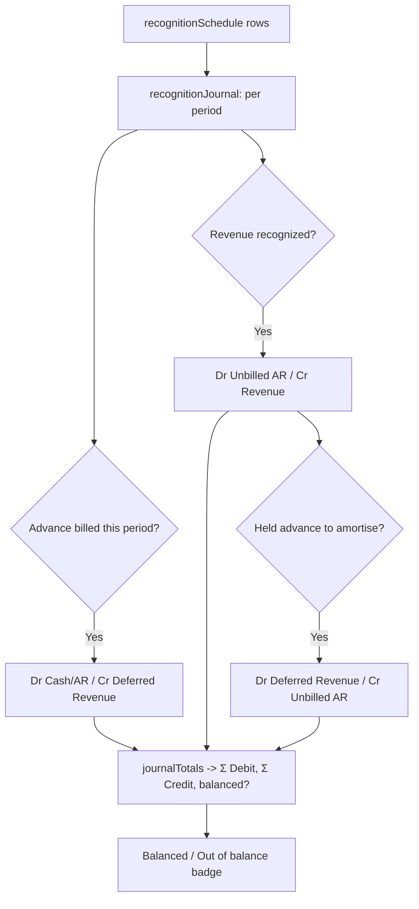
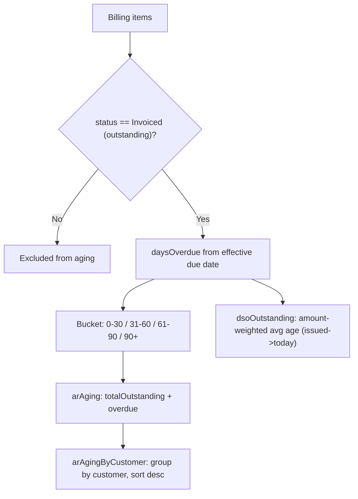

# Billing & Revenue — Standard Operating Procedures

> **Diátaxis mode: How-to (SOP).** This page is the operational playbook for
> billing and revenue in **Delivery Control**: defining the eight billing
> conditions per contract, the milestone (SAL) and progress (POC) triggers,
> capped not-to-exceed enforcement, generating invoices (single + batch),
> revenue recognition, the double-entry journal preview, and A/R aging / DSO
> collections monitoring. Each feature follows the same shape — Purpose, Scope,
> RACI, process flow, detailed steps, exceptions, metrics, links. Roles match the
> real RBAC in `src/server.ts` and the client route guards.
>
> The upstream commercial chain (customers, contracts, orders, order lines) lives
> in [`commercial.md`](commercial.md).

## Who can do what (RBAC ground truth)

Billing conditions live in the commercial collection `/billing-plan-items`, which
shares the commercial RBAC on both read and write in `src/server.ts`:
`sales`, `finance`, `delivery-executive`, `admin`.

The dedicated **Billing** screen is, however, gated more tightly on the client.
Its route is protected by **both** `commercialGuard` **and** `financeGuard`:

| Guard | Resolves to | Roles |
| --- | --- | --- |
| `commercialGuard` | `canManageCommercial()` | sales, finance, delivery-executive, admin |
| `financeGuard` | `canApproveFinancials()` | finance, delivery-executive, admin |
| **Effective (intersection) for `/billing`** | both must pass | **finance, delivery-executive, admin** |

So in this domain **finance is Responsible** for billing and revenue operations,
with **delivery-executive / admin accountable**. `sales` can read/write
billing-plan items at the API and see them inside the Contract 360 view, but
cannot open the finance-grade Billing screen. The Contract 360 read page is
`commercialGuard`-only.

> **Dev vs prod.** As elsewhere, the role comes from a verified Keycloak token in
> production and from `X-User-*` headers only when `AUTH_TRUST_HEADERS=true` in
> development. The RBAC matrix is the same in both; only the role source differs.

## Billing item lifecycle

A `BillingPlanItem` moves through five statuses. The happy path is
`Planned → Ready → Invoiced → Paid`; `Blocked` is a manual hold; a `CreditNote`
is a negative-amount item that reduces invoiced value.

The status auto-transitions are **server-pinned**: the milestone→`Ready` flip and
the Progress→`Ready` auto-advance are enforced in `src/server.ts`, not in the UI,
and run under per-item locks so concurrent writes cannot clobber them.

---

### Define Billing Conditions per contract

**Purpose.** Lay out *how* a contract will be billed by creating one or more
billing conditions on it. Eight condition types cover the common professional-
services billing models; each maps to a recognition pattern downstream.

**Scope.** Creating/editing billing conditions on the finance-grade **Billing**
screen (`openCreate` / `openEdit`), plus the lighter **Expected Billing** form on
the Contract 360 page. Type-specific fields adapt to the chosen type.

**RACI**

| Activity | Responsible | Accountable | Consulted | Informed |
| --- | --- | --- | --- | --- |
| Define a billing condition (Billing screen) | finance | delivery-executive | sales | admin |
| Add expected billing (Contract 360) | finance | delivery-executive | sales | — |
| Edit / correct a condition | finance | delivery-executive | — | — |

**The eight billing types — when to use each + required fields**

| Type | Use when… | Type-specific field(s) | Recognition pattern |
| --- | --- | --- | --- |
| **Milestone (SAL)** | Fixed-price work billed on stage acceptance ("stato avanzamento lavori") | `milestoneId` (the project milestone that triggers it) | Single-period when the milestone is achieved |
| **Recurring** | A retainer billed on a fixed cadence | `recurrence` = `Monthly` / `Quarterly` / `Annual` | Straight-line across the periods |
| **TimeAndMaterials** | As-incurred work: approved hours × bill rate | (none beyond amount) | As-incurred from approved time entries |
| **Capped** | T&M with a not-to-exceed ceiling | `capAmount` (the cap) | As-incurred, filled up to the cap |
| **Advance** | A down payment taken up front | (amount only) | Deferred — recognized as work is earned |
| **Progress (POC)** | Percentage-of-completion billing | `progressPct` (0–100) | Single-period at the booked % |
| **Expense** | Pass-through / re-invoiced expenses, optionally marked up | `markupPct` (optional) | As-incurred |
| **CreditNote** | A credit (nota di credito) reducing invoiced value | (amount only — stored **negative**) | Recognized negative in its period |

Fields common to every type: **Contract** (required), **Project** (optional —
"Unassigned" allowed), **Label** (required), **Amount** (required; for a credit
note the entered amount is stored as a negative), **Currency** (default `EUR`),
**Tax (IVA) %** (default 22), **Retention %** (default 0), **Payment Terms (days)**
(default 30) and **Expected Date**.

**Process flow**

**Detailed steps**

1. **Open the Billing screen.**
   - **Who:** finance. **When:** when papering how a contract bills. **How:**
     navigate to the Billing route (`commercialGuard` + `financeGuard`). Reads
     billing items, contracts, customers, projects, milestones, orders, time
     entries, resources and FX rates (most gated on `authReady()`).
   - **Output:** the master billing table, a KPI strip and a type legend.
2. **Open the form and pick a type.**
   - **Who:** finance. **How:** click **New Billing Condition**; choose the
     **Type**. A hint line and the type-specific field(s) appear (milestone
     picker, recurrence, cap, progress %, markup %). **Output:** a type-shaped
     form. (Use **Edit** to amend an existing condition.)
3. **Enter the condition.**
   - **Who:** finance. **How:** select the **Contract** (required) and optional
     **Project**, enter **Label**, **Amount** and the tax/retention/terms/dates.
     For a credit note the amount field is relabelled "Credit Amount" and stored
     negative. **Output:** a valid payload.
4. **Save.**
   - **Who:** finance. **How:** click **Create condition** → `POST /billing-plan-items`
     with `status: 'Planned'`. The server validates numeric fields (only a
     CreditNote may carry a negative `amount`) and runs the capped-billing check.
   - **Output:** the condition appears in `Planned`.

> **Contract 360 variant.** The "Expected Billing" button on `contracts/:id`
> creates a simpler plan item: type is derived from the contract
> (`T&M → Recurring`, otherwise `Milestone`), with Label, Project, Recurrence,
> Expected Date, Amount, Currency and Status (`Planned` / `Ready` / `Blocked`).

**Exceptions**

| Condition | System behaviour | Resolution |
| --- | --- | --- |
| Non-CreditNote amount negative/NaN | API 400: "amount must be a non-negative number (negative allowed only for CreditNote)" | Fix the amount |
| Any other numeric field negative | API 400: "<field> must be a non-negative number" | Fix the field |
| Capped amount exceeds cap | API 400: "amount … exceeds capAmount … (not-to-exceed)" | Lower amount or raise cap |
| `sales` opens Billing screen | Blocked by `financeGuard` | Use finance role (or edit via Contract 360 / API) |

**Metrics**

| Metric | Definition | Source |
| --- | --- | --- |
| Planned / Ready / Invoiced / Paid | Σ amount (base) by status | Billing KPI strip |
| Tax (IVA) | Σ amount × taxRatePct on Ready + Invoiced | KPI strip |
| Retention Held | Σ amount × retentionPct on not-yet-Paid items | KPI strip |

**Related**

- [Milestone/SAL billing trigger](#milestonesal-billing-trigger)
- [Capped not-to-exceed + Progress auto-advance](#capped-not-to-exceed--progress-poc-auto-advance)
- [Define billing in the Contract 360](commercial.md#contract-360-review)

---

### Milestone/SAL billing trigger

**Purpose.** Make a fixed-price (SAL) condition billable automatically the moment
its project milestone is achieved — no manual status change, no re-keying.

**Scope.** The server-side milestone→`Ready` automation on `PUT /milestones/:id`.
The actor here is the milestone approver (delivery-executive/admin per the
project/milestones write RBAC); the effect lands on `billing-plan-items`.

**RACI**

| Activity | Responsible | Accountable | Consulted | Informed |
| --- | --- | --- | --- | --- |
| Mark milestone `Achieved` | delivery-executive | delivery-executive | pm | finance |
| Auto-flip linked condition to `Ready` | system | delivery-executive | — | finance |
| Invoice the now-Ready condition | finance | delivery-executive | — | — |

**Process flow**

**Detailed steps**

1. **Achieve the milestone.**
   - **Who:** delivery-executive (milestone write RBAC). **When:** the SAL stage
     is accepted. **How:** `PUT /milestones/:id` with `status: 'Achieved'`.
   - **Output:** the milestone is `Achieved`.
2. **Automatic flip (server).**
   - **Who:** system. **When:** only on the *first* transition into `Achieved`.
     **How:** the handler iterates every billing item whose `milestoneId` matches,
     takes a `billing:<id>` lock, re-reads the freshest state, and flips it to
     `Ready` **only if it is still `Planned`** (idempotent; never overwrites a
     manual `Blocked`/`Invoiced`). **Output:** linked SAL conditions become
     `Ready` (billable).
3. **Invoice the Ready condition.**
   - **Who:** finance. **How:** see [Generate an Invoice](#generate-an-invoice).

**Exceptions**

| Condition | System behaviour | Resolution |
| --- | --- | --- |
| Milestone already `Achieved` (re-PUT) | No billing change (guarded on first transition) | None |
| Linked condition not in `Planned` | Left unchanged (no clobber) | Resolve manually if needed |
| Milestone has no linked conditions | Nothing flips | Link a condition via `milestoneId` |

**Metrics**

| Metric | Definition | Source |
| --- | --- | --- |
| Ready value | Σ amount of `Ready` conditions | Billing KPI strip |
| Milestones achieved | Count of `Achieved` milestones | Milestones |

**Related**

- [Generate an Invoice](#generate-an-invoice)
- [Capped not-to-exceed + Progress auto-advance](#capped-not-to-exceed--progress-poc-auto-advance)

---

### Capped not-to-exceed + Progress (POC) auto-advance

**Purpose.** Two server-pinned automations on `billing-plan-items`:
(1) enforce a **not-to-exceed cap** on capped T&M and flag accrual breaches;
(2) **auto-advance** a Progress (POC) condition to `Ready` when it hits 100%.

**Scope.** The `enforceCappedBilling` and `progressAutoAdvance` logic on
`POST`/`PUT /billing-plan-items`. Both run inside the per-item write path; the
Progress auto-advance also runs under the `billing:<id>` lock.

**RACI**

| Activity | Responsible | Accountable | Consulted | Informed |
| --- | --- | --- | --- | --- |
| Set a cap / book progress % | finance | delivery-executive | pm | — |
| Enforce cap + flag accrual breach | system | delivery-executive | — | finance |
| Auto-advance Progress→Ready | system | delivery-executive | — | finance |

**Process flow**

**Detailed steps**

1. **Capped: hard reject on overcap amount.**
   - **Who:** system. **When:** the item is capped (`type === 'Capped'` or carries
     a `capAmount`) and `amount > capAmount`. **How:** `POST`/`PUT` returns
     **400** ("amount … exceeds capAmount … (not-to-exceed)") before persisting.
   - **Output:** an overcap amount never enters the store.
2. **Capped: flag accrual breach.**
   - **Who:** system. **When:** the project has **exactly one** cap-bearing item
     (so project-level accrued time is unambiguously attributable) and accrued
     T&M (Σ approved hours × bill rate, base currency) exceeds the cap converted
     to base via the FX table. **How:** the handler **flags** rather than rejects
     — it prepends `[CAP-EXCEEDED]` to `notes` (idempotent), since accrual comes
     from time entries, not the request body. When accrual falls back within the
     cap, a stale flag is cleared. **Output:** the Billing table shows a
     "Cap exceeded" badge and the printed invoice carries a notice.
3. **Progress: auto-advance to Ready.**
   - **Who:** system. **When:** a `Progress` item's `progressPct` actually
     **changes** to ≥ 100 while still `Planned`. **How:** `progressAutoAdvance`
     patches `status: 'Ready'` (mirroring the milestone trigger; idempotent — a
     re-PUT of 100% never churns, and a manual `Blocked`/`Invoiced` is never
     overwritten). The advanced status is folded into the merged item before the
     cap check, then persisted under the item lock. **Output:** a completed POC
     condition becomes billable automatically.

**Exceptions**

| Condition | System behaviour | Resolution |
| --- | --- | --- |
| `amount > capAmount` | 400 reject | Lower amount / raise cap |
| Multiple cap items on one project | Accrual flag suppressed (avoids double-counting hours); hard amount reject still applies | Use one cap per project for the flag |
| Accrual not derivable (no `projectId`) | Accrual check skipped (not treated as zero) | Assign a project |
| Progress re-PUT at 100% | No status churn (only fires on change) | None |

**Metrics**

| Metric | Definition | Source |
| --- | --- | --- |
| T&M Accrued | Σ approved hours × bill rate, for unbilled projects | Billing KPI strip |
| Cap-exceeded conditions | Items whose `notes` contain `[CAP-EXCEEDED]` | "Cap exceeded" badge |

**Related**

- [Define Billing Conditions](#define-billing-conditions-per-contract)
- [Milestone/SAL billing trigger](#milestonesal-billing-trigger)

---

### Generate an Invoice

**Purpose.** Turn a `Ready` billing condition into an issued invoice: create the
backing Customer order (which the server stamps with a compliant, sequential
invoice number), and move the condition to `Invoiced`.

**Scope.** The single-row **Generate invoice** action and the **batch** action on
the Billing screen, plus the printable invoice artifact and the
`Invoiced → Paid` transition. Invoice numbering is **server-set** — the client
can never supply it.

**RACI**

| Activity | Responsible | Accountable | Consulted | Informed |
| --- | --- | --- | --- | --- |
| Generate invoice (single / batch) | finance | delivery-executive | sales | — |
| Assign invoice number `INV-YYYY-####` | system | delivery-executive | — | finance |
| Mark invoice `Paid` | finance | delivery-executive | — | — |

**Invoice numbering & status transitions**

- Numbers follow `INV-<year>-<zero-padded 4-digit seq>`, e.g. `INV-2026-0002`.
  The seeded invoiced order already holds `INV-2026-0001`, so the next is `0002`.
- A number is assigned **only** when an order first becomes `Invoiced` and has no
  number yet (`applyInvoiceNumbering`), under a shared `invoice-seq` lock so two
  concurrent writes never burn or duplicate a sequence number.
- Order status path: `Open → Confirmed → Invoiced → Paid`. The billing-item path
  is `Ready → Invoiced → Paid` (linked via `orderId`).

**Process flow**

**Detailed steps**

1. **Pick a Ready condition.**
   - **Who:** finance. **When:** a condition is `Ready` (via milestone/POC trigger
     or manually). **How:** in the Billing master table use the per-row
     **Generate invoice** action (only shown on `Ready` rows). **Output:** the
     invoice flow starts; the row is busy-locked during the call.
2. **Issue (server numbering).**
   - **Who:** system. **How:** the client creates a Customer order
     (`amount`, `currency` copied from the condition, `status: 'Invoiced'`); the
     server assigns `INV-YYYY-####` + invoice date under the sequence lock, then
     the client stamps the condition `status: 'Invoiced'`, `orderId`,
     `issuedDate`. **Output:** the condition is `Invoiced` with an invoice number
     and a computed due date (`dueDate`, or `expectedDate + paymentTermsDays`).
3. **View / print the invoice.**
   - **Who:** finance. **How:** on an invoiced row click **View invoice** to open
     the printable artifact (issuer = "Key2 Consulting S.r.l.", bill-to resolved
     contract → customer, line item, net/retention/tax/total, cap-exceeded notice
     if flagged). **Print / Save PDF** uses the browser print path; it is
     SSR-safe (no-op on the server). **Output:** a PDF-ready invoice document.
4. **Mark paid.**
   - **Who:** finance. **When:** payment is received. **How:** the **Mark paid**
     action on an `Invoiced` row sets `status: 'Paid'` and `paidDate`. **Output:**
     the condition is `Paid` (drops out of outstanding A/R).

**Batch invoicing**

- **Who:** finance. **When:** issuing many `Ready` conditions at once. **How:**
  tick the per-row checkboxes (or **Select all ready**, restricted to currently
  visible `Ready` rows), then **Generate N invoices**. The batch processes each
  target **sequentially** (`concatMap`): create an Invoiced order, then stamp the
  condition. The selection is snapshotted up front so it is stable while the
  resource reloads. **Output:** N invoices; the lists reload once at the end.
- **On partial failure:** some invoices may already have been issued before the
  error; the handler reloads to reflect reality, clears the selection, and shows
  an error toast prompting a review-and-retry.

**Exceptions**

| Condition | System behaviour | Resolution |
| --- | --- | --- |
| Action invoked on a non-`Ready` row | Guarded; nothing happens | Only invoice `Ready` items |
| Order created but condition update fails | "Invoice order created, but condition update failed" toast | Re-run; the order already carries a number |
| Concurrent invoice on same order | Sequence lock ensures one number; second write sees it set | None |
| Batch fails midway | Reload + error toast; selection cleared | Review issued rows, retry the rest |
| Print under SSR | `printInvoice()` early-returns | Print from the browser |

**Metrics**

| Metric | Definition | Source |
| --- | --- | --- |
| Invoiced | Σ amount (base) of `Invoiced` conditions | Billing KPI strip |
| Paid | Σ amount (base) of `Paid` conditions | Billing KPI strip |
| Overdue | Σ amount of `Invoiced` items past due | KPI strip + per-row "Overdue Nd" badge |

**Related**

- [Milestone/SAL billing trigger](#milestonesal-billing-trigger)
- [AR Aging & DSO collections monitoring](#ar-aging--dso-collections-monitoring)

---

### Revenue Recognition schedule

**Purpose.** Spread each condition's revenue across calendar months (YYYY-MM) by
its performance-obligation pattern (ASC 606 / IFRS 15, simplified), so finance can
see recognized-to-date, total recognized and deferred (advances) on the contract.

**Scope.** The "Revenue Recognition Schedule" section on the Contract 360 page,
driven by `recognitionSchedule(data, window, { contractId })` from
`finance.util.ts`. Recognition is deterministic and does not reference "now".

**RACI**

| Activity | Responsible | Accountable | Consulted | Informed |
| --- | --- | --- | --- | --- |
| Review the recognition schedule | finance | delivery-executive | — | admin |
| Validate the recognition inputs (billing items, approved time) | finance | delivery-executive | pm | — |

**Recognition patterns (per `recognitionSchedule`)**

| Type | Pattern |
| --- | --- |
| Milestone, Progress (fixed price) | **POC** — recognized single-period (`Progress` at booked %, `Milestone` when realized) |
| Recurring | **Straight-line** — total split evenly across `recurrence` months from the anchor |
| TimeAndMaterials / Capped / Expense | **As-incurred** — approved time × bill rate, scoped to the item's project (or the contract's projects), filled chronologically; capped fill stops at `capAmount` |
| Advance | **Deferred** — not recognized directly; tracked as billed-but-unearned, drawn down as work is earned |
| CreditNote | Recognized **negative** in its period |

**Process flow**

**Detailed steps**

1. **Open the schedule.**
   - **Who:** finance. **When:** period-end, QBR, or pre-invoice review. **How:**
     scroll to the "Revenue Recognition Schedule" section on `contracts/:id`. The
     window spans every dated signal that could carry recognition (billing item
     dates, linked milestone dates, approved time-entry dates).
   - **Output:** the dated schedule, or an empty-state note if there is nothing
     dated to recognize.
2. **Read the KPIs.**
   - **Who:** finance. **How:** **Recognized To Date** (cumulative through the
     latest period), **Total Recognized**, **Deferred (Advance)** (advances billed
     but not yet earned). **Output:** recognition position.
3. **Read the period detail.**
   - **Who:** finance. **How:** per-period **Recognized**, **Cumulative** and
     **Deferred**, with a cumulative-recognition bar (darker edge = that month's
     increment) and a totals footer. **Output:** the month-by-month trend.

**Exceptions**

| Condition | System behaviour | Resolution |
| --- | --- | --- |
| No dated billing items / approved time | Empty-state ("No dated … recognition schedule") | Add dated conditions / approve time |
| Amounts dated outside the window | Clamped to first/last period so cumulative + deferred stay reconcilable | None |
| As-incurred item with no resolvable project | Recognizes nothing (never company-wide) | Set the item's project |

**Metrics**

| Metric | Definition | Source |
| --- | --- | --- |
| Recognized to date | cumulative recognized through latest period | `recognitionSchedule` |
| Deferred (Advance) | Σ advances billed − cumulative recognized (≥ 0) | `recognitionSchedule` |

**Related**

- [Double-entry Journal preview](#double-entry-journal-preview)
- [Define Billing Conditions](#define-billing-conditions-per-contract)

---

### Double-entry Journal preview

**Purpose.** Show the balanced GL postings implied by the recognition schedule so
finance can review them **before** anything is posted. Built from the same window
and filters as the schedule, so the two reconcile exactly.

**Scope.** The "Journal Preview" section on the Contract 360 page, driven by
`recognitionJournal(data, window, { contractId })` and `journalTotals`. These are
a **preview** — they are not posted to any ledger.

**RACI**

| Activity | Responsible | Accountable | Consulted | Informed |
| --- | --- | --- | --- | --- |
| Review the journal preview | finance | delivery-executive | — | admin |
| Confirm Σ Debit = Σ Credit (balanced) | finance | delivery-executive | — | — |

**The postings**

- **Revenue earned** in a period: **Dr Unbilled AR / Cr Revenue**.
- **Advance billed** in a period: **Dr Cash/AR / Cr Deferred Revenue**.
- **Amortise held advance** against revenue earned: **Dr Deferred Revenue /
  Cr Unbilled AR** (capped so deferred never goes below 0).
- A **CreditNote** flips the debit/credit accounts via `balancedPair` so both
  line amounts stay non-negative while preserving direction.
- One entry per period that has movement; every entry is **balanced by
  construction** (Σ debits = Σ credits within ε).

**Process flow**

**Detailed steps**

1. **Open the preview.**
   - **Who:** finance. **When:** alongside the recognition review. **How:** scroll
     to "Journal Preview" on `contracts/:id`. **Output:** date / memo / account /
     debit / credit rows grouped per period, plus a totals footer.
2. **Check it balances.**
   - **Who:** finance. **How:** read the **Balanced / Out of balance** badge and
     the footer `Σ Debit = Σ Credit`. Balanced is the expected state.
   - **Output:** confidence the postings reconcile with the schedule.
3. **Hand off (out of scope here).**
   - **Who:** finance. **How:** the preview is informational; posting to a real GL
     is not performed by this screen (a note states the entries "have not been
     posted to the ledger").

**Exceptions**

| Condition | System behaviour | Resolution |
| --- | --- | --- |
| No movement to preview | Empty-state ("No journal movement to preview") | Recognize/defer something first |
| Badge reads "Out of balance" | Red badge | Investigate source data — entries are balanced by construction, so this points at bad inputs |

**Metrics**

| Metric | Definition | Source |
| --- | --- | --- |
| Σ Debit / Σ Credit | totals across all entries | `journalTotals` |
| Balanced | Σ Debit = Σ Credit within ε | `journalTotals.balanced` |

**Related**

- [Revenue Recognition schedule](#revenue-recognition-schedule)
- [Contract 360 review](commercial.md#contract-360-review)

---

### AR Aging & DSO collections monitoring

**Purpose.** Monitor outstanding receivables — how much is owed, how far past due,
and how long cash takes to collect — so finance can drive collections.

**Scope.** The aging buckets and DSO metric computed by `arAging`,
`arAgingByCustomer` and `dsoOutstanding` in `finance.util.ts` over the billing
items. The Billing screen surfaces the **Overdue** KPI and per-row "Overdue Nd"
badges (Invoiced items past due); the aging/DSO functions are the finance-grade
collections analytics over the same data.

**RACI**

| Activity | Responsible | Accountable | Consulted | Informed |
| --- | --- | --- | --- | --- |
| Monitor A/R aging | finance | delivery-executive | sales | admin |
| Compute / track DSO | finance | delivery-executive | — | admin |
| Drive collections on overdue | finance | delivery-executive | sales | — |

**How the numbers are built**

- **Outstanding** = items in `Invoiced` status (only outstanding items are aged).
- **Aging buckets** by days overdue from the effective due date: `0-30`,
  `31-60`, `61-90`, `90+`. Each bucket carries a count and an amount.
- **Overdue** = the portion at least 1 day past due (days overdue > 0).
- **`arAgingByCustomer`** joins items → contract (`contractId`) → customer
  (`Contract.customerId`); unresolvable items group under a synthetic `unknown`
  customer so nothing is silently dropped; rows sort by descending outstanding.
- **DSO** (`dsoOutstanding`) = amount-weighted average age (issued → today) of the
  outstanding balance — larger/older invoices pull it up; 0 with no dated balance.
- Pass the FX table to normalise mixed-currency amounts to base before
  bucketing/weighting; omit it for single-currency behaviour.

**Process flow**

**Detailed steps**

1. **Read the outstanding position.**
   - **Who:** finance. **When:** weekly collections review / period-end. **How:**
     on the Billing screen read the **Invoiced**, **Overdue** (with count) and
     **Paid** KPIs; per-row "Overdue Nd" badges flag specific late invoices. The
     aging buckets and per-customer rows come from `arAging` / `arAgingByCustomer`.
   - **Output:** total outstanding, overdue portion, and aging distribution.
2. **Read DSO.**
   - **Who:** finance. **How:** `dsoOutstanding` gives the amount-weighted average
     collection age over the outstanding, dated balance. **Output:** the
     days-to-collect health number.
3. **Drive collections.**
   - **Who:** finance. **When:** items fall into `31-60`/`61-90`/`90+` or DSO
     rises. **How:** chase the worst customers (top of the per-customer aging),
     then mark invoices **Paid** as cash arrives (see
     [Generate an Invoice](#generate-an-invoice)). **Output:** outstanding +
     overdue come down; collected items move to `Paid`.

**Exceptions**

| Condition | System behaviour | Resolution |
| --- | --- | --- |
| Item not `Invoiced` | Not aged (Planned/Ready/Paid/Blocked excluded) | Only outstanding A/R is aged |
| Outstanding item with no `issuedDate` | Skipped from DSO weighting | Ensure issued date is stamped at invoicing |
| Item's contract/customer unresolvable | Grouped under `unknown` customer (not dropped) | Fix the contract FK |
| Mixed currencies without FX | Amounts summed as-is | Pass the FX table to normalise to base |

**Metrics**

| Metric | Definition | Source |
| --- | --- | --- |
| Total outstanding | Σ amount of `Invoiced` items | `arAging.totalOutstanding` |
| Overdue | Σ amount with days overdue > 0 | `arAging.overdue` + KPI strip |
| Aging buckets | count + amount per `0-30`/`31-60`/`61-90`/`90+` | `arAging.buckets` |
| DSO | amount-weighted avg age of outstanding | `dsoOutstanding` |

**Related**

- [Generate an Invoice](#generate-an-invoice)
- [Contract 360 review](commercial.md#contract-360-review)
- [Commercial SOPs](commercial.md)
