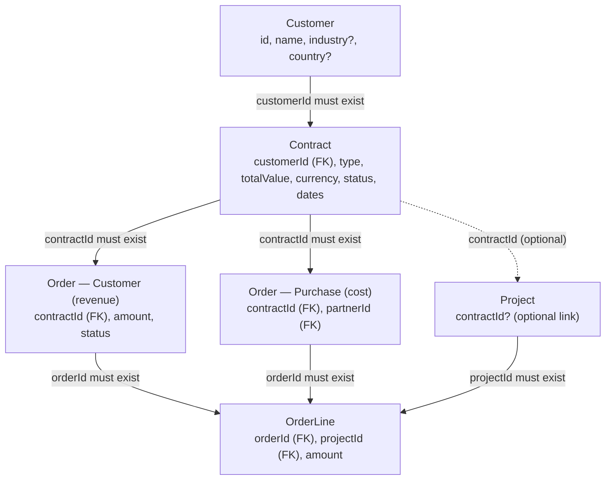
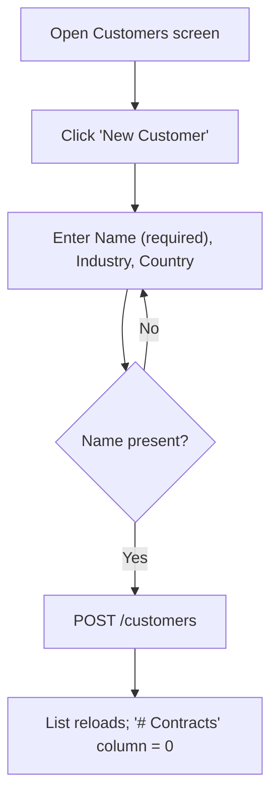
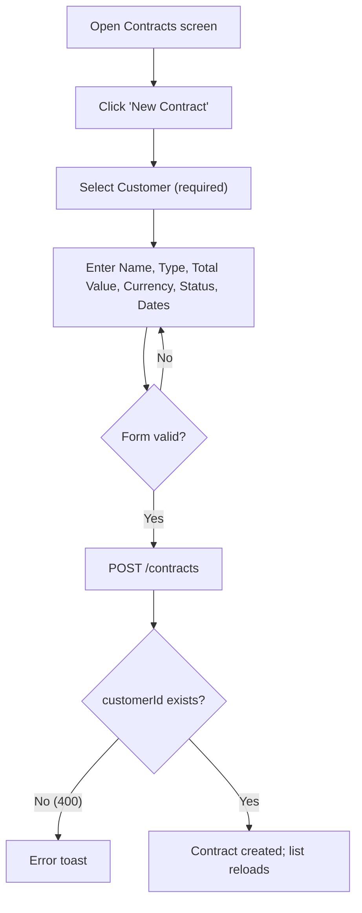
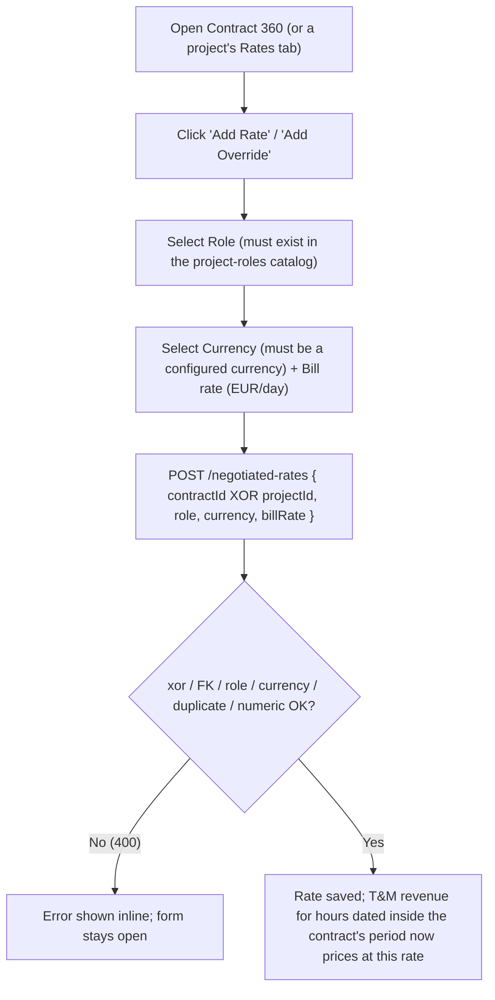
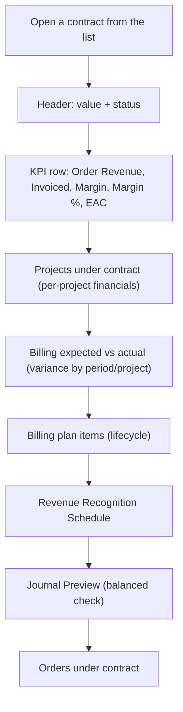
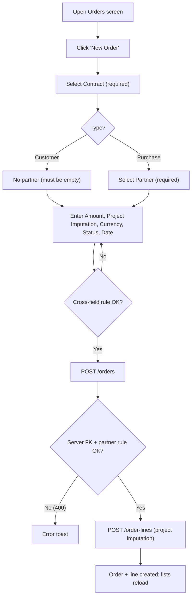
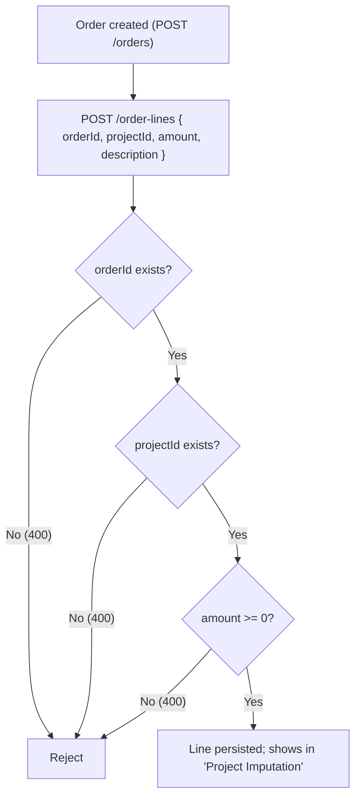

# Commercial — Standard Operating Procedures

> **Diátaxis mode: How-to (SOP).** This page is the operational playbook for the
> commercial domain of **Delivery Control** (PSA "Delivery Control"): customers,
> contracts, the contract 360 review, orders (customer revenue + purchase cost),
> and order lines. Each feature follows the same shape — Purpose, Scope, RACI,
> process flow, detailed steps, exceptions, metrics, and links. Roles named in
> the RACI tables match the real RBAC enforced in `src/server.ts` and the
> client-side route guards.
>
> Billing conditions, invoicing, revenue recognition, the GL journal preview and
> A/R collections live in the sibling page
> [`billing-and-revenue.md`](billing-and-revenue.md).

## Who can do what (RBAC ground truth)

The commercial collections — `/customers`, `/contracts`, `/orders`,
`/order-lines`, `/billing-plan-items`, `/negotiated-rates` — share a single RBAC
rule on both the read and the write side in `src/server.ts`:

| Concern | Collections | Roles allowed |
| --- | --- | --- |
| Read (GET) | `/customers`, `/contracts`, `/orders`, `/order-lines`, `/billing-plan-items`, `/negotiated-rates` | `sales`, `finance`, `delivery-executive`, `admin` |
| Mutate (POST/PUT/DELETE) | same six collections | `sales`, `finance`, `delivery-executive`, `admin` |

On the client, the matching routes (`customers`, `contracts`, `contracts/:id`,
`orders`) are gated by `commercialGuard`, which resolves to
`AuthService.canManageCommercial()` = `['sales', 'finance', 'delivery-executive', 'admin']`.
The seven roles in priority order are
`admin` > `delivery-executive` > `finance` > `sales` > `resource-manager` > `pm` > `employee`;
the three lowest (`resource-manager`, `pm`, `employee`) have no commercial
access at all.

A caller with no verified principal (no Keycloak JWT, no trusted demo header) is
`unknown` and receives **401** on these collections; an authenticated caller in a
non-commercial role receives **403**.

> **Dev vs prod.** The role can arrive two ways. In production it is taken from a
> verified Keycloak bearer token (`req.verifiedRole`). In development the
> `X-User-*` demo headers are honoured **only** when `AUTH_TRUST_HEADERS=true`;
> otherwise the actor is `unknown` and privileged mutations are denied. The RBAC
> matrix above is identical in both environments — only the source of the role
> differs.

## The customer → contract → order → order-line chain

Every commercial record hangs off this chain. Foreign keys are validated
server-side on create **and** update; a write that names a non-existent parent is
rejected with **400** before anything is persisted.

Key FK rules from `src/server.ts`:

- **Contract → Customer**: `POST/PUT /contracts` reject unless `customerId`
  references an existing customer; `totalValue` must be a non-negative number.
- **Order → Contract**: `POST/PUT /orders` reject unless `contractId` references
  an existing contract; `amount` must be non-negative.
- **Order partner rule (server-pinned)**: a `Purchase` order **requires** an
  existing `partnerId`; a `Customer` order must **not** carry a `partnerId`.
- **OrderLine → Order + Project**: `POST/PUT /order-lines` reject unless both
  `orderId` and `projectId` reference existing rows; `amount` non-negative.
- **Customer**: has no parent FK — it is the root of the chain.

---

### Create / maintain a Customer

**Purpose.** Register the commercial counterpart (the legal entity you sell to)
so contracts, orders and billing can hang off it. The customer is the root of the
commercial chain and has no parent.

**Scope.** Creating a customer via the Customers screen and maintaining its
descriptive attributes. Customer deletion exists at the API (`DELETE /customers/:id`)
but has no dedicated UI control; it is out of scope for routine operation.

**RACI**

| Activity | Responsible | Accountable | Consulted | Informed |
| --- | --- | --- | --- | --- |
| Create a customer | sales | delivery-executive | finance | admin |
| Maintain customer attributes | sales | delivery-executive | — | finance |

**Process flow**

**Detailed steps**

1. **Open the Customers list.**
   - **Who:** sales (or any commercial role).
   - **When:** a new customer relationship is signed or a prospect is being set up.
   - **How:** navigate to the Customers route (`commercialGuard`). The list reads
     `GET /customers` and `GET /contracts` (to compute the per-customer contract
     count), both gated on `authReady()` so the request fires only after the
     bearer token is attached.
   - **Output:** a table of existing customers with Name, Industry, Country and a
     live `# Contracts` count.
2. **Open the create form.**
   - **Who:** sales. **When:** before keying a new record. **How:** click
     **New Customer** to open the modal. **Output:** an empty reactive form.
3. **Enter the customer details.**
   - **Who:** sales. **How:** fill **Name** (required), **Industry** (optional)
     and **Country** (optional). The Create button stays disabled while the form
     is invalid (Name empty). **Output:** a valid form payload.
4. **Save.**
   - **Who:** sales. **How:** click **Create Customer** → `POST /customers` with
     `{ name, industry?, country? }`. Empty optional fields are sent as
     `undefined`. **Output:** the new customer; the list reloads and a success
     toast confirms creation. On error a failure toast is shown and the modal
     stays open.

**Exceptions**

| Condition | System behaviour | Resolution |
| --- | --- | --- |
| Name left blank | Create button disabled (client validation) | Enter a name |
| Caller is `pm` / `resource-manager` / `employee` | Route blocked by `commercialGuard`; API returns 403 | Use a commercial role |
| No verified principal | API returns 401 | Authenticate (Keycloak in prod) |
| Network / server error on save | Failure toast; modal remains open | Retry |

**Metrics**

| Metric | Definition | Source |
| --- | --- | --- |
| Customers on book | Row count of `/customers` | Customers list |
| Contracts per customer | `# Contracts` column | Count of contracts grouped by `customerId` |

**Related**

- [Create a Contract under a customer](#create-a-contract-under-a-customer)
- [Billing & revenue SOPs](billing-and-revenue.md)

---

### Create a Contract under a customer

**Purpose.** Capture the commercial agreement — its pricing model, total value,
currency, validity window and lifecycle status — under an existing customer. The
contract is the anchor for orders, billing conditions and revenue recognition.

**Scope.** Creating a contract via the Contracts screen. A contract **requires**
an existing customer (FK enforced server-side). Editing/closing a contract is
available at the API (`PUT /contracts/:id`) but the create flow is the documented
UI path.

**RACI**

| Activity | Responsible | Accountable | Consulted | Informed |
| --- | --- | --- | --- | --- |
| Create a contract | sales | delivery-executive | finance | admin |
| Set/change contract status | sales | delivery-executive | finance | — |

**Process flow**

**Detailed steps**

1. **Open the Contracts list.**
   - **Who:** sales. **When:** a deal is being papered. **How:** navigate to the
     Contracts route (`commercialGuard`); reads `GET /contracts` + `GET /customers`.
   - **Output:** a table of contracts with Name (links to the 360 view),
     Customer, Type, Total Value, Status and the start/end date range.
2. **Open the create form and pick the customer.**
   - **Who:** sales. **How:** click **New Contract**; select a **Customer** from
     the dropdown (required — populated from `/customers`). **Output:** the parent
     FK is set.
3. **Enter the commercial terms.**
   - **Who:** sales. **How:** fill **Name** (required), **Type**
     (`T&M` | `Fixed Price` | `Framework`), **Total Value** (required, ≥ 0),
     **Currency** (default `EUR`), **Status** (`Draft` | `Active` | `Closed`,
     default `Draft`), **Start Date** and **End Date** (both required).
   - **Output:** a valid contract payload.
4. **Save.**
   - **Who:** sales. **How:** click **Create Contract** → `POST /contracts`.
     The server re-validates that `customerId` exists and that `totalValue` is
     non-negative. **Output:** the contract; list reloads with a success toast.

**Exceptions**

| Condition | System behaviour | Resolution |
| --- | --- | --- |
| `customerId` does not exist | API 400: "customerId must reference an existing customer" | Pick a valid customer |
| `totalValue` negative or NaN | API 400: "totalValue must be a non-negative number" | Enter ≥ 0 |
| Required field blank | Create button disabled | Complete the form |
| Non-commercial role / unauthenticated | 403 / 401 | Use a commercial role / sign in |

**Metrics**

| Metric | Definition | Source |
| --- | --- | --- |
| Total contract value | Σ `totalValue` per currency | Contracts list |
| Active vs Draft vs Closed | Count by `status` | Contracts list status column |

**Related**

- [Contract 360 review](#contract-360-review)
- [Define Billing Conditions per contract](billing-and-revenue.md#define-billing-conditions-per-contract)
- [Negotiate a Sell Rate for a Contract or a Project](#negotiate-a-sell-rate-for-a-contract-or-a-project)

---

### Negotiate a Sell Rate for a Contract or a Project

**Purpose.** Price Time & Materials revenue at what was actually negotiated
with **this** customer, instead of billing every customer the same profile at
its company-wide reference rate. A **negotiated rate** sets the €/day sell
price for a role under a specific contract; a **project override** replaces
that price for one project under the contract, without touching the
contract's own rate.

**Scope.** Creating, editing and deleting rows in `/negotiated-rates` from the
Contract 360 view's "Negotiated Rates" card (contract-level rate) and from a
project's **Rates** tab (project-level override). Only **Time & Materials**
billing is affected — see "Fixed Price and Milestone revenue is unaffected"
below.

**RACI**

| Activity | Responsible | Accountable | Consulted | Informed |
| --- | --- | --- | --- | --- |
| Negotiate a contract-level rate | sales | delivery-executive | finance | admin |
| Add a project-level override | sales | delivery-executive | finance | — |

**Process flow**

**Detailed steps**

1. **Negotiate the contract-level rate.**
   - **Who:** sales. **When:** the commercial terms for a role are agreed with
     the customer. **How:** on the Contract 360 view, open the **Negotiated
     Rates** card and click **Add Rate**; pick a **Role** (validated against
     the project-roles catalog — a role need not be held by any resource yet,
     because a rate is negotiated, and a contract signed, before anyone with
     that profile is ever hired or staffed), **Currency** (must be a
     configured currency) and **Bill rate (€/day)**. **Output:**
     `POST /negotiated-rates { contractId, role, currency, billRate }`.
   - **Validity.** The rate carries no dates of its own — it applies to hours
     **dated inside the contract's own `startDate`/`endDate`**. A
     renegotiation is a **new contract**, not an edit to this row.
2. **Override it for one project.**
   - **Who:** sales. **When:** one project under the contract negotiated a
     different price for the same role (e.g. a discount scoped to a specific
     engagement). **How:** on that project's **Rates** tab, every
     contract-level row appears greyed out ("Inherited from contract"); click
     its edit icon (or **Add Override**) to create a project-scoped row for
     the same role and currency. **Output:**
     `POST /negotiated-rates { projectId, role, currency, billRate }` — the
     project's row and the contract's row now both exist, and the project's
     wins for that role (see precedence below).
   - **Validity of the override.** It borrows the **project's own contract's**
     period if the project has one; a project with no contract at all applies
     with no date limit.
3. **Resolution precedence** (`sellRateFor`,
   `src/app/services/sell-rate.util.ts`) — first match wins, evaluated **per
   hour, at that hour's own date**:
   1. a rate on **this project** for the role, if the hours' date falls inside
      the project's contract's period (or the project has no contract at
      all);
   2. else a rate on the project's **contract** for the role, if the hours'
      date falls inside the contract's own period;
   3. else the resource's own **reference bill rate** — their personal
      override on the rate card if one is set, else the rate card default.
      This third step is exactly what T&M revenue priced at before this
      feature existed.
   - **A personal override on a resource never beats a negotiated price.** If
     the customer signed 1000 €/day for a role and the person actually
     staffed on it carries a personal override of 1200 €/day on their own
     rate card, 1000 is what gets billed — a personal override is a company
     default cost/price, not a customer-specific sell price, and it is only
     reached once nothing was negotiated for that (contract-or-project,
     role).
4. **Delete or correct a rate.**
   - **Who:** sales / finance. **How:** the delete icon on the row
     (`DELETE /negotiated-rates/:id`), or edit via the row's edit icon
     (`PUT /negotiated-rates/:id`). Deleting a rate simply removes it from
     consideration; hours already recognized are not retroactively re-priced
     (recognition is computed fresh on every read).

**Exceptions**

| Condition | System behaviour | Resolution |
| --- | --- | --- |
| Neither/both of `contractId`/`projectId` supplied | API 400: "exactly one of contractId or projectId is required" | Pick exactly one parent |
| `contractId` does not exist | API 400: "contractId must reference an existing contract" | Pick a valid contract |
| `projectId` does not exist | API 400: "projectId must reference an existing project" | Pick a valid project |
| `role` does not exist in the project-roles catalog | API 400: "role must reference an existing project role (catalog name)" | Pick a role from the project-roles catalog (it need not be staffed yet) |
| `currency` empty or not a configured currency | API 400: "currency is required..." / "currency must be a configured currency..." | Pick a configured currency |
| A rate already exists for the same (contract-or-project, role, currency) | API 400: "a negotiated rate already exists for this key (existing id …)" | Edit the existing row instead of creating a duplicate |
| `billRate` negative or NaN | API 400: "billRate must be a non-negative number" | Enter ≥ 0 |
| Non-commercial role / unauthenticated | 403 / 401 | Use a commercial role (`sales`, `finance`, `delivery-executive`, `admin`) / sign in |

**Fixed Price and Milestone revenue is unaffected.** A negotiated rate only
ever prices **as-incurred** billing — `TimeAndMaterials`, `Capped`, `Expense`
— because those are the only billing types whose revenue is `hours × rate`
(`recognitionSchedule` in `src/app/services/finance.util.ts`, via
`sellRateFor`). `Milestone` (SAL) and `Progress` (POC) revenue is recognized
as a share of the billing item's own fixed `amount`/`capAmount` and never
multiplies anyone's hours by anyone's rate — entering a negotiated rate on a
Fixed Price contract has **no effect** on what that contract recognizes. See
[Revenue Recognition schedule](billing-and-revenue.md#revenue-recognition-schedule)
for the full recognition-method table.

**Metrics**

| Metric | Definition | Source |
| --- | --- | --- |
| Negotiated rates per contract | Row count of `/negotiated-rates` where `contractId` = this contract | Contract 360 → Negotiated Rates |
| Project overrides | Row count of `/negotiated-rates` where `projectId` = this project | Project → Rates tab |

**Related**

- [Create a Contract under a customer](#create-a-contract-under-a-customer)
- [Contract 360 review](#contract-360-review)
- [Revenue Recognition schedule](billing-and-revenue.md#revenue-recognition-schedule)

---

### Contract 360 review

**Purpose.** Give a single, financially complete view of one contract — its
value vs realized revenue, per-project margin, expected-vs-actual billing, the
billing plan, the dated revenue-recognition schedule, the balanced GL journal
preview, and all orders — so commercial and finance stakeholders can review
health before acting.

**Scope.** The read-only Contract details screen (`contracts/:id`). It also
hosts two mutations — adding an **Expected Billing** plan item, documented in
[billing-and-revenue.md](billing-and-revenue.md#define-billing-conditions-per-contract),
and maintaining the contract's **Negotiated Rates**, documented in
[Negotiate a Sell Rate for a Contract or a Project](#negotiate-a-sell-rate-for-a-contract-or-a-project).
The recognition schedule and journal preview themselves are covered in the
billing page; here we cover the review workflow.

**RACI**

| Activity | Responsible | Accountable | Consulted | Informed |
| --- | --- | --- | --- | --- |
| Review contract health (value, margin, EAC) | delivery-executive | delivery-executive | sales | admin |
| Review billing expected vs actual | finance | delivery-executive | sales | — |
| Review recognition schedule + journal preview | finance | delivery-executive | — | admin |

**Process flow**

**Detailed steps**

1. **Open the 360 view.**
   - **Who:** sales / finance / delivery-executive. **When:** review checkpoint,
     QBR, or before issuing/approving invoices. **How:** click a contract name in
     the Contracts list, or deep-link to `contracts/:id`. The component loads many
     principal-gated reads (contracts, customers, orders, order-lines, resources,
     time-entries, billing-plan-items), each gated on `authReady()`.
   - **Output:** the full contract dashboard, or a "Contract not found" panel if
     the id is unknown or data is still loading.
2. **Read the header + KPI row.**
   - **Who:** delivery-executive. **How:** the header shows Total Value and status;
     the KPI row shows **Order Revenue**, **Invoiced**, **Margin** (revenue −
     actual cost), **Margin %** and **EAC**, aggregated across the contract's
     projects via `computeProjectFinancials`. **Output:** top-line health.
3. **Review per-project financials.**
   - **Who:** delivery-executive. **How:** the "Projects under this contract"
     table lists Revenue, Actual Cost, EAC, Margin and Margin % per project (each
     project name links to the project view). **Output:** where margin is made or
     lost.
4. **Review billing expected vs actual.**
   - **Who:** finance. **How:** the expected recurrence from the billing plan is
     compared period-by-period and project-by-project with Customer Orders in
     `Invoiced`/`Paid` status; variance and a status (`Covered` / `Partial` /
     `Planned` / `Behind` / `Actual only`) are shown, with a Trace column linking
     expected labels to actual order ids. **Output:** billing coverage gaps.
5. **Review the recognition schedule + journal preview.**
   - **Who:** finance. **How:** see
     [Revenue Recognition schedule](billing-and-revenue.md#revenue-recognition-schedule)
     and [Journal preview](billing-and-revenue.md#double-entry-journal-preview).
     The journal carries a **Balanced / Out of balance** badge. **Output:** a
     reconciled, preview-only set of postings.
6. **Review orders.**
   - **Who:** sales / finance. **How:** the Orders table lists every order on the
     contract with type, amount, status and date. **Output:** the order ledger
     behind the revenue figures.

**Exceptions**

| Condition | System behaviour | Resolution |
| --- | --- | --- |
| Unknown contract id / data still loading | "Contract not found" panel | Verify the id; wait for `authReady()` |
| No projects linked to the contract | Empty project table; KPIs largely zero | Link projects (set `contractId`) |
| Journal preview shows "Out of balance" | Badge turns red | Investigate the schedule inputs — postings are balanced by construction, so this signals bad source data |

**Metrics**

| Metric | Definition | Source |
| --- | --- | --- |
| Margin / Margin % | revenue − actual cost; / revenue | `computeProjectFinancials` aggregated |
| EAC | actual cost + ETC | `computeProjectFinancials` |
| Billing variance to date | actual − expected (dated ≤ today) | Expected-vs-actual section |
| Recognized to date | cumulative recognized through latest period | Recognition schedule |

**Related**

- [Negotiate a Sell Rate for a Contract or a Project](#negotiate-a-sell-rate-for-a-contract-or-a-project)
- [Revenue Recognition schedule](billing-and-revenue.md#revenue-recognition-schedule)
- [Double-entry Journal preview](billing-and-revenue.md#double-entry-journal-preview)
- [AR Aging & DSO](billing-and-revenue.md#ar-aging--dso-collections-monitoring)

---

### Create a Customer Order (revenue) and a Purchase Order (cost)

**Purpose.** Record the two kinds of order on a contract: a **Customer** order is
revenue the customer owes you; a **Purchase** order is cost you owe a delivery
partner. Both must reference an existing contract; a purchase order additionally
requires an existing partner.

**Scope.** Creating either order type via the Orders screen. The screen creates
the order **and** an order line in one flow (project imputation). Order status
maintenance (`Open` → `Confirmed` → `Invoiced` → `Paid`) is available via the
API; the create flow is documented here.

**RACI**

| Activity | Responsible | Accountable | Consulted | Informed |
| --- | --- | --- | --- | --- |
| Create a Customer order (revenue) | sales | delivery-executive | finance | — |
| Create a Purchase order (cost) | sales | delivery-executive | finance | — |
| Advance order status | finance | delivery-executive | sales | — |

**Process flow**

**Detailed steps**

1. **Open the Orders list.**
   - **Who:** sales. **When:** a customer commits to spend, or a partner is
     engaged for cost. **How:** navigate to the Orders route (`commercialGuard`);
     reads orders, contracts, partners, projects and order-lines.
   - **Output:** an order ledger showing Contract, Project Imputation, Type,
     Partner, Amount, Status and Date.
2. **Open the create form and choose the contract + type.**
   - **Who:** sales. **How:** click **New Order**; select a **Contract**
     (required) and a **Type** (`Customer` | `Purchase`). The Partner field only
     appears for `Purchase`. **Output:** the parent contract and order kind.
3. **For a Purchase order, name the partner.**
   - **Who:** sales. **When:** Type = `Purchase`. **How:** select a **Partner**
     (the partner must already exist). A client-side cross-field validator
     (`partnerTypeValidator`) blocks a Purchase order with no partner and a
     Customer order that carries a partner. **Output:** the partner FK is set.
4. **Enter amount, project imputation and terms.**
   - **Who:** sales. **How:** fill **Amount** (required, ≥ 0), **Project
     Imputation** (required — the project the amount books to; the dropdown
     prefers projects linked to the chosen contract), optional **Line
     Description**, **Currency** (default `EUR`), **Status** (`Open` default) and
     **Order Date** (required). **Output:** a valid order + line payload.
5. **Save.**
   - **Who:** sales. **How:** click **Create Order**. The client first calls
     `POST /orders`; on success it calls `POST /order-lines` to impute the amount
     to the chosen project. The server validates the contract FK and the
     Customer/Purchase partner rule, then (if the order is created directly as
     `Invoiced`) assigns an invoice number under a sequence lock.
   - **Output:** the order and its line; both lists reload with a success toast.
     If the order saves but the line fails, a partial-success toast is shown.

**Exceptions**

| Condition | System behaviour | Resolution |
| --- | --- | --- |
| `contractId` does not exist | API 400: "contractId must reference an existing contract" | Pick a valid contract |
| Purchase order with no/invalid partner | Client validator blocks; API 400: "Purchase orders require an existing partnerId" | Select an existing partner |
| Customer order carrying a partner | Client validator blocks; API 400: "Customer orders must not set a partnerId" | Clear the partner |
| `amount` negative or NaN | API 400: "amount must be a non-negative number" | Enter ≥ 0 |
| Order created OK but line fails | Partial-success toast | Re-add the order line |

**Metrics**

| Metric | Definition | Source |
| --- | --- | --- |
| Customer order revenue | Σ `amount` of Customer orders | Orders list |
| Purchase order cost | Σ `amount` of Purchase orders | Orders list |
| Orders by status | Count by `Open`/`Confirmed`/`Invoiced`/`Paid` | Orders list status column |

**Related**

- [Manage Order Lines](#manage-order-lines)
- [Generate an Invoice](billing-and-revenue.md#generate-an-invoice)

---

### Manage Order Lines

**Purpose.** Attribute an order's value to one or more projects ("project
imputation"). Order lines are how a single order's amount is split across the
delivery projects that earn (Customer) or consume (Purchase) it, feeding the
expected-vs-actual billing view and project financials.

**Scope.** Order lines are created automatically by the Orders create flow (one
line per order, imputed to the selected project). The line collection
(`/order-lines`) supports create / update / delete at the API; a dedicated
multi-line editor UI is not part of the current screen, so this SOP covers the
imputation created via the order flow and the API-level rules that govern it.

**RACI**

| Activity | Responsible | Accountable | Consulted | Informed |
| --- | --- | --- | --- | --- |
| Impute an order to a project (create line) | sales | delivery-executive | finance | — |
| Adjust / re-impute a line | finance | delivery-executive | sales | — |

**Process flow**

**Detailed steps**

1. **Create the line (via the order flow).**
   - **Who:** sales. **When:** at order creation. **How:** the Orders screen calls
     `POST /order-lines` with `{ orderId, projectId, amount, description }` right
     after the order is created. The description defaults to
     `"<Type> order imputation"` when left blank. **Output:** the order's amount
     is attributed to the chosen project.
2. **Read the imputation.**
   - **Who:** sales / finance. **How:** the Orders list "Project Imputation"
     column summarises each order's lines as `Project (amount currency)`. The
     Contract 360 expected-vs-actual section uses Customer order lines (in
     `Invoiced`/`Paid` status) as the *actual* billing per project and period.
   - **Output:** traceability from order → project → period.
3. **Adjust a line (API).**
   - **Who:** finance. **How:** `PUT /order-lines/:id`; any changed `orderId` or
     `projectId` is re-validated to reference an existing row, and `amount` must
     stay non-negative. `DELETE /order-lines/:id` removes a line. **Output:**
     corrected imputation.

**Exceptions**

| Condition | System behaviour | Resolution |
| --- | --- | --- |
| `orderId` missing/unknown | API 400: "orderId must reference an existing order" | Use a valid order |
| `projectId` missing/unknown | API 400: "projectId must reference an existing project" | Use a valid project |
| `amount` negative or NaN | API 400: "amount must be a non-negative number" | Enter ≥ 0 |
| Order has no lines | Orders list shows "No project line"; expected-vs-actual falls back to the order amount with empty project | Add a line |

**Metrics**

| Metric | Definition | Source |
| --- | --- | --- |
| Imputed amount per project | Σ line `amount` grouped by `projectId` | Order lines |
| Actual billing per period | Σ Customer-order line amounts (Invoiced/Paid) | Contract 360 expected-vs-actual |

**Related**

- [Create a Customer Order and a Purchase Order](#create-a-customer-order-revenue-and-a-purchase-order-cost)
- [Contract 360 review](#contract-360-review)
- [Billing expected vs actual](billing-and-revenue.md)
