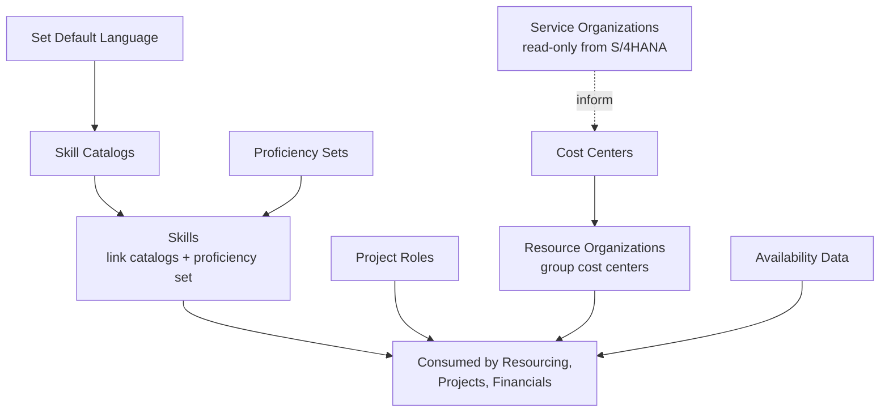
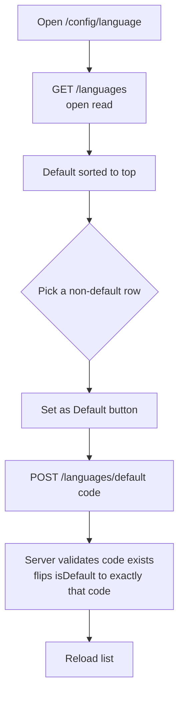
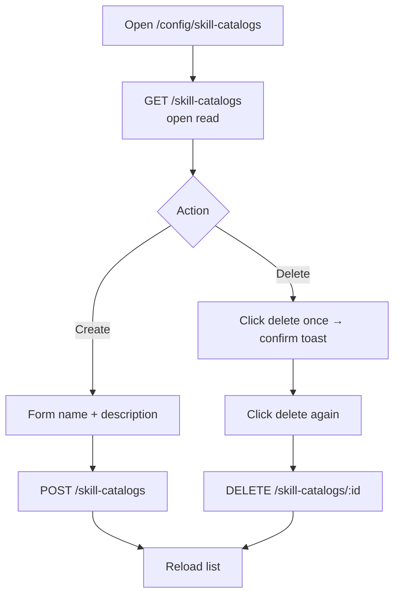
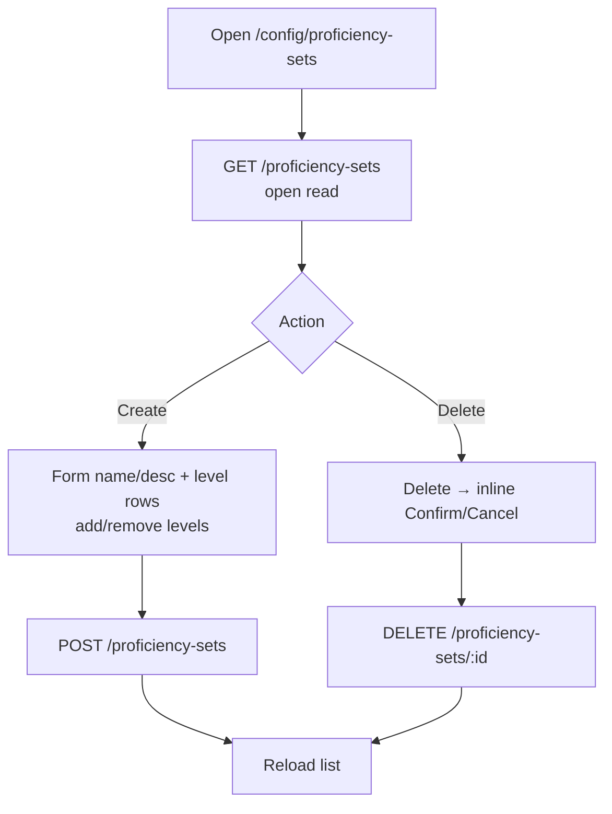
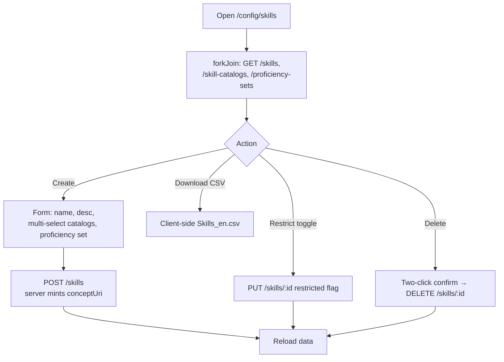
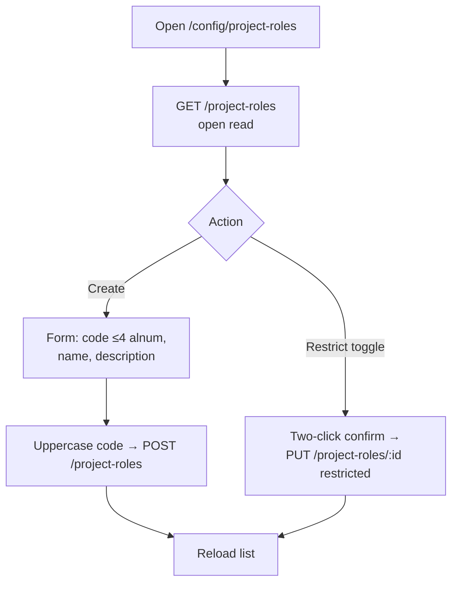
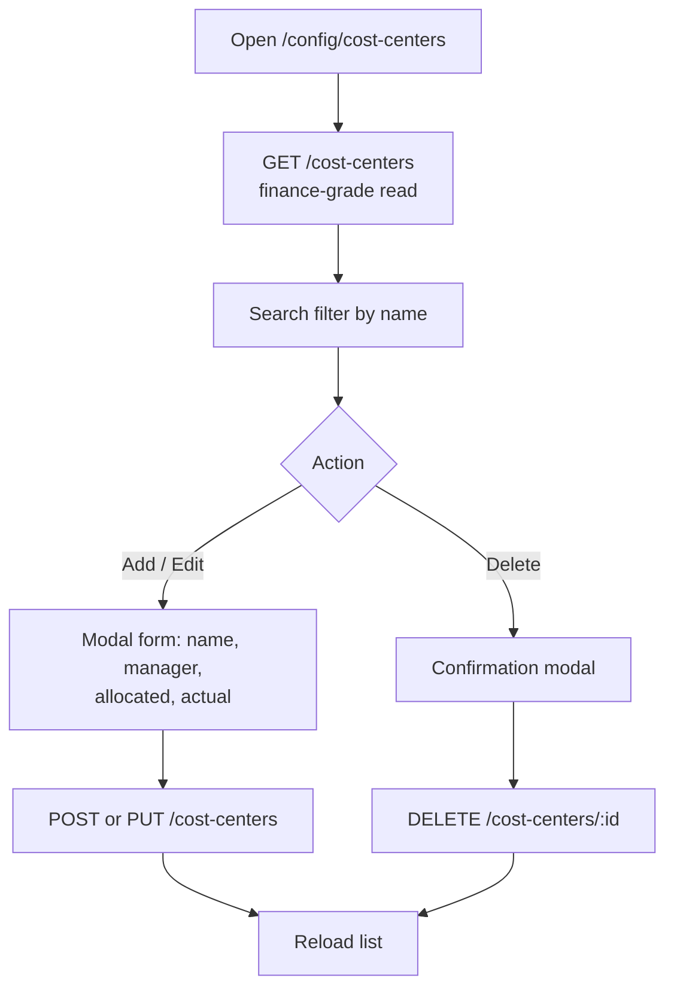
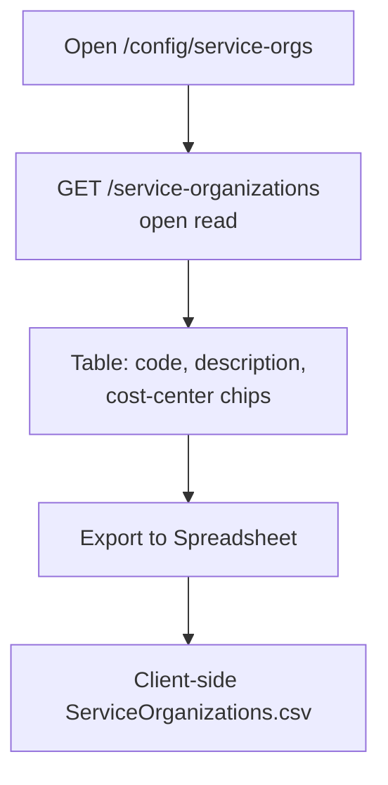
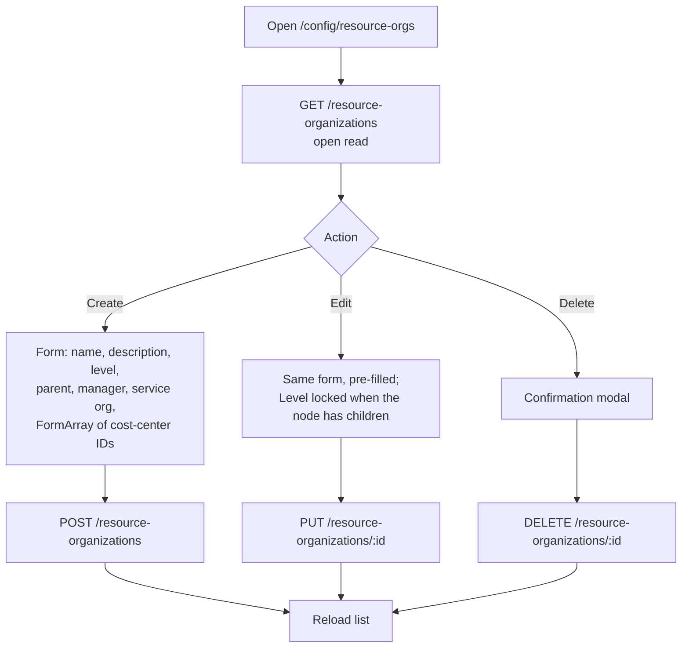
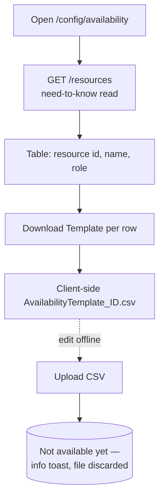

# Configuration & Master Data — Standard Operating Procedures

> **Diátaxis mode: How-to.** This document holds the SOPs for maintaining the
> **reference / master data** that the rest of Delivery Control consumes: the
> default language, skill catalogs, proficiency sets, skills, project roles,
> cost centers, service-organization details, resource organizations, and
> workforce availability data. Each SOP follows the format described in
> [`00-overview.md`](00-overview.md). Roles and the authorization model are
> defined in [`../roles-and-permissions.md`](../roles-and-permissions.md).
>
> **Operating the four integration adapters** (ERP / e-invoice / CRM / BI) lives
> in its sibling document, [`integrations.md`](integrations.md).

**Source of truth.** The procedures below are grounded in the Angular components
under `src/app/configuration/` (`set-default-language`, `manage-skill-catalogs`,
`manage-proficiency-sets`, `manage-skills`, `manage-project-roles`,
`manage-cost-centers`, `service-organization-details`,
`manage-resource-organizations`, `maintain-availability-data`), the client
routes in `src/app/app.routes.ts`, and the server handlers + RBAC in
`src/server.ts` (`/languages`, `/skill-catalogs`, `/proficiency-sets`,
`/skills`, `/project-roles`, `/service-organizations`, `/resource-organizations`,
`/cost-centers`).

## Why this is "master data"

None of the objects on this page are transactional. They are the **reference
vocabulary** that resourcing, projects, and commercial features read against:

- **Skill catalogs + proficiency sets + skills** are the taxonomy the resource
  match scorer (`match.util`) and the profile editor pick from.
- **Project roles** are the role codes a resource request and an assignment are
  expressed in.
- **Cost centers + service organizations + resource organizations** are the
  org/budgeting structure that projects and financials roll up to.
- **Languages** set the default localization for skills and project roles.
- **Availability data** feeds the capacity/utilization views in resource
  management.

Because these are read by *everyone*, the design keeps **reads open** but gates
**mutations**. The verification below comes straight from `src/server.ts`.

## Authorization model for this domain (verified against `src/server.ts`)

| Collection (route prefix) | Read RBAC | Mutation RBAC (POST/PUT/DELETE) |
|---------------------------|-----------|---------------------------------|
| `/languages` | **open** (not in `READ_RULES`) | `admin`, `delivery-executive` |
| `/skill-catalogs` | **open** | `admin`, `delivery-executive` |
| `/proficiency-sets` | **open** | `admin`, `delivery-executive` |
| `/skills` | **open** | `admin`, `delivery-executive` |
| `/project-roles` | **open** | `admin`, `delivery-executive` |
| `/resource-organizations` | **open** | `admin`, `delivery-executive` |
| `/cost-centers` | `finance`, `delivery-executive`, `admin` (need-to-know financial) | `finance`, `delivery-executive`, `admin` |
| `/service-organizations` | **open** | *none — read-only* (replicated from SAP S/4HANA Cloud) |

Notes grounded in code:

- The single mutation rule
  `['/skill-catalogs', '/proficiency-sets', '/skills', '/project-roles', '/resource-organizations', '/languages'] → ['admin', 'delivery-executive']`
  covers all six catalog collections (`src/server.ts`).
- `cost-centers` is grouped with the financial collections
  (`/project-financials`, `/project-cost-centers`, `/cost-centers`) on both the
  read side (`READ_RULES`) and write side, so it requires `finance`,
  `delivery-executive`, or `admin`.
- The **client routes** under `config/*` are *not* role-guarded
  (`src/app/app.routes.ts`) — only `config/integrations` carries
  `canMatch: [financeGuard]`. Navigation is therefore open; the server gate is
  the real authority. A user who reaches a catalog page without the catalog
  mutation role will load and read it, but their POST/PUT/DELETE returns
  `403 Role <role> cannot modify <path>`.
- `RBAC priority` (`ROLE_PRIORITY`): `admin > delivery-executive > finance >
  sales > resource-manager > pm > employee`. `canMutate` admits a role if it is
  in the rule's list (no implicit "higher role wins" beyond the explicit lists).

---

## Domain flow at a glance

---

## SOPs

### Set the default Language

**Purpose.** Choose the single default language used as the localization baseline
for skills and project roles, so newly created reference data has a consistent
language context.

**Scope.**
- *In:* promoting one existing language code to default via
  `POST /languages/default`.
- *Out:* creating/deleting languages (the language list is seeded; this screen
  only reads it and flips the default flag).

**RACI.**

| Step | Responsible | Accountable | Consulted | Informed |
|------|-------------|-------------|-----------|----------|
| Review language list | admin | admin | delivery-executive | — |
| Set a new default | admin / delivery-executive | admin | — | resource/config owners |

**Process flow.**

**Detailed steps.**

1. **Open the page.**
   - **Who:** `admin` (or `delivery-executive`). **When:** establishing or
     correcting the localization baseline.
   - **How:** navigate to `/config/language` (`SetDefaultLanguageComponent`); it
     calls `getLanguages()` → `GET /languages` (open read) and sorts the current
     default to the top.
   - **Output:** the language table (Code, Language, Action), default badged.
2. **Set a new default.**
   - **Who:** `admin` / `delivery-executive`. **When:** the default must change.
   - **How:** click **Set as Default** on a non-default row →
     `setDefaultLanguage(code)` → `POST /languages/default { code }`. The server
     verifies the code references an existing language, then sets `isDefault`
     true on exactly that code and false on the rest.
   - **Output:** `204`; the list reloads with the new default badged.

**Exceptions & edge cases.**

| Situation | System response |
|-----------|-----------------|
| `code` is not an existing language | `400 — code must reference an existing language`. |
| Caller lacks the catalog mutation role | `403 — Role <role> cannot modify /languages`. |
| Changing the default after skills/roles exist | Allowed, but discouraged — the page explicitly recommends setting it **once** before any skills or project roles are created. |

**Metrics.**

| Metric | How to read it |
|--------|----------------|
| Default-language churn | Number of `POST /languages/default` calls over time (should be ~0 after initial setup). |

**Related.** [`manage-skills`](#manage-skills) and
[`manage-project-roles`](#manage-project-roles) are localized against this
default; roles in [`../roles-and-permissions.md`](../roles-and-permissions.md).

---

### Manage Skill Catalogs

**Purpose.** Maintain the named catalogs that group skills (e.g. by domain), so
skills can be filed under one or more catalogs for matching and reporting.

**Scope.**
- *In:* create a catalog (name + description) and delete a catalog.
- *Out:* assigning skills to catalogs (done from
  [Manage Skills](#manage-skills) — the catalog's `skills` array is the join);
  editing a catalog name in place (no edit UI on this screen).

**RACI.**

| Step | Responsible | Accountable | Consulted | Informed |
|------|-------------|-------------|-----------|----------|
| Create catalog | admin / delivery-executive | admin | resource-manager | — |
| Delete catalog | admin / delivery-executive | admin | resource-manager | pm |

**Process flow.**

**Detailed steps.**

1. **Review catalogs.**
   - **Who:** any reader (open read). **How:** `/config/skill-catalogs`
     (`ManageSkillCatalogsComponent`) → `GET /skill-catalogs`. The Skills Count
     column shows `catalog.skills.length`.
   - **Output:** the catalog table (Name, Description, Skills Count, Actions).
2. **Create a catalog.**
   - **Who:** `admin` / `delivery-executive`. **How:** **Create Catalog** →
     fill name (required) + description → **Save** →
     `createSkillCatalog({ name, description })` → `POST /skill-catalogs`. The
     server assigns `id` and seeds `skills: []`.
   - **Output:** persisted catalog; list reloads.
3. **Delete a catalog.**
   - **Who:** `admin` / `delivery-executive`. **How:** the delete button uses a
     **two-click confirm** — first click raises an info toast ("Click delete
     again to confirm"), second click calls `deleteSkillCatalog(id)` →
     `DELETE /skill-catalogs/:id`.
   - **Output:** `204`; list reloads.

**Exceptions & edge cases.**

| Situation | System response |
|-----------|-----------------|
| Empty name | **Save** disabled (`Validators.required`). |
| First delete click | No deletion — only the confirm toast; second click within the same pending state performs it. |
| Caller lacks catalog mutation role | `403 — Role <role> cannot modify /skill-catalogs`. |

**Metrics.**

| Metric | How to read it |
|--------|----------------|
| Catalogs in use | Count of catalogs with `skills.length > 0` vs. empty catalogs. |

**Related.** [Manage Skills](#manage-skills) (skill↔catalog join);
[Manage Proficiency Sets](#manage-proficiency-sets).

---

### Manage Proficiency Sets

**Purpose.** Define reusable proficiency scales (e.g. 1–4 Novice→Expert) that a
skill can be measured against, so skill levels are consistent across the
organization.

**Scope.**
- *In:* create a set (name + description + an ordered list of levels, each with a
  numeric level, name, description) and delete a set.
- *Out:* editing a set in place (no PUT route for proficiency sets — only POST
  and DELETE exist server-side).

**RACI.**

| Step | Responsible | Accountable | Consulted | Informed |
|------|-------------|-------------|-----------|----------|
| Create set | admin / delivery-executive | admin | resource-manager | — |
| Delete set | admin / delivery-executive | admin | resource-manager | — |

**Process flow.**

**Detailed steps.**

1. **Review sets.**
   - **Who:** any reader. **How:** `/config/proficiency-sets`
     (`ManageProficiencySetsComponent`) → `GET /proficiency-sets`. Levels render
     as chips (`level: name`).
   - **Output:** the set table (Name, Description, Levels, Actions).
2. **Create a set.**
   - **Who:** `admin` / `delivery-executive`. **How:** **Create Set** opens a
     form pre-seeded with one empty level row. Use **Add Level** /
     **remove** to build the scale (level number, name required; description
     optional), then **Save** → `createProficiencySet({ name, description,
     levels })` → `POST /proficiency-sets` (server assigns `id`, defaults
     `levels: []` if absent). A success toast confirms.
   - **Output:** persisted set; list reloads.
3. **Delete a set.**
   - **Who:** `admin` / `delivery-executive`. **How:** the delete button reveals
     an **inline Confirm/Cancel** control; **Confirm** →
     `deleteProficiencySet(id)` → `DELETE /proficiency-sets/:id` with a success
     toast.
   - **Output:** `204`; list reloads.

**Exceptions & edge cases.**

| Situation | System response |
|-----------|-----------------|
| Missing name, or a level missing number/name | **Save** disabled (form invalid). |
| Need to rename a set / edit levels | Not supported in place — delete and recreate (no PUT route). |
| Caller lacks catalog mutation role | `403 — Role <role> cannot modify /proficiency-sets`. |

**Metrics.**

| Metric | How to read it |
|--------|----------------|
| Scale standardization | Number of distinct proficiency sets actually referenced by skills (fewer = more consistent). |

**Related.** [Manage Skills](#manage-skills) attaches one proficiency set per
skill.

---

### Manage Skills

**Purpose.** Maintain the skill taxonomy itself, linking each skill to zero-or-
more **catalogs** and (optionally) one **proficiency set**, and controlling
whether a skill is **restricted** (hidden/blocked from normal use). This is the
hub that ties catalogs and proficiency sets together.

**Scope.**
- *In:* create a skill (name, description, catalogs, proficiency set), toggle a
  skill's `restricted` flag, delete a skill, download the skill list as CSV.
- *Out:* CSV **upload/import** is **not available yet** (the file picker shows
  "CSV import is not available yet" and discards the file). Editing the
  catalog/proficiency links of an existing skill in place is via the
  `PUT /skills/:id` route, exercised here for the restrict toggle.

**RACI.**

| Step | Responsible | Accountable | Consulted | Informed |
|------|-------------|-------------|-----------|----------|
| Create skill | admin / delivery-executive | admin | resource-manager | — |
| Restrict / unrestrict | admin / delivery-executive | admin | resource-manager | pm |
| Delete skill | admin / delivery-executive | admin | resource-manager | — |
| Export CSV | any reader | admin | — | — |

**Process flow.**

**Detailed steps.**

1. **Load the page.**
   - **Who:** any reader. **How:** `/config/skills` (`ManageSkillsComponent`)
     loads skills, catalogs, and proficiency sets together via a `forkJoin`
     over the three open `GET` reads, so the catalog/proficiency dropdowns are
     populated.
   - **Output:** the skill table (ID/`conceptUri`, Name, Catalogs, Proficiency
     Set, Status, Actions).
2. **Create a skill.**
   - **Who:** `admin` / `delivery-executive`. **How:** **Create Skill** → name
     (required), description, a **multi-select** of catalogs (Ctrl/Cmd-click),
     and an optional proficiency set → **Save** → `createSkill(...)` →
     `POST /skills`. The server mints `conceptUri` (`sap-rm://skill/<id>`),
     defaults `catalogs: []` and `restricted: false`.
   - **Output:** persisted skill; data reloads.
3. **Restrict / unrestrict.**
   - **Who:** `admin` / `delivery-executive`. **How:** the lock/block button →
     `updateSkill(id, { restricted: !restricted })` → `PUT /skills/:id`.
     Restricted rows render dimmed with a red "Restricted" badge.
   - **Output:** updated status; data reloads.
4. **Delete a skill.**
   - **Who:** `admin` / `delivery-executive`. **How:** **two-click confirm** →
     `deleteSkill(id)` → `DELETE /skills/:id`.
   - **Output:** `204`; data reloads.
5. **Export CSV.**
   - **Who:** any reader. **How:** **Download CSV** builds a `Skills_en.csv`
     entirely **client-side** (browser-only; SSR no-op) with a formula-injection
     guard on every cell. No server call.
   - **Output:** a downloaded CSV.

**Exceptions & edge cases.**

| Situation | System response |
|-----------|-----------------|
| Empty name | **Save** disabled. |
| CSV **upload** attempt | Info toast "CSV import is not available yet"; file discarded. |
| Restricted skill | Shown dimmed; still listed (restriction is a flag, not a delete). |
| Caller lacks catalog mutation role | `403` on POST/PUT/DELETE; reads still succeed (open). |

**Metrics.**

| Metric | How to read it |
|--------|----------------|
| Restricted-skill ratio | Restricted ÷ total skills (governance signal). |
| Uncatalogued skills | Skills with empty `catalogs` (won't surface under any catalog filter). |

**Related.** [Manage Skill Catalogs](#manage-skill-catalogs),
[Manage Proficiency Sets](#manage-proficiency-sets); consumed by the resource
match scorer (`match.util`) and the profile editor.

---

### Manage Project Roles

**Purpose.** Maintain the short role **codes** (≤4 alphanumeric chars) and names
used to express demand and assignments, so resource requests and staffing speak
a controlled vocabulary.

**Scope.**
- *In:* create a role (code, name, description), restrict/unrestrict a role.
- *Out:* deleting a role — there is **no DELETE route** for project roles; a role
  is taken out of circulation by **restricting** it (`PUT /project-roles/:id`).

**RACI.**

| Step | Responsible | Accountable | Consulted | Informed |
|------|-------------|-------------|-----------|----------|
| Create role | admin / delivery-executive | admin | resource-manager, pm | — |
| Restrict / unrestrict | admin / delivery-executive | admin | resource-manager | pm |

**Process flow.**

**Detailed steps.**

1. **Review roles.**
   - **Who:** any reader. **How:** `/config/project-roles`
     (`ManageProjectRolesComponent`) → `GET /project-roles`.
   - **Output:** the role table (Code, Name, Description, Status, Actions).
2. **Create a role.**
   - **Who:** `admin` / `delivery-executive`. **How:** **Create Role** → code
     (required, ≤4, pattern `^[a-zA-Z0-9 ]*$`), name (required), description.
     The component **uppercases the code** before sending →
     `createProjectRole(...)` → `POST /project-roles` (server defaults
     `restricted: false`).
   - **Output:** persisted role; list reloads.
3. **Restrict / unrestrict.**
   - **Who:** `admin` / `delivery-executive`. **How:** the lock/block button uses
     a **two-click confirm** ("Click again to confirm you want to
     restrict/unrestrict") → `updateProjectRole(id, { restricted })` →
     `PUT /project-roles/:id`.
   - **Output:** updated status; list reloads.

**Exceptions & edge cases.**

| Situation | System response |
|-----------|-----------------|
| Code >4 chars or non-alphanumeric | **Save** disabled (validators). |
| Need to remove a role | Not possible via DELETE — **restrict** it instead. |
| Caller lacks catalog mutation role | `403 — Role <role> cannot modify /project-roles`. |

**Metrics.**

| Metric | How to read it |
|--------|----------------|
| Active vs. restricted roles | Restricted roles should not appear in new requests. |

**Related.** Consumed by resource requests and assignments in
[`resource-management.md`](resource-management.md).

---

### Manage Cost Centers

**Purpose.** Define and maintain the organizational **cost centers** (name,
manager, allocated and actual budget) used for project budgeting and financial
rollups. This is the one master-data screen gated to **finance** (and above).

**Scope.**
- *In:* create, edit, and delete a cost center; search/filter by name.
- *Out:* the project-level cost-center allocations (`/project-cost-centers`),
  which live in project delivery.

**RACI.**

| Step | Responsible | Accountable | Consulted | Informed |
|------|-------------|-------------|-----------|----------|
| Create cost center | finance | finance | delivery-executive | pm |
| Edit allocated/actual | finance | finance | delivery-executive | — |
| Delete cost center | finance | delivery-executive | finance | — |

> **Who/role note:** mutations require `finance`, `delivery-executive`, or
> `admin` (cost centers are grouped with the financial collections in both
> `READ_RULES` and the write rules of `src/server.ts`). Unlike the other catalog
> pages, **reads are also gated** to these roles.

**Process flow.**

**Detailed steps.**

1. **Open & filter.**
   - **Who:** `finance` / `delivery-executive` / `admin`. **How:**
     `/config/cost-centers` (`ManageCostCentersComponent`) →
     `getCostCenters()` → `GET /cost-centers`. The search box filters by name.
   - **Output:** the cost-center table (Name, Manager, Allocated, Actual,
     Actions).
2. **Add or edit.**
   - **Who:** `finance` (+). **How:** **Add Cost Center** (or the row's edit
     icon) opens a modal; all four fields are required. **Save** routes to
     `createCostCenter(...)` → `POST /cost-centers` or `updateCostCenter(id,...)`
     → `PUT /cost-centers/:id`. `allocated`/`actual` are server-validated as
     non-negative numbers.
   - **Output:** persisted cost center; list reloads.
3. **Delete.**
   - **Who:** `finance` (+). **How:** the row's delete icon opens a confirmation
     modal; **Delete** → `deleteCostCenter(id)` → `DELETE /cost-centers/:id`.
   - **Output:** `204`; list reloads.

**Exceptions & edge cases.**

| Situation | System response |
|-----------|-----------------|
| Negative / NaN `allocated` or `actual` | `400` (server numeric validation on these fields). |
| Caller lacks finance-grade role | `403` on mutate; **also `401`/`403` on read** (cost centers are need-to-know). |
| No cost centers yet | Empty-state row "No cost centers defined yet." |

**Metrics.**

| Metric | How to read it |
|--------|----------------|
| Budget utilization | `actual ÷ allocated` per cost center. |
| Over-budget centers | Cost centers where `actual > allocated`. |

**Related.** [Manage Resource Organizations](#manage-resource-organizations)
groups cost centers; [Service Organization Details](#service-organization-details)
lists the cost centers replicated from S/4HANA.

---

### Service Organization Details

**Purpose.** **View** the service organizations replicated from SAP S/4HANA Cloud
(code, description, and their associated cost centers), so the org structure
sourced upstream is visible inside Delivery Control.

**Scope.**
- *In:* read-only listing; export the list to a spreadsheet (client-side CSV).
- *Out:* creating/editing/deleting service organizations — there is **no write
  route** (`/service-organizations` is GET-only). This data is **mastered
  upstream in S/4HANA Cloud**, not in this app.

**RACI.**

| Step | Responsible | Accountable | Consulted | Informed |
|------|-------------|-------------|-----------|----------|
| View list | any reader | admin | — | — |
| Export to spreadsheet | any reader | admin | — | finance |

**Process flow.**

**Detailed steps.**

1. **View.**
   - **Who:** any reader. **How:** `/config/service-orgs`
     (`ServiceOrganizationDetailsComponent`) → `getServiceOrganizations()` →
     `GET /service-organizations`.
   - **Output:** a table of Code, Description, and Cost Centers (as chips).
2. **Export.**
   - **Who:** any reader. **How:** **Export to Spreadsheet** builds
     `ServiceOrganizations.csv` **client-side** (browser-only; injection-guarded
     cells). No server call.
   - **Output:** a downloaded CSV.

**Exceptions & edge cases.**

| Situation | System response |
|-----------|-----------------|
| No service organizations | Empty-state row "No service organizations found." |
| Attempt to mutate | Not possible — no POST/PUT/DELETE route exists. |

**Metrics.**

| Metric | How to read it |
|--------|----------------|
| Replication coverage | Number of service organizations visible vs. expected from S/4HANA. |

**Related.** [Manage Cost Centers](#manage-cost-centers);
[Manage Resource Organizations](#manage-resource-organizations).

---

### Manage Resource Organizations

**Purpose.** Maintain the **delivery organization tree** — Capability >
Practice > Competence — with each node's **manager** and the list of
**cost-center IDs** it owns. A node's manager *is* the manual's Capability
Leader / Practice Manager / Competence Manager: this screen is where that
authority is granted, because feature D deliberately adds **no new RBAC role**
(a role is global; authority over a set of resources is relative). See
[Roles & permissions](../roles-and-permissions.md) for what the grant unlocks.

**Scope.**
- *In:* create a node (name, description, **level**, **parent**, **manager**,
  service org, a dynamic list of cost-center IDs); **edit any node in place**
  (the pencil on every row); delete a node.
- *Out:* moving resources between nodes (that is `Resource.organization` on the
  [Resources](resource-management.md) screen — resources bind to a node **by
  name**); cascading a **rename** onto the resources that reference the old name
  (refused instead, see the exceptions below).

**RACI.**

| Step | Responsible | Accountable | Consulted | Informed |
|------|-------------|-------------|-----------|----------|
| Create node | admin / delivery-executive | admin | resource-manager, finance | — |
| Edit node (level / parent / manager) | admin / delivery-executive | admin | resource-manager | finance |
| Delete node | admin / delivery-executive | admin | resource-manager | finance |

**Process flow.**

**Detailed steps.**

1. **Review the tree.**
   - **Who:** any reader. **How:** `/config/resource-orgs`
     (`ManageResourceOrganizationsComponent`) → `GET /resource-organizations`.
   - **Output:** the table as a **tree view** — each node rendered under its
     parent and indented by depth — with columns Name, Level, Parent, Manager,
     Description, Service Org, Cost Centers chips, Actions.
2. **Create a node.**
   - **Who:** `admin` / `delivery-executive`. **How:** **Create Organization** →
     name (required), description, **Level** (capability / practice /
     competence), **Parent** (required for anything but a capability; the picker
     offers only nodes of the legal parent level), **Manager** (optional; the
     picker offers only **active, internal** resources — never a placeholder,
     subcontractor or terminated person), service org, and **Add Cost Center**
     to append cost-center ID inputs (each required) → **Save** →
     `createResourceOrganization(...)` → `POST /resource-organizations` (server
     defaults `costCenters: []` and `level: 'capability'`). Success toast.
   - **Output:** persisted node; the tree reloads.
3. **Edit a node.**
   - **Who:** `admin` / `delivery-executive`. **How:** the pencil on the row
     opens the same form pre-filled → **Save changes** →
     `updateResourceOrganization(id, ...)` → `PUT /resource-organizations/:id`.
     **Level** is locked while the node has children (changing it would leave
     them with an illegal parent — the server refuses it too, see below). The
     Manager select's empty option (**— None —**) detaches the leader.
   - **Output:** the updated node; the tree reloads.
4. **Delete a node.**
   - **Who:** `admin` / `delivery-executive`. **How:** the delete icon opens a
     confirmation modal; **Delete** → `deleteResourceOrganization(id)` →
     `DELETE /resource-organizations/:id`. Success toast.
   - **Output:** `204`; the tree reloads.

**Exceptions & edge cases.**

| Situation | System response |
|-----------|-----------------|
| Empty name, or a blank cost-center row | **Save** disabled (validators). |
| A practice/competence with no parent selected | **Save** disabled; the server would answer `400 — a <level> must have a parent`. |
| A name already used anywhere in the tree | `400 — name must be unique across the whole organizational tree` (resources bind by name, so names are tree-wide unique). |
| A capability given a parent | `400 — a capability is a root and cannot have a parent`. |
| A parent of the wrong level | `400 — the parent of a <level> must be a <wanted>`. |
| `parentId` naming a node that does not exist | `400 — parentId must reference an existing resource organization`. |
| `managerId` naming a resource that does not exist | `400 — managerId must reference an existing resource`. |
| Changing a node's level when it still has children | `400 — cannot change level to <level>: existing <child level> child "<name>" requires a <wanted> parent`. The UI locks the Level select in this state, so this is the server's belt. |
| A parent change that would close a loop | `400 — parentId would close a cycle in the organizational tree`. |
| Clearing Parent / Manager | The empty option sends `''`, which both write paths normalize to *absent* (never a stored empty string). |
| Deleting a node that still has children | `409 — Cannot delete an organization that has children` (delete bottom-up). |
| Deleting a node resources still reference by name | `409 — Cannot delete an organization that resources still reference`. |
| **Renaming** a node resources still reference by name | `409 — Cannot rename: N resource(s) still reference the name "<old>"`. Move the people first; the rename is **not** cascaded. |
| Required field sent as an explicit `null` (`name`, `description`, `costCenters`, `level`) | `400 — <field> is required and cannot be cleared`. |
| Caller lacks catalog mutation role | `403 — Role <role> cannot modify /resource-organizations`. |
| Two admins editing the tree at the same time | Every mutation is serialized server-side on one lock, so the second writer validates against the first one's committed state (it can therefore see a refusal the first write created). |

**Metrics.**

| Metric | How to read it |
|--------|----------------|
| Orgs without cost centers | Resource organizations with empty `costCenters` (incomplete budgeting linkage). |
| Nodes without a manager | Nodes whose `managerId` is absent — nobody is accountable for allocations under them, so the decision falls back to any competent approver. |

**Related.** [Manage Cost Centers](#manage-cost-centers) (the referenced IDs);
[Service Organization Details](#service-organization-details);
[Resource Management](resource-management.md) (where people are attached to a
node); [Roles & permissions](../roles-and-permissions.md) (what a node manager
may decide).

---

### Maintain Availability Data

**Purpose.** Maintain the workforce-person **availability** data consumed by
resource management's capacity/utilization views, via a download-edit-upload
template workflow.

**Scope.**
- *In:* list resources, and **download** a per-resource CSV availability template
  (a single seed row with the resource's IDs and the expected column layout).
- *Out:* CSV **upload** is **not available yet** (the upload control shows
  "Availability upload is not available yet" and discards the file). There is no
  in-app row editing here.

**RACI.**

| Step | Responsible | Accountable | Consulted | Informed |
|------|-------------|-------------|-----------|----------|
| Download template | resource-manager (any reader) | admin | — | — |
| Edit & re-upload | resource-manager | admin | — | — *(upload not yet enabled)* |

> **Who/role note:** the **read** of `/resources` that backs this list is
> need-to-know (`pm`, `resource-manager`, `delivery-executive`, `finance`,
> `admin` per `READ_RULES`). The template download itself is a client-side CSV
> build with no separate mutation; persisting availability would, once upload
> exists, target the workforce/availability data path.

**Process flow.**

**Detailed steps.**

1. **List resources.**
   - **Who:** `resource-manager` / `pm` / `delivery-executive` / `finance` /
     `admin`. **How:** `/config/availability`
     (`MaintainAvailabilityDataComponent`) → `getResources()` → `GET /resources`.
   - **Output:** a table (Resource ID, Name, Role) with a **Template** button
     per row.
2. **Download a template.**
   - **Who:** any permitted reader. **How:** **Template** builds
     `AvailabilityTemplate_<resourceId>.csv` **client-side** with a single seed
     row carrying the resource's id, a derived external id, first/last name, and
     the full expected header (`resourceId, workForcePersonExternalId,
     firstName, lastName, s4costCenterId, companyCode, workAssignmentId,
     startDate, plannedWorkingHours, nonWorkingHours`).
   - **Output:** a downloaded CSV ready to edit offline.
3. **Re-upload (not yet enabled).**
   - **Who:** `resource-manager`. **How:** **Upload CSV** opens a file picker;
     selecting a file currently raises "Availability upload is not available
     yet" and discards it.
   - **Output:** none yet (placeholder for a future ingestion path).

**Exceptions & edge cases.**

| Situation | System response |
|-----------|-----------------|
| CSV **upload** attempt | Info toast "Availability upload is not available yet"; file discarded. |
| Unauthenticated read of `/resources` | `401` (need-to-know read). |
| Download during SSR | No-op (browser-only guard). |

**Metrics.**

| Metric | How to read it |
|--------|----------------|
| Template coverage | Resources for whom a template has been downloaded/maintained. |

**Related.** Availability feeds the capacity/utilization views in
[`resource-management.md`](resource-management.md).

---

## Related documents

- [`integrations.md`](integrations.md) — operating the four integration adapters.
- [`resource-management.md`](resource-management.md) — consumes skills, project
  roles, and availability.
- [`project-delivery.md`](project-delivery.md) and
  [`billing-and-revenue.md`](billing-and-revenue.md) — consume cost centers and
  org structure.
- [`../roles-and-permissions.md`](../roles-and-permissions.md) — the
  authoritative role/RBAC reference.
- [`../architecture/03-backend-and-data.md`](../architecture/03-backend-and-data.md)
  — the repository/RBAC implementation behind these routes.
