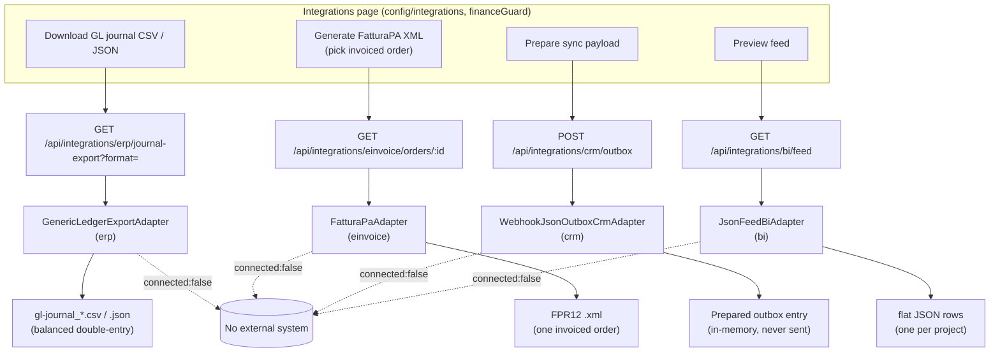
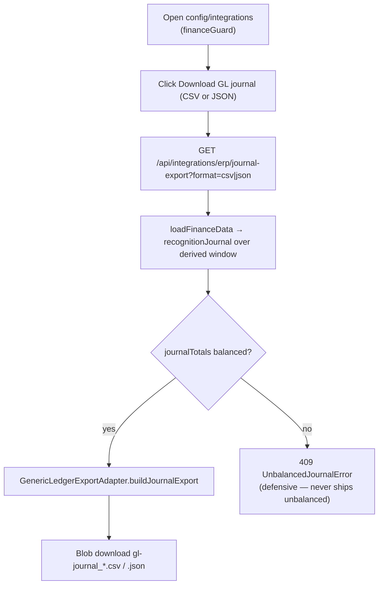
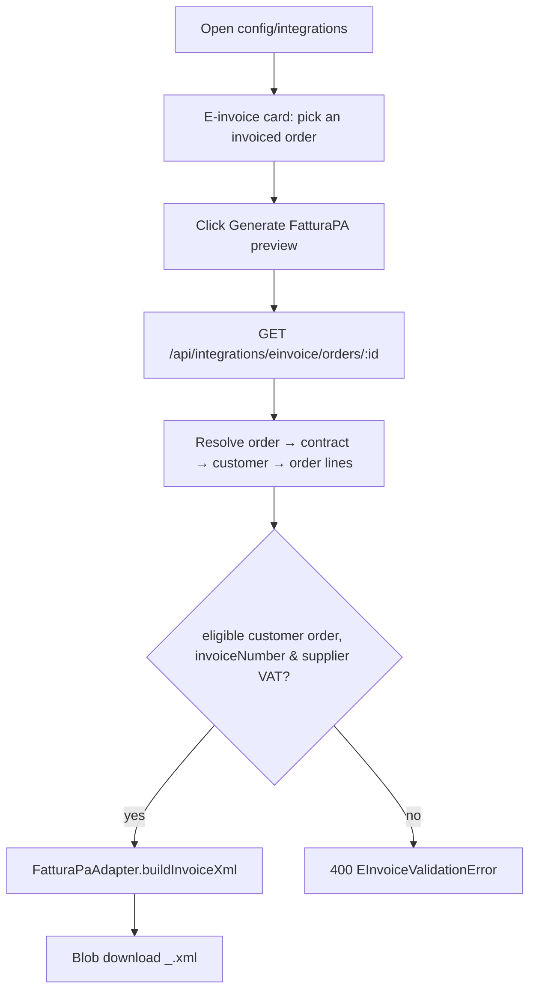
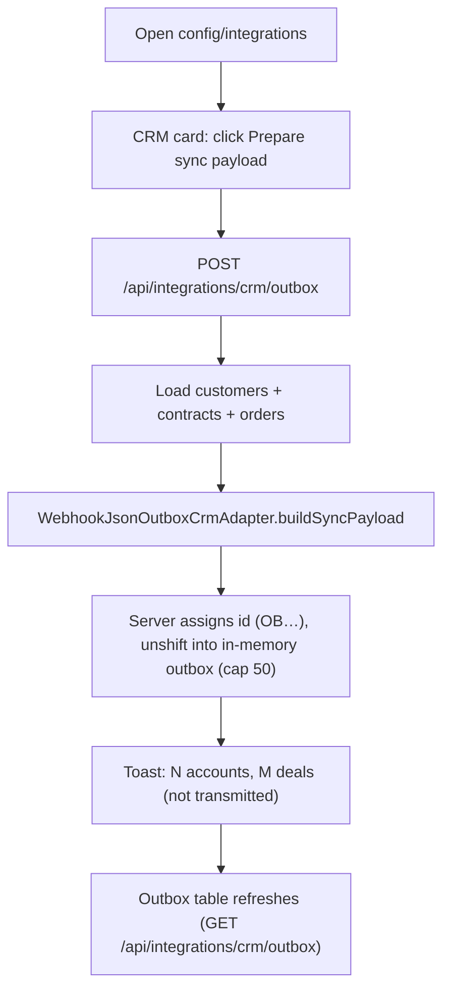
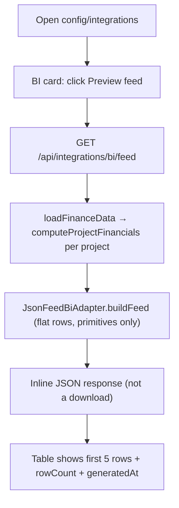

# Integrations — Standard Operating Procedures

> **Diátaxis mode: How-to.** This document holds the SOPs for **operating the
> four integration adapters** from the Integrations page: downloading the ERP
> general-ledger journal, generating a FatturaPA e-invoice XML, preparing the
> CRM sync outbox, and previewing the BI feed. Each SOP follows the format
> described in [`00-overview.md`](00-overview.md). The master-data configuration
> SOPs live in the sibling document [`configuration.md`](configuration.md).
>
> **Architecture cross-reference:** the adapter layer, its types, the registry,
> and the env-var swap mechanism are described in
> [`../architecture/05-integrations.md`](../architecture/05-integrations.md).

**Source of truth.** Grounded in `src/app/configuration/integrations.component.ts`
(the page), the client route `config/integrations` in `src/app/app.routes.ts`,
the server endpoints under `/api/integrations` in `src/server.ts`, the adapter
registry `src/server/integrations/registry.ts`, the shared contracts
`src/server/integrations/types.ts`, and the four adapters
(`erp-ledger.adapter.ts`, `fatturapa.adapter.ts`, `crm-outbox.adapter.ts`,
`bi-feed.adapter.ts`).

## The defining caveat: implemented, **not connected**

Every adapter is **implemented and fully testable but deliberately NOT
connected**. Each one is a **pure builder** that turns live repository data into
a **local artifact** (CSV / JSON / XML) and stops there. There are:

- **no network calls**, **no credentials**, **no vendor SDKs**;
- a self-describing `IntegrationDescriptor` that always carries
  `connected: false` and `mode: 'local-artifact'` (`src/server/integrations/types.ts`).

The page renders an amber **"Implemented — not connected"** status badge on
every card and states it in plain text: *"it builds a local artifact from live
data — no credentials, no network calls."*

### How a real connector would be swapped in

The registry selects exactly **one** adapter per kind by environment variable,
defaulting to the single implementation that exists today
(`src/server/integrations/registry.ts`):

| Kind | Env var | Default key |
|------|---------|-------------|
| ERP | `INTEGRATION_ERP_ADAPTER` | `generic-ledger-export` |
| E-invoice | `INTEGRATION_EINVOICE_ADAPTER` | `fatturapa` |
| CRM | `INTEGRATION_CRM_ADAPTER` | `crm-webhook-json-outbox` |
| BI | `INTEGRATION_BI_ADAPTER` | `json-feed` |

A production connector would be added as a **new implementation** of the same
typed adapter interface (`ErpExportAdapter`, `EInvoiceAdapter`, `CrmSyncAdapter`,
`BiFeedAdapter`), registered under a new key in the relevant `*_IMPLS` map, and
selected by setting the env var to that key. An env var naming an **unknown** key
logs a console warning and **falls back to the default** rather than failing
boot. The registry is memoized (one shared instance per kind per process). See
[`../architecture/05-integrations.md`](../architecture/05-integrations.md) for the
full design.

## Authorization model (verified against `src/server.ts`)

- **Client route:** `config/integrations` is the **only** config route carrying a
  role guard — `canMatch: [financeGuard]`. `financeGuard` resolves to
  `canApproveFinancials()` = **`finance`, `delivery-executive`, `admin`**.
- **Server RBAC:** `/integrations` is gated on **both reads and mutations** to
  `finance`, `delivery-executive`, `admin` — once in `READ_RULES` (the artifacts
  expose commercial/financial rollups, so finance-grade readers only) and once in
  the mutation rules (the CRM `POST` mirrors the read gate).

For every SOP below, the **Responsible** role is **`finance`** (the primary
operator), with `delivery-executive` and `admin` equally authorized.

## Page → endpoint → adapter → artifact

> The page is **auth-gated**: both reads (`GET /integrations`, `GET /orders`,
> `GET /integrations/crm/outbox`) are keyed on `authReady()` so requests fire
> only once the bearer token can be attached. Downloads are fetched as blobs
> through `HttpClient` (so the auth interceptor adds the token) and are
> **browser-only** (SSR no-op).

---

## SOPs

### Download the ERP general-ledger journal

**Purpose.** Produce a **balanced double-entry general-ledger journal** of the
revenue-recognition schedule as an importable local file (CSV or JSON), for an
ERP / accounting system to ingest.

**Scope.**
- *In:* downloading the GL journal as CSV (one row per journal line, trailing
  TOTALS row) or JSON (entries verbatim + totals), over a date window derived
  from the data's own dated activity.
- *Out:* transmitting to any ERP. The artifact is a download only; nothing is
  posted anywhere. The active adapter key is `generic-ledger-export`.

**RACI.**

| Step | Responsible | Accountable | Consulted | Informed |
|------|-------------|-------------|-----------|----------|
| Download GL journal | finance | delivery-executive | — | accounting/ERP team |
| Import into ERP (out of app) | finance / ERP team | finance | — | — |

**Process flow.**

**Detailed steps.**

1. **Open the page.**
   - **Who:** `finance` / `delivery-executive` / `admin`. **When:** an accounting
     period needs a GL extract.
   - **How:** navigate to **Configuration → Integrations**
     (`config/integrations`, `financeGuard`). The ERP card shows the active
     adapter key (`generic-ledger-export`).
   - **Output:** the ERP / General Ledger Export card.
2. **Download the journal.**
   - **Who:** `finance` (+). **How:** click **Download GL journal (CSV)** or the
     **(JSON)** button → `erpJournalExportUrl(format)` →
     `GET /api/integrations/erp/journal-export?format=csv|json`. The server
     assembles the finance snapshot (`loadFinanceData`), derives the month
     window from the data's own dated activity (time-entry + billing-item dates;
     falling back to full-year 2026 monthly when nothing is dated), builds the
     `recognitionJournal`, and calls the adapter.
   - **Output:** a downloaded `gl-journal_<window>.csv` (header
     `date,memo,account,debit,credit`, one row per line, trailing TOTALS row,
     RFC-4180 quoting + formula-injection guard) or `.json` (entries + totals).
3. **Import into the ERP (outside the app).**
   - **Who:** `finance` / ERP team. **How:** load the artifact into the target
     ERP through its own import process — there is no in-app transmission.
   - **Output:** journal posted in the ERP.

**Exceptions & edge cases.**

| Situation | System response |
|-----------|-----------------|
| Journal would be unbalanced (Σ debit ≠ Σ credit) | `409` with `UnbalancedJournalError` message; no artifact. (`recognitionJournal` is balanced by construction, so this is a defensive guard.) |
| Optional `from`/`to` query params (`YYYY-MM`) | Validated; `from > to` → `400`. Otherwise overrides the derived window. |
| Empty journal | Balanced by definition (Σ0 = Σ0); a valid empty artifact is produced. |
| Session expired mid-download (`401`) | The page surfaces "Download failed: your session has expired. Sign in again and retry." (the global interceptor suppresses `/api` 401s, so the action handles it explicitly). |
| Caller lacks finance-grade role | `403`/`401` (route guard + server read/mutate gate). |

**Metrics.**

| Metric | How to read it |
|--------|----------------|
| Journal balance | Always balanced; the TOTALS row shows Σ debit = Σ credit. |
| Coverage window | The derived `from`–`to` should span all dated activity. |

**Related.** Revenue recognition in
[`billing-and-revenue.md`](billing-and-revenue.md);
[`../architecture/05-integrations.md`](../architecture/05-integrations.md).

---

### Generate a FatturaPA XML preview

**Purpose.** Generate an inspectable Italian **FatturaElettronica v1.2 (FPR12)**
preview for one issued customer order. It is a review artifact, not a
submission-ready tax document.

**Scope.**
- *In:* selecting an order that carries an invoice number and downloading its
  FPR12 XML.
- *Out:* fiscal master-data completion and SDI transmission. The customer model
  does not store VAT/tax id or a full registered address; placeholders are made
  explicit. No `Sistema di Interscambio` call, credentials or network are used.

**RACI.**

| Step | Responsible | Accountable | Consulted | Informed |
|------|-------------|-------------|-----------|----------|
| Select invoiced order | finance | finance | — | — |
| Generate/review preview XML | finance | delivery-executive | accounting | — |
| Build and submit the official document (external system) | accounting | finance | tax adviser | — |

**Process flow.**

**Detailed steps.**

1. **Open the page & pick an order.**
   - **Who:** `finance` / `delivery-executive` / `admin`. **When:** an invoiced
     order needs its e-invoice document.
   - **How:** on the E-invoice card, the **Invoiced order** dropdown lists only
     orders carrying a non-empty `invoiceNumber` (filtered client-side from
     `GET /orders`). Select one.
   - **Output:** the selected order id; the **Generate** button enables.
2. **Generate the preview.**
   - **Who:** `finance` (+). **How:** click **Generate FatturaPA preview** →
     `einvoiceXmlUrl(orderId)` → `GET /api/integrations/einvoice/orders/:id`. The
     server resolves the order → its contract → its customer, gathers the order
     lines, supplies supplier (CedentePrestatore) master data from
     `INTEGRATION_SUPPLIER_*` env vars (with demo defaults), and calls the
     adapter, which emits a simplified FPR12-shaped preview at a flat 22% VAT.
   - **Output:** a downloaded `<IdPaese><PartitaIVA>_<Numero>.xml`.
3. **Prepare the official document (outside the app).**
   - **Who:** accounting. **How:** use the preview only as an input to a fiscal
     system that holds the missing customer identifiers/address and performs XSD,
     business-rule and tax validation before SDI transmission.
   - **Output:** an independently validated official document. The preview from
     this application must never be submitted as-is.

**Exceptions & edge cases.**

| Situation | System response |
|-----------|-----------------|
| Order has no invoice number | Not selectable (dropdown excludes it); a direct call returns `400 MISSING_INVOICE_NUMBER`. |
| Purchase order or customer order outside `Invoiced`/`Paid` | Not selectable; direct calls return `400 INELIGIBLE_ORDER`. |
| Supplier VAT missing | `400 MISSING_SUPPLIER_VAT`. |
| Order not found / broken contract→customer chain | `404`. |
| No invoiced orders at all | Card shows "No invoiced orders available…". |
| Customer fiscal/address data is unavailable | The preview uses visible placeholders and is explicitly marked not submission-ready. |
| Negative credit-note order | Emitted as `TD04` with positive document amounts; the domain amount remains negative for accounting. |
| Caller lacks finance-grade role | `403`/`401`. |

**Metrics.**

| Metric | How to read it |
|--------|----------------|
| Invoiced-order coverage | Orders with an invoice number eligible for export. |
| Preview consistency | Mandatory price fields and internal line/tax totals reconcile; fiscal/XSD/SDI validity is deliberately not claimed. |

**Related.** Invoicing/billing in
[`billing-and-revenue.md`](billing-and-revenue.md);
[`../architecture/05-integrations.md`](../architecture/05-integrations.md).

---

### Prepare the CRM sync outbox

**Purpose.** Build the **JSON payload a CRM webhook would receive** — accounts
mapped from customers, deals mapped from contracts joined with their orders — and
park it in a **Prepared** outbox, demonstrating the sync shape without ever
transmitting.

**Scope.**
- *In:* preparing a payload (one click) and reviewing the resulting outbox
  entries (id, prepared-at, status, account/deal counts).
- *Out:* sending to any CRM. The outbox is **ephemeral in-memory demo state**
  (newest first, capped at 50, cleared on restart). The active adapter key is
  `crm-webhook-json-outbox`; entry status is always `Prepared` (there is no
  `Sent`).

**RACI.**

| Step | Responsible | Accountable | Consulted | Informed |
|------|-------------|-------------|-----------|----------|
| Prepare sync payload | finance | delivery-executive | sales | — |
| Review outbox | finance | finance | sales | — |

**Process flow.**

**Detailed steps.**

1. **Open the page.**
   - **Who:** `finance` / `delivery-executive` / `admin`. **How:** the CRM Sync
     Outbox card shows the active key (`crm-webhook-json-outbox`) and the current
     outbox table (loaded via `GET /integrations/crm/outbox`, gated on
     `authReady`).
   - **Output:** the outbox listing (or "No prepared payloads yet.").
2. **Prepare a payload.**
   - **Who:** `finance` (+). **How:** click **Prepare sync payload** →
     `prepareCrmSync()` → `POST /api/integrations/crm/outbox`. The server loads
     customers, contracts, and orders, the adapter builds accounts (from
     customers) and deals (from contracts joined with their orders, with stage
     derived from contract status: Draft→Negotiation, Active→Won, Closed→Closed),
     the server assigns an `OB…` id, unshifts it into the in-memory outbox (cap
     50), and returns the entry.
   - **Output:** a new `Prepared` entry; a success toast ("N accounts, M deals
     (not transmitted)"); the table refreshes.
3. **Review.**
   - **Who:** `finance` (+). **How:** read the outbox table (ID, Prepared at,
     Status, Accounts count, Deals count).
   - **Output:** confirmation of the payload shape — **nothing is transmitted**.

**Exceptions & edge cases.**

| Situation | System response |
|-----------|-----------------|
| More than 50 prepares | Oldest entries drop (array capped at `CRM_OUTBOX_MAX = 50`). |
| Server restart | Outbox cleared by design (module-scoped in-memory array). |
| Status field | Always `Prepared` — there is no "Sent" because nothing is sent. |
| Prepare fails | The global error interceptor surfaces a toast; the button re-enables. |
| Caller lacks finance-grade role | `403`/`401`. |

**Metrics.**

| Metric | How to read it |
|--------|----------------|
| Payload size | Accounts and deals counts per entry (sanity vs. customer/contract totals). |
| Outbox depth | Up to 50 most-recent prepared payloads. |

**Related.** Customers/contracts/orders in [`commercial.md`](commercial.md);
[`../architecture/05-integrations.md`](../architecture/05-integrations.md).

---

### Preview the BI feed

**Purpose.** Preview the **flat JSON dataset** (one row per project, primitives
only) that a BI tool (Power BI / Tableau) would ingest, so the feed shape and
financial figures can be inspected in-app.

**Scope.**
- *In:* requesting the feed and viewing the first rows (project, status, revenue,
  actual cost, margin %, VAC) plus row count and generation timestamp.
- *Out:* pushing to any BI tool. The feed is consumed **inline** (preview), not
  as a file download. The active adapter key is `json-feed`.

**RACI.**

| Step | Responsible | Accountable | Consulted | Informed |
|------|-------------|-------------|-----------|----------|
| Preview feed | finance | delivery-executive | — | BI/analytics team |
| Ingest into BI tool (out of app) | finance / BI team | finance | — | — |

**Process flow.**

**Detailed steps.**

1. **Open the page.**
   - **Who:** `finance` / `delivery-executive` / `admin`. **How:** the BI Feed
     card shows the active key (`json-feed`).
   - **Output:** the BI Feed card with a **Preview feed** button.
2. **Preview.**
   - **Who:** `finance` (+). **How:** click **Preview feed** →
     `getBiFeedPreview()` → `GET /api/integrations/bi/feed`. The server computes
     per-project financials (`computeProjectFinancials`, mapping
     `varianceAtCompletion` → `vac`) and the adapter joins projects with their
     financial rows into one flat row per project (primitives only; non-finite
     numbers and `undefined` normalized to `null`; rows sorted by `projectId`).
     The response is returned **inline** (not a file download).
   - **Output:** an on-page table of the first 5 rows (Project, Status, Revenue,
     Actual cost, Margin %, VAC), with total row count and generation timestamp.
3. **Ingest into a BI tool (outside the app).**
   - **Who:** `finance` / BI team. **How:** a real BI connector would consume the
     same JSON endpoint shape; today it is preview-only.
   - **Output:** dataset available for analytics (external).

**Exceptions & edge cases.**

| Situation | System response |
|-----------|-----------------|
| Project with no financials row | Still emitted; financial columns are `null`. |
| Financial row with no matching project | Still emitted; project-metadata columns are `null` (no input silently dropped). |
| Non-finite numbers (NaN/Infinity) | Normalized to `null` (JSON-safe). |
| Preview fails | Global interceptor surfaces a toast; the button re-enables. |
| Caller lacks finance-grade role | `403`/`401`. |

**Metrics.**

| Metric | How to read it |
|--------|----------------|
| Row count | One row per project (plus any orphan financial rows). |
| Feed freshness | `generatedAt` timestamp on each preview. |

**Related.** Project financials in
[`billing-and-revenue.md`](billing-and-revenue.md) and
[`project-delivery.md`](project-delivery.md);
[`../architecture/05-integrations.md`](../architecture/05-integrations.md).

---

## Related documents

- [`../architecture/05-integrations.md`](../architecture/05-integrations.md) —
  the adapter layer, typed contracts, registry, and the `INTEGRATION_*_ADAPTER`
  swap mechanism.
- [`configuration.md`](configuration.md) — the master-data configuration SOPs.
- [`billing-and-revenue.md`](billing-and-revenue.md) — revenue recognition and
  project financials that feed the ERP and BI artifacts.
- [`commercial.md`](commercial.md) — customers, contracts, and orders behind the
  CRM and e-invoice artifacts.
- [`../roles-and-permissions.md`](../roles-and-permissions.md) — the
  authoritative role/RBAC reference (`financeGuard` → finance / delivery-executive
  / admin).
