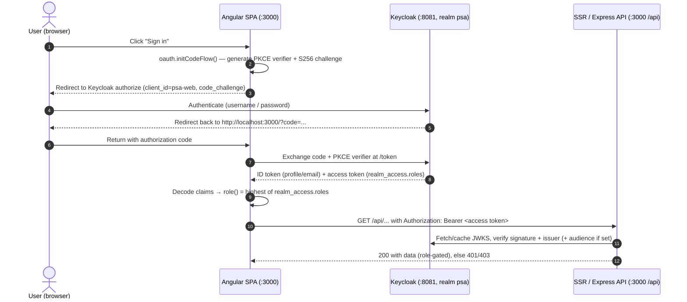

# Keycloak Setup — Operational SOP

> **Diátaxis mode: How-to / SOP.** This document is the step-by-step operational
> procedure for standing up and configuring **Keycloak** as the OpenID Connect
> identity provider for **Delivery Control** (the PSA platform). It is grounded
> in the repository's actual configuration — `docker-compose.yml`,
> `keycloak/realm-export.json`, `postgres/init/01-create-keycloak-db.sql`,
> `src/app/services/auth.service.ts`, and `src/server.ts`. Every realm, client,
> role, and user value quoted below is the value the code actually uses; nothing
> here is invented.
>
> For the mental model of *why* identity is layered the way it is, see
> [`../architecture/04-security-identity.md`](../architecture/04-security-identity.md).
> For deployment/runtime operations see
> [`../architecture/06-deployment-operations.md`](../architecture/06-deployment-operations.md).
> For the exhaustive role/route tables see
> [`../roles-and-permissions.md`](../roles-and-permissions.md).

---

## Purpose

Bring up a working Keycloak instance that:

- serves the realm **`psa`** (issuer `http://localhost:8081/realms/psa`),
- exposes the public, PKCE-protected SPA client **`psa-web`**,
- defines the 7 application realm roles,
- carries the demo users the app expects (`julie`, `john`, `alice`),

so that the Angular SPA (`http://localhost:3000`) can log a user in via
Authorization Code Flow + PKCE, and the SSR/Express API can verify the resulting
JWTs against Keycloak's JWKS.

## Scope

- **In scope:** local / developer "prod-parity" setup. Keycloak runs in **production
  mode** (`start`, not `start-dev`) backed by Postgres, but over **plain HTTP on
  `localhost`** for convenience. This is the topology that ships in
  `docker-compose.yml`.
- **Out of scope:** a hardened, internet-facing deployment. That requires TLS, a
  stable external hostname/issuer, a real admin password, and rotated demo
  credentials — see [Security notes](#security-notes) and
  [`../architecture/06-deployment-operations.md`](../architecture/06-deployment-operations.md).

---

## Responsible role

**Platform Administrator / Ops.** In Delivery Control's role model this maps to
the application's **`admin`** realm role (highest privilege). All realm/client/
role/user changes below are performed by this person. Application end users
(roles `delivery-executive`, `finance`, `pm`, etc.) never touch Keycloak admin —
they only log in at the app.

### RACI

| Activity | Platform Admin / Ops (`admin`) | App Developer | App End User | Security / Compliance |
|---|---|---|---|---|
| Bring up Postgres + Keycloak containers | **R/A** | C | — | I |
| Import / create the `psa` realm | **R/A** | C | — | I |
| Create/maintain `psa-web` client | **R/A** | C | — | I |
| Create/maintain realm roles | **R/A** | C | — | C |
| Onboard a new app user + assign role | **R/A** | I | I | I |
| Wire app env (`OIDC_ISSUER`, `ISSUER`, ...) | C | **R/A** | — | I |
| Rotate admin / demo passwords | **R/A** | I | — | **C/A** |
| Approve internet-facing (TLS, issuer) config | C | C | — | **R/A** |

R = Responsible, A = Accountable, C = Consulted, I = Informed.

---

## Prerequisites

1. **Docker running** (Docker Desktop or equivalent) with `docker compose`
   available.
2. **This repository** checked out; commands are run from the repo root
   (`docker-compose.yml`, `keycloak/realm-export.json`, and `postgres/init/`
   live there).
3. **Host ports free:**
   - **`8081`** — Keycloak (published host port). Inside the container Keycloak
     still listens on **`8080`** (`KC_HTTP_PORT=8080`); the host mapping is
     `8081:8080`.
   - **`5432`** — Postgres (`${POSTGRES_PORT:-5432}:5432`).
   - **`3000`** — the application (SPA + SSR API), the configured redirect/origin.
4. **openHAB note:** host port **`8080` is owned by the user's openHAB**, which is
   exactly why Keycloak is published on **`8081`** and never on `8080`. Do not
   "fix" the port back to 8080.
5. *(Optional)* a sibling `.env` file. `docker compose` auto-loads it; the
   `${VAR:-default}` fallbacks in `docker-compose.yml` keep `docker compose up`
   working even without one (all defaults are `admin`/`postgres`).

---

## Process A — Automated (recommended): realm pre-imported

This is the normal path. The `psa` realm is imported automatically from
`keycloak/realm-export.json` (mounted into `/opt/keycloak/data/import/`), and
Keycloak runs in production mode against Postgres.

| # | Step | Who | When | How | Output |
|---|---|---|---|---|---|
| A1 | Start the services | `admin` | First setup / after `down` | `docker compose up -d postgres keycloak` | Two containers: `prm-postgres`, `prm-keycloak` |
| A2 | Wait until healthy | `admin` | After A1 | Watch container state (below) | Postgres `healthy`, Keycloak started |
| A3 | Verify OIDC discovery | `admin` | After A2 | `curl` the well-known endpoint (below) | HTTP 200 + JSON with `issuer` = `http://localhost:8081/realms/psa` |
| A4 | Verify JWKS | `admin` | After A3 | `curl` the certs endpoint (below) | HTTP 200 + a `keys` array |
| A5 | Confirm realm + users in admin console | `admin` | After A4 | Log in to `http://localhost:8081` as `admin`/`admin`, open realm `psa` | Realm `psa`, client `psa-web`, 7 roles, users `julie`/`john`/`alice` present |
| A6 | Done | `admin` | — | Hand off issuer URL to the app | App can log in + verify tokens |

### A1 — Start the services

```bash
docker compose up -d postgres keycloak
```

What this does, per `docker-compose.yml`:

- **`postgres`** (`postgres:17`) bootstraps the app DB (`POSTGRES_DB`, default
  `project_resource_mgmt`) and runs `postgres/init/01-create-keycloak-db.sql`,
  which creates the **separate `keycloak` database** (only on a fresh volume).
- **`keycloak`** (`quay.io/keycloak/keycloak:26.1`) waits for Postgres to be
  `service_healthy`, pre-builds the optimized image with the Postgres provider
  (`kc.sh build --db=postgres`), then runs:

  ```
  start --import-realm --optimized
  ```

  `--import-realm` reads everything under `/opt/keycloak/data/import/` (the
  mounted `realm-export.json`) **only when the realm does not already exist**.

### A2 — Wait until healthy

```bash
docker compose ps
docker compose logs -f keycloak
```

Wait for `prm-postgres` to report `healthy` and for the Keycloak log to show it
has started and imported the realm. Keycloak is gated on Postgres health via
`depends_on: { postgres: { condition: service_healthy } }`, so it will not even
attempt to start until the DB accepts connections.

### A3 — Verify OIDC discovery

```bash
curl http://localhost:8081/realms/psa/.well-known/openid-configuration
```

Expected: **HTTP 200** and JSON whose `"issuer"` is exactly
`http://localhost:8081/realms/psa`. This issuer string is what both the SPA
(`src/app/services/auth.service.ts` → `ISSUER`) and the API
(`src/server.ts` → `OIDC_ISSUER`) expect by default. The issuer is emitted as
`http://localhost:8081/...` (not `:8080`) because `KC_HOSTNAME` is set to
`http://localhost:8081`.

### A4 — Verify JWKS

```bash
curl http://localhost:8081/realms/psa/protocol/openid-connect/certs
```

Expected: **HTTP 200** and a JSON object with a non-empty `"keys"` array. This is
the exact URL `src/server.ts` builds for `createRemoteJWKSet`
(`${OIDC_ISSUER}/protocol/openid-connect/certs`) to verify access-token
signatures.

### A5 — Confirm realm and users in the admin console

1. Open `http://localhost:8081`.
2. Sign in with the bootstrap admin **`admin` / `admin`**
   (`KC_BOOTSTRAP_ADMIN_USERNAME` / `KC_BOOTSTRAP_ADMIN_PASSWORD`).
3. Switch to the **`psa`** realm (top-left realm selector).
4. Confirm:
   - **Clients** → `psa-web` exists.
   - **Realm roles** → the 7 roles (see [role list](#the-7-realm-roles)).
   - **Users** → `julie`, `john`, `alice` exist with their role mappings.

> The bootstrap admin is **temporary** and scoped to the `master` realm only. It
> exists to get you in. See [Security notes](#security-notes).

---

## Process B — Manual setup from scratch

Use this only when you are **not** using the auto-import — e.g. building a fresh
realm by hand on an existing Keycloak, or learning what the import produces. Each
step gives both the **admin-console click-path** and the equivalent
**`kcadm.sh`** command. `kcadm.sh` runs inside the container:

```bash
# One-time per shell session: authenticate kcadm against the master realm.
docker compose exec keycloak /opt/keycloak/bin/kcadm.sh config credentials \
  --server http://localhost:8080 \
  --realm master --user admin --password admin
```

> Note: inside the container Keycloak listens on **`8080`**, so `kcadm.sh` targets
> `http://localhost:8080`. From your host browser you still use `:8081`.

### B1 — Create realm `psa`

**Console:** top-left realm dropdown → **Create realm** → Realm name `psa` →
toggle **Enabled** on → **Create**. Then under **Realm settings**:
`displayName` = `PSA (Professional Services Automation)`, **Login** tab:
*User registration* OFF (`registrationAllowed: false`), *Login with email* ON
(`loginWithEmailAllowed: true`), *Forgot password* ON
(`resetPasswordAllowed: true`), *Edit username* OFF, **Brute-force detection** ON
(`bruteForceProtected: true`). Token lifespans: access token `300` s,
SSO idle `1800` s, SSO max `36000` s.

```bash
docker compose exec keycloak /opt/keycloak/bin/kcadm.sh create realms \
  -s realm=psa \
  -s enabled=true \
  -s 'displayName=PSA (Professional Services Automation)' \
  -s sslRequired=external \
  -s registrationAllowed=false \
  -s loginWithEmailAllowed=true \
  -s duplicateEmailsAllowed=false \
  -s resetPasswordAllowed=true \
  -s editUsernameAllowed=false \
  -s bruteForceProtected=true \
  -s accessTokenLifespan=300 \
  -s ssoSessionIdleTimeout=1800 \
  -s ssoSessionMaxLifespan=36000
```

### B2 — Create the 7 realm roles

**Console:** realm `psa` → **Realm roles** → **Create role** (repeat for each).

#### The 7 realm roles

| Role | Description (from `realm-export.json`) |
|---|---|
| `employee` | Base role: any authenticated employee. |
| `pm` | Project manager. |
| `resource-manager` | Resource manager. |
| `delivery-executive` | Delivery executive (broad approval authority). |
| `finance` | Finance / financial approver. |
| `sales` | Sales / commercial. |
| `admin` | Administrator (highest privilege). |

```bash
for r in employee pm resource-manager delivery-executive finance sales admin; do
  docker compose exec keycloak /opt/keycloak/bin/kcadm.sh create roles \
    -r psa -s name="$r"
done
```

> The realm's default composite role (`default-roles-psa`) bundles the realm role
> `employee` plus the `account` client roles `view-profile` / `manage-account`,
> so every new user is at minimum an `employee`. With auto-import this default
> already exists; on a hand-built realm Keycloak creates `default-roles-<realm>`
> automatically — add `employee` to it (**Realm settings → User registration →
> Default roles**, or `add-roles` against the composite) to match the import.

### B3 — Create the public client `psa-web`

**Console:** realm `psa` → **Clients** → **Create client**.

- **General settings:** Client type **OpenID Connect**, Client ID **`psa-web`**,
  Name `PSA Web (Angular SPA)`.
- **Capability config:** **Client authentication OFF** (this makes it a *public*
  client — `publicClient: true`). **Standard flow ON**
  (`standardFlowEnabled: true`). **Direct access grants OFF**
  (`directAccessGrantsEnabled: false`). Implicit flow OFF. Service accounts OFF.
- **Login settings:**
  - Root URL **`http://localhost:3000`**
  - Home/Base URL **`http://localhost:3000`**
  - Valid redirect URIs **`http://localhost:3000/*`**
  - Valid post-logout redirect URIs **`http://localhost:3000/*`**
  - Web origins **`http://localhost:3000`** and **`+`** (the `+` tells Keycloak
    to allow CORS for all Valid Redirect URI origins).
- **Advanced → Proof Key for Code Exchange (PKCE):** Code challenge method
  **`S256`** (`pkce.code.challenge.method: S256`). Front-channel logout ON.

```bash
docker compose exec keycloak /opt/keycloak/bin/kcadm.sh create clients -r psa \
  -s clientId=psa-web \
  -s 'name=PSA Web (Angular SPA)' \
  -s enabled=true \
  -s publicClient=true \
  -s protocol=openid-connect \
  -s rootUrl=http://localhost:3000 \
  -s baseUrl=http://localhost:3000 \
  -s 'redirectUris=["http://localhost:3000/*"]' \
  -s 'webOrigins=["http://localhost:3000","+"]' \
  -s standardFlowEnabled=true \
  -s implicitFlowEnabled=false \
  -s directAccessGrantsEnabled=false \
  -s serviceAccountsEnabled=false \
  -s frontchannelLogout=true \
  -s fullScopeAllowed=true \
  -s 'attributes."pkce.code.challenge.method"=S256' \
  -s 'attributes."post.logout.redirect.uris"=http://localhost:3000/*'
```

### B4 — Ensure default client scopes

The client's **default** client scopes must include **`profile`**, **`email`**,
and **`roles`** (the import sets `defaultClientScopes`:
`["web-origins", "acr", "profile", "roles", "email"]`, with `offline_access` as
optional). This matters because of how the app reads claims
(`src/app/services/auth.service.ts`):

- the **`roles`** scope emits **`realm_access.roles`** into the **access token**,
  which the app collapses to the effective `role()` (highest-wins);
- **`profile`** / **`email`** populate **`preferred_username`** / `name` in the
  **ID token**, which the app uses for `userId()` and `displayName()`.

The SPA requests `scope: 'openid profile email'`; the `roles` scope is applied as
a client default scope, so realm roles ride along in the access token without the
SPA asking for them explicitly.

**Console:** Clients → `psa-web` → **Client scopes** tab → confirm `profile`,
`email`, `roles` are listed as **Default** (add via **Add client scope →
Default** if missing).

```bash
# Each of these is normally already a Default scope; add only if absent.
for s in profile email roles; do
  docker compose exec keycloak /opt/keycloak/bin/kcadm.sh update \
    clients/$(docker compose exec keycloak /opt/keycloak/bin/kcadm.sh get clients -r psa \
      -q clientId=psa-web --fields id --format csv --noquotes | tr -d '\r')/default-client-scopes/$s \
    -r psa 2>/dev/null || true
done
```

> If you must add the mapper by hand (only on a hand-built `roles` scope): make
> sure the **realm-roles** protocol mapper has **Add to access token = ON** so
> `realm_access.roles` reaches the access token — the API
> (`src/server.ts → verifyBearer`) reads roles from the **access** token.

### B5 — Create users (non-temporary passwords, email verified)

Create the three demo users. For each: **Console** → realm `psa` → **Users** →
**Create new user** → set username, **Email verified ON**, first/last name and
email → **Create**; then **Credentials** tab → **Set password** → set the
password, **Temporary OFF**.

#### Demo users (passwords are local-only)

| Username | Password | emailVerified | First / Last | Email | Realm role mapping |
|---|---|---|---|---|---|
| `julie` | `julie` | true | Julie / Delivery | julie@example.com | `default-roles-psa`, **`delivery-executive`** |
| `john` | `john` | true | John / Finance | john@example.com | `default-roles-psa`, **`finance`** |
| `alice` | `alice` | true | Alice / Manager | alice@example.com | `default-roles-psa`, **`pm`** |

> The password equals the username **only** for the local demo. Rotate these in
> any shared or networked environment.

```bash
# julie (delivery-executive)
docker compose exec keycloak /opt/keycloak/bin/kcadm.sh create users -r psa \
  -s username=julie -s enabled=true -s emailVerified=true \
  -s firstName=Julie -s lastName=Delivery -s email=julie@example.com
docker compose exec keycloak /opt/keycloak/bin/kcadm.sh set-password -r psa \
  --username julie --new-password julie   # non-temporary by default
```

Repeat for `john` (`finance`, `john@example.com`) and `alice` (`pm`,
`alice@example.com`).

### B6 — Assign realm roles

**Console:** Users → *user* → **Role mapping** → **Assign role** → filter by
realm roles → pick the role from the table above → **Assign**.

```bash
docker compose exec keycloak /opt/keycloak/bin/kcadm.sh add-roles -r psa \
  --uusername julie --rolename delivery-executive
docker compose exec keycloak /opt/keycloak/bin/kcadm.sh add-roles -r psa \
  --uusername john --rolename finance
docker compose exec keycloak /opt/keycloak/bin/kcadm.sh add-roles -r psa \
  --uusername alice --rolename pm
```

`default-roles-psa` (carrying `employee`) is assigned automatically on user
creation, so each user ends up with **both** `employee` (via the default) and
their specific role — exactly as the import declares. The app's highest-wins
logic then resolves the effective role (e.g. `delivery-executive` for julie).

---

## Process C — Onboard a new app user

Who = **`admin`**. To add a brand-new person to Delivery Control:

1. **Create the user** in realm `psa` (Console: Users → Create new user; set
   **Email verified ON**). Or:

   ```bash
   docker compose exec keycloak /opt/keycloak/bin/kcadm.sh create users -r psa \
     -s username=NEWUSER -s enabled=true -s emailVerified=true \
     -s firstName=First -s lastName=Last -s email=NEWUSER@example.com
   ```

2. **Set a non-temporary password** (Credentials → Set password, Temporary OFF):

   ```bash
   docker compose exec keycloak /opt/keycloak/bin/kcadm.sh set-password -r psa \
     --username NEWUSER --new-password 'CHANGE-ME'
   ```

3. **Assign the appropriate realm role** — one of `employee`, `pm`,
   `resource-manager`, `delivery-executive`, `finance`, `sales`, `admin`:

   ```bash
   docker compose exec keycloak /opt/keycloak/bin/kcadm.sh add-roles -r psa \
     --uusername NEWUSER --rolename pm
   ```

4. **Demo-data alignment (note).** The app maps a **username → resource id** for
   the seeded demo data, via `USERNAME_TO_RESOURCE_ID` in
   `src/app/services/auth.service.ts`:

   | Username | resourceId |
   |---|---|
   | `julie` | `1` |
   | `john` | `2` |
   | `alice` | `3` |

   A brand-new username is **not** in this map, so it falls through to
   `DEFAULT_RESOURCE_ID = '1'` — it will see resource `1`'s demo data until the
   mapping is extended. To give a new user their own demo identity, add an entry
   to `USERNAME_TO_RESOURCE_ID` (and seed a matching resource). This mapping is a
   demo-data convenience only; the user's **authorization** comes entirely from
   their realm role, not from this map.

5. **User logs in** at `http://localhost:3000` via the **Sign in** control; they
   are redirected to Keycloak (`:8081`), authenticate, and are returned to the app
   with a token carrying their `realm_access.roles`.

---

## Wire the app to Keycloak

The SPA is a **public PKCE client** — there is **no client secret** anywhere in
the app. The wiring is just URLs/ids:

### SPA (`src/app/services/auth.service.ts`)

```ts
const ISSUER = 'http://localhost:8081/realms/psa';
const CLIENT_ID = 'psa-web';
// init(): scope = 'openid profile email', responseType 'code' (Auth Code + PKCE)
```

These constants must match the realm issuer and client id created above. In
production these are overridden by the deployed realm URL.

### SSR / API server (`src/server.ts`)

Environment variables (with their in-code defaults):

| Env var | Default in code | Purpose |
|---|---|---|
| `OIDC_ISSUER` | `http://localhost:8081/realms/psa` | Issuer the API trusts; also the base for the JWKS URL `${OIDC_ISSUER}/protocol/openid-connect/certs`. Must equal the SPA `ISSUER` and the token `iss`. |
| `OIDC_AUDIENCE` | *(unset)* | Optional. When set, `jwtVerify` requires and checks the `aud` claim (blocks cross-client token replay). Unset = audience not checked (the local-dev default). |
| `AUTH_TRUST_HEADERS` | `false` | Must stay `false` in any networked env: only a **verified JWT** then grants a role; the spoofable `X-User-*` demo headers are ignored. |

The server verifies every `Authorization: Bearer <token>` against the realm JWKS
+ issuer; a valid token's `realm_access.roles` becomes the request's trusted
role, an invalid token is rejected with **401**, and (with `AUTH_TRUST_HEADERS`
off) a request with no token is treated as role `unknown` and denied privileged
mutations.

---

## Login sequence



---

## Verification checklist

- [ ] **Discovery 200:** `curl http://localhost:8081/realms/psa/.well-known/openid-configuration`
      returns 200 with `issuer = http://localhost:8081/realms/psa`.
- [ ] **JWKS 200:** `curl http://localhost:8081/realms/psa/protocol/openid-connect/certs`
      returns 200 with a non-empty `keys` array.
- [ ] **Login works:** at `http://localhost:3000`, **Sign in** as `julie` /
      `julie` succeeds and returns to the app authenticated.
- [ ] **Role badge:** the app shows julie's effective role as
      **`delivery-executive`** (highest of her realm roles).
- [ ] **Bearer on /api:** API requests carry `Authorization: Bearer <token>` and
      privileged calls succeed for julie's role and are 403/401 for an
      anonymous/under-privileged caller.

---

## Exceptions & troubleshooting

| Symptom | Likely cause | Resolution |
|---|---|---|
| `invalid_scope` at login | Client missing the `profile` / `email` (or `roles`) **default** client scopes | Add them as Default scopes on `psa-web` (Process B4). Without `roles`, `realm_access.roles` never reaches the access token and every user collapses to `employee`. |
| CORS error in browser console (origin blocked) | Web origins on `psa-web` don't cover `http://localhost:3000` | Set Web origins to `http://localhost:3000` and `+` (Process B3). |
| API returns 401 on valid-looking token / issuer mismatch | App issuer ≠ token `iss` (e.g. app points at `:8080` or a different host, or `OIDC_ISSUER` not set to the realm URL) | Make SPA `ISSUER`, server `OIDC_ISSUER`, and the realm issuer all exactly `http://localhost:8081/realms/psa`. The `iss` is governed by `KC_HOSTNAME`. |
| Roles missing from token (everyone is `employee`) | `roles` scope not default on the client, or the realm-roles mapper isn't adding to the **access** token | Ensure `roles` is a Default scope and its mapper has *Add to access token* ON (Process B4). |
| Keycloak unreachable on `:8080` | Wrong port — **openHAB owns host `8080`** | Use **`:8081`** from the host. Inside the container it's `8080`; the mapping is `8081:8080`. |
| Realm `psa` not present after `up` | `--import-realm` only imports when the realm is **absent**, and the import ran against a now-populated volume | Re-import by recreating the volume: `docker compose down -v` then `docker compose up -d postgres keycloak` (this wipes the `keycloak` DB and re-runs the Postgres init + realm import). |
| Can't log into admin console | Using the wrong admin or the bootstrap admin was disabled | Bootstrap admin is `admin` / `admin` (`KC_BOOTSTRAP_ADMIN_*`), **master-realm only and bootstrap-only**. Create a permanent admin and stop relying on it. |
| App "stays anonymous", no error | Keycloak down/misconfigured — the SPA swallows discovery/login failures by design (demo/loopback fallback) | Fix discovery/JWKS (Process A3–A4); the SPA never throws on bootstrap, so check the network tab, not for an app crash. |

---

## Security notes

- **Bootstrap admin is bootstrap-only.** `admin` / `admin`
  (`KC_BOOTSTRAP_ADMIN_USERNAME` / `KC_BOOTSTRAP_ADMIN_PASSWORD`) is a temporary
  master-realm admin. Change it (and create a real, named admin) before anyone
  else can reach the instance.
- **Rotate the demo passwords.** The demo users' passwords equal their usernames
  (`julie`/`julie`, etc.) — acceptable only on a developer's local machine.
- **`AUTH_TRUST_HEADERS=false`.** Keep it false so only a **server-verified JWT**
  grants a role; the spoofable `X-User-*` headers are a local-demo-only escape
  hatch and must never be trusted on a network.
- **Set `OIDC_AUDIENCE` for shared deployments** so the API rejects tokens minted
  for another client in the same realm (confused-deputy / cross-audience
  escalation).
- **Real deployment needs TLS + a stable external issuer.** The shipped config is
  HTTP-on-localhost (`KC_HTTP_ENABLED=true`, `sslRequired: external`). An
  internet-facing deployment requires HTTPS, a fixed external hostname/issuer
  (`KC_HOSTNAME`), and re-pointing both the SPA `ISSUER` and the server
  `OIDC_ISSUER` at it. See
  [`../architecture/06-deployment-operations.md`](../architecture/06-deployment-operations.md).

---

## Related

- [`../architecture/04-security-identity.md`](../architecture/04-security-identity.md) — the *why* of the identity/authorization model.
- [`../architecture/06-deployment-operations.md`](../architecture/06-deployment-operations.md) — runtime/deployment operations, env, and hardening.
- [`../roles-and-permissions.md`](../roles-and-permissions.md) — exhaustive role/route/endpoint tables.
