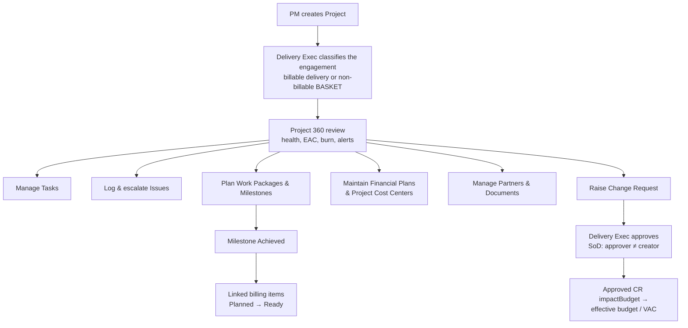
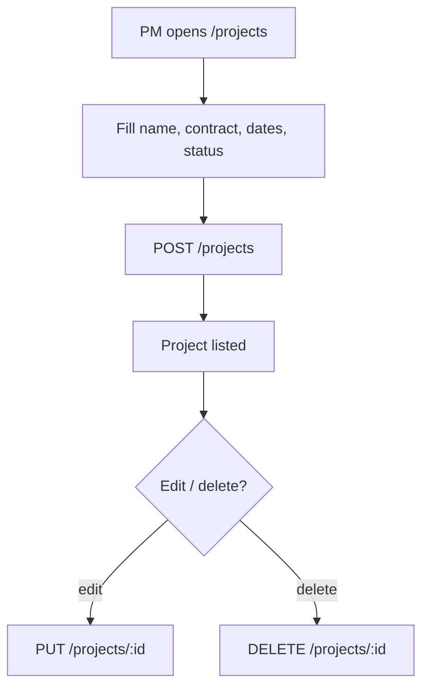
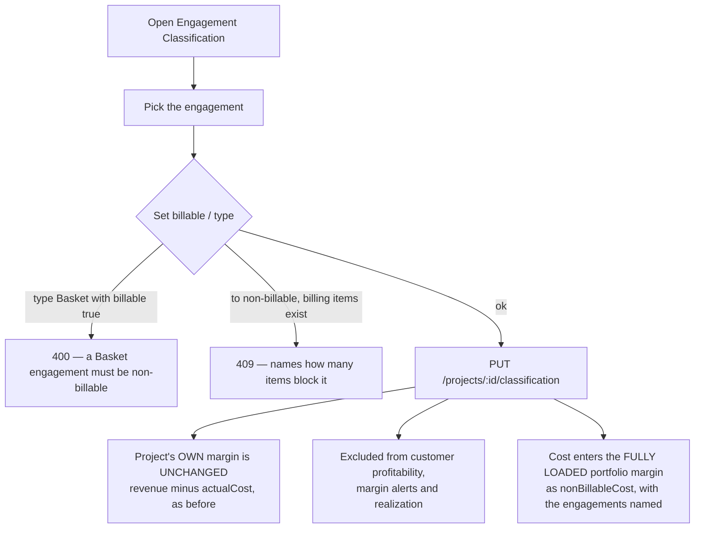
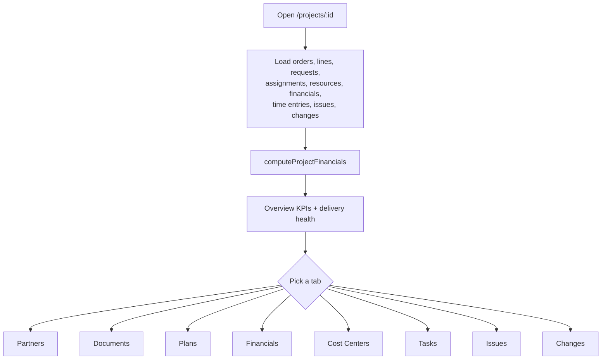
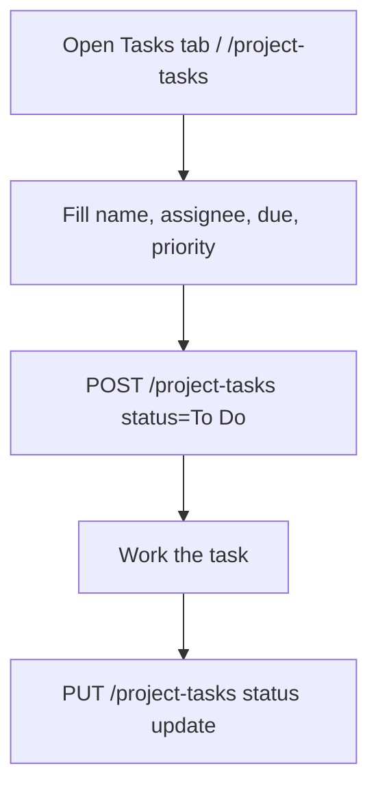
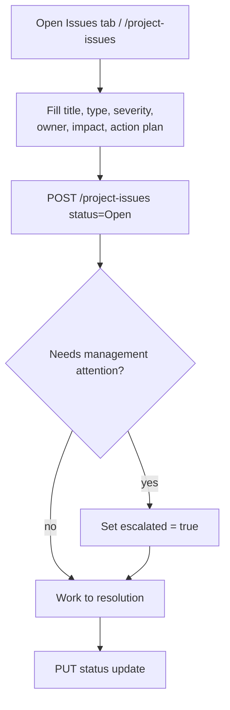
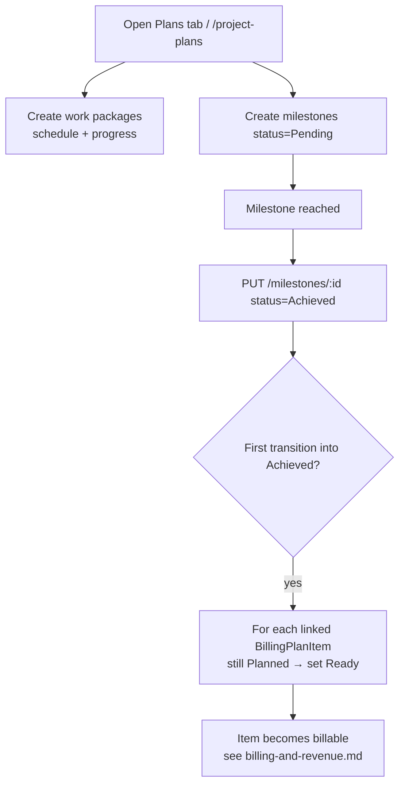
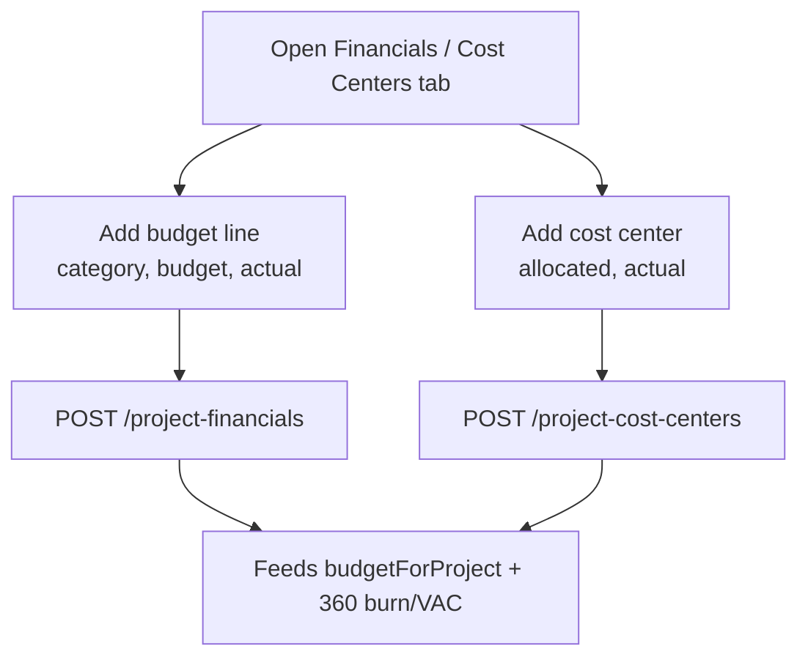
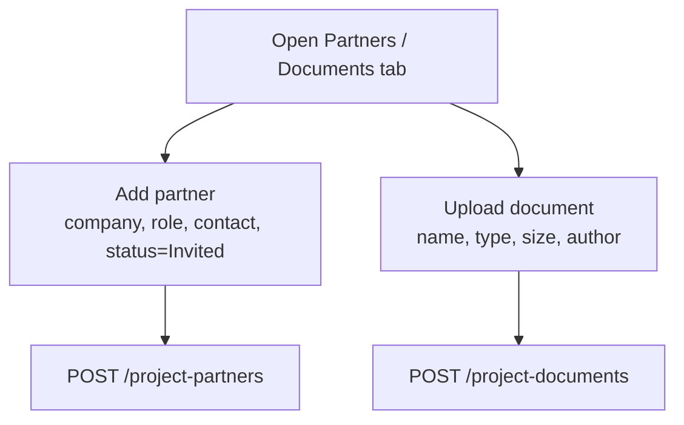
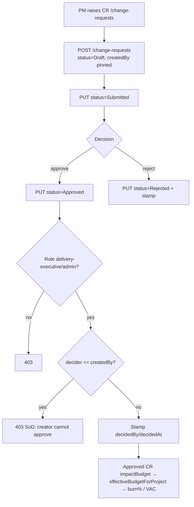

# Project Delivery — Standard Operating Procedures

> **Diátaxis mode: How-to.** This document holds the SOPs for delivering a
> project end to end: creating it, reviewing its 360° health, managing tasks,
> logging and escalating issues, planning work packages and milestones,
> maintaining financial plans and project cost centers, managing partners and
> documents, raising and deciding change requests under segregation of duties,
> and the milestone → billing "Ready" trigger. Each SOP follows the format in
> [`00-overview.md`](00-overview.md). Roles and the authorization model are in
> [`../roles-and-permissions.md`](../roles-and-permissions.md).

**Source of truth.** Grounded in the Angular components under
`src/app/projects/*` (`projects`, `project-details` (the 360), `project-partners`,
`project-documents`, `project-plans`, `financial-plans`, `project-cost-centers`,
`project-tasks`, `project-issues`, `change-requests`), the rollup module
`src/app/services/finance.util.ts`, and the server handlers + RBAC in
`src/server.ts`.

**Roles touching this domain (mutation RBAC, from `src/server.ts`):**

- `/projects`, `/project-partners`, `/project-documents`, `/work-packages`,
  `/milestones`, `/project-tasks`, `/project-issues`, `/change-requests` →
  `pm`, `delivery-executive`, `admin`
- `/project-financials`, `/project-cost-centers`, `/cost-centers` →
  `finance`, `delivery-executive`, `admin`
- Change-request **approval** is additionally SoD-gated: only
  `delivery-executive`/`admin` may approve, and the approver ≠ the CR's creator.
- `PUT /projects/:id/classification` → `delivery-executive`, `admin` only. **`pm`
  is deliberately excluded** even though they may edit everything else about the
  project: the classification decides whether the engagement's cost lands in
  delivery margin or in the non-billable bucket, and a PM is measured on that.

---

## Domain flow at a glance

---

## SOPs

### Create a Project

**Purpose.** Stand up a project record (name, customer/contract link, dates,
status) so demand, delivery artifacts, and financials can attach to it.

**Scope.**
- *In:* creating, editing, and deleting a project (`/projects`).
- *Out:* commercial setup (contracts/orders — see [commercial](commercial.md));
  staffing (see [resource management](resource-management.md)).

**RACI.**

| Step | Responsible | Accountable | Consulted | Informed |
|------|-------------|-------------|-----------|----------|
| Define project basics | pm | pm | delivery-executive, sales | — |
| Create the project | pm | pm | — | delivery-executive |
| Edit / delete | pm | pm | delivery-executive | — |

**Process flow.**

**Detailed steps.**

1. **Create the project.**
   - **Who:** `pm`. **When:** a new engagement is kicked off.
   - **How:** at `/projects` (`ProjectsComponent`) fill the form and save →
     `createProject(data)` → `POST /projects`.
   - **Output:** a project row (joined to contracts in the list view).
2. **Edit / delete.**
   - **Who:** `pm`. **How:** `updateProject(id, data)` → `PUT /projects/:id`;
     `deleteProject(id)` → `DELETE /projects/:id`.
   - **Output:** updated/removed project.

**Exceptions & edge cases.**

| Situation | System response |
|-----------|-----------------|
| Caller role outside `pm`/`delivery-executive`/`admin` | `403` on mutation. |
| Non-allow-listed field in body | Dropped by the allow-list pick. |
| Reads of `/projects` | Open to any caller (non-sensitive reference read). |

**Metrics.**

| Metric | Definition |
|--------|------------|
| Active projects | Projects in a non-closed status. |
| Projects without a contract link | Data-hygiene signal for revenue attribution. |

**Related.** [Project 360 review](#project-360-review), [commercial](commercial.md).

---

### Classify an engagement (billable delivery vs non-billable BASKET)

**Purpose.** State whether a project **earns customer revenue** or only
**consumes cost**. Delivery organisations run real work that no customer pays
for directly — AMS duty rosters, internal presidio, technical practice groups,
the platform team. RPT calls that container a **BASKET**. Until an
engagement is classified, its cost is indistinguishable from billable delivery,
and every margin, realization and customer-profitability figure in the portfolio
quietly absorbs it.

**Scope.**
- *In:* the two fields `billable` (boolean) and `type` (`Delivery` | `Basket` |
  `Internal` …), set through `PUT /projects/:id/classification` and the
  **Engagement Classification** screen.
- *Out:* everything else about the project (the Create/Edit SOPs), and any change
  to how a project's OWN margin is computed — see the invariant below.

**WHEN TO USE A BASKET — the decision, before the mechanics.**

Four containers can hold work, and picking the wrong one is not a labelling
mistake: each one sends the cost somewhere different. Ask the questions in this
order and stop at the first yes.

| Ask | If yes | Because |
|-----|--------|---------|
| 1. Is the person simply **not available** — leave, sickness, parental? | **Not a project at all.** Record an [absence](resource-management.md#record-an-absence-leave-sickness-parental). | An absence costs nothing and takes them off the bench. A basket would make them look *busy*, which is the opposite of the truth. |
| 2. Is there a **contract or an order** behind the work, now or expected? | A **billable Delivery** project. | Its revenue and its cost both belong to the customer's profitability. |
| 3. Is it a **project** — a start, an end, a deliverable — that simply has no external customer? | A **non-billable Delivery** project. | It is a real initiative to be tracked and finished. The platform team building this product is one; an internal migration is another. `billable: false`, `type: 'Delivery'`. |
| 4. Otherwise: is it **standing, recurring work with no end date**, that absorbs many people's residual time? | A **BASKET**. | This is what a basket is for. |

**A basket is a standing container, not a project.** The distinguishing marks,
all of which normally hold at once:

- **No deliverable and no end date.** It does not finish; it is turned off.
- **No customer, now or ever.** Not "unbilled yet" — unbillable by nature.
- **Many people, small slices.** It absorbs residual time across a practice
  rather than being staffed as a team.
- **The cost must stay visible**, attributed to a practice, and be excluded from
  any question about customer profitability.

Typical baskets: an **AMS duty roster**, **internal presidio**, a **technical or
practice community**, a **pre-sales pool**, **training and certification** time.

**What choosing wrong costs you.** This is the part worth reading twice, because
every one of these is silent — nothing errors, the numbers simply lie:

| Mistake | What breaks |
|---------|-------------|
| Real customer work marked **non-billable** | It leaves customer profitability entirely, so that customer's cost disappears from their margin while their revenue stays. The customer looks more profitable than they are, and the cost resurfaces as an unexplained lump in `nonBillableCost`. |
| Basket work left **billable** | Its cost sits inside delivery margin with no revenue against it, dragging down the margin of engagements that did nothing wrong — and it enters customer profitability under the synthetic "unknown" customer, which then reads as a customer permanently in the red. |
| A basket used where an **absence** belongs | The person is counted as working. Bench, availability and the Unchargeable report all overstate capacity, and their leave becomes invisible. |
| A one-off internal project modelled as a **basket** | It never closes, because a basket has no end. Its cost accumulates forever under a practice instead of against the initiative that incurred it. |

**A basket is still a real engagement.** It has an owner, it appears in the
project list, people are booked onto it and their hours are logged normally. The
only things it cannot do are carry a billing plan item and earn revenue.

**Two fields, and only one of them is authoritative.**

| Field | Role |
|-------|------|
| `billable` | The **single source of truth**. Every rollup asks this and only this. |
| `type` | A **label** for humans and reports. The arithmetic never reads it. |

Two fields that can contradict each other would force every consumer to pick one
to believe — and the one it picked would be invisible at the call site. So there
is one rule and one guard: **`type: 'Basket'` implies `billable: false`**
(rejected otherwise); the converse is free, because plenty of non-billable work
is not a basket.

**Why it is not an ordinary project field.** `billable` and `type` are **not in
`PROJECT_FIELDS`**. Sending them to `POST /projects` or `PUT /projects/:id`
returns **403 with the reason**, rather than silently dropping them — a silent
drop is how a classification change appears to succeed and does nothing.

**RACI.**

| Step | Responsible | Accountable | Consulted | Informed |
|------|-------------|-------------|-----------|----------|
| Propose a classification | pm | delivery-executive | — | — |
| Set / change it | delivery-executive | delivery-executive | finance | pm |
| Consume it in margin & profitability | — | finance | — | delivery-executive |

**Process flow.**

**Steps.**

1. **Open the screen.** `/project-classification` lists every engagement with its
   current classification.
2. **Set it.** `delivery-executive` or `admin` → `PUT /projects/:id/classification`.
3. **Read the consequences.** They are the point of the whole SOP:
   - The engagement's **own margin does not move**. It still reports
     `revenue − actualCost`, i.e. minus its real cost, because that cost is real
     and must stay visible on its own page.
   - It **leaves** customer profitability, the margin-compression alerts and the
     realization rollups. A non-billable engagement has no contract, so it used
     to land under the synthetic "unknown" customer and show up as a customer
     permanently in the red — a "customer" that was in fact our own AMS team.
   - Its cost **enters the fully-loaded portfolio margin** as `nonBillableCost`,
     and the tile names the engagements behind the figure. Without that, the drop
     in the headline number is unexplainable at the point of reading.
   - It can no longer carry **billing plan items** (`400` on create).
   - A **margin percentage** is no longer rendered for it anywhere — with no
     revenue there is nothing to be a percentage of. See
     [Reporting & analytics](reporting-analytics.md#a-margin--needs-revenue-to-be-a-percentage-of).

**Exceptions & edge cases.**

| Situation | System response |
|-----------|-----------------|
| `type: 'Basket'` with `billable: true` | `400` — `a Basket engagement must be non-billable (billable: false)`. |
| `billable: false` with `type: 'Delivery'` | **Allowed.** Internal delivery work that is not a basket is a real category. |
| Flipping a project to non-billable while it has billing plan items | `409` — `cannot classify this engagement as non-billable: N billing plan item(s) still reference it`. The count is in the message so the user knows the size of the cleanup. |
| Flipping to **billable** | Never blocked. Nothing about becoming chargeable is unsafe. |
| `billable`/`type` sent to `POST /projects` or `PUT /projects/:id` | `403` — `<field> is set by PUT /projects/:id/classification and cannot be sent here`. Not a silent drop. |
| `pm` calls the classification endpoint | `403`. The narrow rule is registered **before** the coarse `/projects` rule, and the order is load-bearing. |
| A project row that predates the columns, or a caller that sends no project data | Reads as **billable** (`?? true`). The safe direction: it keeps margin alerts on and hours counted as billable value, rather than silently switching either off for the whole portfolio the first time a field is forgotten. |

**Metrics.**

| Metric | Definition |
|--------|------------|
| Non-billable cost | Σ `actualCost` of engagements with `billable: false`, in base currency. |
| Fully-loaded portfolio margin | `revenue − deliveryCost − nonBillableCost`. The headline the CFO reads. |
| Basket share | Non-billable cost ÷ total delivery cost. How much of the organisation is not chargeable. |

**Related.** [Create a Project](#create-a-project),
[Billing & revenue](billing-and-revenue.md),
[Reporting & analytics](reporting-analytics.md#the-fully-loaded-portfolio-margin),
[Record an absence](resource-management.md#record-an-absence-leave-sickness-parental)
(the other half of "why is this person not chargeable").

---

### Project 360 review

**Purpose.** Give a PM / delivery executive a single financial-and-delivery
health view of a project — revenue, cost, margin, budget, burn, EAC, ETC, VAC —
plus the delivery sub-views (partners, documents, plans, financials, cost
centers, tasks, issues, changes) on one tabbed screen.

**Scope.**
- *In:* the read-and-act 360 at `/projects/:id` (`ProjectDetailsComponent`),
  driven by `computeProjectFinancials` (`finance.util`).
- *Out:* the underlying mutations live in the sub-resource SOPs below.

**The financial rollup (`src/app/services/finance.util.ts`).**

| KPI | Meaning |
|-----|---------|
| `revenue` | committed customer order-line revenue imputed to the project. |
| `invoiced` / `backlog` | revenue on Invoiced/Paid orders / not-yet-invoiced. |
| `laborCost` | actual approved-time labor when present, else planned-booking labor. |
| `externalCost` | purchase-order lines imputed to the project. |
| `actualCost` | `laborCost + externalCost`. |
| `budget` | **effective budget** = Σ financial-plan budget **+ Σ approved-CR `impactBudget`**. |
| `margin` / `marginPct` | `revenue − actualCost` / over revenue. |
| `burnPct` | `actualCost / effective budget`. |
| `etc` | estimate to complete = `max(0, plannedLabor − actualLabor)`. |
| `eac` | estimate at completion = `actualCost + etc` (CR-independent). |
| `varianceAtCompletion` (VAC) | `effective budget − eac`. |

The 360's delivery-health flag turns **amber** when burn > 85% or there are open
change requests, escalating with VAC/alerts.

**Baseline vs Planned card (block E).** A second card on the Overview tab,
below the revenue breakdown, compares the project's **frozen monthly PCP
baseline** against its **live planned cost**, month by month
(`costBaselineComparison`, fed by `plannedCostSchedule` — the monthly cost
side of the plan `computeProjectFinancials`'s whole-project `plannedLaborCost`
does not have). It is gated on `canReadStaffing()` — `pm`, `resource-manager`,
`finance`, `delivery-executive`, `admin` — **absent entirely**, not a zeroed
card, for `employee`/`sales`. **"Freeze baseline"** is visible only to
`finance`/`delivery-executive`/`admin`: whoever is measured on the variance
(the PM) must not be able to move the target that measures them. Freezing is
**pinned**: a baseline never moves on its own, not even when a Change Request
is approved — an approved CR instead widens the visible delta (the effective
Budget line above already reflects the CR; the frozen Baseline deliberately
does not), which is the early-warning signal this card exists to surface. A
re-freeze is always a fresh action (a new row, never an edit) — see
[architecture/03-backend-and-data.md](../architecture/03-backend-and-data.md)
for why, and [Review Margin & Variance drivers](reporting-analytics.md#review-margin--variance-drivers)
for the same comparison rolled up per-project and portfolio-wide in Reporting.

**RACI.**

| Step | Responsible | Accountable | Consulted | Informed |
|------|-------------|-------------|-----------|----------|
| Open the 360 | pm | pm | — | delivery-executive |
| Read financial health | pm / delivery-executive | delivery-executive | finance | — |
| Drill into a tab | pm / delivery-executive | pm | finance | — |
| Read Baseline vs Planned | pm / resource-manager / finance | delivery-executive | finance | — |
| Freeze / re-freeze baseline | finance | finance | delivery-executive | pm |

**Process flow.**

**Detailed steps.**

1. **Open the 360.**
   - **Who:** `pm` / `delivery-executive`. **When:** any project review.
   - **How:** navigate to `/projects/:id`; principal-gated collections (orders,
     order lines, resources, financials, time entries) load on `authReady`.
   - **Output:** the Overview tab with the financial KPIs and the delivery-health
     badge (On Track / Watch / Critical).
2. **Drill into a tab.**
   - **How:** switch among Overview, Partners, Documents, Plans, Financials, Cost
     Centers, Tasks, Issues, Changes.
   - **Output:** the corresponding sub-view (each backed by the SOPs below).

**Exceptions & edge cases.**

| Situation | System response |
|-----------|-----------------|
| No revenue | margin flags never fire; marginPct = 0. |
| No budget (no financial plan, no approved CR) | burn/EAC flags never fire — nothing to measure against. |
| Approved CR present | inflates `budget` (effective), changing burn% and VAC — EAC itself is unchanged; the frozen Baseline is unaffected (pinned by design). |
| Unauthenticated user | sensitive reads 401; load is gated on `authReady`. |
| `employee` / `sales` viewing the 360 | the Baseline vs Planned card is **absent**, not empty or zeroed. |
| Project has booked hours but was never frozen | the card still shows the month with a "not frozen" badge and a real planned figure — `outOfBaselineHorizon: true`, never hidden. |
| Baseline read fails / is still loading | "Couldn't load cost baseline" + Retry, or a loading skeleton — never a number. |

**Metrics.**

| Metric | Definition |
|--------|------------|
| Burn % | actualCost / effective budget. |
| VAC | effective budget − EAC (negative = projected overrun). |
| Margin % | margin / revenue. |
| Open changes | Count of CRs in Draft/Submitted. |
| Baseline / Delta / Delta % | frozen monthly PCP total / live-vs-frozen delta / delta as a % of baseline (null, rendered `—`, only when baseline = 0). |

**Related.** [Maintain Financial Plans & Project Cost Centers](#maintain-financial-plans--project-cost-centers),
[Raise & decide a Change Request](#raise--decide-a-change-request),
[Reporting & analytics](reporting-analytics.md).

---

### Manage Tasks

**Purpose.** Track the project's work items (internal or partner) with assignee,
due date, status, and priority.

**Scope.** *In:* create/edit task status (`/project-tasks`). *Out:* work packages
/ milestones (separate SOP).

**RACI.**

| Step | Responsible | Accountable | Consulted | Informed |
|------|-------------|-------------|-----------|----------|
| Create a task | pm | pm | partner (if external) | assignee |
| Advance status | pm | pm | — | assignee |

**Process flow.**

**Detailed steps.**

1. **Create a task.**
   - **Who:** `pm`. **How:** `/project-tasks` (`ProjectTasks`) form → `createProjectTask({ …, status: 'To Do', assigneeType, partnerId })` → `POST /project-tasks`.
   - **Output:** a tracked task.
2. **Advance status.**
   - **Who:** `pm`. **How:** `updateProjectTask(id, { status })` → `PUT /project-tasks/:id`.
   - **Output:** updated task status.

**Exceptions & edge cases.**

| Situation | System response |
|-----------|-----------------|
| External assignee without a partner link | Allowed; `partnerId` may be empty (data-hygiene signal). |
| Caller role outside `pm`/`delivery-executive`/`admin` | `403`. |

**Metrics.**

| Metric | Definition |
|--------|------------|
| Open tasks | Tasks not Done. |
| Overdue tasks | Open tasks past `dueDate`. |

**Related.** [Manage Work Packages / Plans](#manage-work-packages--plans),
[Log & escalate Issues](#log--escalate-issues).

---

### Log & escalate Issues

**Purpose.** Capture project issues (bug/risk/etc.) with severity, owner, impact,
and an action plan, and **escalate** the ones that need management attention.

**Scope.** *In:* create issue, update status, set the `escalated` flag
(`/project-issues`). *Out:* change requests (a CR is a scope/budget change, not an
issue).

**RACI.**

| Step | Responsible | Accountable | Consulted | Informed |
|------|-------------|-------------|-----------|----------|
| Log an issue | pm | pm | issue owner | — |
| Set action plan & owner | pm | issue owner | — | — |
| Escalate | pm | delivery-executive | — | delivery-executive |
| Resolve | pm | pm | — | reporter |

**Process flow.**

**Detailed steps.**

1. **Log the issue.**
   - **Who:** `pm`. **How:** `/project-issues` (`ProjectIssues`) form →
     `createProjectIssue({ …, status: 'Open', escalated })` → `POST /project-issues`.
   - **Output:** an open issue with severity and action plan.
2. **Escalate.**
   - **Who:** `pm`. **When:** the issue needs delivery-executive attention.
   - **How:** set the `escalated` flag (on create or via `PUT /project-issues/:id`).
   - **Output:** an escalated issue (badged in the list; contributes to delivery-health context).
3. **Resolve.**
   - **Who:** `pm`. **How:** `updateProjectIssue(id, { status })`.
   - **Output:** updated/closed issue.

**Exceptions & edge cases.**

| Situation | System response |
|-----------|-----------------|
| Critical severity but not escalated | Allowed; surfaced by severity badge — escalation is a deliberate flag. |
| Caller role outside `pm`/`delivery-executive`/`admin` | `403`. |

**Metrics.**

| Metric | Definition |
|--------|------------|
| Open issues | Issues not closed. |
| Escalation rate | % of issues flagged `escalated`. |
| Aged criticals | Critical issues open beyond SLA. |

**Related.** [Project 360 review](#project-360-review),
[Raise & decide a Change Request](#raise--decide-a-change-request).

---

### Manage Work Packages / Plans

**Purpose.** Plan delivery as work packages (schedule, progress, assignee) and
milestones, and — by **achieving** a milestone — trigger the downstream billing
"Ready" flip for its fixed-price billing item.

**Scope.**
- *In:* create/edit work packages (`/work-packages`); create milestones and mark
  them `Achieved` (`/milestones`).
- *Out:* the billing-item lifecycle itself (see [billing & revenue](billing-and-revenue.md)).

**RACI.**

| Step | Responsible | Accountable | Consulted | Informed |
|------|-------------|-------------|-----------|----------|
| Plan work packages | pm | pm | — | team |
| Create milestones | pm | pm | finance | — |
| Mark milestone Achieved | pm | delivery-executive | finance | finance |

**Process flow.**

**Detailed steps.**

1. **Plan work packages.**
   - **Who:** `pm`. **How:** `/project-plans` (`ProjectPlans`) →
     `createWorkPackage({ …, status: 'Planned' })` / `updateWorkPackage(id, …)`.
   - **Output:** scheduled work packages with progress.
2. **Create milestones.**
   - **Who:** `pm`. **How:** `createMilestone({ …, status: 'Pending' })` → `POST /milestones`.
   - **Output:** pending milestones.
3. **Mark a milestone Achieved (the billing trigger).**
   - **Who:** `pm` (accountable to `delivery-executive`). **When:** the milestone
     is delivered/accepted.
   - **How:** `updateMilestone(id, { status: 'Achieved' })` → `PUT /milestones/:id`.
   - **Output:** **on the first transition into `Achieved`**, the server flips
     **every linked `BillingPlanItem` still in `Planned` to `Ready`** (under
     `withLock('billing:<id>')`, re-checking `Planned` against fresh state). This
     is the milestone → billing "Ready" trigger — the item becomes billable. See
     [billing & revenue](billing-and-revenue.md).

**Exceptions & edge cases.**

| Situation | System response |
|-----------|-----------------|
| Milestone re-saved as `Achieved` again | No re-trigger — only the *first* `→ Achieved` transition fires the flip (idempotent). |
| Linked billing item already `Ready`/`Invoiced`/`Paid` | Left untouched — only `Planned` items are advanced. |
| Concurrent billing-item PUT during the flip | Serialized per item via `withLock`; neither write clobbers the other. |
| Caller role outside `pm`/`delivery-executive`/`admin` | `403`. |

**Metrics.**

| Metric | Definition |
|--------|------------|
| Milestone hit rate | Achieved on/before planned date. |
| Ready-after-achieve | Billing items flipped to Ready per achieved milestone. |

**Related.** [Billing & revenue](billing-and-revenue.md),
[Maintain Financial Plans & Project Cost Centers](#maintain-financial-plans--project-cost-centers).

---

### Maintain Financial Plans & Project Cost Centers

**Purpose.** Set the project's budget baseline (financial-plan items by category)
and the cost-center allocations/actuals that feed the 360 rollup.

**Scope.**
- *In:* create/edit/delete financial-plan items (`/project-financials`) and
  project cost centers (`/project-cost-centers`).
- *Out:* the EAC/burn math (read-only in the 360); approved CRs adjust the
  *effective* budget separately.

**RACI.**

| Step | Responsible | Accountable | Consulted | Informed |
|------|-------------|-------------|-----------|----------|
| Set budget lines | finance | finance | pm | delivery-executive |
| Maintain cost centers | finance | finance | pm | — |
| Record actuals | finance | finance | pm | delivery-executive |

**Process flow.**

**Detailed steps.**

1. **Maintain financial-plan items.**
   - **Who:** `finance` (route admits `finance`/`delivery-executive`/`admin`).
   - **How:** `/financial-plans` (`FinancialPlans`) → `createProjectFinancial({ projectId, category, budget, actual })`, `updateProjectFinancial(id, …)`, `deleteProjectFinancial(id)`.
   - **Output:** budget lines (Σ budget = `budgetForProject`); actuals feed expense cost.
2. **Maintain project cost centers.**
   - **Who:** `finance`. **How:** `/project-cost-centers` (`ProjectCostCenters`) →
     `createProjectCostCenter({ projectId, name, manager, allocated, actual })` / `updateProjectCostCenter(id, …)`.
   - **Output:** allocation/actual tracking per cost center.

**Exceptions & edge cases.**

| Situation | System response |
|-----------|-----------------|
| `budget`/`actual`/`allocated` negative or NaN | `400` — must be a non-negative number. |
| Caller role outside `finance`/`delivery-executive`/`admin` | `403` (financial collections are finance-grade). |
| Effective budget vs base budget | Base budget here + approved-CR `impactBudget` = effective budget in the 360. |

**Metrics.**

| Metric | Definition |
|--------|------------|
| Budget vs actual | Σ actual / Σ budget per project. |
| Cost-center overrun | actual > allocated per cost center. |

**Related.** [Project 360 review](#project-360-review),
[Raise & decide a Change Request](#raise--decide-a-change-request).

---

### Manage Project Partners & Documents

**Purpose.** Track delivery partners/subcontractors and their status, and store
project documents.

**Scope.** *In:* create/delete partners (`/project-partners`) and documents
(`/project-documents`). *Out:* purchase orders to partners (see [commercial](commercial.md)).

**RACI.**

| Step | Responsible | Accountable | Consulted | Informed |
|------|-------------|-------------|-----------|----------|
| Invite/track a partner | pm | pm | — | delivery-executive |
| Upload a document | pm | pm | — | team |

**Process flow.**

**Detailed steps.**

1. **Manage partners.**
   - **Who:** `pm`. **How:** `/project-partners` (`ProjectPartners`) →
     `createProjectPartner({ projectId, company, role, contact, status: 'Invited' })`; `deleteProjectPartner(id)`.
   - **Output:** the partner roster with status.
2. **Manage documents.**
   - **Who:** `pm`. **How:** `/project-documents` (`ProjectDocuments`) →
     `createProjectDocument(payload)`; `deleteProjectDocument(id)`.
   - **Output:** stored project documents.

**Exceptions & edge cases.**

| Situation | System response |
|-----------|-----------------|
| Delete a non-existent partner/document | `404`. |
| Caller role outside `pm`/`delivery-executive`/`admin` | `403`. |

**Metrics.**

| Metric | Definition |
|--------|------------|
| Active partners | Partners not in a terminal/declined status. |
| Document coverage | Projects with ≥1 document. |

**Related.** [Manage Tasks](#manage-tasks), [commercial](commercial.md).

---

### Raise & decide a Change Request

**Purpose.** Govern scope/budget/schedule change: a PM **raises** a CR; a delivery
executive **decides** it; an **approved** CR flows into the project's effective
budget (and therefore burn% / VAC), under segregation of duties.

**Scope.**
- *In:* create a CR (`POST /change-requests`); transition it (`PUT`); approve
  (`Approved`) or reject (`Rejected`); implement.
- *Out:* editing the underlying financial plan (separate SOP) — the CR's
  `impactBudget` is what adjusts the effective budget.

**The CR lifecycle.** `Draft → Submitted → Approved | Rejected → Implemented`.
`impactBudget`/`impactScheduleDays` may be **negative** (a CR can reduce
scope/budget) and are deliberately not validated as non-negative.

**Segregation of duties (`src/server.ts`).** On the transition **into `Approved`**:
1. only `delivery-executive` or `admin` may approve (else `403`);
2. the approver may be **neither the creator** — the SoD basis is the
   **server-pinned `createdBy`** (set once on POST from the verified actor, never
   in the client allow-list), falling back to the editable `requestedBy`/`owner`
   only for legacy rows that predate `createdBy`.
On reaching `Approved`/`Rejected`, the server stamps `decidedBy`/`decidedAt` from
the trusted actor (not client-settable).

**RACI.**

| Step | Responsible | Accountable | Consulted | Informed |
|------|-------------|-------------|-----------|----------|
| Raise the CR | pm | pm | finance | delivery-executive |
| Submit for decision | pm | pm | — | delivery-executive |
| Approve / reject (SoD) | delivery-executive | delivery-executive | finance | pm, finance |
| Implement | pm | delivery-executive | — | finance |

**Process flow.**

**Detailed steps.**

1. **Raise the CR.**
   - **Who:** `pm`. **When:** a scope/budget/schedule change is needed.
   - **How:** `/change-requests` (`ChangeRequests`) form → `createChangeRequest({ …, requestedBy: userId, status: 'Draft' })` → `POST /change-requests`. The server **pins `createdBy`** to the verified actor (immutable SoD basis).
   - **Output:** a Draft CR with `impactScope`, `impactBudget`, `impactScheduleDays`, `priority`.
2. **Submit.**
   - **Who:** `pm`. **How:** Submit action → `updateChangeRequest(id, { status: 'Submitted' })`.
   - **Output:** the CR awaits a decision.
3. **Approve / reject (SoD-gated).**
   - **Who:** `delivery-executive` (or `admin`) — **not the creator**.
   - **How:** Approve → `PUT status: 'Approved'` (client also sends `decidedBy/decidedAt`, which the server overrides with the trusted actor); Reject → `PUT status: 'Rejected'`.
   - **Output:** on **Approved**, the CR's `impactBudget` joins
     `effectiveBudgetForProject` (`finance.util`), changing the 360's `budget`,
     `burnPct`, and `varianceAtCompletion`. (EAC itself stays CR-independent;
     approved CRs move the *budget* the EAC is measured against.) See
     [billing & revenue](billing-and-revenue.md) and
     [reporting & analytics](reporting-analytics.md).
4. **Implement.**
   - **Who:** `pm`. **How:** `PUT status: 'Implemented'`.
   - **Output:** the change is delivered; its budget impact remains counted (Implemented is treated alongside Approved for budget rollups).

**Exceptions & edge cases.**

| Situation | System response |
|-----------|-----------------|
| Non-`delivery-executive`/`admin` approves | `403` — only delivery-executive/admin may approve a CR. |
| Creator approves their own CR | `403` — `Segregation of duties: the change request creator cannot approve their own change request`. |
| Client forges `createdBy` in body | Ignored — not in the allow-list; the pinned value stands. |
| Client forges `decidedBy`/`decidedAt` | Ignored — server stamps from the trusted actor. |
| Negative `impactBudget` | Allowed (scope/budget reduction). |
| Caller can't mutate `/change-requests` at all | `403` (route admits `pm`/`delivery-executive`/`admin`). |

**Metrics.**

| Metric | Definition |
|--------|------------|
| CR approval cycle time | Submitted → Approved/Rejected latency. |
| Approved budget impact | Σ `impactBudget` of approved/implemented CRs per project. |
| SoD blocks | Self-approval attempts denied. |

**Related.** [Project 360 review](#project-360-review),
[Maintain Financial Plans & Project Cost Centers](#maintain-financial-plans--project-cost-centers),
[Approvals & governance](approvals-governance.md).
