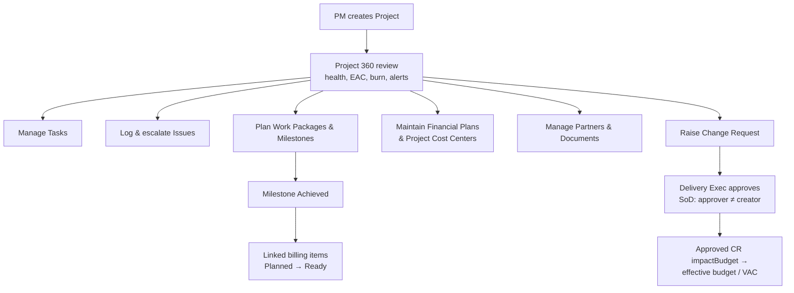
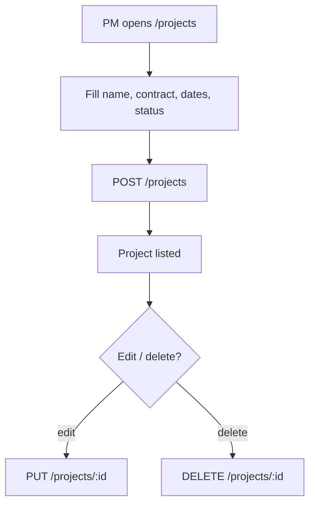
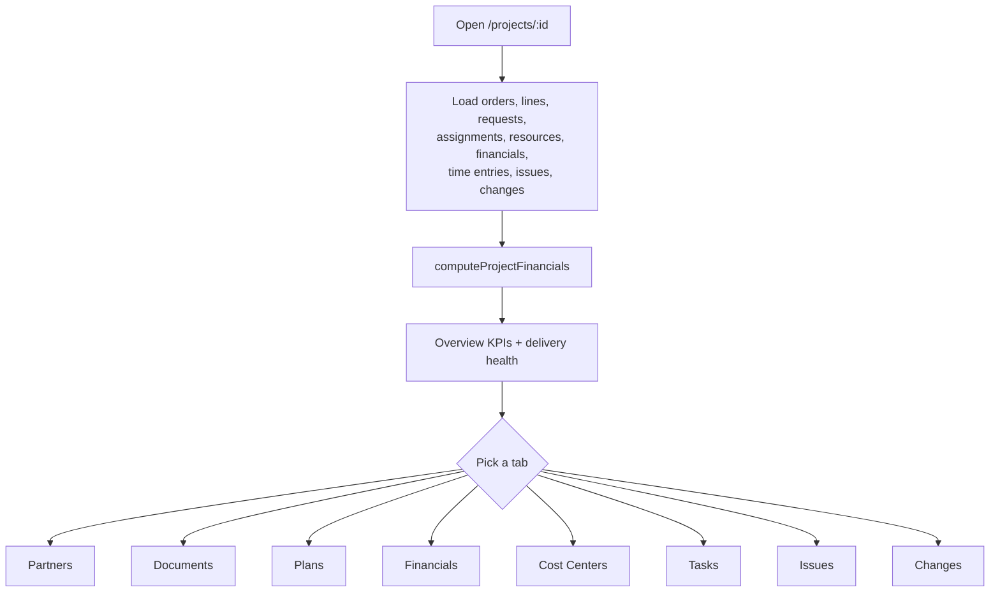
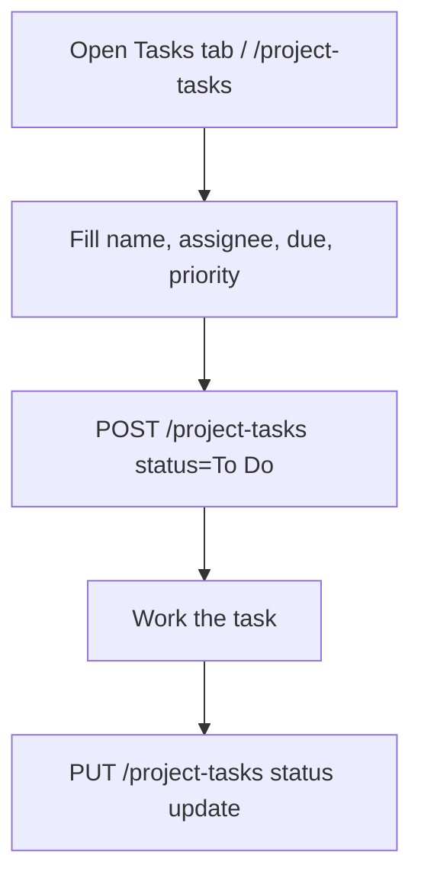
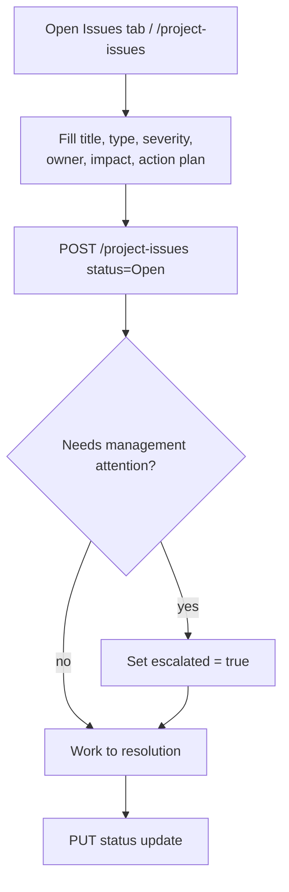
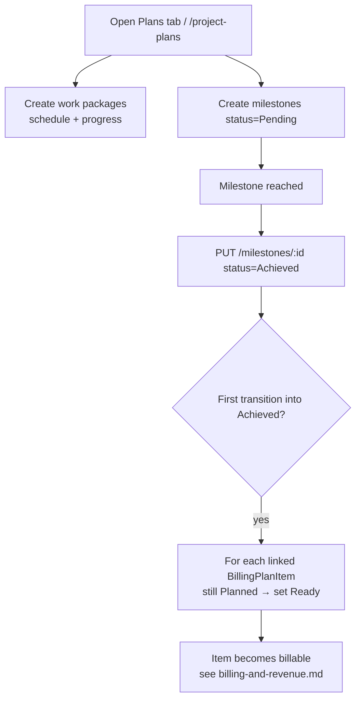
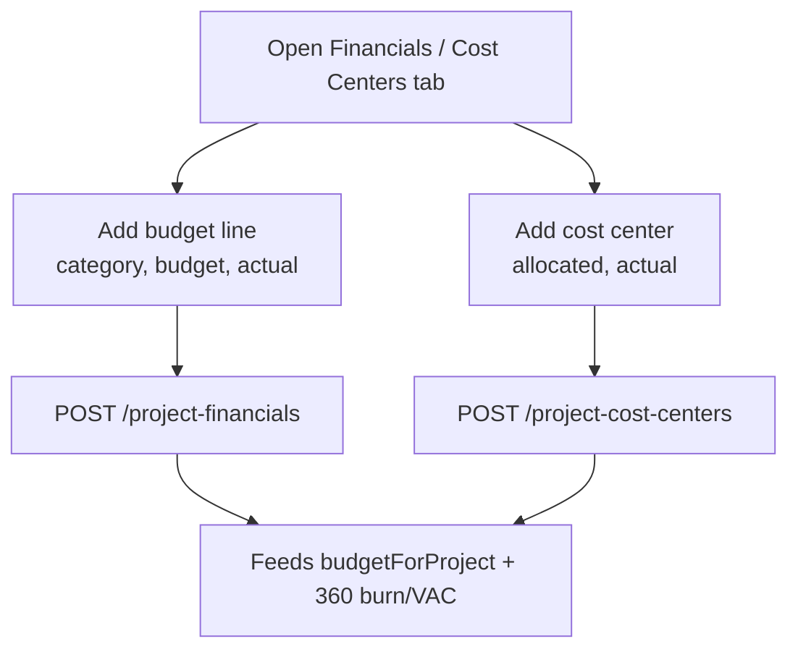
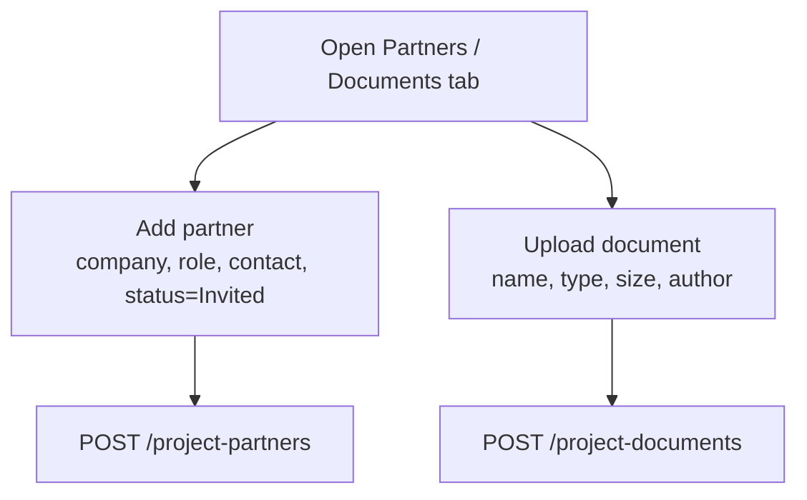
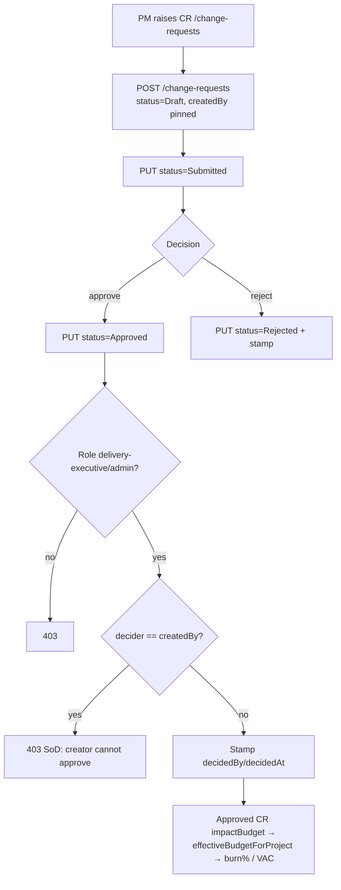

# Project Delivery — Standard Operating Procedures

> **Diátaxis mode: How-to.** This document holds the SOPs for delivering a
> project end to end: creating it, reviewing its 360° health, managing tasks,
> logging and escalating issues, planning work packages and milestones,
> maintaining financial plans and project cost centers, managing partners and
> documents, raising and deciding change requests under segregation of duties,
> and the milestone → billing "Ready" trigger. Each SOP follows the format in
> [`00-overview.md`](00-overview.md). Roles and the authorization model are in
> [`../roles-and-permissions.md`](../roles-and-permissions.md).

**Source of truth.** Grounded in the Angular components under
`src/app/projects/*` (`projects`, `project-details` (the 360), `project-partners`,
`project-documents`, `project-plans`, `financial-plans`, `project-cost-centers`,
`project-tasks`, `project-issues`, `change-requests`), the rollup module
`src/app/services/finance.util.ts`, and the server handlers + RBAC in
`src/server.ts`.

**Roles touching this domain (mutation RBAC, from `src/server.ts`):**

- `/projects`, `/project-partners`, `/project-documents`, `/work-packages`,
  `/milestones`, `/project-tasks`, `/project-issues`, `/change-requests` →
  `pm`, `delivery-executive`, `admin`
- `/project-financials`, `/project-cost-centers`, `/cost-centers` →
  `finance`, `delivery-executive`, `admin`
- Change-request **approval** is additionally SoD-gated: only
  `delivery-executive`/`admin` may approve, and the approver ≠ the CR's creator.

---

## Domain flow at a glance

---

## SOPs

### Create a Project

**Purpose.** Stand up a project record (name, customer/contract link, dates,
status) so demand, delivery artifacts, and financials can attach to it.

**Scope.**
- *In:* creating, editing, and deleting a project (`/projects`).
- *Out:* commercial setup (contracts/orders — see [commercial](commercial.md));
  staffing (see [resource management](resource-management.md)).

**RACI.**

| Step | Responsible | Accountable | Consulted | Informed |
|------|-------------|-------------|-----------|----------|
| Define project basics | pm | pm | delivery-executive, sales | — |
| Create the project | pm | pm | — | delivery-executive |
| Edit / delete | pm | pm | delivery-executive | — |

**Process flow.**

**Detailed steps.**

1. **Create the project.**
   - **Who:** `pm`. **When:** a new engagement is kicked off.
   - **How:** at `/projects` (`ProjectsComponent`) fill the form and save →
     `createProject(data)` → `POST /projects`.
   - **Output:** a project row (joined to contracts in the list view).
2. **Edit / delete.**
   - **Who:** `pm`. **How:** `updateProject(id, data)` → `PUT /projects/:id`;
     `deleteProject(id)` → `DELETE /projects/:id`.
   - **Output:** updated/removed project.

**Exceptions & edge cases.**

| Situation | System response |
|-----------|-----------------|
| Caller role outside `pm`/`delivery-executive`/`admin` | `403` on mutation. |
| Non-allow-listed field in body | Dropped by the allow-list pick. |
| Reads of `/projects` | Open to any caller (non-sensitive reference read). |

**Metrics.**

| Metric | Definition |
|--------|------------|
| Active projects | Projects in a non-closed status. |
| Projects without a contract link | Data-hygiene signal for revenue attribution. |

**Related.** [Project 360 review](#project-360-review), [commercial](commercial.md).

---

### Project 360 review

**Purpose.** Give a PM / delivery executive a single financial-and-delivery
health view of a project — revenue, cost, margin, budget, burn, EAC, ETC, VAC —
plus the delivery sub-views (partners, documents, plans, financials, cost
centers, tasks, issues, changes) on one tabbed screen.

**Scope.**
- *In:* the read-and-act 360 at `/projects/:id` (`ProjectDetailsComponent`),
  driven by `computeProjectFinancials` (`finance.util`).
- *Out:* the underlying mutations live in the sub-resource SOPs below.

**The financial rollup (`src/app/services/finance.util.ts`).**

| KPI | Meaning |
|-----|---------|
| `revenue` | committed customer order-line revenue imputed to the project. |
| `invoiced` / `backlog` | revenue on Invoiced/Paid orders / not-yet-invoiced. |
| `laborCost` | actual approved-time labor when present, else planned-booking labor. |
| `externalCost` | purchase-order lines imputed to the project. |
| `actualCost` | `laborCost + externalCost`. |
| `budget` | **effective budget** = Σ financial-plan budget **+ Σ approved-CR `impactBudget`**. |
| `margin` / `marginPct` | `revenue − actualCost` / over revenue. |
| `burnPct` | `actualCost / effective budget`. |
| `etc` | estimate to complete = `max(0, plannedLabor − actualLabor)`. |
| `eac` | estimate at completion = `actualCost + etc` (CR-independent). |
| `varianceAtCompletion` (VAC) | `effective budget − eac`. |

The 360's delivery-health flag turns **amber** when burn > 85% or there are open
change requests, escalating with VAC/alerts.

**RACI.**

| Step | Responsible | Accountable | Consulted | Informed |
|------|-------------|-------------|-----------|----------|
| Open the 360 | pm | pm | — | delivery-executive |
| Read financial health | pm / delivery-executive | delivery-executive | finance | — |
| Drill into a tab | pm / delivery-executive | pm | finance | — |

**Process flow.**

**Detailed steps.**

1. **Open the 360.**
   - **Who:** `pm` / `delivery-executive`. **When:** any project review.
   - **How:** navigate to `/projects/:id`; principal-gated collections (orders,
     order lines, resources, financials, time entries) load on `authReady`.
   - **Output:** the Overview tab with the financial KPIs and the delivery-health
     badge (On Track / Watch / Critical).
2. **Drill into a tab.**
   - **How:** switch among Overview, Partners, Documents, Plans, Financials, Cost
     Centers, Tasks, Issues, Changes.
   - **Output:** the corresponding sub-view (each backed by the SOPs below).

**Exceptions & edge cases.**

| Situation | System response |
|-----------|-----------------|
| No revenue | margin flags never fire; marginPct = 0. |
| No budget (no financial plan, no approved CR) | burn/EAC flags never fire — nothing to measure against. |
| Approved CR present | inflates `budget` (effective), changing burn% and VAC — EAC itself is unchanged. |
| Unauthenticated user | sensitive reads 401; load is gated on `authReady`. |

**Metrics.**

| Metric | Definition |
|--------|------------|
| Burn % | actualCost / effective budget. |
| VAC | effective budget − EAC (negative = projected overrun). |
| Margin % | margin / revenue. |
| Open changes | Count of CRs in Draft/Submitted. |

**Related.** [Maintain Financial Plans & Project Cost Centers](#maintain-financial-plans--project-cost-centers),
[Raise & decide a Change Request](#raise--decide-a-change-request),
[Reporting & analytics](reporting-analytics.md).

---

### Manage Tasks

**Purpose.** Track the project's work items (internal or partner) with assignee,
due date, status, and priority.

**Scope.** *In:* create/edit task status (`/project-tasks`). *Out:* work packages
/ milestones (separate SOP).

**RACI.**

| Step | Responsible | Accountable | Consulted | Informed |
|------|-------------|-------------|-----------|----------|
| Create a task | pm | pm | partner (if external) | assignee |
| Advance status | pm | pm | — | assignee |

**Process flow.**

**Detailed steps.**

1. **Create a task.**
   - **Who:** `pm`. **How:** `/project-tasks` (`ProjectTasks`) form → `createProjectTask({ …, status: 'To Do', assigneeType, partnerId })` → `POST /project-tasks`.
   - **Output:** a tracked task.
2. **Advance status.**
   - **Who:** `pm`. **How:** `updateProjectTask(id, { status })` → `PUT /project-tasks/:id`.
   - **Output:** updated task status.

**Exceptions & edge cases.**

| Situation | System response |
|-----------|-----------------|
| External assignee without a partner link | Allowed; `partnerId` may be empty (data-hygiene signal). |
| Caller role outside `pm`/`delivery-executive`/`admin` | `403`. |

**Metrics.**

| Metric | Definition |
|--------|------------|
| Open tasks | Tasks not Done. |
| Overdue tasks | Open tasks past `dueDate`. |

**Related.** [Manage Work Packages / Plans](#manage-work-packages--plans),
[Log & escalate Issues](#log--escalate-issues).

---

### Log & escalate Issues

**Purpose.** Capture project issues (bug/risk/etc.) with severity, owner, impact,
and an action plan, and **escalate** the ones that need management attention.

**Scope.** *In:* create issue, update status, set the `escalated` flag
(`/project-issues`). *Out:* change requests (a CR is a scope/budget change, not an
issue).

**RACI.**

| Step | Responsible | Accountable | Consulted | Informed |
|------|-------------|-------------|-----------|----------|
| Log an issue | pm | pm | issue owner | — |
| Set action plan & owner | pm | issue owner | — | — |
| Escalate | pm | delivery-executive | — | delivery-executive |
| Resolve | pm | pm | — | reporter |

**Process flow.**

**Detailed steps.**

1. **Log the issue.**
   - **Who:** `pm`. **How:** `/project-issues` (`ProjectIssues`) form →
     `createProjectIssue({ …, status: 'Open', escalated })` → `POST /project-issues`.
   - **Output:** an open issue with severity and action plan.
2. **Escalate.**
   - **Who:** `pm`. **When:** the issue needs delivery-executive attention.
   - **How:** set the `escalated` flag (on create or via `PUT /project-issues/:id`).
   - **Output:** an escalated issue (badged in the list; contributes to delivery-health context).
3. **Resolve.**
   - **Who:** `pm`. **How:** `updateProjectIssue(id, { status })`.
   - **Output:** updated/closed issue.

**Exceptions & edge cases.**

| Situation | System response |
|-----------|-----------------|
| Critical severity but not escalated | Allowed; surfaced by severity badge — escalation is a deliberate flag. |
| Caller role outside `pm`/`delivery-executive`/`admin` | `403`. |

**Metrics.**

| Metric | Definition |
|--------|------------|
| Open issues | Issues not closed. |
| Escalation rate | % of issues flagged `escalated`. |
| Aged criticals | Critical issues open beyond SLA. |

**Related.** [Project 360 review](#project-360-review),
[Raise & decide a Change Request](#raise--decide-a-change-request).

---

### Manage Work Packages / Plans

**Purpose.** Plan delivery as work packages (schedule, progress, assignee) and
milestones, and — by **achieving** a milestone — trigger the downstream billing
"Ready" flip for its fixed-price billing item.

**Scope.**
- *In:* create/edit work packages (`/work-packages`); create milestones and mark
  them `Achieved` (`/milestones`).
- *Out:* the billing-item lifecycle itself (see [billing & revenue](billing-and-revenue.md)).

**RACI.**

| Step | Responsible | Accountable | Consulted | Informed |
|------|-------------|-------------|-----------|----------|
| Plan work packages | pm | pm | — | team |
| Create milestones | pm | pm | finance | — |
| Mark milestone Achieved | pm | delivery-executive | finance | finance |

**Process flow.**

**Detailed steps.**

1. **Plan work packages.**
   - **Who:** `pm`. **How:** `/project-plans` (`ProjectPlans`) →
     `createWorkPackage({ …, status: 'Planned' })` / `updateWorkPackage(id, …)`.
   - **Output:** scheduled work packages with progress.
2. **Create milestones.**
   - **Who:** `pm`. **How:** `createMilestone({ …, status: 'Pending' })` → `POST /milestones`.
   - **Output:** pending milestones.
3. **Mark a milestone Achieved (the billing trigger).**
   - **Who:** `pm` (accountable to `delivery-executive`). **When:** the milestone
     is delivered/accepted.
   - **How:** `updateMilestone(id, { status: 'Achieved' })` → `PUT /milestones/:id`.
   - **Output:** **on the first transition into `Achieved`**, the server flips
     **every linked `BillingPlanItem` still in `Planned` to `Ready`** (under
     `withLock('billing:<id>')`, re-checking `Planned` against fresh state). This
     is the milestone → billing "Ready" trigger — the item becomes billable. See
     [billing & revenue](billing-and-revenue.md).

**Exceptions & edge cases.**

| Situation | System response |
|-----------|-----------------|
| Milestone re-saved as `Achieved` again | No re-trigger — only the *first* `→ Achieved` transition fires the flip (idempotent). |
| Linked billing item already `Ready`/`Invoiced`/`Paid` | Left untouched — only `Planned` items are advanced. |
| Concurrent billing-item PUT during the flip | Serialized per item via `withLock`; neither write clobbers the other. |
| Caller role outside `pm`/`delivery-executive`/`admin` | `403`. |

**Metrics.**

| Metric | Definition |
|--------|------------|
| Milestone hit rate | Achieved on/before planned date. |
| Ready-after-achieve | Billing items flipped to Ready per achieved milestone. |

**Related.** [Billing & revenue](billing-and-revenue.md),
[Maintain Financial Plans & Project Cost Centers](#maintain-financial-plans--project-cost-centers).

---

### Maintain Financial Plans & Project Cost Centers

**Purpose.** Set the project's budget baseline (financial-plan items by category)
and the cost-center allocations/actuals that feed the 360 rollup.

**Scope.**
- *In:* create/edit/delete financial-plan items (`/project-financials`) and
  project cost centers (`/project-cost-centers`).
- *Out:* the EAC/burn math (read-only in the 360); approved CRs adjust the
  *effective* budget separately.

**RACI.**

| Step | Responsible | Accountable | Consulted | Informed |
|------|-------------|-------------|-----------|----------|
| Set budget lines | finance | finance | pm | delivery-executive |
| Maintain cost centers | finance | finance | pm | — |
| Record actuals | finance | finance | pm | delivery-executive |

**Process flow.**

**Detailed steps.**

1. **Maintain financial-plan items.**
   - **Who:** `finance` (route admits `finance`/`delivery-executive`/`admin`).
   - **How:** `/financial-plans` (`FinancialPlans`) → `createProjectFinancial({ projectId, category, budget, actual })`, `updateProjectFinancial(id, …)`, `deleteProjectFinancial(id)`.
   - **Output:** budget lines (Σ budget = `budgetForProject`); actuals feed expense cost.
2. **Maintain project cost centers.**
   - **Who:** `finance`. **How:** `/project-cost-centers` (`ProjectCostCenters`) →
     `createProjectCostCenter({ projectId, name, manager, allocated, actual })` / `updateProjectCostCenter(id, …)`.
   - **Output:** allocation/actual tracking per cost center.

**Exceptions & edge cases.**

| Situation | System response |
|-----------|-----------------|
| `budget`/`actual`/`allocated` negative or NaN | `400` — must be a non-negative number. |
| Caller role outside `finance`/`delivery-executive`/`admin` | `403` (financial collections are finance-grade). |
| Effective budget vs base budget | Base budget here + approved-CR `impactBudget` = effective budget in the 360. |

**Metrics.**

| Metric | Definition |
|--------|------------|
| Budget vs actual | Σ actual / Σ budget per project. |
| Cost-center overrun | actual > allocated per cost center. |

**Related.** [Project 360 review](#project-360-review),
[Raise & decide a Change Request](#raise--decide-a-change-request).

---

### Manage Project Partners & Documents

**Purpose.** Track delivery partners/subcontractors and their status, and store
project documents.

**Scope.** *In:* create/delete partners (`/project-partners`) and documents
(`/project-documents`). *Out:* purchase orders to partners (see [commercial](commercial.md)).

**RACI.**

| Step | Responsible | Accountable | Consulted | Informed |
|------|-------------|-------------|-----------|----------|
| Invite/track a partner | pm | pm | — | delivery-executive |
| Upload a document | pm | pm | — | team |

**Process flow.**

**Detailed steps.**

1. **Manage partners.**
   - **Who:** `pm`. **How:** `/project-partners` (`ProjectPartners`) →
     `createProjectPartner({ projectId, company, role, contact, status: 'Invited' })`; `deleteProjectPartner(id)`.
   - **Output:** the partner roster with status.
2. **Manage documents.**
   - **Who:** `pm`. **How:** `/project-documents` (`ProjectDocuments`) →
     `createProjectDocument(payload)`; `deleteProjectDocument(id)`.
   - **Output:** stored project documents.

**Exceptions & edge cases.**

| Situation | System response |
|-----------|-----------------|
| Delete a non-existent partner/document | `404`. |
| Caller role outside `pm`/`delivery-executive`/`admin` | `403`. |

**Metrics.**

| Metric | Definition |
|--------|------------|
| Active partners | Partners not in a terminal/declined status. |
| Document coverage | Projects with ≥1 document. |

**Related.** [Manage Tasks](#manage-tasks), [commercial](commercial.md).

---

### Raise & decide a Change Request

**Purpose.** Govern scope/budget/schedule change: a PM **raises** a CR; a delivery
executive **decides** it; an **approved** CR flows into the project's effective
budget (and therefore burn% / VAC), under segregation of duties.

**Scope.**
- *In:* create a CR (`POST /change-requests`); transition it (`PUT`); approve
  (`Approved`) or reject (`Rejected`); implement.
- *Out:* editing the underlying financial plan (separate SOP) — the CR's
  `impactBudget` is what adjusts the effective budget.

**The CR lifecycle.** `Draft → Submitted → Approved | Rejected → Implemented`.
`impactBudget`/`impactScheduleDays` may be **negative** (a CR can reduce
scope/budget) and are deliberately not validated as non-negative.

**Segregation of duties (`src/server.ts`).** On the transition **into `Approved`**:
1. only `delivery-executive` or `admin` may approve (else `403`);
2. the approver may be **neither the creator** — the SoD basis is the
   **server-pinned `createdBy`** (set once on POST from the verified actor, never
   in the client allow-list), falling back to the editable `requestedBy`/`owner`
   only for legacy rows that predate `createdBy`.
On reaching `Approved`/`Rejected`, the server stamps `decidedBy`/`decidedAt` from
the trusted actor (not client-settable).

**RACI.**

| Step | Responsible | Accountable | Consulted | Informed |
|------|-------------|-------------|-----------|----------|
| Raise the CR | pm | pm | finance | delivery-executive |
| Submit for decision | pm | pm | — | delivery-executive |
| Approve / reject (SoD) | delivery-executive | delivery-executive | finance | pm, finance |
| Implement | pm | delivery-executive | — | finance |

**Process flow.**

**Detailed steps.**

1. **Raise the CR.**
   - **Who:** `pm`. **When:** a scope/budget/schedule change is needed.
   - **How:** `/change-requests` (`ChangeRequests`) form → `createChangeRequest({ …, requestedBy: userId, status: 'Draft' })` → `POST /change-requests`. The server **pins `createdBy`** to the verified actor (immutable SoD basis).
   - **Output:** a Draft CR with `impactScope`, `impactBudget`, `impactScheduleDays`, `priority`.
2. **Submit.**
   - **Who:** `pm`. **How:** Submit action → `updateChangeRequest(id, { status: 'Submitted' })`.
   - **Output:** the CR awaits a decision.
3. **Approve / reject (SoD-gated).**
   - **Who:** `delivery-executive` (or `admin`) — **not the creator**.
   - **How:** Approve → `PUT status: 'Approved'` (client also sends `decidedBy/decidedAt`, which the server overrides with the trusted actor); Reject → `PUT status: 'Rejected'`.
   - **Output:** on **Approved**, the CR's `impactBudget` joins
     `effectiveBudgetForProject` (`finance.util`), changing the 360's `budget`,
     `burnPct`, and `varianceAtCompletion`. (EAC itself stays CR-independent;
     approved CRs move the *budget* the EAC is measured against.) See
     [billing & revenue](billing-and-revenue.md) and
     [reporting & analytics](reporting-analytics.md).
4. **Implement.**
   - **Who:** `pm`. **How:** `PUT status: 'Implemented'`.
   - **Output:** the change is delivered; its budget impact remains counted (Implemented is treated alongside Approved for budget rollups).

**Exceptions & edge cases.**

| Situation | System response |
|-----------|-----------------|
| Non-`delivery-executive`/`admin` approves | `403` — only delivery-executive/admin may approve a CR. |
| Creator approves their own CR | `403` — `Segregation of duties: the change request creator cannot approve their own change request`. |
| Client forges `createdBy` in body | Ignored — not in the allow-list; the pinned value stands. |
| Client forges `decidedBy`/`decidedAt` | Ignored — server stamps from the trusted actor. |
| Negative `impactBudget` | Allowed (scope/budget reduction). |
| Caller can't mutate `/change-requests` at all | `403` (route admits `pm`/`delivery-executive`/`admin`). |

**Metrics.**

| Metric | Definition |
|--------|------------|
| CR approval cycle time | Submitted → Approved/Rejected latency. |
| Approved budget impact | Σ `impactBudget` of approved/implemented CRs per project. |
| SoD blocks | Self-approval attempts denied. |

**Related.** [Project 360 review](#project-360-review),
[Maintain Financial Plans & Project Cost Centers](#maintain-financial-plans--project-cost-centers),
[Approvals & governance](approvals-governance.md).
