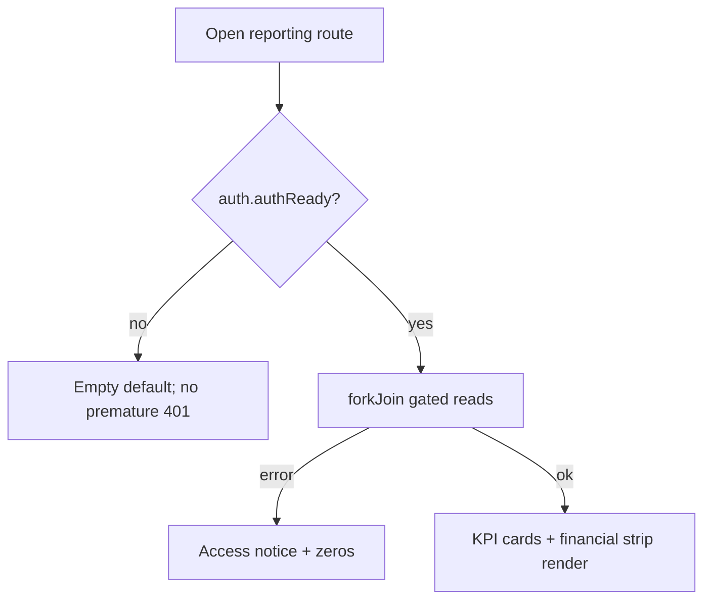
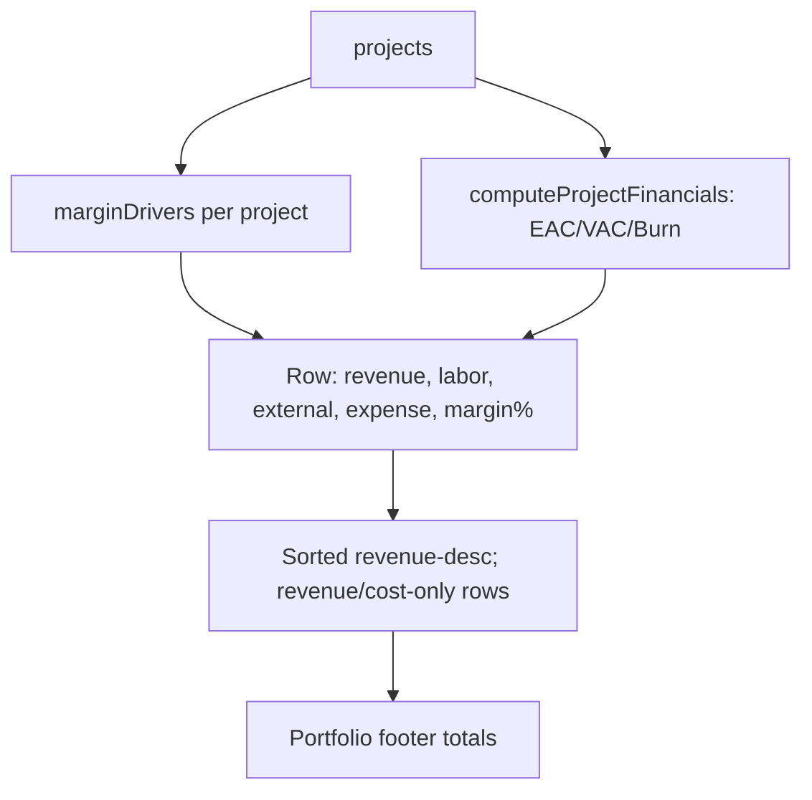
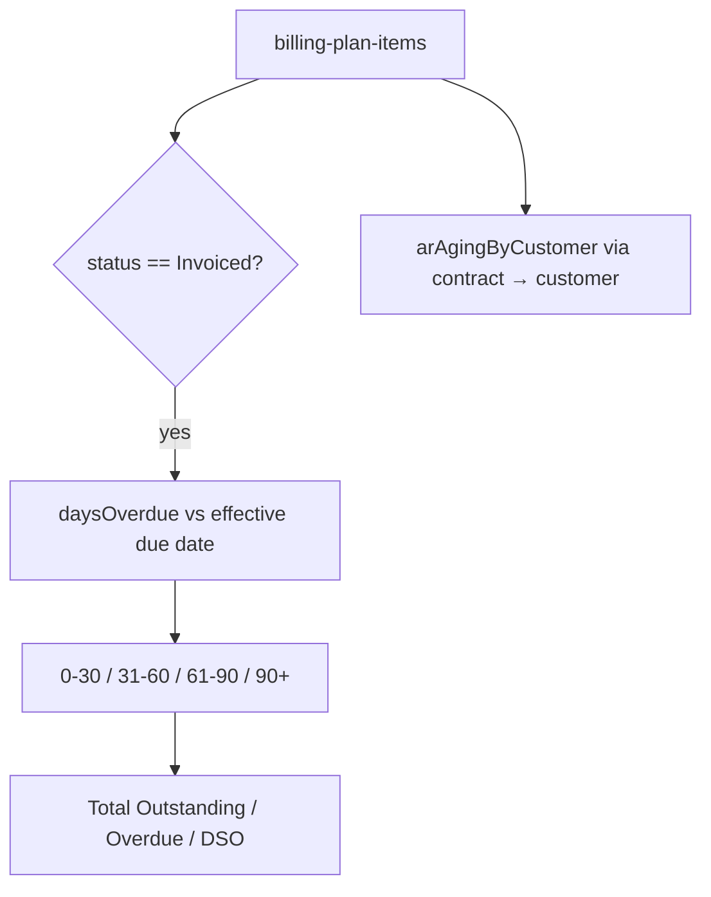
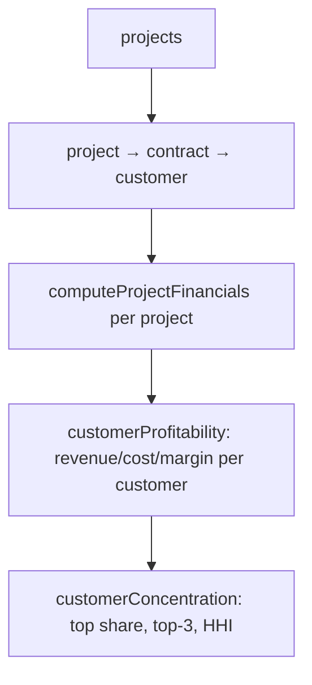
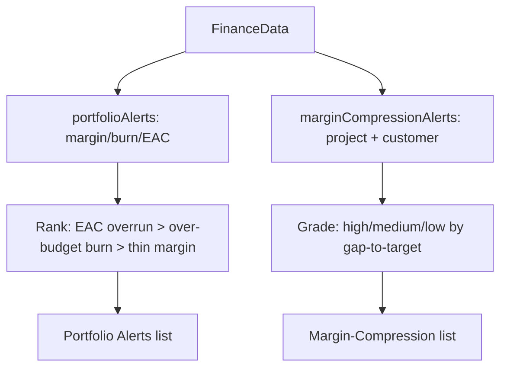
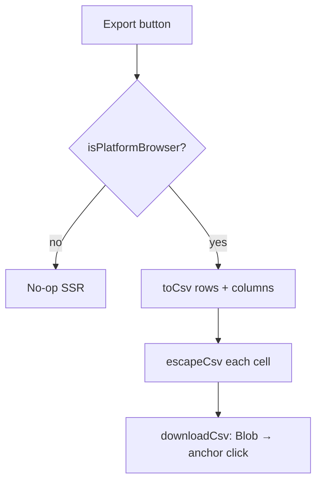

# Reporting & Analytics — Standard Operating Procedures

> **Diátaxis mode: How-to.** This document holds the how-tos for the executive
> **Portfolio Analytics** dashboard: reading the headline KPIs and portfolio
> financials, reviewing margin & variance drivers, monitoring A/R aging & DSO,
> reading customer profitability & concentration (HHI), realization % and
> revenue-per-FTE, acting on margin-compression / delivery alerts, and exporting
> any table to CSV. Each SOP follows the format in
> [`00-overview.md`](00-overview.md). Roles and the authorization model are in
> [`../roles-and-permissions.md`](../roles-and-permissions.md).

**Source of truth.** Grounded in the Angular component
`src/app/reporting/reporting.ts` (the dashboard, its gated `forkJoin` load, the
access notice, and the export actions), the pure rollup module
`src/app/services/finance.util.ts` (all metric definitions — `arAging`,
`arAgingByCustomer`, `dsoOutstanding`, `marginDrivers`, `customerProfitability`,
`customerConcentration`, `realizationMetrics`, `marginCompressionAlerts`,
`portfolioAlerts`, `recognizedRevenueTrend`, `periodDelta`, `computeProjectFinancials`,
`portfolioTotalsInBase`), and the CSV helpers in
`src/app/services/export.util.ts`.

**Roles touching this domain (RBAC, from `src/server.ts`):**

The `reporting` **route is OPEN** (no route guard). But the data it shows comes
from a fail-fast `forkJoin` over **role-gated collections** — resources, users,
requests, assignments, orders, order-lines, project-financials, time-entries,
billing-plan-items, contracts, customers — which require an authenticated,
sufficiently-privileged principal:

- Commercial reads (`/customers`, `/contracts`, `/orders`, `/order-lines`,
  `/billing-plan-items`) → `sales`, `finance`, `delivery-executive`, `admin`.
- Financial-plan reads (`/project-financials`, `/cost-centers`) → `finance`,
  `delivery-executive`, `admin`.
- `/resources`, `/users` (carry confidential `costRate`/`billRate` and role
  directory) → `pm`, `resource-manager`, `delivery-executive`, `finance`, `admin`.
- `/requests`, `/assignments` → `pm`, `resource-manager`, `delivery-executive`,
  `finance`, `admin` (finance is read-only; mutations stay with staffing roles).
- `/time-entries` → any authenticated role.

So **primary audience is `delivery-executive` and `finance`** (they see every
figure). A `pm` reads the subset their gates allow (timesheets, resources,
projects) and full A/R / commercial financials are incomplete for them. An
**anonymous or under-privileged** viewer reaches the page but the gated reads
`401`/`403`; the dashboard then shows an **access notice** and zeros rather than
pretending the portfolio is empty (documented behavior — see below).

---

## Data sources → reporting rollups

```mermaid
flowchart TD
  subgraph Gated reads forkJoin, keyed on authReady
    R[resources] --> FD[FinanceData]
    U[users] --> FD
    O[orders] --> FD
    OL[order-lines] --> FD
    PF[project-financials] --> FD
    TE[time-entries] --> FD
    BI[billing-plan-items] --> FD
    CT[contracts] --> FD
    CU[customers] --> FD
    CR[change-requests] --> FD
    MS[milestones] --> FD
    FX[fx-rates] --> FD
  end
  FD --> CPF[computeProjectFinancials]
  FD --> MD[marginDrivers]
  FD --> AR[arAging / arAgingByCustomer / dsoOutstanding]
  FD --> CP[customerProfitability / customerConcentration]
  FD --> RM[realizationMetrics]
  FD --> MC[marginCompressionAlerts]
  FD --> PA[portfolioAlerts]
  FD --> RT[recognizedRevenueTrend / periodDelta]
  CPF --> DASH[Portfolio Analytics dashboard]
  MD --> DASH
  AR --> DASH
  CP --> DASH
  RM --> DASH
  MC --> DASH
  PA --> DASH
  RT --> DASH
```

> **Multi-currency.** All monetary rollups normalise to `BASE_CURRENCY` ('EUR')
> via `convertToBase` using the FX rate table (`rateToBase` = base value of one
> unit). When no rates are present, conversion is an identity (single-currency
> behavior). Tables that show converted totals are labelled "EUR (base)".

> **Load timing.** Both the data `forkJoin` and the FX read are keyed on
> `auth.authReady()` so they fire **after** the OIDC bearer token is restored;
> firing earlier would `401` and latch the whole report to its empty default.

---

## The fully-loaded portfolio margin

The headline margin on `/` and `/reporting` is **fully loaded**: it carries the
cost of work no customer pays for.

```
fullyLoadedMargin    = revenue − deliveryCost − nonBillableCost
fullyLoadedMarginPct = fullyLoadedMargin / revenue
```

`deliveryCost` is the `actualCost` of the **billable** engagements;
`nonBillableCost` is the `actualCost` of the ones classified non-billable
([Classify an engagement](project-delivery.md#classify-an-engagement-billable-delivery-vs-non-billable-basket)).
Both tiles read **one function**, `portfolioMarginFullyLoaded`, rather than each
open-coding a sum — which is how the same-named tile on two screens used to
answer two different questions with nothing on either screen saying so.

The tile **names the split**: how much non-billable cost, across how many
engagements, with the caveat that it is *not comparable with a single project's
delivery margin*. Without that line, a drop in the headline number is
unexplainable at the point of reading.

A project's **own** margin is deliberately untouched by any of this: it still
reports `revenue − actualCost`, because that cost is real and must stay visible
on its own page. What classification changes is **who consumes** that margin —
customer profitability, the margin-compression alerts and the realization
rollups all exclude non-billable engagements, because "how profitable is this
customer" is a question they cannot answer.

### A margin % needs revenue to be a percentage OF

Every margin percentage in `finance.util.ts` is computed as
`revenue > 0 ? (margin / revenue) × 100 : 0`. **That trailing `0` is a sentinel
for "undefined", not a measurement.** Returning `NaN` instead would poison every
downstream sum, so the sentinel exists — but rendering it as a number says
something false.

For a non-billable engagement, revenue is zero **by construction**, so the
sentinel is not an edge case: it is the only value it ever has. Printing "0%"
beside a red negative amount asserted break-even on an engagement that had lost
every euro of its cost.

**The rule.** Ask `hasMeasuredMarginPct(revenue)` before RENDERING a margin
percentage. Where it is false:

| Surface | What is shown instead |
|---------|----------------------|
| Screen (tiles, tables, KPIs) | an **em dash**, with the tile's red/amber tint suppressed — there is no verdict to tint |
| CSV export | an **em dash**, matching the `PCP Delta %` column already in those files |
| RPT `.xlsx` workbook | an **empty cell** — Excel skips empty cells in `=AVERAGE()`/`=SUM()`, where a `0` would silently drag a portfolio figure down, and unlike a dash it keeps the column numeric |

The **amount** is always measured and always shown. Only the ratio is undefined.

Three consumers deliberately keep the raw sentinel, and each is asserted to be
unreachable rather than assumed: the per-project margin chart (its source filters
`revenue > 0`), the margin-compression alerts and their CSV (they return nothing
at all when there is no revenue). A fourth — the BI-feed preview in
`/configuration` — shows the sentinel **on purpose**, because it previews the
artefact and a preview that disagrees with the downloaded file is the one that
lies.

A repo-wide scan requires every file naming a margin percentage to either import
the guard or carry a written exemption, so a new render site cannot quietly print
the sentinel.

## SOPs

### Read the Portfolio Analytics dashboard

**Purpose.** Give delivery and finance leadership a single cross-functional
control view — active projects, utilization, portfolio revenue/margin/margin%,
EAC/VAC, backlog, open changes and high-risk issues — so they can steer the
portfolio.

**Scope.**
- *In:* the headline KPI cards and the Portfolio Financials strip.
- *Out:* the per-driver drill-downs (subsequent SOPs).

**RACI.**

| Activity | delivery-executive | finance | pm | sales | admin |
| --- | --- | --- | --- | --- | --- |
| Read headline KPIs & portfolio financials | R | R | C (subset) | C (subset) | A |
| Act on portfolio EAC/VAC / open changes | R | C | C | — | A |

**Process flow.**



**Detailed steps.**

1. **Open the dashboard.**
   - **Who:** `delivery-executive` / `finance` (full view); `pm`/`sales` see the
     subset their gates allow.
   - **When:** routine portfolio review or a period checkpoint.
   - **How:** navigate to `reporting`; optionally set the period selector
     (Last 30 Days / This Quarter / This Year) which sizes the recognised-revenue
     trend window (1 / 3 / 12 months).
   - **Output:** KPI cards and the EUR-base financial strip.

2. **Read the headline KPIs.**
   - **Who:** reviewer.
   - **How:** the four cards are point-in-time counts/averages —
     **Total Active Projects** (status in execution/planning/active),
     **Avg Resource Utilization** (mean `resource.utilization`),
     **Open Resource Requests** (status open/published), and
     **Delivery Risk Items** (high-risk issues + open changes + pending
     milestones). Their trend indicator is intentionally **hidden** (no dated
     prior period to compare against — requirement #15; never a fabricated %).
   - **Output:** the portfolio's current shape; drives where to drill in.

3. **Read the Portfolio Financials strip (EUR base).**
   - **Who:** reviewer.
   - **How:** **Portfolio Revenue** (Σ `computeProjectFinancials.revenue` over
     projects with revenue), **Total Margin** (Σ `margin = revenue − actualCost`),
     **Margin %** (`totalMargin / totalRevenue × 100`, warning < 15%, danger < 0),
     **Backlog** (Σ `revenue − invoiced`), **Portfolio EAC**
     (Σ `actualCost + ETC`), **VAC** (Σ effective budget − EAC; danger < 0),
     **Open Changes**, **High Risk Issues**.
   - **Output:** the financial health line; negatives flag where to act.

**Exceptions.**

| Condition | Handling |
| --- | --- |
| Token not yet restored | Load deferred to `authReady`; empty default, no false 401. |
| Gated reads error (anon / under-privileged) | Access notice shown; figures incomplete (see *access-notice behavior*). |
| No projects with customer revenue | Margin chart shows guidance empty state. |

**Metrics.** (definitions per `finance.util`)

| KPI | Definition |
| --- | --- |
| Margin % | `totalMargin / totalRevenue × 100` (0 when no revenue). |
| EAC | `actualCost + max(0, plannedLabor − actualLabor)` summed across projects. |
| VAC | effective (CR-adjusted) budget − EAC; negative = projected overrun. |
| Backlog | customer revenue − invoiced revenue. |

**Related.** [Margin & variance](#review-margin--variance-drivers) ·
[Project delivery](project-delivery.md) · [Roles](../roles-and-permissions.md).

---

### Review Margin & Variance drivers

**Purpose.** Show where each project's money goes — labor vs external vs expense
— alongside CR-adjusted EAC/VAC/Burn, so leadership can see which cost driver is
eroding margin.

**Scope.**
- *In:* the per-project Margin & Variance table (with stacked cost-driver bar)
  and its portfolio footer; the Project Margin chart.
- *Out:* threshold alerts (next SOP).

**RACI.**

| Activity | delivery-executive | finance | pm | admin |
| --- | --- | --- | --- | --- |
| Review per-project drivers | R | R | C | A |
| Export drivers CSV | R | R | — | A |

**Process flow.**



**Detailed steps.**

1. **Read the per-project rows.**
   - **Who:** `delivery-executive` / `finance` (pm partial).
   - **How:** each row from `marginDrivers(projectId)`:
     `laborCost` (actual approved time × `costRate`, else planned bookings),
     `externalCost` (purchase-order lines), `expenseCost` (financial-plan
     `actual`), `margin = revenue − (labor + external + expense)`, `marginPct`.
     EAC/VAC/Burn come from `computeProjectFinancials`. Rows are limited to those
     carrying revenue or cost and sorted highest-revenue-first.
   - **Output:** the project P&L breakdown; the stacked mini-bar shows the cost
     mix at a glance.

2. **Read the portfolio footer.**
   - **How:** sums of each column (CR-adjusted via the shared `FinanceData`).
   - **Output:** portfolio-level revenue / cost / margin / EAC / VAC.

3. **Watch Burn %.**
   - **How:** `burnPct = actualCost / effective budget × 100`; rows at/over the
     warn level (`burnWarnPct` = 90) are coloured red.
   - **Output:** an early overrun signal that feeds the alerts SOP.
4. **Read the Baseline / Delta / Delta % columns (block E).**
   - **Who:** `pm` / `resource-manager` / `finance` / `delivery-executive` /
     `admin` (same audience as the rest of this table — the whole page
     already fails fast for `sales`/`employee`, so these three columns
     inherit that gate rather than adding a second one).
   - **How:** `Baseline` is the CURRENT frozen monthly PCP total for the
     project (the row with the latest `frozenAt` per period, summed —
     `costBaselineComparison`); `Delta` = live planned cost − that baseline;
     `Delta %` follows the same null rule as the Project 360 card (see
     [Project 360 review](project-delivery.md#project-360-review)): null,
     rendered `—`, **only** when the baseline itself is 0 (never frozen). A
     descoped month against a real frozen baseline still shows a real,
     signed percentage — never an em dash. The portfolio footer sums
     Baseline/Delta but leaves Delta % blank, exactly like it already leaves
     Margin %/Burn % blank rather than averaging a percentage.
   - **Output:** per-project and portfolio PCP variance, exported alongside
     everything else in the CSV.

**Exceptions.**

| Condition | Handling |
| --- | --- |
| No projects with revenue/cost | Table empty state. |
| No budget on a project | Burn % is 0 (nothing to measure against). |
| No baseline ever frozen for a project | Baseline/Delta are 0, Delta % is `—` — never a fabricated percentage. |

**Metrics.**

| Metric | Definition |
| --- | --- |
| labor / external / expense | `marginDrivers` cost dimensions (mutually exclusive). |
| Margin / Margin % | `revenue − cost` / `margin ÷ revenue × 100`. |
| Burn % | `actualCost ÷ effective budget × 100`. |
| Baseline / Delta / Delta % | frozen monthly PCP total / live-vs-frozen delta / delta as a % of baseline (null only when baseline = 0). |

**Action it drives.** Reallocate or renegotiate where one driver dominates;
escalate a thin-margin or over-burn project into change control; a widening
PCP delta against a frozen baseline is an early signal that a project is
spending ahead of what was committed.

**Related.** [Act on alerts](#act-on-margin-compression--delivery-alerts) ·
[Export to CSV](#export-a-table-to-csv) ·
[Project 360 review](project-delivery.md#project-360-review) (the
per-project Baseline vs Planned card this table's columns mirror).

---

### Monitor A/R Aging & DSO

**Purpose.** Track money invoiced but not yet collected, bucketed by how overdue
it is, plus the amount-weighted age of the book (DSO), so finance can chase
collections and flag risk.

**Scope.**
- *In:* the A/R KPI cards, the aging bar (0-30 / 31-60 / 61-90 / 90+), and the
  per-customer A/R table.
- *Out:* invoice issuance and billing-plan mechanics (see
  [billing-and-revenue](billing-and-revenue.md)).

**RACI.**

| Activity | finance | delivery-executive | admin |
| --- | --- | --- | --- |
| Monitor aging / DSO | R | C | A |
| Drill per-customer A/R | R | C | A |
| Export A/R CSVs | R | C | A |

**Process flow.**



**Detailed steps.**

1. **Read the KPI cards.**
   - **Who:** `finance`.
   - **How:** `arAging(billingItems, today, fxRates)` yields **Total Outstanding**
     (Σ Invoiced amounts in base), **Overdue** (portion with `daysOverdue > 0`).
     `dsoOutstanding(...)` gives **DSO** — the amount-weighted average age
     (issued → today) of the outstanding balance.
   - **Output:** the collection exposure headline.

2. **Read the aging bar.**
   - **How:** each item is bucketed by `daysOverdue` from its effective due date
     (`dueDate`, else `issuedDate + paymentTermsDays`). Only `Invoiced` items are
     outstanding (Paid is collected; pre-Invoiced is unbilled). The 90+ bar is
     highlighted red.
   - **Output:** the shape of the overdue tail.

3. **Drill per customer.**
   - **How:** `arAgingByCustomer` joins items → contract → customer; rows are
     sorted by descending outstanding, each tagged with its **oldest non-empty
     bucket**. Unresolvable items group under "Unknown" so nothing is dropped.
   - **Output:** which customers to chase first.

**Exceptions.**

| Condition | Handling |
| --- | --- |
| Item with no derivable due date | Treated as not-overdue (0 days) → 0-30 bucket. |
| Item not Invoiced | Excluded from A/R entirely. |
| Customer unresolvable from contract | Grouped under "Unknown". |

**Metrics.**

| Metric | Definition |
| --- | --- |
| Total Outstanding | Σ amount of `Invoiced` items (base currency). |
| Overdue | Σ outstanding with `daysOverdue > 0`. |
| DSO | Amount-weighted average issued→today age of outstanding balance. |

**Action it drives.** Prioritise collections on the 90+ bucket and the top
per-customer balances.

**Related.** [Billing & revenue](billing-and-revenue.md) ·
[Customer profitability](#review-customer-profitability--concentration-hhi).

---

### Review Customer Profitability & Concentration (HHI)

**Purpose.** Roll project financials up to the customer and measure how lopsided
the revenue base is, so leadership can see profitability per account and
single-customer dependency risk.

**Scope.**
- *In:* the concentration KPI cards (Customers, Top Customer Share, Top-3 Share,
  HHI) and the Top Customers by Margin table.
- *Out:* per-project drill-down (Margin & Variance SOP).

**RACI.**

| Activity | delivery-executive | finance | sales | admin |
| --- | --- | --- | --- | --- |
| Review profitability per customer | R | R | C | A |
| Assess concentration risk (HHI) | R | C | C | A |
| Export profitability CSV | R | R | — | A |

**Process flow.**



**Detailed steps.**

1. **Read concentration KPIs.**
   - **Who:** `delivery-executive`.
   - **How:** `customerConcentration` (over positive customer revenue only):
     **Customers** (count with revenue), **Top Customer Share** (largest share %,
     warning ≥ 40%, danger ≥ 60%), **Top-3 Share** (warning ≥ 75%), **HHI** =
     Σ(share²) on a 0–10000 scale (warning ≥ 2500, danger ≥ 5000; 10000 = a
     single customer).
   - **Output:** dependency-risk read on the revenue base.

2. **Read the Top Customers by Margin table.**
   - **How:** `customerProfitability` aggregates `computeProjectFinancials`
     revenue/cost up the project→contract→customer chain (unresolvable →
     "Unknown"), giving revenue, cost, margin, margin%, revenue share, and project
     count, sorted by revenue. Footer totals the book.
   - **Output:** which accounts carry margin vs which are thin/loss-making.

**Exceptions.**

| Condition | Handling |
| --- | --- |
| Customer net-negative (credit notes) | Contributes 0 to concentration (no negative share). |
| No customer revenue | Cards show 0 / table empty state. |

**Metrics.**

| Metric | Definition |
| --- | --- |
| HHI | Σ(revenue-share²) in percent, 0–10000. |
| Top / Top-3 Share | Largest / combined top-3 revenue share %. |
| Margin % per customer | `(revenue − cost) ÷ revenue × 100`. |

**Action it drives.** Diversify when HHI/top share is high; review or exit
loss-making accounts.

**Related.** [A/R aging](#monitor-ar-aging--dso) ·
[Margin compression alerts](#act-on-margin-compression--delivery-alerts).

---

### Read Realization % & Revenue-per-FTE

**Purpose.** Show how much of the rate-card value of delivered effort is actually
turning into revenue, plus headline productivity (revenue per FTE / per head), so
leadership sees discount/write-off/WIP erosion and output per person.

**Scope.**
- *In:* the Realization & Productivity strip and its recognised-revenue trend.
- *Out:* the dated rev-rec journal (see [billing-and-revenue](billing-and-revenue.md)).

**RACI.**

| Activity | delivery-executive | finance | pm | admin |
| --- | --- | --- | --- | --- |
| Read realization & productivity | R | R | C | A |

**Detailed steps.**

1. **Read realization.**
   - **Who:** `delivery-executive` / `finance`.
   - **How:** portfolio roll-up of `realizationMetrics` per project:
     `realizationPct = recognised revenue ÷ standardBillValue × 100`, where
     `standardBillValue = Σ approved hours × billRate` (the rate card). Warning
     below 85%.
   - **Output:** the realization headline plus a **real** recognised-revenue trend
     (`recognizedRevenueTrend` over the selected window vs the prior equal window);
     the trend chip is hidden when no prior basis exists (`periodDelta` returns
     null — never fabricated).

2. **Read productivity.**
   - **How:** **Recognised Revenue** (earned to date, POC/realised),
     **Revenue / FTE** (revenue ÷ FTE, FTE = approved hours ÷ 160h basis),
     **Revenue / Head** (revenue ÷ distinct resources who logged approved time).
   - **Output:** output-per-person read.

**Exceptions.**

| Condition | Handling |
| --- | --- |
| No rate-card value (no approved hours) | Realization % is 0. |
| No prior window basis | Trend chip hidden (no fabricated %). |
| No hours basis | Revenue/FTE falls back to revenue/head. |

**Metrics.**

| Metric | Definition |
| --- | --- |
| Realization % | recognised revenue ÷ standard bill value × 100. |
| Revenue / FTE | revenue ÷ (approved hours ÷ hoursPerFte). |
| Revenue / Head | revenue ÷ distinct approved-time resources. |

**Action it drives.** Investigate low realization (discounting, write-offs,
fixed-price overruns, unbilled WIP); benchmark productivity across the portfolio.

**Related.** [Billing & revenue — recognition](billing-and-revenue.md).

---

### Act on Margin-Compression & Delivery alerts

**Purpose.** Surface projects and customers whose profitability is thin or
eroding, and projects breaching margin/burn/EAC thresholds, ranked worst-first,
so leadership acts before a project goes underwater.

**Scope.**
- *In:* the Portfolio Alerts list (`portfolioAlerts`) and the severity-graded
  Margin-Compression Alerts list (`marginCompressionAlerts`).
- *Out:* the raw per-project drivers (Margin & Variance SOP).

**RACI.**

| Activity | delivery-executive | finance | pm | admin |
| --- | --- | --- | --- | --- |
| Triage portfolio alerts | R | C | C | A |
| Triage margin-compression alerts | R | R | C | A |
| Export compression alerts CSV | R | R | — | A |

**Process flow.**



**Detailed steps.**

1. **Triage Portfolio Alerts.**
   - **Who:** `delivery-executive`.
   - **How:** `portfolioAlerts` flags a project when `marginPct ≤ 15`
     (`marginTargetPct`), `burnPct ≥ 90` (`burnWarnPct`), or `EAC > effective
     budget`. Rows are ranked EAC-overrun (3) > over-budget burn (2) > thin
     margin (1); badge is **Critical** when EAC/burn fires, else **Warning**.
   - **Output:** the threshold-breach worklist with human-readable reasons.

2. **Triage Margin-Compression Alerts.**
   - **Who:** `delivery-executive` / `finance`.
   - **How:** `marginCompressionAlerts` evaluates both **project** and **customer**
     scopes; fires when `marginPct ≤ 15` or the bill-vs-cost spread is thin
     (< 10%). Severity is graded by how far margin sits below target — **high** at
     ≥ 15pts gap, **medium** at ≥ 7pts, else **low** — sorted worst-first.
   - **Output:** the eroding-margin worklist, scoped to project or customer.

**Exceptions.**

| Condition | Handling |
| --- | --- |
| Project with no revenue | Never trips the margin/compression flags. |
| Project with no budget | Never trips burn/EAC flags. |
| Nothing breaching | Green "no alerts" empty state. |

**Metrics.**

| Metric | Definition |
| --- | --- |
| marginTargetPct / burnWarnPct | 15% / 90% thresholds. |
| Gap (pts) | `marginTargetPct − marginPct` (compression severity driver). |
| Thin spread | `(revenue − cost) ÷ revenue × 100 < 10%`. |

**Action it drives.** Raise a change request, renegotiate scope/price, or
re-staff; escalate critical EAC overruns to portfolio review.

**Related.** [Margin & variance](#review-margin--variance-drivers) ·
[Change requests](approvals-governance.md#decide-a-change-request-parallel-sod-path).

---

### Export a table to CSV

**Purpose.** Let finance / delivery-executive take any reporting table offline
for analysis or distribution, safely (formula-injection guarded, RFC-4180
quoted) and in base currency.

**Scope.**
- *In:* the Export buttons across the dashboard (KPI summary, Margin & Variance,
  Customer Profitability, Margin-Compression Alerts, A/R Aging, A/R by Customer)
  and the `export.util.ts` helpers.
- *Out:* server-side report generation (the "Available Reports" list is
  illustrative; its Export reuses the KPI export).

**RACI.**

| Activity | finance | delivery-executive | admin |
| --- | --- | --- | --- |
| Export any reporting CSV | R | R | A |

**Process flow.**



**Detailed steps.**

1. **Trigger an export.**
   - **Who:** `finance` / `delivery-executive`.
   - **How:** click Export on the relevant card/table. Each handler guards with
     `isPlatformBrowser`, builds rows via `toCsv(rows, columns)`, and downloads
     via `downloadCsv(filename, csv)`. Empty tables disable their Export button.
   - **Output:** a `.csv` file (e.g. `Margin_And_Variance.csv`,
     `Customer_Profitability.csv`, `AR_Aging.csv`, `AR_By_Customer.csv`,
     `Margin_Compression_Alerts.csv`, `Reporting_Summary.csv`) and a success toast.

2. **Trust the cell safety.**
   - **How:** `escapeCsv` prefixes a `'` to any cell starting with
     `= + - @`, TAB or CR (formula-injection guard) — but **never** to a cell that
     is *entirely* a number, whatever its JavaScript type, so `-1500` and the
     string `"-1500.00"` that `.toFixed(2)` produces both stay numeric and
     SUM-able. The type-based exemption alone was not enough: every money column
     pre-formats with `.toFixed()`, so real negative figures (VAC, margin, PCP
     delta, credit-note amounts) arrived as strings and were emitted as text
     labels — `=SUM` then skipped exactly the overrunning rows the export exists
     to surface. Anything with a second operator or a letter (`-1+1`, `-A1`,
     `+SUM(A1)`) is not numeric and is still prefixed. RFC-4180 double-quoting
     applies to cells containing comma/quote/newline. Money columns are labelled
     "EUR (base)".
   - **Output:** spreadsheet-safe, correctly-typed CSV.

**Exceptions.**

| Condition | Handling |
| --- | --- |
| SSR / non-browser context | Export no-ops (no `document`). |
| Empty source table | Export button disabled. |

**Metrics.** N/A (export is an action, not a measure).

**Related.** Export helpers grounded in `export.util.ts` ·
[Read the dashboard](#read-the-portfolio-analytics-dashboard).

---

## Access-notice behavior (anonymous / under-privileged users)

The `reporting` route is unguarded, so anyone can reach the page — but the data
load is a **fail-fast `forkJoin` over role-gated collections**, and `401`s are
deliberately **not** toasted by the error interceptor. Without a notice, an
anonymous or under-privileged user would see a page of silent zeros and
misleading "no data yet" empty states. So when `dataRes.status() === 'error'`,
the dashboard renders an `accessNotice`:

- **Authenticated but insufficient role:** *"Your role does not have access to
  the financial reporting data. The figures below are incomplete."*
- **Not authenticated:** *"Sign in to view portfolio analytics — financial data
  requires an authenticated role."*

This is intended, documented behavior: the page never claims the portfolio is
empty when the real cause is access. Full figures require `delivery-executive` /
`finance` (or `admin`); a `pm` sees only the subset their gates permit.

---

## Related

- [Roles & permissions](../roles-and-permissions.md)
- [Approvals & governance — Open Changes / CR alerts](approvals-governance.md)
- [Billing & revenue — recognition, DSO, journal](billing-and-revenue.md)
- [Project delivery — EAC/VAC, alerts](project-delivery.md)
- [Functional overview & SOP format](00-overview.md)
