# Resource Management — Standard Operating Procedures

> **Diátaxis mode: How-to.** This document holds the SOPs for the resource
> lifecycle: maintaining a profile, logging and submitting time, raising and
> publishing demand, matching and assigning people, approving time under
> segregation of duties, monitoring utilization, and forecasting capacity. Each
> SOP follows the format described in [`00-overview.md`](00-overview.md). Roles
> and the authorization model are defined in
> [`../roles-and-permissions.md`](../roles-and-permissions.md).

**Source of truth.** The procedures below are grounded in the Angular components
under `src/app/{my-profile,my-assignments,resource-requests,staffing,utilization,forecast,schedule}/`,
the pure decision modules `src/app/services/{forecast.util,match.util,staffing.util,schedule.util}.ts`,
and the server handlers + RBAC in `src/server.ts` (`/resources`, `/requests`,
`/assignments`, `/time-entries`).

**Roles touching this domain (mutation RBAC, from `src/server.ts`):**

- `/resources` → `resource-manager`, `delivery-executive`, `admin`
- `/requests`, `/assignments` → `pm`, `resource-manager`, `delivery-executive`, `admin`
- `/time-entries` → all of `employee`, `pm`, `resource-manager`, `finance`, `delivery-executive`, `admin` (approval is SoD-gated: approver ≠ the entry's resource owner)

---

## Domain flow at a glance

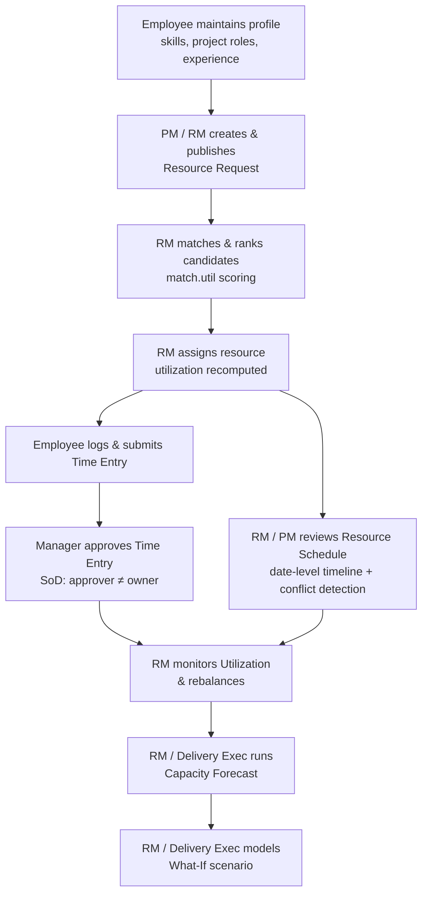

---

## SOPs

### Manage resources / onboard & terminate employees

**Purpose.** Run the full resource (employee) lifecycle from one People screen:
view the pool, onboard a new employee (assunzione), edit master data, and
logically terminate a contract (cessazione) — never a hard delete. Active vs
Terminated is derived from `terminationDate`; a terminated resource can be
reactivated.

**Scope.**
- *In:* listing resources with an Active/Terminated badge and an "Active only"
  filter; creating a resource via `POST /resources` (with required `hireDate`);
  editing `name`, `role`, `organization`, `location`, `capacity`, `costRate`,
  `billRate`, `hireDate` via `PUT /resources/:id`; terminating
  (`PUT /resources/:id` with `terminationDate`) and reactivating
  (`terminationDate: null`).
- *Out:* `utilization` (derived server-side from assignments — never sent from
  this screen), skills/project-roles/experience (the My Profile SOP), a hard
  `DELETE` (does not exist — termination is logical only), staffing/assignments
  (separate SOPs).

**RACI.**

| Step | Responsible | Accountable | Consulted | Informed |
|------|-------------|-------------|-----------|----------|
| Open Resources screen | resource-manager | resource-manager | — | — |
| Onboard a new employee | resource-manager | resource-manager | delivery-executive | finance |
| Edit resource master data | resource-manager | resource-manager | — | — |
| Terminate a contract | resource-manager | delivery-executive | — | finance |
| Reactivate a resource | resource-manager | delivery-executive | — | — |

**Process flow.**

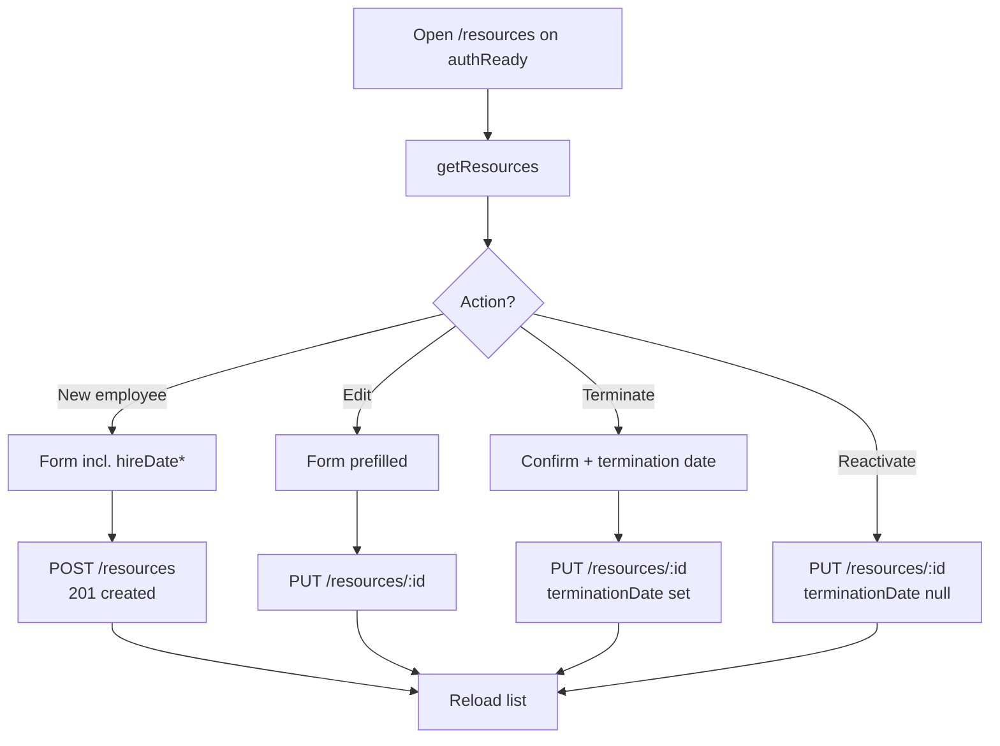

**Detailed steps.**

1. **Open the Resources screen.**
   - **Who:** `resource-manager` / `delivery-executive` / `admin`. **When:**
     managing the people pool.
   - **How:** navigate to `/resources` (`ResourcesComponent`). On `authReady` the
     page loads `getResources()`. The "Active only" toggle (on by default) hides
     terminated rows; the search box filters by name/role/organization/location.
     Four further selects narrow the list: **Kind** (internal / dummy / subco),
     and **Capability / Practice / Competence** plus **People Manager**. The three
     dimension filters are matched through the org tree
     (`dimensionsOf`, see [Manage Resource Organizations](configuration.md#manage-resource-organizations)),
     **not** by raw equality on `organization` — so filtering by a capability
     also returns everyone attached *below* it (e.g. two levels down, on a
     competence). All filters combine (AND).
   - **Output:** the resource table with an Active / Terminated status badge.
2. **Onboard a new employee (creazione).**
   - **Who:** `resource-manager`. **When:** a new hire joins.
   - **How:** "New employee" → fill name\*, role\*, organization, location,
     capacity\* (h/wk, positive), costRate, billRate, **hireDate\*** (data di
     assunzione, required) → `createResource()` → `POST /resources`. The server
     defaults `utilization: 0`, assigns the `id`, and returns `201` + the record.
   - **Output:** the new resource appears in the list (Active).
3. **Edit resource master data (modifica).**
   - **Who:** `resource-manager`. **How:** the row "Edit" action opens the same
     form prefilled → `updateResource(id, {...})` → `PUT /resources/:id`.
     `utilization` is not editable here (derived server-side).
   - **Output:** persisted changes; the list reloads.
4. **Terminate a contract (cessazione logica).**
   - **Who:** `resource-manager` (accountable: `delivery-executive`). **When:** an
     employee leaves.
   - **How:** the row "Terminate" action opens a confirm dialog with a date input
     defaulting to today → `updateResource(id, { terminationDate })`
     → `PUT /resources/:id`. The row flips to **Terminated** once the date is on
     or before today. No data is deleted.
   - **Output:** the resource is logically terminated and hidden under
     "Active only".
5. **Reactivate a resource.**
   - **Who:** `resource-manager`. **How:** on a terminated row, the "Reactivate"
     action clears the marker → `updateResource(id, { terminationDate: null })`.
   - **Output:** the resource is Active again.

**Exceptions & edge cases.**

| Situation | System response |
|-----------|-----------------|
| `hireDate` missing or not ISO-parseable on create | `400` — `hireDate is required and must be an ISO date string`. |
| `capacity` 0 / negative / NaN on create or edit | `400` — `capacity must be a positive number` (it is a divisor in utilization math). |
| `terminationDate` earlier than `hireDate` | `400` — `terminationDate must be on or after hireDate`. |
| Reactivate (`terminationDate: null` / empty) | Allowed — clears the marker; the resource becomes Active. |
| Caller lacks the capability | `403` — `/resources` mutations require `resource-manager` / `delivery-executive` / `admin`. |
| Hard delete of a resource | Not supported — there is no `DELETE /resources/:id`; termination is logical only. |
| Non-allow-listed field sent in body | Silently dropped — only `RESOURCE_FIELDS` are picked; `utilization` is never client-set on this path. |

**Metrics.**

| Metric | Definition |
|--------|------------|
| Active headcount | Count of resources with no `terminationDate` ≤ today. |
| Attrition | Resources terminated in a period ÷ average headcount. |
| Onboarding lead time | Days between `hireDate` and first assignment. |

**Related.** [View / maintain My Profile](#view--maintain-my-profile),
[Match & rank candidates](#match--rank-candidates--assign-a-resource),
[Monitor Utilization & rebalance](#monitor-utilization--rebalance).

---

### View / maintain My Profile

**Purpose.** Let an employee keep their own skill inventory, project-role
qualifications, external experience, profile picture, and résumé current, so the
match scorer and capacity views work from accurate data.

**Scope.**
- *In:* editing the signed-in user's own `skills`, `projectRoles`,
  `externalExperience`, `profilePicture`, `resume` via `PUT /resources/:id`.
- *Out:* editing `costRate` / `billRate` (financial fields — restricted to
  resource-manager/delivery-executive/admin), editing another person's profile,
  creating a new resource record.

**RACI.**

| Step | Responsible | Accountable | Consulted | Informed |
|------|-------------|-------------|-----------|----------|
| Open My Profile | employee | employee | — | — |
| Add/remove a skill | employee | employee | resource-manager | — |
| Add/remove a project role | employee | employee | resource-manager | — |
| Add external experience | employee | employee | — | — |
| Upload picture / résumé | employee | employee | — | — |

**Process flow.**

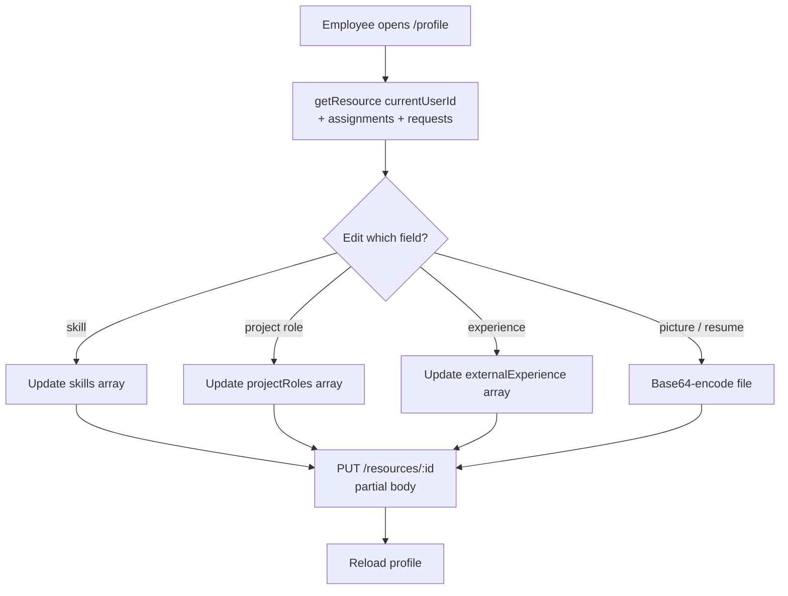

**Detailed steps.**

1. **Open the profile.**
   - **Who:** `employee`. **When:** they want to review/update their record.
   - **How:** navigate to `/profile` (`MyProfileComponent`). On `authReady`, the
     page loads `getResource(currentUserId)`, plus the user's assignments and
     requests for context.
   - **Output:** the profile card with role, skills, project roles, experience.
2. **Add or remove a skill.**
   - **Who:** `employee`. **When:** their skill set changes.
   - **How:** use the skill form / the remove button; the component computes the
     new `skills` array and calls `updateResource(id, { skills })`
     → `PUT /resources/:id`.
   - **Output:** persisted skills; the page reloads.
3. **Add or remove a project role.**
   - **Who:** `employee`. **How:** the project-role form / remove button →
     `updateResource(id, { projectRoles })`.
   - **Output:** updated project-role list (feeds `roleFit` in match scoring).
4. **Add external experience.**
   - **Who:** `employee`. **How:** the experience form (project, company, role,
     dates, comment) → `updateResource(id, { externalExperience })`.
   - **Output:** an appended experience entry.
5. **Upload picture / résumé.**
   - **Who:** `employee`. **How:** the file input base64-encodes the file and
     calls `updateResource(id, { profilePicture })` or `{ resume }`
     (clearing the résumé sends `{ resume: '' }`).
   - **Output:** stored picture/résumé.

**Exceptions & edge cases.**

| Situation | System response |
|-----------|-----------------|
| `capacity` sent as 0 / negative / NaN | `400` — `capacity must be a positive number` (it is a divisor in utilization math). |
| Caller is `employee` but is not a manager | The `PUT /resources/:id` is allowed only because the route gate admits the write; however the gate restricts `/resources` writes to `resource-manager`/`delivery-executive`/`admin`. In practice the profile self-edit relies on the signed-in user being permitted; financial fields (`costRate`/`billRate`) are never in the self-edit allow-list reached by this UI. |
| Non-allow-listed field sent in body | Silently dropped — only `RESOURCE_FIELDS` are picked. |
| Reads of `/resources` by an unauthenticated caller | `401` (read RBAC: `/resources` is need-to-know). |

> **Note on `/resources` write RBAC.** The server gate (`src/server.ts`) restricts
> `/resources` mutations to `resource-manager`, `delivery-executive`, `admin`. The
> profile editor is exposed to the signed-in user; in a hardened production realm
> employees who must self-service their own profile are granted the capability via
> their realm roles. Sensitive rate fields are never reachable from this screen.

**Metrics.**

| Metric | Definition |
|--------|------------|
| Profile completeness | % of resources with ≥1 skill, ≥1 project role, and a résumé. |
| Skill freshness | Days since last profile edit per resource. |

**Related.** [Match & rank candidates](#match--rank-candidates--assign-a-resource),
[Capacity Forecast](#capacity-forecast).

---

### View My Assignments + submit Time Entries

**Purpose.** Let an employee see what they are booked on and record the hours
they actually worked, submitting them for approval.

**Scope.**
- *In:* viewing the signed-in user's assignments; creating a time entry
  (`POST /time-entries`); adjusting their own assignment hours.
- *Out:* approving time (a manager action, SoD-gated); changing the entry's owner
  (`resourceId` is not reassignable on `PUT`).

**RACI.**

| Step | Responsible | Accountable | Consulted | Informed |
|------|-------------|-------------|-----------|----------|
| View assignments | employee | employee | — | resource-manager |
| Log a time entry | employee | employee | — | resource-manager |
| Submit for approval | employee | employee | — | approving manager |

**Process flow.**

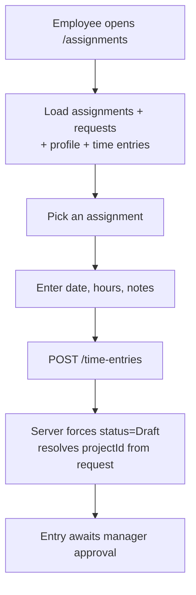

**Detailed steps.**

1. **Open My Assignments.**
   - **Who:** `employee`. **When:** to see current bookings / log time.
   - **How:** navigate to `/assignments` (`MyAssignmentsComponent`); on
     `authReady` it loads assignments, requests, the profile, and time entries.
   - **Output:** the assignment list with linked requests.
2. **Log a time entry.**
   - **Who:** `employee`. **When:** after working hours against an assignment.
   - **How:** start a time entry on an assignment, enter `date`, `hours`,
     `notes`, then save → `createTimeEntry({ assignmentId, requestId, resourceId,
     projectId, date, hours, notes })` → `POST /time-entries`.
   - **Output:** a new time entry. **The server forces `status: 'Draft'`** (the
     client-sent status is ignored and `approvedBy`/`approvedAt` are not in the
     create allow-list — this prevents seeding an already-`Approved` entry that
     would bypass the transition whitelist and inflate billing accrual). `projectId`
     is resolved from the linked request when not supplied.
3. **Adjust assignment hours (optional).**
   - **Who:** `employee` (the route also admits pm/rm/delivery-exec/admin).
   - **How:** edit hours → `updateAssignment(id, { assignedHours })`
     → `PUT /assignments/:id`. The server recomputes the resource's utilization
     from the full set of assignments.
   - **Output:** updated booking and recomputed utilization.

**Exceptions & edge cases.**

| Situation | System response |
|-----------|-----------------|
| `hours` negative / NaN | `400` — `hours must be a non-negative number`. |
| Client sends `status: 'Submitted'` (or `Approved`) on create | Ignored — server pins `Draft`. The employee then advances `Draft → Submitted` via `PUT`. |
| Request has no `projectId` and none supplied | `projectId` defaults to `''`. |
| Attempt to change `resourceId` (owner) on `PUT` | Field is excluded from the PUT allow-list (SoD hardening) — the owner cannot be re-pointed. |

**Metrics.**

| Metric | Definition |
|--------|------------|
| Timesheet submission rate | % of bookings with submitted time per period. |
| Draft backlog | Count of entries stuck in `Draft`/`Submitted`. |

**Related.** [Approve a Time Entry](#approve-a-time-entry-segregation-of-duties),
[Billing & revenue](billing-and-revenue.md) (approved T&M hours accrue revenue).

---

### Create & publish a Resource Request

**Purpose.** Capture a staffing need (role, effort, skills, window) and publish
it so it becomes visible demand for staffing and forecasting.

**Scope.**
- *In:* creating a request (`POST /requests`); editing it; publishing
  (`status: 'Published'`); withdrawing (`status: 'Withdrawn'`); deleting.
- *Out:* setting `Fulfilled` (server-derived from staffing), assigning people
  (separate SOP).

**RACI.**

| Step | Responsible | Accountable | Consulted | Informed |
|------|-------------|-------------|-----------|----------|
| Define the need | pm | pm | resource-manager | — |
| Create the request | pm / resource-manager | pm | — | resource-manager |
| Publish | pm / resource-manager | resource-manager | — | staffing team |
| Withdraw / delete | pm / resource-manager | pm | resource-manager | — |

**Process flow.**

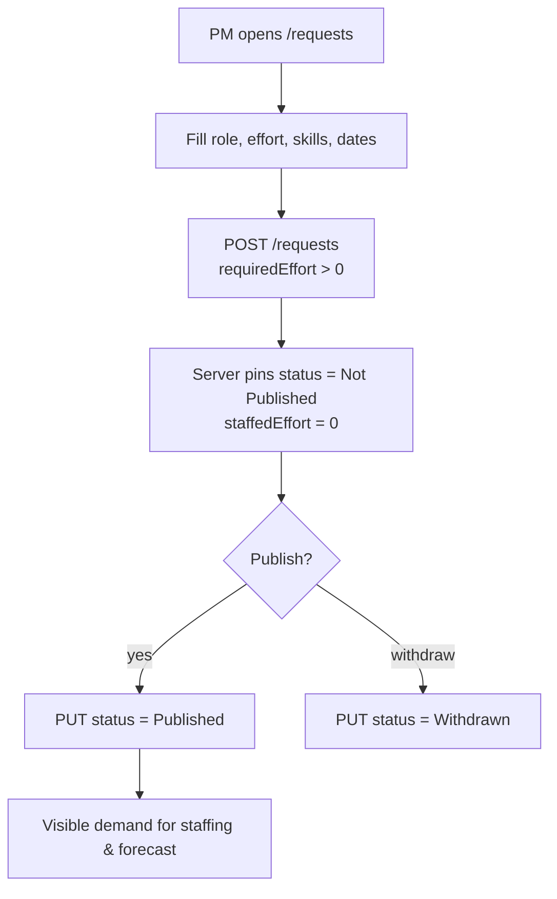

**Detailed steps.**

1. **Create the request.**
   - **Who:** `pm` or `resource-manager`. **When:** a new staffing need arises.
   - **How:** at `/requests` (`ResourceRequestsComponent`) fill the form
     (`requiredRole`, `requiredEffort`, `skills`, `description`, dates,
     `projectId`) and save → `createRequest(...)` → `POST /requests`.
   - **Output:** a request with **server-pinned** `status: 'Not Published'` and
     `staffedEffort: 0`. `requiredEffort` **must be > 0** (an absent/0 effort
     would make `Fulfilled` impossible or trivially true).
2. **Publish the request.**
   - **Who:** `pm` / `resource-manager`. **When:** the need is ready to staff.
   - **How:** the Publish action → `updateRequest(id, { status: 'Published' })`.
   - **Output:** the request becomes visible demand. Client-settable statuses are
     limited to `Not Published`, `Published`, `Open`, `Withdrawn` — **`Fulfilled`
     is rejected** if a client tries to set it.
3. **Withdraw / delete.**
   - **Who:** `pm` / `resource-manager`. **How:** Withdraw → `PUT status:
     'Withdrawn'`; delete → `deleteRequest(id)` → `DELETE /requests/:id`.
   - **Output:** demand removed/parked.

**Exceptions & edge cases.**

| Situation | System response |
|-----------|-----------------|
| `requiredEffort` ≤ 0 / NaN on create | `400` — `requiredEffort must be a positive number`. |
| Client sets `status: 'Fulfilled'` | `400` — status must be one of the client-settable values. `Fulfilled` is only ever set by the server from staffing. |
| `requiredEffort` set negative on edit | `400` — must be non-negative. |
| Caller role outside `pm`/`resource-manager`/`delivery-executive`/`admin` | `403` on the mutation. |

**Metrics.**

| Metric | Definition |
|--------|------------|
| Time to publish | Created → Published latency. |
| Open demand | Σ unstaffed effort across non-closed requests. |

**Related.** [Match & rank candidates](#match--rank-candidates--assign-a-resource),
[Capacity Forecast](#capacity-forecast) (pipeline demand = unstaffed open requests).

---

### Match & rank candidates + Assign a resource

**Purpose.** Score the resource pool against a published request, rank the best
fits deterministically, and book the chosen resource — recomputing utilization
and request fulfillment as a side effect.

**Scope.**
- *In:* ranking candidates with the `match.util` scorer; creating an assignment
  (`POST /assignments`).
- *Out:* approving time, publishing the request (prerequisite SOP).

**The match score (`src/app/services/match.util.ts`).** A pure, deterministic
0–100 score per candidate, summing five weighted dimensions:

| Dimension | Weight | Basis |
|-----------|-------:|-------|
| `skillCoverage` | 40 | fraction of the request's skills the resource has (by name). A request with no skills gets full coverage. |
| `proficiency` | 15 | average proficiency level on **matched** skills (level / 5). |
| `roleFit` | 15 | exact `role` match = 1.0; a `projectRoles` match = 0.6 (configurable); no role required = full fit. |
| `availability` | 20 | headroom = `clamp(100 − utilization)/100`; a non-finite utilization is treated as fully booked (worst case). |
| `marginFit` | 10 | `(billRate − costRate)/billRate`, clamped 0–1; 0 when `billRate` ≤ 0. |

`rankCandidates` sorts by score desc, then fewer missing skills, then resource id
(stable). `requestSkillGap` lists skills **no** candidate can cover (hire / upskill / subcontract signal).

**RACI.**

| Step | Responsible | Accountable | Consulted | Informed |
|------|-------------|-------------|-----------|----------|
| Select a request | resource-manager | resource-manager | pm | — |
| Review ranked candidates | resource-manager | resource-manager | pm | — |
| Assign the resource | resource-manager | resource-manager | pm | resource (employee) |

**Process flow.**

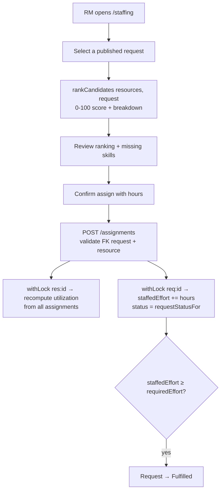

**Detailed steps.**

1. **Select a request and rank candidates.**
   - **Who:** `resource-manager`. **When:** staffing a published request.
   - **How:** at `/staffing` (`StaffingComponent`) pick the request; the page calls
     `rankCandidates(searchedResources, request)` and renders the score breakdown
     and each candidate's missing skills.
   - **Output:** a ranked candidate list.
2. **Assign the chosen resource.**
   - **Who:** `resource-manager`. **When:** a candidate is selected.
   - **How:** confirm with `assignedHours` (defaults to the request's remaining
     effort) → `createAssignment({ requestId, resourceId, assignedHours })`
     → `POST /assignments`. **No `status`:** since B3 the assignment's status is
     a *derived* rollup of its per-month rows, so `POST`/`PUT /assignments`
     reject a client-supplied `status` with **400**. A brand-new assignment has
     no month rows and therefore reads as `Draft`; the lifecycle continues from
     the allocation calendar (book the days, then submit the month for approval).
   - **Output:** an assignment. The server then, **under per-key locks**:
     - **recomputes the resource's utilization** from the *full* set of its
       assignments (never a lossy running delta — see `recomputeResourceUtilization`);
     - **updates the request:** `staffedEffort += assignedHours` and
       `status = requestStatusFor(...)`, which sets **`Fulfilled`** when
       `staffedEffort ≥ requiredEffort` (server-derived only).
3. **Re-book / move (optional).**
   - **Who:** `resource-manager`. **How:** `PUT /assignments/:id` to change hours
     or retarget the request/resource. When the FK target changes, **both** the
     old and new resource utilization and **both** old/new request staffing are
     recomputed.

**Exceptions & edge cases.**

| Situation | System response |
|-----------|-----------------|
| `assignedHours` negative / NaN | `400` — must be non-negative. |
| `requestId` / `resourceId` does not exist | `400` — must reference an existing request / resource. |
| Concurrent assignments to the same resource/request | Serialized via `withLock('res:…')` / `withLock('req:…')`; utilization/staffing recomputed from source of truth, so no drift. |
| Request drops below requirement after a delete | `requestStatusFor` reverts a previously-`Fulfilled` request to `Open`. |
| Skill demanded by request that no resource has | Surfaced by `requestSkillGap` / `skillGap` (forecast) as a shortage. |

**Metrics.**

| Metric | Definition |
|--------|------------|
| Match quality | Score of the assigned candidate vs the top-ranked candidate. |
| Fill rate | % of published requests reaching `Fulfilled`. |
| Time to fill | Published → Fulfilled latency. |

**Related.** [Create & publish a Resource Request](#create--publish-a-resource-request),
[Monitor Utilization & rebalance](#monitor-utilization--rebalance).

---

### Approve a Time Entry (segregation of duties)

**Purpose.** Let a manager approve submitted timesheets so the hours become
billable / costable — while guaranteeing no one approves their own time.

**Scope.**
- *In:* moving an entry `Submitted → Approved` (or `Rejected`) via
  `PUT /time-entries/:id` with the transition whitelist and the SoD guard.
- *Out:* creating entries (employee SOP); reverting an `Approved` entry (terminal
  from the direct PUT path — reserved for the approval engine).

**Transition whitelist (`src/app/services/staffing.util.ts`).**

```
Draft     → Submitted
Submitted → Draft | Approved | Rejected
Rejected  → Draft
Approved  → (terminal)
```

A no-op transition (`from === to`) is always allowed so non-status edits don't trip the guard.

**RACI.**

| Step | Responsible | Accountable | Consulted | Informed |
|------|-------------|-------------|-----------|----------|
| Review submitted entry | resource-manager (or pm/finance/delivery-exec/admin) | resource-manager | — | employee |
| Approve (SoD enforced) | resource-manager | resource-manager | — | finance |
| Reject | resource-manager | resource-manager | — | employee |

**Process flow.**

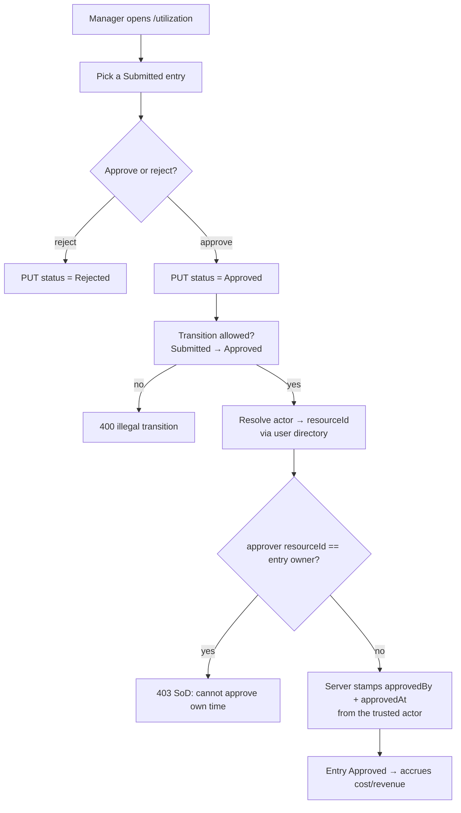

**Detailed steps.**

1. **Review the submitted entry.**
   - **Who:** a manager role (`resource-manager`, `pm`, `finance`,
     `delivery-executive`, `admin`). **When:** an employee has submitted time.
   - **How:** at `/utilization` (`UtilizationComponent`), inspect the entry.
2. **Approve.**
   - **Who:** the approving manager (≠ the entry's owner). **When:** the entry is
     correct.
   - **How:** Approve action → `updateTimeEntry(id, { status: 'Approved', … })`
     → `PUT /time-entries/:id`. The server:
     - enforces the transition whitelist (`Submitted → Approved` only);
     - resolves the **trusted actor** to a **resource id** through the user
       directory and **rejects self-approval** (`approverResourceId === entry.resourceId`);
     - sets `approvedBy` (the trusted actor) and `approvedAt` server-side —
       client-supplied approver fields are ignored.
   - **Output:** an `Approved` entry; approved hours feed actual labor cost
     (`finance.util`) and T&M/Capped revenue recognition.
3. **Reject.**
   - **Who:** the manager. **How:** Reject → `PUT status: 'Rejected'`; the
     employee can reopen `Rejected → Draft` to correct.

**Exceptions & edge cases.**

| Situation | System response |
|-----------|-----------------|
| Approver is the entry's owner | `403` — `Segregation of duties: a resource cannot approve their own time entry`. |
| Illegal transition (e.g. `Draft → Approved`, `Approved → Draft`) | `400` — `Illegal time-entry transition`. |
| Client supplies `approvedBy` | Ignored — server stamps the trusted actor. |
| Actor identity can't map to a resource id | SoD comparison is skipped (no false self-approval); approval proceeds with server-stamped fields. |
| Caller role not in the time-entry mutation set | `403`. |

**Metrics.**

| Metric | Definition |
|--------|------------|
| Approval cycle time | Submitted → Approved latency. |
| Rejection rate | % of submitted entries rejected. |
| SoD blocks | Count of self-approval attempts denied (governance signal). |

**Related.** [View My Assignments + submit Time Entries](#view-my-assignments--submit-time-entries),
[Approvals & governance](approvals-governance.md), [Billing & revenue](billing-and-revenue.md).

---

### Monitor Utilization & rebalance

**Purpose.** Give the resource manager a live view of who is over/under-booked
and the tools to rebalance bookings (add, copy/paste, edit, delete assignments).

**Scope.**
- *In:* reviewing per-resource utilization; creating/copying/editing/deleting
  assignments (`/assignments`); approving/rejecting time inline.
- *Out:* the rate fields, the forecast horizon (separate SOP).

**RACI.**

| Step | Responsible | Accountable | Consulted | Informed |
|------|-------------|-------------|-----------|----------|
| Review utilization | resource-manager | resource-manager | pm | delivery-executive |
| Read the Team Average | resource-manager | resource-manager | pm | delivery-executive |
| Rebalance bookings | resource-manager | resource-manager | pm | employee |
| Approve/reject inline time | resource-manager | resource-manager | — | finance |

**Process flow.**

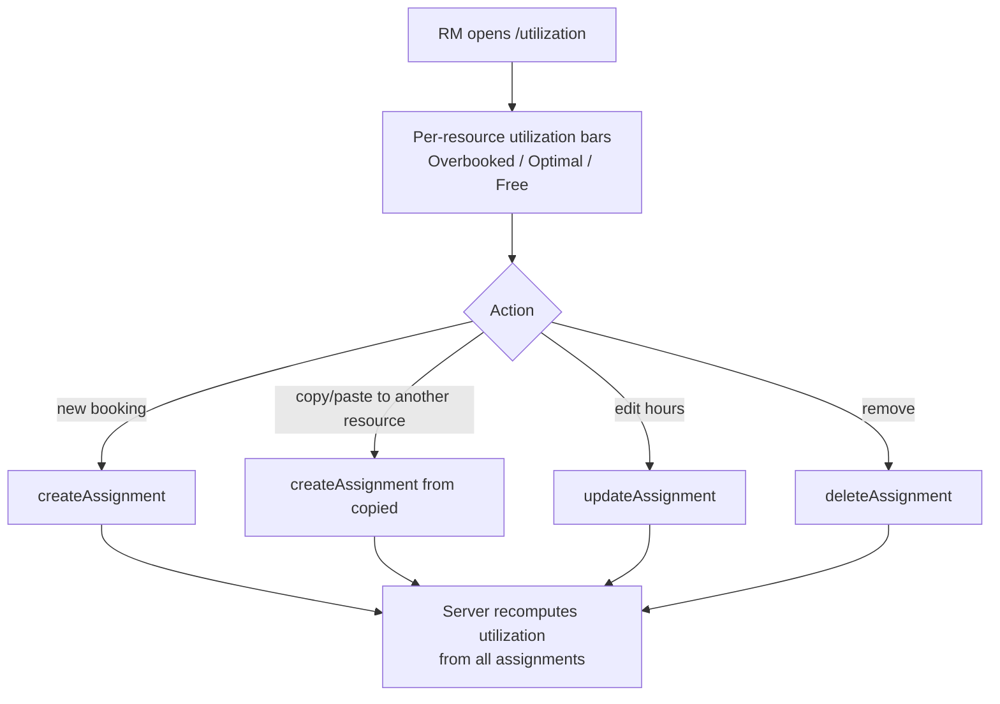

**Detailed steps.**

1. **Review utilization.**
   - **Who:** `resource-manager`. **When:** ongoing capacity management.
   - **How:** `/utilization` loads resources, assignments, requests, time
     entries, and the org tree in one shot. Bars are banded: **Overbooked**
     (> 110%), **Optimal** (80–110%), **Free Capacity** (< 80%). The **My
     Team** panel has a **team scope** switch with two views, always visible
     even when the second view would be empty:
     - **Direct reports** (default, pre-existing behaviour) — everyone whose
       `managerId` is the viewer.
     - **All my org** — the same **function** the Allocation Approvals feed
       uses to scope requests (`scopeOf`): the transitive org chart below the
       viewer **union** the resources sitting in the org-tree subtrees
       (Capability / Practice / Competence) they manage. A person reachable
       only through a subtree two levels down, with no org-chart link at all,
       still appears here. That equivalence is about the **function**, not
       the **set** the feed shows, though: the feed also admits any resource
       with **no manager anywhere** (`roleFallback`) to every
       `resource-manager`, so a manager may see and decide on placeholder
       rows in the feed that All my org does not list. `admin` and
       `delivery-executive` see their **own** scope in this view — never the
       whole company — so the number means the same thing for every viewer
       regardless of role.
     - The empty state names the reason: **"Nobody is set up to report
       directly to you."** (Direct reports) is a different message from
       **"You do not manage any organization, and nobody reports to you."**
       (All my org) — the "…and nobody reports to you" ending belongs to the
       All my org message, not to Direct reports.
   - **Output:** a per-resource utilization picture, scoped to the active view.
2. **Read the Team Average.**
   - **Who:** `resource-manager` and any viewer of the panel. **How:** the
     average is computed over whichever list the active team-scope view
     shows, but it counts **internal resources only**
     (`countsTowardInternalCapacity(kindOf(resource))`) — a placeholder
     (dummy) or a subcontractor (subco) is not internal capacity, so its
     `utilization` (0% for a dummy, or not a saturation signal for a subco)
     never dilutes the mean. This applies in **both** views: a dummy that has
     been given a manager would otherwise pull the average toward zero in
     Direct reports too, the same class of defect the portfolio KPIs on
     `/reporting` had before it was fixed there.
   - **Output:** when the list holds rows the average does not count, an
     **"internal only"** note appears next to the percentage so the
     denominator is never a silent mismatch with the row count — an auditor
     comparing "how many people are listed" against "what the average divides
     by" gets the discrepancy explained on the same screen, not only in code.
3. **Rebalance.**
   - **Who:** `resource-manager`. **How:**
     - new booking → `createAssignment(data)` → `POST /assignments`;
     - copy/paste a booking to another resource → `createAssignment({ …copied,
       resourceId })`;
     - edit hours → `updateAssignment(id, { … })` → `PUT /assignments/:id`;
     - remove → `deleteAssignment(id)` → `DELETE /assignments/:id`.
   - **Output:** rebalanced bookings; the server **recomputes utilization from the
     full assignment set** for every affected resource (under `withLock('res:…')`),
     so over-removals or moves never corrupt the stored figure.
4. **Approve/reject time inline** — see [Approve a Time Entry](#approve-a-time-entry-segregation-of-duties).

**Exceptions & edge cases.**

| Situation | System response |
|-----------|-----------------|
| Delete a non-existent assignment | `404`. |
| Booking exceeds capacity | Allowed; utilization shows > 100% (Overbooked band). |
| FK retarget on edit to a missing resource/request | `400`. |
| Concurrent edits to one resource | Serialized; utilization recomputed deterministically. |
| Viewer manages no organization and has no direct reports | The **All my org** view is empty; the switch itself stays visible so the viewer can tell "no data" from "no feature". |
| A dummy or subco sits in the viewer's org subtree | It appears in the **All my org** list (it belongs to the organization) but is excluded from **Team Average**; the **internal only** note marks the gap. |
| `admin` / `delivery-executive` open **All my org** | Scoped to their own `scopeOf`, same as any other viewer — not the whole company, even though these roles see every request in the Allocation Approvals feed. |

**Metrics.**

| Metric | Definition |
|--------|------------|
| Average utilization | Mean utilization across **internal** resources in the active team-scope view (Direct reports or All my org); dummy/subco rows are listed but never counted. |
| Overbooked count | Resources > 110%. |
| Bench count | Resources < 80% (see forecast `benchList`). |

**Related.** [Capacity Forecast](#capacity-forecast),
[Match & rank candidates](#match--rank-candidates--assign-a-resource).

---

### Plan the resource Schedule

**Purpose.** Give the resource manager / PM a read-only, date-level timeline of
who is booked when, with automatic **conflict detection** that flags resources
double-booked beyond 100% of weekly capacity in any overlapping window — turning
the portfolio-wide `utilization > 110%` signal into a *time-aware* one the
existing utilization view cannot show.

**Scope.**
- *In:* reviewing the read-only Schedule timeline at `/schedule`
  (`ScheduleComponent`), driven by `schedule.util` (`buildSchedule` → per-resource
  lanes + a `conflicts` list); reading the over-allocation badges, conflict
  styling, and the "N resources over-allocated" summary; navigating the visible
  horizon (prev/next, ~12 weeks).
- *Out:* editing bookings here (the view is read-only — bookings are created and
  rebalanced in [Match & rank candidates](#match--rank-candidates--assign-a-resource)
  and [Monitor Utilization & rebalance](#monitor-utilization--rebalance)),
  drag-drop, auto-leveling, and sub-weekly granularity (all deferred).

**The model (`src/app/services/schedule.util.ts`).** A pure, SSR-safe sweep-line
per resource over its booking intervals:

- Each assignment resolves a **window** (`startDate`/`endDate`, falling back to
  the linked request's dates when absent) and an **`allocationPct`** (% of weekly
  `capacity` consumed, default `100`).
- At any instant where the summed `allocationPct` of concurrent active bookings
  **exceeds 100%**, those bookings are flagged `conflict: true`; the sweep records
  the **peak over-allocation %** and the offending **window**.
- Output: `lanes` (per resource → ordered bookings with resolved start/end/
  allocation, a project/request label, and `conflict`), and `conflicts`
  (`{ resourceId, peakPct, windowStart, windowEnd, bookingIds }[]`). Adjacent
  bookings (one's `end` == the next's `start`) do **not** conflict.

**RACI.**

| Step | Responsible | Accountable | Consulted | Informed |
|------|-------------|-------------|-----------|----------|
| Open the Schedule | resource-manager / pm | resource-manager | — | delivery-executive |
| Review conflicts | resource-manager / pm | resource-manager | pm | delivery-executive |
| Resolve a conflict (rebalance) | resource-manager | resource-manager | pm | employee |

**Process flow.**

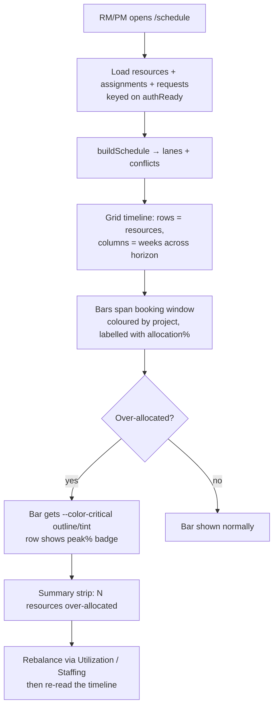

**Detailed steps.**

1. **Open the Schedule.**
   - **Who:** `resource-manager` or `pm` (route-gated to
     `pm`/`resource-manager`/`delivery-executive`/`admin`). **When:** to see
     date-level bookings and spot conflicts.
   - **How:** navigate to `/schedule` (`ScheduleComponent`); on `authReady` it
     loads resources, assignments, and requests, then computes
     `buildSchedule(...)`. `ListStateComponent` covers loading/empty/error.
   - **Output:** a CSS-grid timeline — one row per resource (name · role ·
     capacity), one column per week across the visible horizon; each booking
     rendered as a bar spanning its window, coloured by project and labelled with
     its `allocation%`.
2. **Read the conflicts.**
   - **Who:** `resource-manager` / `pm`. **When:** reviewing capacity health.
   - **How:** conflicting bars carry a `--color-critical` outline/tint; the
     resource row shows an over-allocation badge with the peak %; the summary
     strip reports **"N resources over-allocated"**. The legend explains the
     conflict styling.
   - **Output:** an at-a-glance read of who is double-booked, by how much, and in
     which window.
3. **Navigate the horizon (optional).**
   - **Who:** `resource-manager` / `pm`. **How:** the range control pages the
     visible window prev/next (default ~12 weeks from today).
   - **Output:** the timeline re-renders for the chosen window (pure geometry from
     data — no DOM measurement, so it is SSR-safe).
4. **Resolve a conflict.**
   - **Who:** `resource-manager`. **When:** a real over-allocation is confirmed.
   - **How:** the Schedule is read-only, so rebalance the underlying bookings in
     [Monitor Utilization & rebalance](#monitor-utilization--rebalance) (edit
     hours/allocation, move, or delete an assignment) or re-staff via
     [Match & rank candidates](#match--rank-candidates--assign-a-resource); then
     re-read the timeline to confirm the conflict has cleared.

**Exceptions & edge cases.**

| Situation | System response |
|-----------|-----------------|
| Assignment has no own `startDate`/`endDate` | Falls back to the linked request's dates (backward-compatible; never dropped). |
| Booking with no resolvable dates at all | Excluded from the timeline geometry (cannot be placed on a week column). |
| Bookings adjacent in time (`end` == next `start`) | **Not** a conflict — the windows do not overlap. |
| Summed `allocationPct` of overlapping bookings ≤ 100% | No conflict; bars render normally. |
| Caller role outside `pm`/`resource-manager`/`delivery-executive`/`admin` | Blocked by the `schedule` route guard (re-evaluated in the browser after `authReady`); the API still gates the underlying reads. |
| Unauthenticated read of `/resources` | `401` (read RBAC); the view keys its load on `authReady`. |

**Metrics.**

| Metric | Definition |
|--------|------------|
| Over-allocated resources | Count of resources with ≥1 conflicting window (the summary strip's *N*). |
| Peak over-allocation | Highest `peakPct` across all conflicts. |
| Booking coverage | % of assignments with explicit `startDate`/`endDate` (vs request-date fallback). |

**Related.** [Monitor Utilization & rebalance](#monitor-utilization--rebalance),
[Match & rank candidates](#match--rank-candidates--assign-a-resource),
[Capacity Forecast](#capacity-forecast).

---

### Capacity Forecast

**Purpose.** Produce a rolling supply-vs-demand outlook (per week or month) from
committed bookings and the unstaffed pipeline, plus bench, over-allocation, and
skill-shortage lists, so the resource manager / delivery executive can plan ahead.

**Scope.**
- *In:* the read-only forecast at `/forecast`, driven by `forecast.util`
  (`capacityForecast`, `benchList`, `overAllocated`, `skillGap`); CSV export.
- *Out:* mutating data — the forecast only reads.

**The model (`src/app/services/forecast.util.ts`).**

- **Supply** per period = Σ `resource.capacity` (weekly hours; scaled by ≈4.33 for
  a monthly horizon).
- **Committed demand** = booked assignment hours, spread across the linked
  request's start/end window (missing dates → first period, never dropped).
- **Pipeline demand** = unstaffed effort (`requiredEffort − staffedEffort`) of
  *open* requests (not closed/fulfilled/cancelled/staffed), spread over their window.
- **Demand** = committed + pipeline; **utilization%** = demand/supply×100
  (0 when supply is 0); **gap** = supply − demand.
- **`benchList`** = resources with utilization < threshold (default 80%), with
  spare hours. **`overAllocated`** = utilization ≥ threshold (default 110%), with
  hours over capacity. **`skillGap`** = per-skill open demand vs covering
  resources, shortage when demand exists but zero coverage.

**RACI.**

| Step | Responsible | Accountable | Consulted | Informed |
|------|-------------|-------------|-----------|----------|
| Choose horizon | resource-manager | resource-manager | delivery-executive | — |
| Read the outlook | resource-manager / delivery-executive | delivery-executive | pm | — |
| Export CSV | resource-manager / delivery-executive | resource-manager | — | — |

**Process flow.**

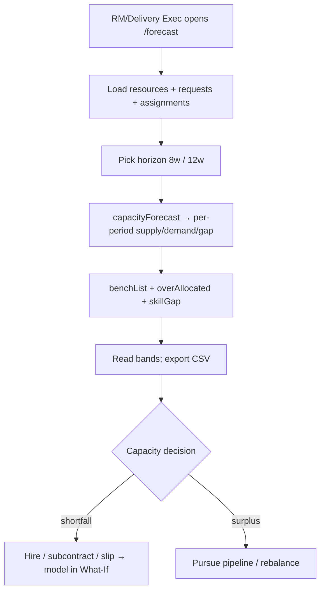

**Detailed steps.**

1. **Open the forecast and pick a horizon.**
   - **Who:** `resource-manager` / `delivery-executive`. **When:** capacity
     planning. **How:** `/forecast` (`Forecast`), choose **8w** or **12w**.
   - **Output:** per-period supply/committed/pipeline/demand/utilization/gap rows.
2. **Read the supporting lists.**
   - **How:** the page renders bench, over-allocation, and skill-gap tables from
     `benchList`/`overAllocated`/`skillGap`.
   - **Output:** who is free, who is over, which skills are short.
3. **Export.**
   - **How:** the CSV export (`export.util`) downloads the period rows.
   - **Output:** a CSV for offline planning.

**Exceptions & edge cases.**

| Situation | System response |
|-----------|-----------------|
| Total capacity is 0 | utilization% = 0 (explicit zero-capacity guard); gap = −demand. |
| Booking/request has no dates | Its whole weight lands in the first period (never silently dropped). |
| NaN / Infinity in capacity or hours | Guarded to 0 by `Number.isFinite`; never throws. |
| Unauthenticated read of `/resources` | `401` (read RBAC); the forecast keys its load on `authReady`. |

**Metrics.**

| Metric | Definition |
|--------|------------|
| Forecast utilization | Mean utilization% across the horizon. |
| Peak demand | Busiest period's demand hours. |
| Shortage count | Skills with zero coverage. |

**Related.** [What-if scenario](#what-if-scenario),
[Monitor Utilization & rebalance](#monitor-utilization--rebalance).

---

### What-if scenario

**Purpose.** Let a resource manager / delivery executive model the capacity
impact of winning a deal, hiring, or slipping a project — **entirely in memory,
nothing persisted** — and compare it side-by-side against today's baseline.

**Scope.**
- *In:* the client-only sandbox at `/what-if` (`WhatIf`) with three levers (win
  deal, hire, slip project) over a fixed 12-week horizon; reset.
- *Out:* writing any change to the server — every mutation touches only the
  in-memory scenario copy.

**RACI.**

| Step | Responsible | Accountable | Consulted | Informed |
|------|-------------|-------------|-----------|----------|
| Define a scenario lever | resource-manager / delivery-executive | delivery-executive | pm, sales | — |
| Compare vs baseline | resource-manager / delivery-executive | delivery-executive | — | — |
| Reset | resource-manager / delivery-executive | resource-manager | — | — |

**Process flow.**

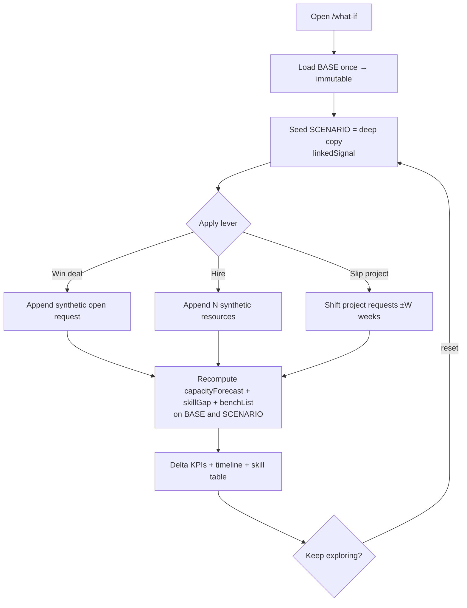

**Detailed steps.**

1. **Load the baseline.**
   - **Who:** `resource-manager` / `delivery-executive`. **When:** capacity
     stress-testing. **How:** `/what-if` loads resources/requests/assignments once
     (keyed on `authReady`) into an **immutable BASE**; a **SCENARIO** is seeded as
     a deep copy via `linkedSignal`.
   - **Output:** matched base and scenario.
2. **Apply a lever.**
   - **Win deal:** append a synthetic open `ResourceRequest` (new pipeline demand).
   - **Hire:** append *N* synthetic resources with capacity + one skill (new supply).
   - **Slip project:** shift a project's requests' start/end by *W* weeks
     (re-timed demand; non-zero weeks required).
   - **Output:** the scenario diverges (a dirty badge + change count appears).
3. **Compare.**
   - **How:** the page recomputes the forecast/skill-gap/bench on both base and
     scenario and shows **delta KPIs** (Avg Utilization, Peak Demand, Skill
     Shortages, On Bench), a scenario capacity timeline with per-week demand
     deltas, and a base-vs-scenario skill-coverage table.
   - **Output:** an evidence-based read on the scenario's capacity impact.
4. **Reset.**
   - **How:** Reset re-seeds the scenario from the base, discarding changes.

**Exceptions & edge cases.**

| Situation | System response |
|-----------|-----------------|
| No capacity data at all | Empty-state card; levers produce nothing useful until data exists. |
| Slip a project with no dated requests | Notice: "no dated requests to shift"; nothing changes. |
| Zero-week slip | Form invalid (`nonZeroWeeks` validator). |
| Page reload / deep-link before auth settles | Load is gated on `authReady`; firing earlier would 401 and collapse the baseline. |
| Any lever | **Never persisted** — base data is untouched; reload restores everything. |

**Metrics.**

| Metric | Definition |
|--------|------------|
| Δ Avg Utilization | Scenario − base mean utilization across 12 weeks. |
| Δ Peak Demand | Scenario − base busiest weekly hours. |
| Δ Skill Shortages | Scenario − base count of zero-coverage skills. |
| Δ On Bench | Scenario − base count of under-allocated resources. |

**Related.** [Capacity Forecast](#capacity-forecast),
[Create & publish a Resource Request](#create--publish-a-resource-request).
